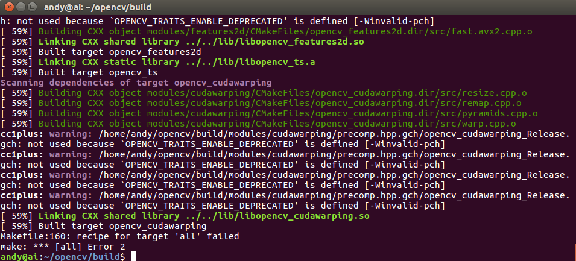

# Inatall AI envirnment on Ubuntu platform

   
**安装环境**  
*其他环境类似* 
```
硬件环境: CPU i7 / NVIDIA TITAN V
系统环境：Windows 10 64bit / Ubuntu 16.04 64bit
软件环境：CUDA9.0 / caffe1.0/
````

### 目录
1. [参考](#reference)
2. [安装Ubuntu和Windows双系统](#id1)   
3. [安装NVIDIA驱动](#id2)   
4. [安装CUDA 9.0](#id3)   
5. [安装cuDNN](#id4)  
6. [安装OpenCV](#id5) 
7. [安装Caffe 1.0](#id6)   

##  1. <span id="reference">参考</span>   
1. https://blog.csdn.net/s717597589/article/details/79117112/
2. https://blog.csdn.net/balixiaxuetian/article/details/79154013
3. http://www.yaoingwen.com/ubuntu16-04-anaconda-3-6-caffe/


## 2. <span id="id1">安装Ubuntu和Windows双系统</span>    
详细的安装双系统就不过多介绍了，可以参考[这篇文章](https://blog.csdn.net/s717597589/article/details/79117112/)，但是在安装过程中有几个问题需要说明：      
- 安装Ubuntu之前首先要把BIOS的`security boot`关闭，否则会出现NVIDIA驱动安装完以后重启电脑会反复进入登录界面。
 
- 硬盘分区的时候可以只分为`swap`、`UEFI`、`\`和`\home`四个分区，不分`\home也可以，在挂在`\`分区的时候会自动生成`\home`和其他分区，但是在重装系统的时候`\home`无法重新挂在之前的`\home`分区导致数据丢失（类似于Windows的非系统盘）。
 
- 重装Ubuntu系统时请早Windows下用EasyUEFI软件将Ubuntu的引导项删除。


## 3. <span id="id2">安装NVIDIA驱动</span>    

### a. **在终端里依次输入以下命令安装驱动所需的依赖包**：   
```python
sudo apt-get install libprotobuf-dev libleveldb-dev libsnappy-dev libopencv-dev libhdf5-serial-dev protobuf-compiler

sudo apt-get install --no-install-recommends libboost-all-dev
 
sudo apt-get install libopenblas-dev liblapack-dev libatlas-base-dev
 
sudo apt-get install libgflags-dev libgoogle-glog-dev liblmdb-dev
 
sudo apt-get install git cmake build-essential
```
假如有安装包一直下载失败，可以使用：
```
sudo apt-get update 
```
### b. **禁用Ubuntu自带的显卡驱动**：  
Ubuntu 16.04 自带 nouveau显卡驱动，这个自带的驱动是不能用于CUDA的，需要卸载重装。假如重装过显卡驱动则可跳过这一步。没有重装过的就跟着我的步骤往下走。

首先得禁用Ubuntu自带的显卡驱动nouveau，只有在禁用掉 nouveau 后才能顺利安装 NVIDIA 显卡驱动，禁用方法就是在 `/etc/modprobe.d/blacklist-nouveau.conf`文件中添加一条禁用命令，首先需要打开该文件，通过以下命令打开：   
```
sudo gedit /etc/modprobe.d/blacklist-nouveau.conf
```
打开后发现该文件中没有任何内容，**写入**：
```
blacklist nouveau  
options nouveau modeset=0
```
保存后关闭文件，注意此时还需执行以下命令使禁用 nouveau 真正生效：
```
sudo update-initramfs -u
```
**重启电脑**，然后输入以下命令，若什么都没有显示则禁用nouveau生效了：
```
lsmod | grep nouveau
```
### c. **安装NVIDIA官方显卡驱动**：
通过`Ctrl + Alt + F1`进入文本模式，输入帐号密码登录，通过`Ctrl + Alt + F7`可返回图形化模式，在文本模式登录后首先关闭桌面服务：
```
sudo service lightdm stop
```
这里会要求你输入账户的密码。然后通过`Ctrl + Alt + F7`发现已无法成功返回图形化模式，说明桌面服务已成功关闭，注意此步对接下来的 nvidia 驱动安装尤为重要，必需确保桌面服务已关闭。按`Ctrl + Alt + F1`再次进入文本模式，先卸载之前的显卡驱动：    
```
sudo apt-get purge nvidia*
```
加入官方ppa源：   
```
sudo add-apt-repository ppa:graphics-drivers/ppa
```
之后刷新软件库并安装显卡驱动：   
```
sudo apt-get update
 
sudo apt-get install nvidia-390 nvidia-settings nvidia-prime  #大部分NVIDIA驱动可以安装390
```
**重启电脑**，通过下面命令查看显卡信息：   
···
nvidia-settings
···

### d. **配置环境变量**：
使用 gedit 命令打开配置文件：
```
sudo gedit ~/.bashrc
```
打开后在**文件最后加入**以下两行内容：   
```
export LD_LIBRARY_PATH=/usr/lib/x86_64-linux-gnu:$LD_LIBRARY_PATH
 
export LD_LIBRARY_PATH=/lib/x86_64-linux-gnu:$LD_LIBRARY_PATH
```
保存并退出，运行以下内容使环境变量生效：   
```
source  ~./bashrc
```

## 4. <span id="id3">安装CUDA 9.0</span>    
安装完显卡驱动后，CUDA toolkit和samples可单独安装，直接在终端运行安装，无需进入文本模式：   
```
sudo sh cuda_9.0.176_384.81_linux.run --no-opengl-libs
```
执行此命令约1分钟后会出现安装协议要你看，刚开始是0%，此时长按回车键让此百分比增长，直到100%，然后按照提示操作即可，先输入 accept ，是否安装显卡驱动选择no:   
```
Install NVIDIA Accelerated Graphics Driver for Linux-x86_64 387.26?
(y)es/(n)o/(q)uit: n
```
其余的一律按默认或者y进行安装即可。    
安装完成后配置CUDA环境变量，使用 gedit 命令打开配置文件：   
```
sudo gedit ~/.bashrc
```
在该文件最后加入以下两行并保存：   
```
export PATH=/usr/local/cuda/bin:$PATH    #/usr/local/cuda和/usr/local/cuda-9.0是同一个文件夹，两者通过软连接相连
 
export LD_LIBRARY_PATH=/usr/local/cuda/lib64:$LD_LIBRARY_PATH
```
使该配置生效：   
```
source  ~/.bashrc
```
检验CUDA 是否安装成功，输入：   
```
cd /usr/local/cuda-9.1/samples/1_Utilities/deviceQuery
 
sudo make
 
./deviceQuery
```
卸载CUDA 9.1 的方法：   
``` 
cd /usr/local/cuda/bin
sudo ./uninstall_cuda_9.0.pl
```
卸载完成后如果显示：Not removing directory, it is not empty: /usr/local/cuda-9.0 ，假如需要重装CUDA 9.0的话就把这个文件夹删除。在/usr/local/路劲下输入：
```
sudo rm -r cuda-9.0
```

## 5. <span id="id4">安装cuDNN</span>   

解压cuNDD v7.zip到当前文件夹，得到一个cudn 文件夹，该文件夹下有include 和 lib64 两个文件夹，命令行进入其中的include 文件夹路径下，然后进行以下操作：
```
sudo cp cudnn.h /usr/local/cuda/include/ #复制头文件
```
然后命令行进入 cudn/lib64 文件夹路径下，运行以下命令：
```
sudo cp lib* /usr/local/cuda/lib64/ #复制动态链接库
cd /usr/local/cuda/lib64/ 
sudo rm -rf libcudnn.so libcudnn.so.7  #删除原有动态文件
sudo ln -s libcudnn.so.7.0.5 libcudnn.so.7  #生成软衔接
sudo ln -s libcudnn.so.7 libcudnn.so  #生成软链接
```
随后需要将路径/usr/local/cuda/lib64 添加到动态库，分两步：
1）安装vim。输入： 
```
sudo apt-get install vim-gtk
```
2）输入：
```
sudo vim /etc/ld.so.conf.d/cuda.conf
```
编辑状态下，输入：   
```
/usr/local/cuda/lib64
```
保存退出，输入下面代码使其生效：
```
sudo ldconfig
```
安装完成后可用`nvcc -V`命令验证是否安装成功，若出现以下信息则表示安装成功：
```
nvcc: NVIDIA (R) Cuda compiler driver
Copyright (c) 2005-2017 NVIDIA Corporation
Built on Fri_Nov__3_21:07:56_CDT_2017
Cuda compilation tools, release 9.0, V9.0.85
```


## 5. <span id="id5">安装 OpenCV</span>   
进入官网 : http://opencv.org/releases.html , 选择 3.4.0 版本的 sources , 下载 opencv-3.4.0.zip 。随后解压到你要安装的位置，命令行进入已解压的文件夹 opencv-3.4.0 目录下，执行：
```
mkdir build # 创建编译的文件目录
 
cd build
 
cmake -D CMAKE_BUILD_TYPE=Release -D CMAKE_INSTALL_PREFIX=/usr/local ..
 
make -j8  #编译
```
**遇到一下报错信息有两种可能：**

- 在编译opencv3.4.0源码的时候，会下载诸如ippicv_2017u3_lnx_intel64_20170822.tgz的东西，如果下载失败，请下载离线包（source文件夹中），解压该文件，会得到.cache文件夹，用此文件夹覆盖opencv源码文件夹下的.cache文件夹，再重新编译即可。.cahce文件夹为隐藏文件，可用ctrl+h查看。

- 若本机里安装了anaconda，则需要在环境变量(`sudo gedit ~/.bashrc`)中加入：
```
# added by Anaconda3 installer
export PATH="/home/andy/anaconda3/bin:$PATH"
export LD_LIBRARY_PATH=~/anaconda3/lib:$LD_LIBRARY_PATH
export CPLUS_INCLUDE_PATH=~/anaconda3/include/python3.6m
export PATH="$PATH:$HOME/bin"
```
在98%的时候会等很久很久，属于正常现象。编译过程很顺利，编译成功后安装：   
```
sudo make install #安装
```
安装完成后通过查看 opencv 版本验证是否安装成功：   
```
pkg-config --modversion opencv
```
卸载OpenCV的方法：进入OpenCV解压文件夹中的buid 文件夹：   
```
cd /home/ccem/opencv-3.4.0/build
```
运行：   
```
sudo make uninstall
```
然后把整个opencv-3.4.0文件夹都删掉。随后再运行：   
```
sudo rm -r /usr/local/include/opencv2 /usr/local/include/opencv /usr/include/opencv /usr/include/opencv2 /usr/local/share/opencv /usr/local/share/OpenCV /usr/share/opencv /usr/share/OpenCV /usr/local/bin/opencv* /usr/local/lib/libopencv
```
把一些残余的动态链接文件和空文件夹删掉。有些文件夹已经被删掉了所以会找不到路径。

## 6. <span id="id6">安装Caffe 1.0</span>    
### a.安装依赖库   
```
sudo apt-get update
sudo apt-get upgrade
sudo apt-get install -y build-essential cmake git pkg-config
sudo apt-get install -y libprotobuf-dev libleveldb-dev libsnappy-dev protobuf-compiler

sudo apt-get install -y libatlas-base-dev
sudo apt-get install -y --no-install-recommends libboost-all-dev

sudo apt-get install -y libgflags-dev libgoogle-glog-dev liblmdb-dev
sudo apt-get -y install build-essential cmake git libgtk2.0-dev pkg-config python-dev python-numpy libdc1394-22 libdc1394-22-dev libjpeg-dev libpng12-dev libtiff5-dev libjasper-dev libavcodec-dev libavformat-dev libswscale-dev libxine2-dev libgstreamer0.10-dev libgstreamer-plugins-base0.10-dev libv4l-dev libtbb-dev libqt4-dev libfaac-dev libmp3lame-dev libopencore-amrnb-dev libopencore-amrwb-dev libtheora-dev libvorbis-dev libxvidcore-dev x264 v4l-utils unzip
```
### b. 配置CUDA 及 CUDNN   
添加 CUDA 环境变量   
```
sudo gedit ~/.bashrc
export PATH=/usr/local/cuda-8.0/bin:$PATH
export LD_LIBRARY_PATH=/usr/local/cuda-8.0/lib64:$LD_LIBRARY_PATH
```
Conda 安装依赖模块: 
```
conda install -c menpo opencv3
conda install libgcc
conda install protobuf
```
**conda install -c menpo opencv3命令有时候会显示权限不够permission issue。这是因为你安装anaconda时用的是sudo，这时候需要修改anaconda3文件夹权限**:
```
sudo chown -R 你的用户名（user ） /home/你的用户名/anaconda3
```
添加Anaconda CPLUS路径:   
```
export CPLUS_INCLUDE_PATH=~/anaconda3/include/python3.6m
```
配置 boost_python   
```
cd /usr/lib/x86_64-linux-gnu && sudo ln -s libboost_python-py35.so libboost_python3.so
```
在caffe源码目录中修改Makefile.config文件如下：
```
## Refer to http://caffe.berkeleyvision.org/installation.html
# Contributions simplifying and improving our build system are welcome!

# cuDNN acceleration switch (uncomment to build with cuDNN).
USE_CUDNN := 1

# Uncomment if you're using OpenCV 3
OPENCV_VERSION := 3

# CUDA directory contains bin/ and lib/ directories that we need.
CUDA_DIR := /usr/local/cuda
# On Ubuntu 14.04, if cuda tools are installed via
# "sudo apt-get install nvidia-cuda-toolkit" then use this instead:
# CUDA_DIR := /usr

# CUDA architecture setting: going with all of them.
# For CUDA >= 9.0, comment the *_20 and *_21 lines for compatibility.
CUDA_ARCH := -gencode arch=compute_30,code=sm_30 \
-gencode arch=compute_35,code=sm_35 \
-gencode arch=compute_50,code=sm_50 \
-gencode arch=compute_52,code=sm_52 \
-gencode arch=compute_60,code=sm_60 \
-gencode arch=compute_61,code=sm_61 \
-gencode arch=compute_61,code=compute_61

# BLAS choice:
# atlas for ATLAS (default)
# mkl for MKL
# open for OpenBlas
BLAS := atlas

# NOTE: this is required only if you will compile the python interface.
# We need to be able to find Python.h and numpy/arrayobject.h.
# PYTHON_INCLUDE := /usr/include/python2.7 \
# /usr/lib/python2.7/dist-packages/numpy/core/include
# Anaconda Python distribution is quite popular. Include path:
# Verify anaconda location, sometimes it's in root.
ANACONDA_HOME := $(HOME)/anaconda3
PYTHON_INCLUDE := $(ANACONDA_HOME)/include \
# $(ANACONDA_HOME)/include/python3.6m \
# $(ANACONDA_HOME)/lib/python3.6/site-packages/numpy/core/include

# Uncomment to use Python 3 (default is Python 2)
PYTHON_LIBRARIES := boost_python3 python3.6m
# PYTHON_INCLUDE := /usr/include/python3.5m \
# /usr/lib/python3.5/dist-packages/numpy/core/include

# We need to be able to find libpythonX.X.so or .dylib.
#PYTHON_LIB := /usr/lib
PYTHON_LIB := $(ANACONDA_HOME)/lib

# Uncomment to support layers written in Python (will link against Python libs)
WITH_PYTHON_LAYER := 1

# Whatever else you find you need goes here.
INCLUDE_DIRS := $(PYTHON_INCLUDE) /usr/local/include
LIBRARY_DIRS := $(PYTHON_LIB) /usr/local/lib /usr/lib

# If Homebrew is installed at a non standard location (for example your home directory) and you use it for general dependencies
# INCLUDE_DIRS += $(shell brew --prefix)/include
# LIBRARY_DIRS += $(shell brew --prefix)/lib

# N.B. both build and distribute dirs are cleared on `make clean`
BUILD_DIR := build
DISTRIBUTE_DIR := distribute

# The ID of the GPU that 'make runtest' will use to run unit tests.
TEST_GPUID := 0

# enable pretty build (comment to see full commands)
Q ?= @
```

保存后,开始编译:   
```
make all -j $(($(nproc) + 1))
make test -j $(($(nproc) + 1))
make runtest -j $(($(nproc) + 1))
make pycaffe -j $(($(nproc) + 1))
```

**在编译的时候有可能会提示错误，可能是因为anaconda环境的原因，需要在~/.bashrc中将anaconda的环境变量屏蔽掉**   

添加环境变量
```
sudo gedit ~/.bashrc
export PYTHONPATH=~/caffe/python:$PYTHONPATH
```

