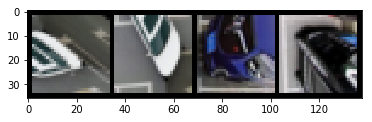

# Pytorch
*基于Pytorch1.0*     
- [将数据转换为Pytorch格式](#将数据转换为pytorch格式)
- [Pytorch多GPU训练](#pytorch多gpu训练)


---
## 将数据转换为Pytorch格式
`Pytorch`官方提供了[`torch.utils.data.Dataset`](https://pytorch.org/docs/stable/_modules/torch/utils/data/dataset.html#Dataset)抽象类，需要根据自己应用具体实现:
```python
class Dataset(object):
    """An abstract class representing a Dataset.

    All other datasets should subclass it. All subclasses should override
    ``__len__``, that provides the size of the dataset, and ``__getitem__``,
    supporting integer indexing in range from 0 to len(self) exclusive.
    """

    def __getitem__(self, index):
        raise NotImplementedError

    def __len__(self):
        raise NotImplementedError

    def __add__(self, other):
        return ConcatDataset([self, other])
```

**1、首先将`Dataset`抽象类实现**:     
```python
import torch
import torchvision
import torchvision.transforms as transforms
from PIL import Image

class andyDataset(Dataset):
    """
    Implement the Dataset abstract class
    imgRootPath tree is:
        imgRootPath:
            dog:
                img1.png
                img2.png
                ...
            cat:
                img1.png
                img2.png
            ...

    classNameList is:
        ['dog', 'cat', ...]

    """
    def __init__(self, imgRootPath, classNameList=None, imgShape=(32, 32)):
        self.imgList = []
        self.labelList = []
        self.size = imgShape
        
        if not os.path.isdir(imgRootPath):
            print("imgRootPath is not image root path!")
            return
        
        imgFolderList = os.listdir(imgRootPath)
        if len(imgFolderList) != len(classNameList):
            print("The number of  sample folder!= the number of classes!")
            return
        
        # Folder
        for index, folderName in enumerate(imgFolderList):
            if folderName not in classNameList:
                print("Folder name is not as same as label! Check Again!")
                return
            
            folderPath = os.path.join(imgRootPath, folderName)
            imgNameList = os.listdir(folderPath)
            #print(folderPath, " has ",len(imgNameList), "images!")
            
            # images
            for imgName in imgNameList:
                imgPath = os.path.join(folderPath, imgName)
                self.imgList.append(imgPath)
                self.labelList.append(index)
        #print(len(self.imgList))
        #print(len(self.labelList))
        #print(self.imgList)
        #print(self.labelList)
    
    def __len__(self):
        return len(self.labelList)
    
    def __getitem__(self, index):
        imgPath = self.imgList[index]
        lable = self.labelList[index]
        img = Image.open(imgPath)
        img_as_tensor = transforms.Compose([transforms.Resize(self.size), transforms.ToTensor()])(img)
        return img_as_tensor, lable
```

**2、封装自己的`DataLoader`**：    
```python
def andyDataLoader(imgRootPath, classNameList=None, imgShape=(32, 32), batch_size=128, shuffle=True, num_workers=8):
    myLoader = andyDataset(imgRootPath, classNameList, imgShape)
    imgNum = len(myLoader)
    print('Use a dataset with', imgNum, 'images')
    loader = torch.utils.data.DataLoader(myLoader, batch_size=batch_size,shuffle=shuffle, num_workers=num_workers)
    return imgNum, loader
```
或者简单点:    
```python
imgShape = (32, 32)
batch_size = 128
shuffle = True
num_workers = 8
andyDataLoader = torch.utils.data.DataLoader(andyDataset(imgRootPath, classNameList, imgShape), batch_size=batch_size,shuffle=shuffle, num_workers=num_workers)
```

**3、具体调用andyDataLoader**:    
```python
train_img_num, train_loader = andyDataLoader('data/train/', class_labels)
```
其中：
- `data/train/`，目录中的文件结构：
    - dog
      - img1.png
      - img2.png
      - ...
    - cat
      - img1.png
      - img2.png
    - ...

- class_labels中的内容: 
    ```python
    class_labels = ['dog', 'cat', ...]
    ```
**显示Tensor结构的图像**    
[`Pytorch`官方实例](https://gist.github.com/anonymous/bf16430f7750c023141c562f3e9f2a91)中的显示图像的代码为:    
```python
%matplotlib inline
def show(imgTensor):
    npimg = imgTensor.numpy()
    plt.imshow(np.transpose(npimg, (1,2,0)), interpolation='nearest')
```

显示调用:    
```python
test_img_num, test_loader = andyDataLoader('data/test/', class_labels)
dataiter = iter(test_loader)
images, labels = dataiter.next()
images = images[:4]
imshow(torchvision.utils.make_grid(images))
```
      

---
## Pytorch多GPU训练
利用服务器**多GPU**进行训练，需要在原单GPU基础上修改以下两处:    
1. 网络模型 **Model**
    ```python
    # multi-GPU
    import torch.nn as nn
    new_net = nn.DataParallel(net, device_ids=[0, 1])
    ```

2. 更新参数字典 **state dict**:    
    ```python
    from collections import OrderedDict

    checkpoint = torch.load(PATH)
    state_dict = checkpoint['model_state_dict']
    new_state_dict = OrderedDict()

    for k, v in state_dict.items():
        if 'module' not in k:
            k = 'module.' + k
        else:
            k = k.replace('features.module.', 'module.features.')
        new_state_dict[k]=v

    model.load_state_dict(new_state_dict)
    ```
    或者:
    ```python
    #-----多GPU训练的模型读取的代码，multi-gpu training---------
    def load_network(network, PATH):
        state_dict = torch.load(PATH)
        # create new OrderedDict that does not contain `module.`
        from collections import OrderedDict
        new_state_dict = OrderedDict()
        for k, v in state_dict.items():
            namekey = k[7:] # remove `module.`
            new_state_dict[namekey] = v
        # load params
        network.load_state_dict(new_state_dict)
        return network


    #----------单GPU训练读取模型的代码，single gpu training-----------------
    def load_network(network, PATH):
        network.load_state_dict(torch.load(PATH))
        return network
    ```

---
