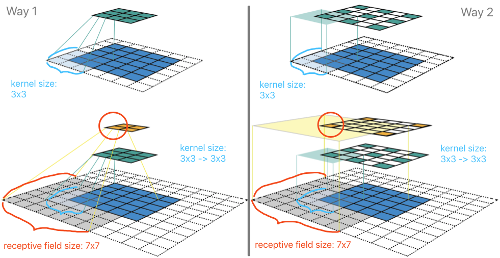
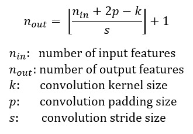
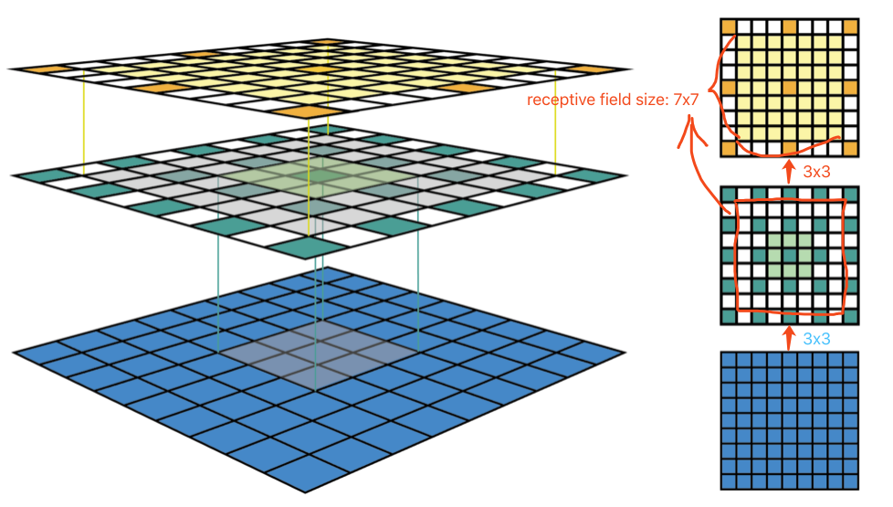
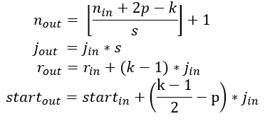
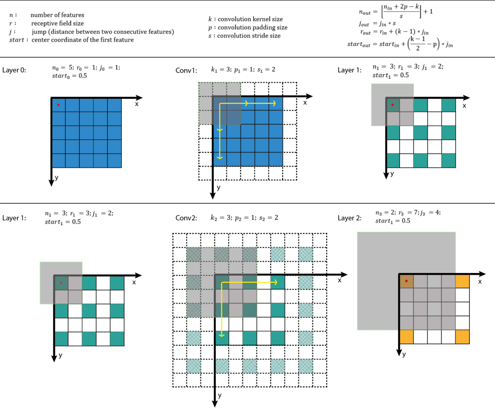
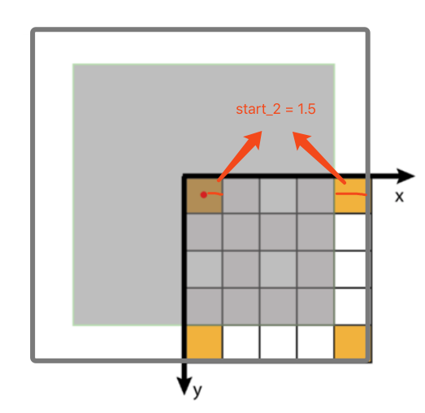
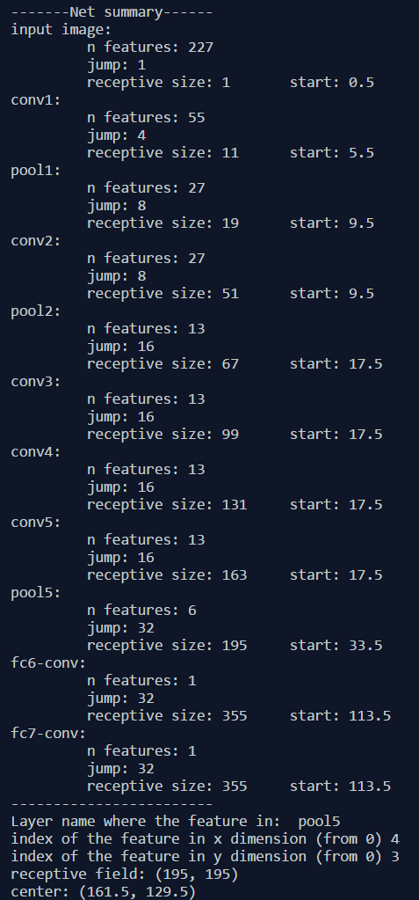

# 特征尺寸(Feature Map)和感受野(Receptive Field)计算

什么是**感受野**(**Receptive Field**)？
> The receptive field is defined as the region in the input space that a particular CNN’s feature is looking at (i.e. be affected by).

理论上定义，卷积神经网络中每层的**特征图**(**Feature Map**)上的像素点在原始图像中映射的区域大小，也就相当于高层的特征图中的像素点受原图多大区域的影响！

一个特征点的感受野可以用其所在的**中心点位置(center location)**和**大小(size)**来描述。然而，某卷积特征点所对应的感受野上并不是所有像素都是同等重要的，就好比人的眼睛所在的有限视野范围内，总有要 focus 的焦点。对于感受野来说，距离中心点越近的像素肯定对未来输出特征图的贡献就越大。换句话说，一个特征点在输入图像(Input) 上所关注的特定区域(也就是其对应的感受野)会在该区域的中心处聚焦，并以指数变化向周边扩展(need more explanation)。

在**目标检测**任务中，我们一般**在高层的`Feature Map`上检测大物体，在底层的`Feature Map`上检测小物体**。

## 特征图(Feature Map)

<!--  -->

如图1所示，我们采用卷积核C的核大小(kernel size) k=3x3，填充大小(padding size) p=1x1，步长(stride) s=2x2。(图中上面一行)对5x5的输入特征图进行卷积生成3x3的绿色特征图。(图中下面一行)对上面绿色的特征图采用相同的卷积操作生成2x2的橙色特征图。(图中左边一列)按列可视化CNN特征图，如果只看特征图，我们无法得知特征的位置(即感受野的中心位置)和区域大小(即感受野的大小)，而且无法深入了解CNN中的感受野信息。(图中右边一列)CNN特征图的大小固定，其特征位置即感受野的中心位置。

感受野表示输入空间中一个特定CNN特征的范围区域(*The receptive field is defined as the region in the input space that a particular CNN’s feature is looking at*)。一个特征的感受野可以采用区域的中心位置和特征大小进行描述。图1展示了一些感受野的例子，采用核大小(kernel size) k=3x3，填充大小(padding size) p=1x1，步长(stride)s=2x2的卷积核C对5x5大小的输入图进行卷积操作，将输出3x3大小的特征图(绿色图)。对3x3大小的特征图进行相同的卷积操作，将输出2x2的特征图(橙色)。[输出特征图在每个维度上的大小可以采用下面的公式进行计算](https://arxiv.org/pdf/1603.07285.pdf)：    

$$n_{out}=[\frac{n_{in}+2p-k}{s}]+1$$    

- $n_{in}$: number of input features    
- $n_{out}$: number of output features    
- $k$: kernel size    
- $p$: padding size    
- $s$: stride size    

<!--  -->

为了简单，本文假设CNN的架构是对称的，而且输入图像长宽比为1:1，因此所有维度上的变量值都相同。若CNN架构或者输入图像不是对称的，你也可以分别计算每个维度上的特征图大小。如**图1左边**所示一列展示了一种CNN特征图的常见可视化方式。这种可视化方式能够获取特征图的个数，但无法计算特征的位置(感受野的中心位置)和区域大小(感受野尺寸)。**图1右边**一列展示了一种固定大小的CNN特征图可视化方式，通过保持所有特征图大小和输入图大小相同来解决上述问题，接下来每个特征位于其感受野的中心。由于特征图中所有特征的感受野尺寸相同，我们就可以非常方便画出特征对应的包围盒(bounding box)来表示感受野的大小。因为特征图大小和输入图像相同，所以我们无需将包围盒映射到输入层。

<!--  -->

如图2所示，采用相同的卷积核C对7*7大小的输入图进行卷积操作，这里在特征中心周围画出了感受野的包围盒。为了表达更清楚，这里忽略了周围的填充像素。固定尺寸的CNN特征图可以采用3D(左图)或2D(右图)表示下的固定尺寸CNN特征图。注意：图2中感受野尺寸逐渐扩大，第二个特征层的中心特征感受野很快就会覆盖整个输入图。这一点对于CNN设计架构的性能提升非常重要。

## 感受野的计算(Receptive Field Arithmetic)

除了每个维度上特征图的个数，还需要计算每一层的感受野大小，因此我们需要了解每一层的额外信息，包括：当前感受野的尺寸**r**，相邻特征之间的距离(或者*jump*) **j**，左上角(起始) 特征的中心坐标*start*，其中特征的中心坐标定义为其感受野的中心坐标(如上述固定大小CNN特征图所述) 。假设卷积核大小**k**，填充大小**p**，步长大小**s**，则其输出层的相关属性计算如下：

$$n_{out}=[\frac{n_{in}+2p-k}{s}]+1$$    

$$j_{out}=j_{in}*s$$    

$$r_{out}=r_{in}+(k-1)*j_{in}$$    

$$start_{out}=start_{in}+(\frac{k-1}{2}-p)*j_{in}$$    


<!--  -->

- **公式一**: 基于输入特征个数和卷积相关属性计算输出特征的个数
- **公式二**: 计算输出特征图的**jump**，等于输入图的jump与输入特征个数(执行卷积操作时jump的个数，stride的大小)的乘积
- **公式三**: 计算输出特征图的*receptive field size*，等于**k**个输入特征覆盖区域`(k-1)*j_in`加上边界上输入特征的感受野覆盖的附加区域r_in。
- **公式四**: 计算第一个输出特征的感受野的中心位置，等于第一个输入特征的中心位置，加上第一个输入特征位置到第一个卷积核中心位置的距离`(k-1)/2*j_in`，再减去填充区域大小`p*j_in`。注意：这里都需要乘上输入特征图的*jump*，从而获取实际距离或间隔。
-


如图3所示，第一行给出一些符号和等式；第二行和最后一行说明给定输入层信息下输出层感受野的计算过程。
CNN的第一层是输入层，**n = image size**，**r = 1**，**j = 1**，**start = 0.5**。图3采用的坐标系中输入层的第一个特征中心位置在0.5。递归执行上述四个公式，就可以计算CNN中所有特征图中的感受野信息。图3给出这些公式计算的样例。



这里给出一个python小程序，用于计算给定CNN架构下所有层的感受野信息。程序允许输入任何特征图的名称和图中特征的索引号，输出相关感受野的尺寸和位置。图4给出AlexNet下的例子。



图4 AlexNet下感受野计算样例:
```python
# [filter size, stride, padding]
#Assume the two dimensions are the same
#Each kernel requires the following parameters:
# - k_i: kernel size
# - s_i: stride
# - p_i: padding (if padding is uneven, right padding will higher than left padding; "SAME" option in tensorflow)
#
#Each layer i requires the following parameters to be fully represented:
# - n_i: number of feature (data layer has n_1 = imagesize )
# - j_i: distance (projected to image pixel distance) between center of two adjacent features
# - r_i: receptive field of a feature in layer i
# - start_i: position of the first feature's receptive field in layer i (idx start from 0, negative means the center fall into padding)

import math
convnet =   [[11,4,0], [3,2,0], [5,1,2], [3,2,0], [3,1,1], [3,1,1], [3,1,1], [3,2,0], [6,1,0], [1, 1, 0]]
layer_names = ['conv1','pool1','conv2','pool2','conv3','conv4','conv5','pool5','fc6-conv', 'fc7-conv']
imsize = 227

def outFromIn(conv, layerIn):
  n_in = layerIn[0]
  j_in = layerIn[1]
  r_in = layerIn[2]
  start_in = layerIn[3]
  k = conv[0]
  s = conv[1]
  p = conv[2]

  n_out = math.floor((n_in - k + 2*p)/s) + 1
  actualP = (n_out-1)*s - n_in + k
  pR = math.ceil(actualP/2)
  pL = math.floor(actualP/2)

  j_out = j_in * s
  r_out = r_in + (k - 1)*j_in
  start_out = start_in + ((k-1)/2 - pL)*j_in
  return n_out, j_out, r_out, start_out

def printLayer(layer, layer_name):
  print(layer_name + ":")
  print("\t n features: %s \n \t jump: %s \n \t receptive size: %s \t start: %s " % (layer[0], layer[1], layer[2], layer[3]))

layerInfos = []
if __name__ == '__main__':
#first layer is the data layer (image) with n_0 = image size; j_0 = 1; r_0 = 1; and start_0 = 0.5
  print ("-------Net summary------")
  currentLayer = [imsize, 1, 1, 0.5]
  printLayer(currentLayer, "input image")
  for i in range(len(convnet)):
    currentLayer = outFromIn(convnet[i], currentLayer)
    layerInfos.append(currentLayer)
    printLayer(currentLayer, layer_names[i])
  print ("------------------------")
  layer_name = raw_input ("Layer name where the feature in: ")
  layer_idx = layer_names.index(layer_name)
  idx_x = int(raw_input ("index of the feature in x dimension (from 0)"))
  idx_y = int(raw_input ("index of the feature in y dimension (from 0)"))

  n = layerInfos[layer_idx][0]
  j = layerInfos[layer_idx][1]
  r = layerInfos[layer_idx][2]
  start = layerInfos[layer_idx][3]
  assert(idx_x < n)
  assert(idx_y < n)

  print ("receptive field: (%s, %s)" % (r, r))
  print ("center: (%s, %s)" % (start+idx_x*j, start+idx_y*j))
```

## 参考资料
> 1. [如何计算感受野(Receptive Field)——原理](https://zhuanlan.zhihu.com/p/31004121)
> 2. [A guide to receptive field arithmetic for Convolutional Neural Networks](https://medium.com/mlreview/a-guide-to-receptive-field-arithmetic-for-convolutional-neural-networks-e0f514068807)
> 3. [关于感受野 (Receptive field) 你该知道的事](https://iphysresearch.github.io/posts/receptive_field.html)
> 4. [特征图尺寸和感受野计算详解](https://zhuanlan.zhihu.com/p/56940729)
> 5. [卷积神经网络中的感受野计算（译）](https://zhuanlan.zhihu.com/p/26663577)