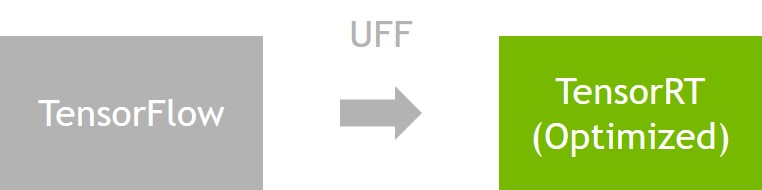

# TensorFlow

*基于TensorFlow2.0*
- [TensorFlow](#tensorflow)
  - [Tensorflow to TensorRT Image Classification](#tensorflow-to-tensorrt-image-classification)
    - [Models](#models)
    - [Setup](#setup)
    - [Download models and create frozen graphs](#download-models-and-create-frozen-graphs)
    - [Convert frozen graph to TensorRT engine](#convert-frozen-graph-to-tensorrt-engine)
    - [Execute TensorRT engine](#execute-tensorrt-engine)
    - [Benchmark all models](#benchmark-all-models)
  - [TensorFlow FAQ](#tensorflow-faq)
    - [导入TensorFlow的时候提示`ImportError: libcublas.so.10.0`](#%E5%AF%BC%E5%85%A5tensorflow%E7%9A%84%E6%97%B6%E5%80%99%E6%8F%90%E7%A4%BAimporterror-libcublasso100)


---
## Tensorflow to TensorRT Image Classification

[TensorFlow->TensorRT Image Classification](https://github.com/NVIDIA-AI-IOT/tf_to_trt_image_classification)    

<p align="center">

</p>

This contains examples, scripts and code related to image classification using TensorFlow models
(from [here](https://github.com/tensorflow/models/tree/master/research/slim#Pretrained))
converted to TensorRT.  Converting TensorFlow models to TensorRT offers significant performance
gains on the Jetson TX2 as seen [below](#models).

- [TensorFlow](#tensorflow)
  - [Tensorflow to TensorRT Image Classification](#tensorflow-to-tensorrt-image-classification)
    - [Models](#models)
    - [Setup](#setup)
    - [Download models and create frozen graphs](#download-models-and-create-frozen-graphs)
    - [Convert frozen graph to TensorRT engine](#convert-frozen-graph-to-tensorrt-engine)
    - [Execute TensorRT engine](#execute-tensorrt-engine)
    - [Benchmark all models](#benchmark-all-models)
  - [TensorFlow FAQ](#tensorflow-faq)
    - [导入TensorFlow的时候提示`ImportError: libcublas.so.10.0`](#%E5%AF%BC%E5%85%A5tensorflow%E7%9A%84%E6%97%B6%E5%80%99%E6%8F%90%E7%A4%BAimporterror-libcublasso100)

<a name="models"></a>
### Models

The table below shows various details related to pretrained models ported from the TensorFlow 
slim model zoo.  

| <sub>Model</sub> | <sub>Input Size</sub> | <sub>TensorRT (TX2 / Half)</sub> | <sub>TensorRT (TX2 / Float)</sub> | <sub>TensorFlow (TX2 / Float)</sub> | <sub>Input Name</sub> | <sub>Output Name</sub> | <sub>Preprocessing Fn.</sub> |
|--- |:---:|:---:|:---:|:---:|---|---|---|
| <sub>inception_v1</sub> | <sub>224x224</sub> | <sub>7.98ms</sub> | <sub>12.8ms</sub> | <sub>27.6ms</sub> | <sub>input</sub> | <sub>InceptionV1/Logits/SpatialSqueeze</sub> | <sub>inception</sub> |
| <sub>inception_v3</sub> | <sub>299x299</sub> | <sub>26.3ms</sub> | <sub>46.1ms</sub> | <sub>98.4ms</sub> | <sub>input</sub> | <sub>InceptionV3/Logits/SpatialSqueeze</sub> | <sub>inception</sub> |
| <sub>inception_v4</sub> | <sub>299x299</sub> | <sub>52.1ms</sub> | <sub>88.2ms</sub> | <sub>176ms</sub> | <sub>input</sub> | <sub>InceptionV4/Logits/Logits/BiasAdd</sub> | <sub>inception</sub> |
| <sub>inception_resnet_v2</sub> | <sub>299x299</sub> | <sub>53.0ms</sub> | <sub>98.7ms</sub> | <sub>168ms</sub> | <sub>input</sub> | <sub>InceptionResnetV2/Logits/Logits/BiasAdd</sub> | <sub>inception</sub> |
| <sub>resnet_v1_50</sub> | <sub>224x224</sub> | <sub>15.7ms</sub> | <sub>27.1ms</sub> | <sub>63.9ms</sub> | <sub>input</sub> | <sub>resnet_v1_50/SpatialSqueeze</sub> | <sub>vgg</sub> |
| <sub>resnet_v1_101</sub> | <sub>224x224</sub> | <sub>29.9ms</sub> | <sub>51.8ms</sub> | <sub>107ms</sub> | <sub>input</sub> | <sub>resnet_v1_101/SpatialSqueeze</sub> | <sub>vgg</sub> |
| <sub>resnet_v1_152</sub> | <sub>224x224</sub> | <sub>42.6ms</sub> | <sub>78.2ms</sub> | <sub>157ms</sub> | <sub>input</sub> | <sub>resnet_v1_152/SpatialSqueeze</sub> | <sub>vgg</sub> |
| <sub>resnet_v2_50</sub> | <sub>299x299</sub> | <sub>27.5ms</sub> | <sub>44.4ms</sub> | <sub>92.2ms</sub> | <sub>input</sub> | <sub>resnet_v2_50/SpatialSqueeze</sub> | <sub>inception</sub> |
| <sub>resnet_v2_101</sub> | <sub>299x299</sub> | <sub>49.2ms</sub> | <sub>83.1ms</sub> | <sub>160ms</sub> | <sub>input</sub> | <sub>resnet_v2_101/SpatialSqueeze</sub> | <sub>inception</sub> |
| <sub>resnet_v2_152</sub> | <sub>299x299</sub> | <sub>74.6ms</sub> | <sub>124ms</sub> | <sub>230ms</sub> | <sub>input</sub> | <sub>resnet_v2_152/SpatialSqueeze</sub> | <sub>inception</sub> |
| <sub>mobilenet_v1_0p25_128</sub> | <sub>128x128</sub> | <sub>2.67ms</sub> | <sub>2.65ms</sub> | <sub>15.7ms</sub> | <sub>input</sub> | <sub>MobilenetV1/Logits/SpatialSqueeze</sub> | <sub>inception</sub> |
| <sub>mobilenet_v1_0p5_160</sub> | <sub>160x160</sub> | <sub>3.95ms</sub> | <sub>4.00ms</sub> | <sub>16.9ms</sub> | <sub>input</sub> | <sub>MobilenetV1/Logits/SpatialSqueeze</sub> | <sub>inception</sub> |
| <sub>mobilenet_v1_1p0_224</sub> | <sub>224x224</sub> | <sub>12.9ms</sub> | <sub>12.9ms</sub> | <sub>24.4ms</sub> | <sub>input</sub> | <sub>MobilenetV1/Logits/SpatialSqueeze</sub> | <sub>inception</sub> |
| <sub>vgg_16</sub> | <sub>224x224</sub> | <sub>38.2ms</sub> | <sub>79.2ms</sub> | <sub>171ms</sub> | <sub>input</sub> | <sub>vgg_16/fc8/BiasAdd</sub> | <sub>vgg</sub> |

<!--| inception_v2 | 224x224 | 10.3ms | 16.9ms | 38.3ms | input | InceptionV2/Logits/SpatialSqueeze | inception |-->
<!--| vgg_19 | 224x224 | 97.3ms | OOM | input | vgg_19/fc8/BiasAdd | vgg |-->


The times recorded include data transfer to GPU, network execution, and
data transfer back from GPU.  Time does not include preprocessing. 
See [scripts/test_tf.py](scripts/test_tf.py), [scripts/test_trt.py](scripts/test_trt.py), and [src/test/test_trt.cu](src/test/test_trt.cu) 
for implementation details. 

<a name="install"></a>
### Setup

1. Flash the Jetson TX2 using JetPack 3.2.  Be sure to install
   * CUDA 9.0
   * OpenCV4Tegra
   * cuDNN
   * TensorRT 3.0

2. Install pip on Jetson TX2.
    ```
    sudo apt-get install python-pip
    ```

3. Install TensorFlow on Jetson TX2.
   1. Download the TensorFlow 1.5.0 pip wheel from [here](https://drive.google.com/open?id=1ZYUJqcFdJytdMCQ5bVDtb3KoTqc_cugG).  This build of TensorFlow is provided as a convenience for the purposes of this project.
   2. Install TensorFlow using pip
  
            sudo pip install tensorflow-1.5.0rc0-cp27-cp27mu-linux_aarch64.whl

4. Install uff exporter on Jetson TX2.
   1. Download TensorRT 3.0.4 for Ubuntu 16.04 and CUDA 9.0 tar package from https://developer.nvidia.com/nvidia-tensorrt-download.
   2. Extract archive 

            tar -xzf TensorRT-3.0.4.Ubuntu-16.04.3.x86_64.cuda-9.0.cudnn7.0.tar.gz

   3. Install uff python package using pip 

            sudo pip install TensorRT-3.0.4/uff/uff-0.2.0-py2.py3-none-any.whl

5. Clone and build this project

    ```shell
    git clone --recursive https://github.com/NVIDIA-Jetson/tf_to_trt_image_classification.git
    cd tf_to_trt_image_classification
    ```
    修改`CMakeLists.txt`文件，添加以下内容:    
    ```makefile
    # export TENSORRT_PATH=/home/andy/TensorRT
    include_directories(${TENSORRT_PATH}/include)
    link_directories(${TENSORRT_PATH}/lib)

    # include_directories(/home/andy/TensorRT/include)
    # link_directories(/home/andy/TensorRT/lib)
    ```
    然后编译运行:     
    ```shell
    mkdir build
    cd build
    cmake ..
    make 
    cd ..
    ```

<a name="download"></a>
### Download models and create frozen graphs

Run the following bash script to download all of the pretrained models. 

```
source scripts/download_models.sh
``` 

If there are any models you don't want to use, simply remove the URL from the model list in [scripts/download_models.sh](scripts/download_models.sh).  
Next, because the TensorFlow models are provided in checkpoint format, we must convert them to frozen graphs for optimization with TensorRT.  Run the [scripts/models_to_frozen_graphs.py](scripts/models_to_frozen_graphs.py) script.  

```
python scripts/models_to_frozen_graphs.py
```

If you removed any models in the previous step, you must add ``'exclude': true`` to the corresponding item in the [NETS](scripts/model_meta.py#L67) dictionary located in [scripts/model_meta.py](scripts/model_meta.py).  If you are following the instructions for executing engines below, you may also need some sample images.  Run the following script to download a few images from ImageNet.

```
source scripts/download_images.sh
```

<a name="convert"></a>
### Convert frozen graph to TensorRT engine

Run the [scripts/convert_plan.py](scripts/convert_plan.py) script from the root directory of the project, referencing the [models table](#models) for relevant parameters.  For example, to convert the Inception V1 model run the following

```
python scripts/convert_plan.py data/frozen_graphs/inception_v1.pb data/plans/inception_v1.plan input 224 224 InceptionV1/Logits/SpatialSqueeze 1 0 float
```

The inputs to the convert_plan.py script are

1. frozen graph path
2. output plan path
3. input node name
4. input height
5. input width
6. output node name
7. max batch size
8. max workspace size
9. data type (float or half)

This script assumes single output single input image models, and may not work out of the box for models other than those in the table above.

<a name="execute"></a>
### Execute TensorRT engine

Call the [examples/classify_image](examples/classify_image) program from the root directory of the project, referencing the [models table](#models) for relevant parameters.  For example, to run the Inception V1 model converted as above

```
./build/examples/classify_image/classify_image data/images/gordon_setter.jpg data/plans/inception_v1.plan data/imagenet_labels_1001.txt input InceptionV1/Logits/SpatialSqueeze inception
```

For reference, the inputs to the example program are

1. input image path
2. plan file path
3. labels file (one label per line, line number corresponds to index in output)
4. input node name
5. output node name
6. preprocessing function (either vgg or inception)

We provide two image label files in the [data folder](data/).  Some of the TensorFlow models were trained with an additional "background" class, causing the model to have 1001 outputs instead of 1000.  To determine the number of outputs for each model, reference the [NETS](scripts/model_meta.py#L67) variable in [scripts/model_meta.py](scripts/model_meta.py).

<a name="benchmark"></a>
### Benchmark all models

To benchmark all of the models, first convert all of the models that you [downloaded above](#download) into TensorRT engines.  Run the following script to convert all models

```
python scripts/frozen_graphs_to_plans.py
```

If you want to change parameters related to TensorRT optimization, just edit the [scripts/frozen_graphs_to_plans.py](scripts/frozen_graphs_to_plans.py) file.
Next, to benchmark all of the models run the [scripts/test_trt.py](scripts/test_trt.py) script

```
python scripts/test_trt.py
```

Once finished, the timing results will be stored at **data/test_output_trt.txt**.
If you want to also benchmark the TensorFlow models, simply run.

```
python scripts/test_tf.py
```

The results will be stored at **data/test_output_tf.txt**.  This benchmarking script loads an example image as input, make sure you have downloaded the sample images as [above](#download).

---
## TensorFlow FAQ
### 导入TensorFlow的时候提示`ImportError: libcublas.so.10.0`
错误提示:   
```python
Python 3.6.8 |Anaconda, Inc.| (default, Dec 30 2018, 01:22:34) 
[GCC 7.3.0] on linux
Type "help", "copyright", "credits" or "license" for more information.
>>> import tensorflow as tf
Traceback (most recent call last):
  File "/home/andy/anaconda3/envs/tf2/lib/python3.6/site-packages/tensorflow/python/pywrap_tensorflow.py", line 58, in <module>
    from tensorflow.python.pywrap_tensorflow_internal import *
  File "/home/andy/anaconda3/envs/tf2/lib/python3.6/site-packages/tensorflow/python/pywrap_tensorflow_internal.py", line 28, in <module>
    _pywrap_tensorflow_internal = swig_import_helper()
  File "/home/andy/anaconda3/envs/tf2/lib/python3.6/site-packages/tensorflow/python/pywrap_tensorflow_internal.py", line 24, in swig_import_helper
    _mod = imp.load_module('_pywrap_tensorflow_internal', fp, pathname, description)
  File "/home/andy/anaconda3/envs/tf2/lib/python3.6/imp.py", line 243, in load_module
    return load_dynamic(name, filename, file)
  File "/home/andy/anaconda3/envs/tf2/lib/python3.6/imp.py", line 343, in load_dynamic
    return _load(spec)
ImportError: libcublas.so.10.0: cannot open shared object file: No such file or directory

During handling of the above exception, another exception occurred:

Traceback (most recent call last):
  File "<stdin>", line 1, in <module>
  File "/home/andy/anaconda3/envs/tf2/lib/python3.6/site-packages/tensorflow/__init__.py", line 27, in <module>
    from tensorflow._api.v2 import audio
  File "/home/andy/anaconda3/envs/tf2/lib/python3.6/site-packages/tensorflow/_api/v2/audio/__init__.py", line 8, in <module>
    from tensorflow.python.ops.gen_audio_ops import decode_wav
  File "/home/andy/anaconda3/envs/tf2/lib/python3.6/site-packages/tensorflow/python/__init__.py", line 49, in <module>
    from tensorflow.python import pywrap_tensorflow
  File "/home/andy/anaconda3/envs/tf2/lib/python3.6/site-packages/tensorflow/python/pywrap_tensorflow.py", line 74, in <module>
    raise ImportError(msg)
ImportError: Traceback (most recent call last):
  File "/home/andy/anaconda3/envs/tf2/lib/python3.6/site-packages/tensorflow/python/pywrap_tensorflow.py", line 58, in <module>
    from tensorflow.python.pywrap_tensorflow_internal import *
  File "/home/andy/anaconda3/envs/tf2/lib/python3.6/site-packages/tensorflow/python/pywrap_tensorflow_internal.py", line 28, in <module>
    _pywrap_tensorflow_internal = swig_import_helper()
  File "/home/andy/anaconda3/envs/tf2/lib/python3.6/site-packages/tensorflow/python/pywrap_tensorflow_internal.py", line 24, in swig_import_helper
    _mod = imp.load_module('_pywrap_tensorflow_internal', fp, pathname, description)
  File "/home/andy/anaconda3/envs/tf2/lib/python3.6/imp.py", line 243, in load_module
    return load_dynamic(name, filename, file)
  File "/home/andy/anaconda3/envs/tf2/lib/python3.6/imp.py", line 343, in load_dynamic
    return _load(spec)
ImportError: libcublas.so.10.0: cannot open shared object file: No such file or directory


Failed to load the native TensorFlow runtime.

See https://www.tensorflow.org/install/errors

for some common reasons and solutions.  Include the entire stack trace
above this error message when asking for help
```
[解决方法](https://github.com/tensorflow/tensorflow/issues/26182#issuecomment-468882301):   
```shell
conda install cudatoolkit
conda install cudnn
```
