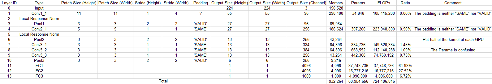
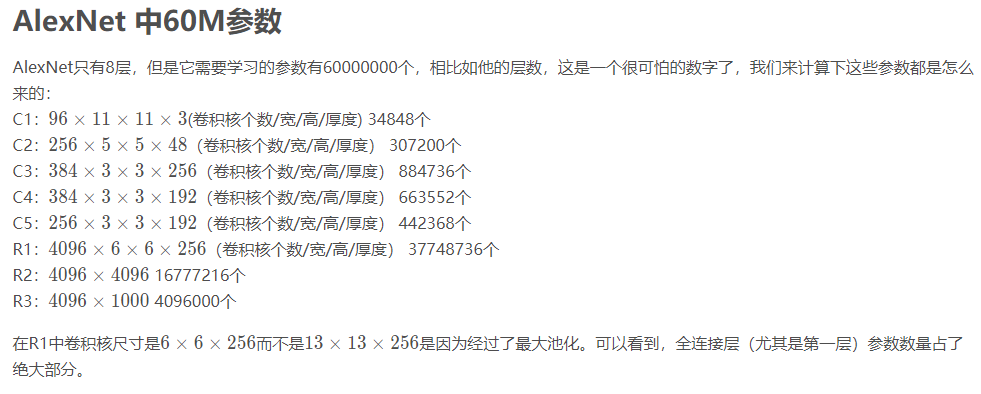

# 神经网络参数量(weights)和计算量(FLOPs)

<!--  -->

最近在估计往TDA4上移植模型的大小，ResNet18实际模型大小大概为44M，而我自己计算的只有11M左右？ 所以就想写一篇文章来讲一下如何计算网络的参数量。为了搞清楚参数量的计算，首先我们先搞清楚参数量的定义。

**参数量**就是指，模型所有带参数的层的权重参数总量。视觉类网络组件中带参数的层，主要有: **卷积层**、**BN层**、**全连接层**等。（注意: 激活函数层(relu等)和Maxpooling层、Upsample层是没有参数的，不需要学习，他们只是提供了一种非线性的变换）

## 理论公式部分
### 存储单位转换
   1 bit = 2^8    
   1 Byte = 8 bits = 2^8    
   1 word = 2 Byte = 2x2^8    
   1 char = 1 Byte = 2^8    
   1 int  = 4 Byte = 4x2^8    
   **1 float = 4 Byte = 4x2^8**    

## 神经网络参数量(weights)
### 网络知识储备
1. **卷积层**: <!-- \\(K^2 \times C_i \times C_o + C_o\\) --> 

   其中 `K` 为卷积核大小， `Ci` 为输入channel数， `Co` 为输出的channel数(也是filter的数量)，算式第二项是偏置项的参数量 。(虽然一般不写偏置项，因为不会影响总参数量的数量级，但是我们为了准确起见，把偏置项的参数量也考虑进来）

2. **BN层**:  <!-- \\(2 \times C_i\\) -->  

   其中 `Ci` 为输入的channel数（BN层有两个需要学习的参数，**平移因子**和**缩放因子**）

3. **全连接层**:  <!-- \\(T_i \times T_o + T_o\\) -->  

   其中 `Ti` 为输入向量的长度， `To` 为输出向量的长度，其中第二项为偏置项参数量。 (不过目前全连接层已经逐渐被Global Average Pooling层取代了)

有了公式，下面将以**AlexNet**为例，来实践一下参数量的计算。

## 以AlexNet为例

得到的结果为：

根据上表计算得到的参数量大概为60M, **每个参数按每个`4 bytes`算**，总共有60 x 4 = 240M, 这与实际上训练产生的model大小一致。

## 计算量(FLOPs)
[TODO]

## 参考资料
> 1. [神经网络参数量的计算: 以UNet为例](https://zhuanlan.zhihu.com/p/57437131)
> 2. [从AlexNet理解卷积神经网络的一般结构](https://blog.csdn.net/chaipp0607/article/details/72847422)
> 3. [经典神经网络参数的计算](https://zhuanlan.zhihu.com/p/49842046)
