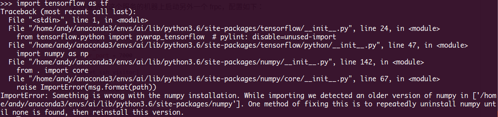
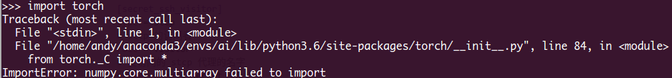
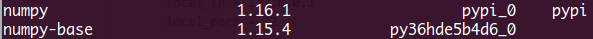
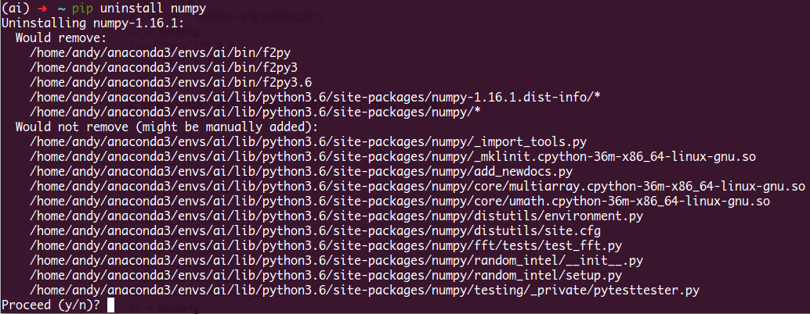
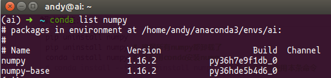

# AI算法学习

- [AI算法学习](#ai%E7%AE%97%E6%B3%95%E5%AD%A6%E4%B9%A0)
	- [YOLO V3](#yolo-v3)
	- [Faster R-CNN](#faster-r-cnn)
	- [Anaconda FAQ](#anaconda-faq)
		- [Anaconda环境下TensorFlow和Pytorch共存问题](#anaconda%E7%8E%AF%E5%A2%83%E4%B8%8Btensorflow%E5%92%8Cpytorch%E5%85%B1%E5%AD%98%E9%97%AE%E9%A2%98)
		- [Anaconda环境下Python下导入正常Jupyter Notebook中导入莫名出错](#anaconda%E7%8E%AF%E5%A2%83%E4%B8%8Bpython%E4%B8%8B%E5%AF%BC%E5%85%A5%E6%AD%A3%E5%B8%B8jupyter-notebook%E4%B8%AD%E5%AF%BC%E5%85%A5%E8%8E%AB%E5%90%8D%E5%87%BA%E9%94%99)


---
##  YOLO V3  

```shell
git clone http://github.com/pjreddie/darknet.git
cd darknet
```    
修改`Makefile`编译配置文件：    
```vim
  GPU=1
  CUDNN=1
  OPENCV=1
```
然后运行一下命令：    
```bash
make -j8
```   
也可以根据YOLO[官方](https://pjreddie.com/darknet/install/)安装指导安装即可，其中若编译的时候用到opencv库的时候，遇到以下报错：

**原因是opencv没有加入到环境变量中，解决方式**
用gedit打开`/etc/ld.so.conf`，注意要用sudo打开获得权限，不然无法修改， 如：
```shell
sudo gedit /etc/ld.so.conf
```
在文件中加上一行:
```shell
/usr/local/lib
```
`/user/local`是opencv安装路径 就是makefile中指定的安装路径.

再运行`sudo ldconfig`, 修改`bash.bashrc`文件:
```shell
sudo gedit /etc/bash.bashrc
```
在文件末尾加入： 
```shell
PKG_CONFIG_PATH=$PKG_CONFIG_PATH:/usr/local/lib/pkgconfig 
export PKG_CONFIG_PATH 
```
运行`source /etc/bash.bashrc`使其生效。

---
## Faster R-CNN
1. Clone the Faster R-CNN repository
```shell
# Make sure to clone with --recursive
git clone --recursive https://github.com/rbgirshick/py-faster-rcnn.git
```
or find it in [`src/algorithm/py-faster-rcnn.zip`](ai/py-faster-rcnn.zip) and unzip it.

1. Build the Cython modules
```shell
cd $FRCN_ROOT/lib
make
```

3. Build Caffe and pycaffe
若使用的CUDA 9.0以上，需要将 `/caffe-fast-rcnn/include/caffe/util/cudnn*` 、`/caffe-fast-rcnn/include/caffe/layers/cudnn*` 、`/caffe-fast-rcnn/src/caffe/util/cudnn*` 以及 `/caffe-fast-rcnn/src/caffe/layers/cudnn*` 用**caffe**下的同名替换。  
```shell
cd $FRCN_ROOT/caffe-fast-rcnn
# Now follow the Caffe installation instructions here:
#   http://caffe.berkeleyvision.org/installation.html

# or copy the following:
## Refer to http://caffe.berkeleyvision.org/installation.html
# Contributions simplifying and improving our build system are welcome!

# cuDNN acceleration switch (uncomment to build with cuDNN).
USE_CUDNN := 1

# CPU-only switch (uncomment to build without GPU support).
# CPU_ONLY := 1

# Uncomment if you're using OpenCV 3
OPENCV_VERSION := 3
# To customize your choice of compiler, uncomment and set the following.
# N.B. the default for Linux is g++ and the default for OSX is clang++
CUSTOM_CXX := g++

# CUDA directory contains bin/ and lib/ directories that we need.
CUDA_DIR := /usr/local/cuda
# On Ubuntu 14.04, if cuda tools are installed via
# "sudo apt-get install nvidia-cuda-toolkit" then use this instead:
# CUDA_DIR := /usr

# CUDA architecture setting: going with all of them.
# For CUDA < 6.0, comment the *_50 through *_61 lines for compatibility.
# For CUDA < 8.0, comment the *_60 and *_61 lines for compatibility.
# For CUDA >= 9.0, comment the *_20 and *_21 lines for compatibility.
CUDA_ARCH := -gencode arch=compute_30,code=sm_30 \
		-gencode arch=compute_35,code=sm_35 \
		-gencode arch=compute_50,code=sm_50 \
		-gencode arch=compute_52,code=sm_52 \
		-gencode arch=compute_60,code=sm_60 \
		-gencode arch=compute_61,code=sm_61 \
		-gencode arch=compute_61,code=compute_61

# BLAS choice:
# atlas for ATLAS (default)
# mkl for MKL
# open for OpenBlas
BLAS := atlas
# Custom (MKL/ATLAS/OpenBLAS) include and lib directories.
# Leave commented to accept the defaults for your choice of BLAS
# (which should work)!
# BLAS_INCLUDE := /path/to/your/blas
# BLAS_LIB := /path/to/your/blas

# This is required only if you will compile the matlab interface.
# MATLAB directory should contain the mex binary in /bin.
# MATLAB_DIR := /usr/local
# MATLAB_DIR := /Applications/MATLAB_R2012b.app

# NOTE: this is required only if you will compile the python interface.
# We need to be able to find Python.h and numpy/arrayobject.h.
PYTHON_INCLUDE := /usr/include/python2.7 \
		/usr/lib/python2.7/dist-packages/numpy/core/include
# Anaconda Python distribution is quite popular. Include path:
# Verify anaconda location, sometimes it's in root.
# ANACONDA_HOME := $(HOME)/anaconda
# PYTHON_INCLUDE := $(ANACONDA_HOME)/include \
		# $(ANACONDA_HOME)/include/python2.7 \
		# $(ANACONDA_HOME)/lib/python2.7/site-packages/numpy/core/include \

# We need to be able to find libpythonX.X.so or .dylib.
PYTHON_LIB := /usr/lib
# PYTHON_LIB := $(ANACONDA_HOME)/lib

# Uncomment to support layers written in Python (will link against Python libs)
# This will require an additional dependency boost_regex provided by boost.
WITH_PYTHON_LAYER := 1

# Whatever else you find you need goes here.
INCLUDE_DIRS := $(PYTHON_INCLUDE) /usr/local/include /usr/include/hdf5/serial/
LIBRARY_DIRS := $(PYTHON_LIB) /usr/local/lib /usr/lib /usr/lib/x86_64-linux-gnu /usr/lib/x86_64-linux-gnu/hdf5/serial

# Uncomment to use `pkg-config` to specify OpenCV library paths.
# (Usually not necessary -- OpenCV libraries are normally installed in one of the above $LIBRARY_DIRS.)
# USE_PKG_CONFIG := 1

BUILD_DIR := build
DISTRIBUTE_DIR := distribute

# Uncomment for debugging. Does not work on OSX due to https://github.com/BVLC/caffe/issues/171
# DEBUG := 1

# The ID of the GPU that 'make runtest' will use to run unit tests.
TEST_GPUID := 0

# enable pretty build (comment to see full commands)
Q ?= @
```
然后，编译安装：
```shell
make -j8 && make pycaffe
```

4. Download pre-computed Faster R-CNN detectors
```shell
cd $FRCN_ROOT
./data/scripts/fetch_faster_rcnn_models.sh
```

---
## Anaconda FAQ
### Anaconda环境下TensorFlow和Pytorch共存问题
`conda`环境中同时安装`TensorFlow`和`Pytorch`后，在导入这两个库的时候提示以下错误：    
     
    


原因是安装`Pytorch`和`TensorFlow`的时候安装了两遍`numpy`，且和`numpy-base`版本不同:    
    
解决方法：    
```shell
pip uninstall numpy
pip uninstall numpy # 确保所有numpy都卸载了
conda install numpy # 然后用conda安装numpy
# conda install --force-reinstall numpy # 上条命令无效使用本条命令
```
    
安装好了以后查看`numpy`版本:    
```shell
conda list numpy
```
     

### Anaconda环境下Python下导入正常Jupyter Notebook中导入莫名出错    
**问题描述**     
Anaconda环境下Python下导入正常JupyterNotebook中导入莫名出错    

**解决方案**   
出现该问题的原因是`Anaconda`虚拟环境中没有安装`Jupyter Notebook`而在虚拟环境中运行的`Jupyter Notebook`是调用的外部环境的`Jupyter Notebook`，解决方法是在虚拟环境中安装`Jupyter Notebook`:    
```shell
source activate virtualenv
conda install jupyter notebook
```
