# AI基础环境搭建和设置

 深度学习基础环境的搭建和设置

---
### 目录
1. [安装Ubuntu和Windows双系统](#安装ubuntu和windows双系统)
    - [CPU有集成显卡](#cpu有集成显卡)
      - [有关Ubuntu分区的相关问题](#有关ubuntu分区的相关问题)
      - [Ubuntu与Windows双系统时间同步解决方法](#ubuntu与windows双系统时间同步解决方法)
      - [调整grub引导系统顺序](#调整grub引导系统顺序)
      - [设置grub引导菜单的分辨率](#设置grub引导菜单的分辨率)
      - [设置grub Menu显示](#设置grub-menu显示)
    - [CPU无集成显卡](#cpu无集成显卡)
    - [远程切换双系统](#远程切换双系统)  
2. [安装**NVIDIA驱动**](#安装nvidia驱动)  
    - [安装NVIDIA驱动所需的依赖包](#安装nvidia驱动所需的依赖包)
    - [禁用Ubuntu自带的显卡驱动](#禁用ubuntu自带的显卡驱动)
    - [Ubuntu16TLS安装NVIDIA驱动](#ubuntu16tls安装nvidia驱动)
    - [Ubuntu18TLS安装NVIDIA驱动](#ubuntu18tls安装nvidia驱动)
    - [Ubuntu20TLS安装NVIDIA驱动](#ubuntu20tls安装nvidia驱动)
    - [配置NVIDIA环境变量](#配置nvidia环境变量)
    - [查看NVIDIA驱动版本](#查看nvidia驱动版本)
    - [解决Linux双系统安装卡在启动Logo](#解决linux双系统安装卡在启动logo)
3. [安装**CUDA**](#安装cuda)
    - [安装CUDA步骤](#安装cuda步骤)
    - [修改配置文件](#修改配置文件)
    - [查看CUDA版本](#查看cuda版本)
    - [卸载CUDA的方法](#卸载cuda的方法)
4. [安装**cuDNN**](#安装cudnn)
   - [下载安装**cuDNN**](#下载安装cudnn)
   - [**cuDNN**常见问题](#cudnn常见问题)
5. [**Ubuntu CUDA多版本**问题](#ubuntu-cuda多版本问题)
6. [**Windows CUDA多版本**问题](#windows-cuda多版本问题)
7. [**Anaconda**](#anaconda)
   - [安装Anaconda](#安装anaconda)
   - [屏蔽Anaconda](#屏蔽anaconda)
   - [Anaconda环境配置](#anaconda环境配置)
      - [重建Anaconda软连接](#重建anaconda软连接)
      - [关闭conda自动进入base虚拟环境](#关闭conda自动进入base虚拟环境)
      - [修复无名字环境](#修复无名字环境)
   - [卸载Anaconda](#卸载anaconda)
8. [安装**OpenCV**](#安装opencv)
    - [下载OpenCV](#下载opencv)
    - [编译OpenCV](#编译opencv)
    - [安装OpenCV](#安装opencv)
    - [卸载OpenCV](#卸载opencv)
9. [安装**Docker**](#安装docker)
10. [**TensorRT**](#tensorrt)
    - [安装TensorRT](#安装tensorrt)
      - [TensorRT环境变量设置](#tensorrt1)
      - [安装Python的TensorRT包](#tensorrt2)
      - [安装**uff**](#tensorrt3)
      - [安装**graphsurgeon**](#tensorrt4)
      - [验证TensorRT是否安装成功](#tensorrt5)
      - [TensorRT安装过程中遇到的问题以及解决方法](#tensorrt6)
    - [TensorRT生成**Engine**](#tensorrt生成engine)
      - [**Caffe**模型用TensorRT生成**Engine**](#caffe模型用tensorrt生成engine)
      - [**TensorFlow**模型用TensorRT生成**Engine**](#tensorflow模型用tensorrt生成engine)
        - [将TensorFlow模型生成UFF文件](#将tensorflow模型生成uff文件)
        - [将UFF文件转为Engine](#将uff文件转为engine)
        - [调用Engine进行推理](#调用engine进行推理)
      - [TensorRT**官方**实例](#tensorrt官方实例)
        - [TensorRT Caffe Engine](tensorrt/tensorrt-4.0.1.6/caffe_to_tensorrt.ipynb)
        - [TensorRT Tensorflow Engine](tensorrt/tensorrt-4.0.1.6/tf_to_tensorrt.ipynb)
        - [Manually Construct Tensorrt Engine](tensorrt/tensorrt-4.0.1.6/manually_construct_tensorrt_engine.ipynb)
11. [安装**Pytorch**](#安装pytorch)
12. [安装**TensorFlow**](#安装tensorflow)
13. [安装**Caffe**](#安装caffe)
    - [Python2下安装Caffe](#python2下安装cafe)
    - [Python3下安装Caffe](#python3下安装cafe)
14. [安装**Protobuf**](#安装protobuf)
15. [Linux **MATLAB**安装](#linux-matlab安装)
    - [Linux **MATLAB 2018**安装](#linux-matlab-2018安装)
    - [Linux **MATLAB 2019**安装](#linux-matlab-2019安装)

---
## 安装Ubuntu和Windows双系统
### CPU有集成显卡
详细的安装双系统就不过多介绍了，可以参考[这篇文章](https://blog.csdn.net/s717597589/article/details/79117112/)，但是在安装过程中有几个问题需要说明：
- BIOS里修改硬盘模式从`RAID` 至 `ACHI` :
    如果不修改raid至achi，我们采用UEFI启动的u盘安装盘将不能识别nvme驱动。会导致安装系统的过程中看不到硬盘。
    ```bash
    # 首先调整windows至safeboot minimal模式，使用windows管理员权限运行cmd：
    bcdedit /set {current} safeboot minimal

    # 禁用raid
    进入bios，修改RAID至ACHI

    # 重新进入windows，关闭safeboot minimal模式, 使用windows管理员权限运行cmd：
    bcdedit /deletevalue {current} safeboot
    ```

- BIOS里及`security boot`关闭，否则会出现NVIDIA驱动安装完以后重启电脑会反复进入登录界面
- 启动方式为`UEFI`
- 硬盘分区的时候可以只分为 `swap` 、 `efi` 、 `\` 和 `\home` 四个分区，不分 `\home` 也可以，在挂载 `\` 分区的时候会自动生成 `\home` 和其他分区，但是在重装系统的时候 `\home` 无法重新挂载之前的 `\home` 分区导致数据丢失（类似于Windows的非系统盘）
- 安装Alienware 17r4的killer网卡驱动(驱动在[`src\linux\linux-firmware_1.169.3_all.deb`](linux/linux-firmware_1.169.3_all.deb) )
- 重装Ubuntu系统时请在Windows下用`EasyUEFI`软件将Ubuntu的引导项删除，也可以调整启动顺序

| 分区 | 文件类型 | 分区大小 | 分区类型 |
| ------ | ------ | ------ | ------  |
| swap |  | 2倍内存大小 | 主分区 |
| efi |  | 512M | 逻辑分区 |
| / | ext4 | 磁盘剩下空间 | 逻辑分区 |

**下方「安装引导器设备」要选择 `efi` 分区**

#### 有关Ubuntu分区的相关问题
> swap交换空间，这个也就是虚拟内存的地方，选择主分区和空间起始位置。如果你给Ubuntu系统分区容量足够的话，最好是能给到你物理内存的2倍大小，像我8GB内存，就可以给个16GB的空间给它，这个看个人使用情况，太小也不好，太大也没用。（其实我只给了8GB，没什么问题）

> 新建efi系统分区，选中逻辑分区（这里不是主分区，请勿怀疑，老式的boot挂载才是主分区）和空间起始位置，大小最好不要小于256MB，系统引导文件都会在里面，我给的512MB，它的作用和boot引导分区一样，但是boot引导是默认grub引导的，而efi显然是UEFI引导的。不要按照那些老教程去选boot引导分区，也就是最后你的挂载点里没有“/boot”这一项，否则你就没办法UEFI启动两个系统了。

> 挂载“/home”，类型为EXT4日志文件系统，选中逻辑分区和空间起始位置，这个相当于你的个人文件夹，类似Windows里的User，如果你是个娱乐向的用户，我建议最好能分配稍微大点，因为你的图片、视频、下载内容基本都在这里面，这些东西可不像在Win上面你想移动就能移动的。
> 总的来说，最好不要低于8GB，我Ubuntu分区的总大小是64GB，这里我给了12GB给home。
（这里特别提醒一下，Ubuntu最新发行版不建议强制获取Root权限，因为我已经玩崩过一次。所以你以后很多文档、图片、包括免安装软件等资源不得不直接放在home分支下面。你作为图形界面用户，只对home分支有完全的读写执行权限，其余分支例如usr你只能在终端使用sudo命令来操作文件，不利于存放一些直接解压使用的免安装软件。因此，建议home分支多分配一点空间，32GB最好……）

> 挂载“/usr”，类型为EXT4日志文件系统，选中逻辑分区和空间起始位置，这个相当于你的软件安装位置，Linux下一般来说安装第三方软件你是没办法更改安装目录的，系统都会统一地安装到/usr目录下面，因此你就知道了，这个分区必须要大，我给了32GB。

> 最后，挂载“/”，类型为EXT4日志文件系统，选中逻辑分区和空间起始位置，
因为除了home和usr还有很多别的目录，但那些都不是最重要的，“/”就把除了之前你挂载的home和usr外的全部杂项囊括了，大小也不要太小，最好不低于8GB。如果你非要挨个仔细分配空间，那么你需要知道这些各个分区的含义
不过就算你把所有目录都自定义分配了空间也必须要给“/”挂载点分配一定的空间。

#### Ubuntu与Windows双系统时间同步解决方法
安装`ntpdate`:
```shell
sudo apt-get install ntpdate
sudo ntpdate time.windows.com
```
然后将时间更新到硬件上:
```shell
sudo hwclock --localtime --systohc
```

#### 调整grub引导系统顺序
##### 方法一: 只更改默认选项
只更改默认选项，修改`/etc/default/grub`文件:
```bash
sudo vim /etc/default/grub
```
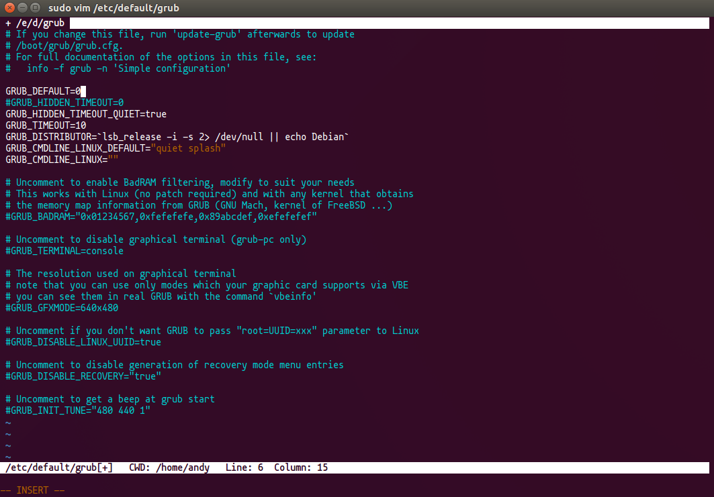

```bash
# If you change this file, run 'update-grub' afterwards to update
# /boot/grub/grub.cfg.
# For full documentation of the options in this file, see:
#   info -f grub -n 'Simple configuration'

GRUB_DEFAULT=0
#GRUB_HIDDEN_TIMEOUT=0
GRUB_HIDDEN_TIMEOUT_QUIET=true
GRUB_TIMEOUT=10
GRUB_DISTRIBUTOR=`lsb_release -i -s 2> /dev/null || echo Debian`
GRUB_CMDLINE_LINUX_DEFAULT="quiet splash"
GRUB_CMDLINE_LINUX=""

# Uncomment to enable BadRAM filtering, modify to suit your needs
# This works with Linux (no patch required) and with any kernel that obtains
# the memory map information from GRUB (GNU Mach, kernel of FreeBSD ...)
#GRUB_BADRAM="0x01234567,0xfefefefe,0x89abcdef,0xefefefef"

# Uncomment to disable graphical terminal (grub-pc only)
#GRUB_TERMINAL=console

# The resolution used on graphical terminal
# note that you can use only modes which your graphic card supports via VBE
# you can see them in real GRUB with the command `vbeinfo'
#GRUB_GFXMODE=640x480

# Uncomment if you don't want GRUB to pass "root=UUID=xxx" parameter to Linux
#GRUB_DISABLE_LINUX_UUID=true

# Uncomment to disable generation of recovery mode menu entries
#GRUB_DISABLE_RECOVERY="true"

# Uncomment to get a beep at grub start
#GRUB_INIT_TUNE="480 440 1"
```
这是我们关注的内容，只需要把第6行的`GRUB_DEFAULT="0"`改成你想要默认选中的序号减去1就行，比如第一张图中，想要默认选中`Windows boot manger`，修改`GRUB_DEFAULT="2"`按 `ESC` 然后 `wq` 保存，退出。最后执行关键的一步:
```bash
sudo update-grub
```
这样，下次开机的时候默认选中的启动项就是`Windows`了。

这样的操作对于强迫症人来说是绝对不能忍的。必须把 `Windows boot manger` 放到第一位，下面就是第二种方法.

##### 方法二: 彻底解决

修改`/boot/grub/grub.cfg`文件，首先讲原始的`grub.cfg`备份一份:
```bash
sudo cp /boot/grub/grub.cfg /boot/grub/grub.cfg.backup
```
然后用`gedit`打开`/boot/grub/grub.cfg`文件:
```bash
sudo gedit /boot/grub/grub.cfg
```
在用gedit打开的文件里里搜索`menuentry`，找到以下位置:
```bash
### BEGIN /etc/grub.d/30_os-prober ###
menuentry 'Windows Boot Manager (on /dev/nvme1n1p1)' --class windows --class os $menuentry_id_option 'osprober-efi-00ED-6F44' {
	insmod part_gpt
	insmod fat
	if [ x$feature_platform_search_hint = xy ]; then
	  search --no-floppy --fs-uuid --set=root  00ED-6F44
	else
	  search --no-floppy --fs-uuid --set=root 00ED-6F44
	fi
	chainloader /efi/Microsoft/Boot/bootmgfw.efi
}
set timeout_style=menu
if [ "${timeout}" = 0 ]; then
  set timeout=10
fi
### END /etc/grub.d/30_os-prober ###
```
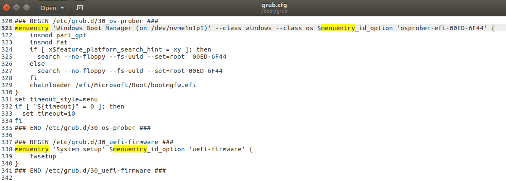
剪切该段，放到以下位置的前面:
```bash
menuentry 'Ubuntu' --class ubuntu --class gnu-linux --class gnu --class os $menuentry_id_option 'gnulinux-simple-0a4a1e2a-292f-43d2-bd28-97cc6bee3b02' {
	recordfail
	load_video
	gfxmode $linux_gfx_mode
	insmod gzio
	if [ x$grub_platform = xxen ]; then insmod xzio; insmod lzopio; fi
	insmod part_msdos
	insmod ext2
	if [ x$feature_platform_search_hint = xy ]; then
	  search --no-floppy --fs-uuid --set=root  0a4a1e2a-292f-43d2-bd28-97cc6bee3b02
	else
	  search --no-floppy --fs-uuid --set=root 0a4a1e2a-292f-43d2-bd28-97cc6bee3b02
	fi
        linux	/boot/vmlinuz-4.15.0-48-generic root=UUID=0a4a1e2a-292f-43d2-bd28-97cc6bee3b02 ro  quiet splash $vt_handoff
	initrd	/boot/initrd.img-4.15.0-48-generic
}
```
调整后如下:
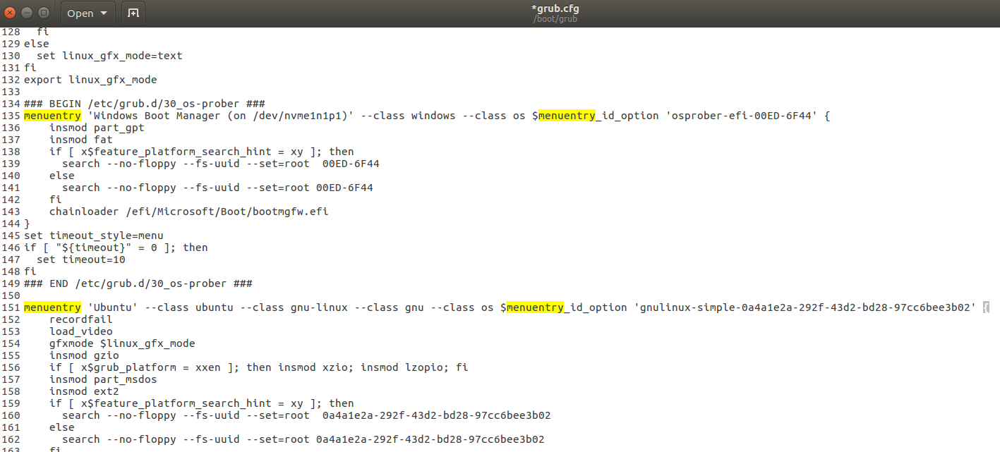


**注意**
这里千万不要! 千万不要! 千万不要执行` sudo update-grub` .


#### 设置grub引导菜单的分辨率
开机长按 `shift` 或者 `GRUB` 菜单按 `C` 进入 `GRUB` 命令行:
```
videoinfo
```


然后进入Ubuntu系统，运行一下命令：
```bash
sudo vim /etc/default/grub
```
在 `grub` 文本中找到 `#GRUB_GFXMODE=640×480` 将 `#` 去掉并修改为正确的分辨率数值:
```bash
GRUB_GFXMODE=1920×1080
```
然后更新grub:
```bash
sudo update-grub
```
#### 设置grub Menu显示
1. `ctrl+alt+t`打开终端
2. 键入  `sudo vim /etc/default/grub`  ，使用vim打开grub文件，或者使用其他文本编辑器亦可
3. 在`GRUB-TIMEOUT_STYLE=hidden`行首添加#注释掉该行
4. (可选)将`GRUB_TIMEOUT=10`改为`3`，减少“自动选择默认项”等待时间
5. `sudo update-grub` 更新grub即可

### CPU无集成显卡
建议使用Windows下的**WSL**系统，WSL下也可以安装**CUDA**。

### 远程切换双系统
当远程连接Windows和Ubuntu双系统电脑时，有时候需要远程切换两个系统，但是无法远程在BIOS里选择想要启动的系统。本文提供一个可靠的解决方案，在事先进入了某个系统的前提下，重启到另一个系统。
首先，如果双系统正常安装，先安装Windows，再安装Ubuntu，那么Ubuntu将成为BIOS的引导，选择启动系统的界面应该长这样。

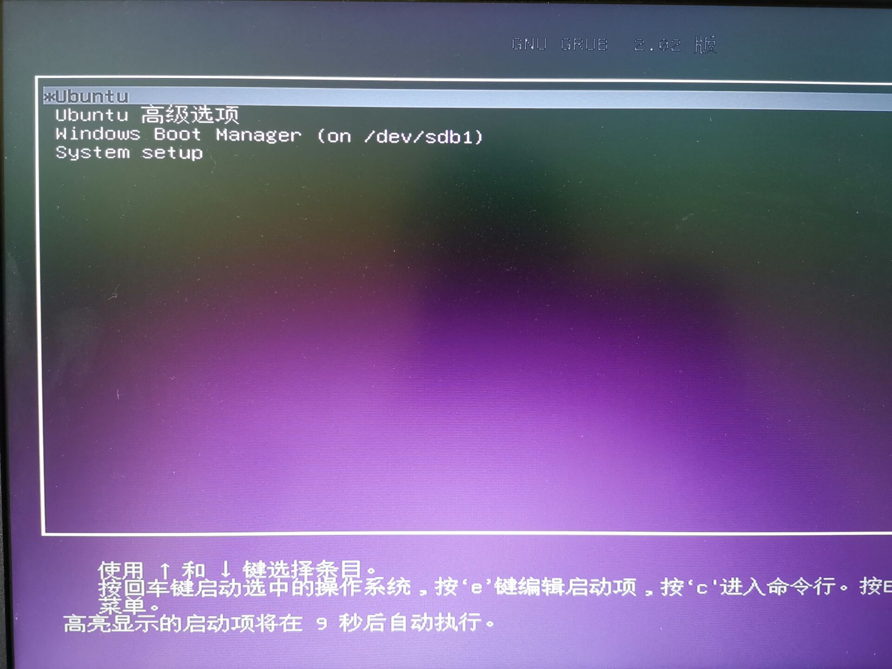

#### Ubuntu切换到Windows
在文件`/etc/default/grub`中，可以通过修改`GRUB_DEFAULT=0`这个值来修改BIOS默认选择启动系统。但是如果将其设置为默认启动Windows系统（值修改为2）时，就无法从Windows再切换回Ubuntu。
所以可以通过bash指令，指定重启到Windows系统，但不影响BIOS默认的选择。
```shell
sudo grub-reboot 2 #指定选择Windows系统
sudo reboot
```
为了快捷方便，可以在桌面创建快捷方式，并写一个可执行脚本来实现重启。
```bash
[Desktop Entry]
Encoding=UTF-8
Name=Reboot to Windows
Icon=help-about
Exec=bash ~/reboot2win.sh
Type=Application
Terminal=false
```
reboot2win.sh中的内容:
```shell
echo "你的sudo密码" | sudo -S grub-reboot 2
echo "你的sudo密码" | sudo -S reboot
```
#### Windows切换到Ubuntu

直接重启，BIOS默认选择系统就是Ubuntu。

---
## Ubuntu16TLS安装NVIDIA驱动
### 安装NVIDIA驱动所需的依赖包
*在终端里依次输入以下命令安装驱动所需的依赖包*
```shell
sudo apt-get install libprotobuf-dev libleveldb-dev libsnappy-dev libopencv-dev libhdf5-serial-dev protobuf-compiler
sudo apt-get install --no-install-recommends libboost-all-dev
sudo apt-get install libopenblas-dev liblapack-dev libatlas-base-dev
sudo apt-get install libgflags-dev libgoogle-glog-dev liblmdb-dev
sudo apt-get install git cmake build-essential
```
假如有安装包一直下载失败，可以使用：
```shell
sudo apt-get update
```
### 禁用Ubuntu自带的显卡驱动
Ubuntu 16.04 自带 nouveau显卡驱动，这个自带的驱动是不能用于CUDA的，需要卸载重装。假如重装过显卡驱动则可跳过这一步。没有重装过的就跟着我的步骤往下走。

首先得禁用Ubuntu自带的显卡驱动nouveau，只有在禁用掉 nouveau 后才能顺利安装 NVIDIA 显卡驱动，禁用方法就是在 `/etc/modprobe.d/blacklist-nouveau.conf`文件中添加一条禁用命令，首先需要打开该文件，通过以下命令打开：
```shell
sudo gedit /etc/modprobe.d/blacklist-nouveau.conf
```
打开后发现该文件中没有任何内容，**写入**：
```shell
blacklist nouveau
options nouveau modeset=0
```
保存后关闭文件，注意此时还需执行以下命令使禁用 `nouveau` 真正生效：
```shell
sudo update-initramfs -u
```
然后输入以下命令，若什么都没有显示则禁用nouveau生效了(**重启电脑有可能会出现黑屏，原因是禁用了集成显卡，系统没有显卡驱动**)：
```shell
lsmod | grep nouveau
```


### 安装NVIDIA官方显卡驱动

**NOTE：显卡驱动不要追求过新，够用即可.**

通过`Ctrl + Alt + F1`进入文本模式，输入帐号密码登录，通过`Ctrl + Alt + F7`可返回图形化模式，在文本模式登录后首先关闭桌面服务：
```shell
sudo service lightdm stop
```
这里会要求你输入账户的密码。然后通过`Ctrl + Alt + F7`发现已无法成功返回图形化模式，说明桌面服务已成功关闭，注意此步对接下来的 NVIDIA 显卡驱动安装尤为重要，必需确保桌面服务已关闭。按`Ctrl + Alt + F1`再次进入终端命令行界面，先卸载之前的显卡驱动(注意以下命令在`Zsh`的shell环境下不认识*，需要切换到`bash`的shell环境)：
```shell
sudo apt-get purge nvidia*
```
加入官方ppa源：
```shell
sudo add-apt-repository ppa:graphics-drivers/ppa
```
之后刷新软件库并安装显卡驱动：
```shell
sudo apt-get update
sudo apt-get install nvidia-418 nvidia-settings nvidia-prime  # CUDA 10.1
#sudo apt-get install nvidia-390 nvidia-settings nvidia-prime  # cuda 8.0 或 CUDA 9.0
#sudo apt-get install nvidia-415 nvidia-settings nvidia-prime  # CUDA 9.0
```
**重启电脑**，通过下面命令查看显卡信息：
```shell
nvidia-settings
```

## Ubuntu18TLS安装NVIDIA驱动
在Ubuntu 18.04上安装NVIDIA有三种方法：
1. 使用标准Ubuntu仓库进行自动化安装
2. 使用PPA仓库进行自动化安装
3. 使用官方的NVIDIA驱动进行手动安装

上述三种方法均可用，更推荐使用手动安装。

**注意**：

在安装之前首先就是要禁用Nouveau的驱动，禁用该驱动的方法参照[这篇博客](https://blog.csdn.net/tjuyanming/article/details/79267984)。

上一步的改动只是在安装的时候临时禁用。如果没有永久禁用该驱动，可能会出现安装完毕NIVIDA显卡后无法进入Ubuntu的情况(在登录界面，输入密码也无法登录)。

所以，在安装后Ubuntu成功后需要在grub的配置文件里面更改：
```shell
$ sudo gedit /boot/grub/grub.cfg
```
在文本中搜索 `quiet splash` 然后添加`acpi_osi=linux nomodeset`，保存文本即可。

### 使用标准Ubuntu 仓库进行自动化安装
这种方法几乎是所有的示例中最简单的方法，也是该教程最为推荐的方法。首先，检测你的NVIDIA显卡型号和推荐的驱动程序的模型。在命令行中输入如下命令：
```shell
$ ubuntu-drivers devices
== /sys/devices/pci0000:00/0000:00:01.1/0000:02:00.0 ==
modalias : pci:v000010DEd00001E04sv00001458sd000037C4bc03sc00i00
vendor   : NVIDIA Corporation
driver   : nvidia-driver-440 - third-party free recommended
driver   : nvidia-driver-410 - third-party free
driver   : nvidia-driver-415 - third-party free
driver   : nvidia-driver-435 - distro non-free
driver   : xserver-xorg-video-nouveau - distro free builtin
```
从输出结果可以看到，目前系统已连接Nvidia GeFrand GTX 680显卡，建议安装驱动程序是 nvidia-384版本的驱动。如果您同意该建议，请再次使用Ubuntu驱动程序命令来安装所有推荐的驱动程序。

输入以下命令：
```shell
$ sudo ubuntu-drivers autoinstall
```
一旦安装结束，重新启动系统，你就完成了。

### 使用PPA仓库进行自动安装
使用图形驱动程序PPA存储库允许我们安装NVIDIA beta驱动程序，但是这种方法存在不稳定的风险。
首先，将`ppa:graphics-drivers/ppa`存储库添加到系统中：
```shell
$ sudo add-apt-repository ppa:graphics-drivers/ppa
$ sudo apt update
```
接下来，识别显卡模型和推荐的驱动程序：
```shell
$ ubuntu-drivers devices
== /sys/devices/pci0000:00/0000:00:01.1/0000:02:00.0 ==
modalias : pci:v000010DEd00001E04sv00001458sd000037C4bc03sc00i00
vendor   : NVIDIA Corporation
driver   : nvidia-driver-440 - third-party free recommended
driver   : nvidia-driver-410 - third-party free
driver   : nvidia-driver-415 - third-party free
driver   : nvidia-driver-435 - distro non-free
driver   : xserver-xorg-video-nouveau - distro free builtin
```
输入以下命令：
```shell
$ sudo apt install nvidia-dirver-440
```
一旦完成，即可重新启动系统。

### 使用官方的NVIDIA驱动进行手动安装

这种方式是最为推荐的方式。

需要先安装一些 `NVIDIA` 显卡依赖的软件，在终端依次执行如下命令：
```shell
sudo dpkg --add-architecture i386
sudo apt update
sudo apt install build-essential libc6:i386
```

首先识别NVIDIA显卡型号，输入一下命令：
```shell
$  lshw -numeric -C display
```
或者
```shell
$ lspci -vnn | grep VGA
```
下载NVIDIA官方显卡驱动，然后存储到相应路径。

停止可视化桌面：
```shell
$ sudo telinit 3
```
之后会进入一个新的命令行会话，使用当前的用户名密码登录。

如果原来安装过，需要先卸载：
```shell
sudo apt-get --purge remove nvidia-*
```
或者:
```shell
sudo sh NVIDIA-Linux-x86_64-440.82.run -uninstall
```

在相应路径下安装NVIDIA驱动：
```shell
$ sudo chmod a+x NVIDIA-Linux-x86_64-440.82.run
$ sudo sh NVIDIA-Linux-x86_64-440.82.run --no-x-check
```
按照以下步骤：
```shell
Accept License
The distribution-provided pre-install script failed! Are you sure you want to continue? -> CONTINUE INSTALLATION
Would you like to run the nvidia-xconfig utility? -> YES
```
让后，更新内核，重启电脑：
```shell
sudo update-initramfs -u
sudo reboot now
```
**注意**
- 采用这种方法安装的驱动，每次内核更新后，都要按照上面的方法搞一遍才能启用新的驱动。
- 原来的方法通过添加PPA，可以自动更新，但是没有最新的驱动程序版本（Ubuntu18.04上最高390，Ubuntu16.04上为396），目前还不能支持2080Ti显卡。

安装完成后重启系统就可以点击软件列表中的 `NVIDIA` 的配置软件配置显卡驱动了，如果你遇到如下报错，请依次在终端输入如下命令解决：
**报错**： `WARNING: Unable to find suitable destination to install 32-bit compatibility libraries`
**解决办法**：
```shell
sudo dpkg --add-architecture i386
sudo apt update
sudo apt install libc6:i386
```

**注意Ubuntu18.04进tty**
If you are already in the TTY environment, you can use the shortcut to get out from TTY.
```shell
CTRL + ALT + F1 or F2
```
F1 is for my locked login screen. F2 is for my unlocked screen.
However, if you’re in the GUI environment and you want to access with TTY, you can try
```shell
CTRL + ALT + F3 ~ F6
```
Ubuntu按下`Ctrl + Alt + Fn`键会进入tty界面（虚拟终端），电脑键盘有`F1-F12`，所以有12个tty。
注意：有时候开机的时候也会进入tty界面
在**Ubuntu18.04**系统下:
- 按下`Ctrl + Alt + Fn1`进入图形化用户登录界面
- 按下`Ctrl + Alt + Fn2`进入当前图形化界面
- 按下`Ctrl + Alt + Fn3-Fn6`进入命令行虚拟终端
- 按下`Ctrl + Alt + Fn7-Fn12`进入另外的虚拟终端，这些虚拟终端没有任何程序执行，所以只能看到一个闪烁的光标
要退出`Fn3-Fn12`虚拟终端，按下`Ctrl + Alt + F1`，或者`Ctrl + Alt + F2`就行了。
注意：如果开机后进入`tty`界面（我的进入过tty1），先尝试上面的退出方法，如果不行，输入以下命令：
```shell
sudo apt install ubuntu-desktop
```
注意：输入后，没有提示输入密码，可能会出现以下命令：
```shell
[sudo] usrname(这里是你的用户名) 四个小白方块
```
接着在四个小白方块后面输入密码就可以了，然后会自动安装ubunu-desktop。


### 配置NVIDIA环境变量
使用 `vim` 命令打开配置文件：
```shell
sudo apt-get install vim
vim ~/.bashrc
```
然后在**文件最后**追加以下内容：
```shell
# NVIDIA
export LD_LIBRARY_PATH=/usr/lib/x86_64-linux-gnu:$LD_LIBRARY_PATH
export LD_LIBRARY_PATH=/lib/x86_64-linux-gnu:$LD_LIBRARY_PATH
```
`wq` 保存并退出，运行以下内容使环境变量生效：
```shell
source  ~/.bashrc
```
### 查看NVIDIA驱动版本
```bash
cat /proc/driver/nvidia/version
```
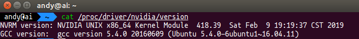
或者
```shell
nvidia-smi
```


### 解决Linux双系统安装卡在启动Logo
在安装Linux 双系统时，经常会出现卡在安装logo的问题，这种原因一般是由于linux发行商收录的nouveau 的开源显卡的问题。针对这种情况，解决方案如下：
1 最重要的话放在前面：**安装Linux之前先关闭Security Boot**！！（不同主板引导界面中该选项的位置可能不太一致，但是大多数都是在boot 选项中的）

2 在进入grub安装界面的时候，在Install Ubuntu选项，按`e`,进入命令行模式，然后在`quiet slash`，添加`acpi_osi=linux nomodeset`，然后按`F10`重新引导。

修改上述选项可以在开机的时候，禁用 `nouveau` 显卡
重新引导之后，你可能会发现，安装的窗口有一部分屏幕下方，导致部分按钮无法点击。此时，按下`Alt+F7`，鼠标会变成手指图标，即将窗口向上拖动即可。

3 安装完成，重启。在电脑重启黑屏的时候，拔出U盘。
(重启的时候也可能卡在logo ，所以在要求选择引导选项的时候，重复上述操作)

4 成功进入linux以后,要立即安装nvidia的显卡驱动。可以通过两种方式安装
4.1 在设置->软件和更新->附加驱动(倒数第二个选项)里面选择安装(可能显卡驱动版本比较老)
4.2 或者去nvidia官网查看合适驱动安装


ubuntu16.04进入tty 命令行登录模式(`Ctrl+Alt+F1`)，而ubuntu18.04则需要用`Ctrl+Alt+F3`,执行下列语句：
```shell
sudo apt-get purge nvidia-*  #删除可能存在的已有驱动
sudo add-apt-repository ppa:graphics-drivers/ppa
sudo apt-get update
sudo apt-get install nvidia-384
sudo reboot #重启
```
测试nvidia 驱动是否成功安装，使用以下命令：
```shell
nvidia-smi
nvidia-settings
```

## Ubuntu20TLS安装NVIDIA驱动
**Ubuntu20.04**推荐使用官方的NVIDIA驱动进行手动安装

这种方式是最为推荐的方式。

需要先安装一些 `NVIDIA` 显卡依赖的软件，在终端依次执行如下命令：
```shell
sudo dpkg --add-architecture i386
sudo apt update
sudo apt install build-essential libc6:i386
```

首先识别NVIDIA显卡型号，输入一下命令：
```shell
$  lshw -numeric -C display
```
或者
```shell
$ lspci -vnn | grep VGA
```
下载NVIDIA官方显卡驱动，然后存储到相应路径。

停止可视化桌面：
```shell
$ sudo telinit 3
```
之后会进入一个新的命令行会话，使用当前的用户名密码登录。

如果原来安装过，需要先卸载：
```shell
sudo apt-get --purge remove nvidia-*
```
或者:
```shell
sudo sh NVIDIA-Linux-x86_64-440.82.run -uninstall
```

在相应路径下安装NVIDIA驱动：
```shell
$ sudo chmod a+x NVIDIA-Linux-x86_64-440.82.run
$ sudo sh NVIDIA-Linux-x86_64-440.82.run --no-x-check
```
按照以下步骤：
```shell
Accept License
The distribution-provided pre-install script failed! Are you sure you want to continue? -> CONTINUE INSTALLATION
Would you like to run the nvidia-xconfig utility? -> YES
```
让后，更新内核，重启电脑：
```shell
sudo update-initramfs -u
sudo reboot now
```
**注意**
- 采用这种方法安装的驱动，每次内核更新后，都要按照上面的方法搞一遍才能启用新的驱动。
- 原来的方法通过添加PPA，可以自动更新，但是没有最新的驱动程序版本（Ubuntu18.04上最高390，Ubuntu16.04上为396），目前还不能支持2080Ti显卡。

安装完成后重启系统就可以点击软件列表中的 `NVIDIA` 的配置软件配置显卡驱动了，如果你遇到如下报错，请依次在终端输入如下命令解决：
**报错**： `WARNING: Unable to find suitable destination to install 32-bit compatibility libraries`
**解决办法**：
```shell
sudo dpkg --add-architecture i386
sudo apt update
sudo apt install libc6:i386
```

**注意Ubuntu18.04进tty**
If you are already in the TTY environment, you can use the shortcut to get out from TTY.
```shell
CTRL + ALT + F1 or F2
```
F1 is for my locked login screen. F2 is for my unlocked screen.
However, if you’re in the GUI environment and you want to access with TTY, you can try
```shell
CTRL + ALT + F3 ~ F6
```
Ubuntu按下`Ctrl + Alt + Fn`键会进入tty界面（虚拟终端），电脑键盘有`F1-F12`，所以有12个tty。
注意：有时候开机的时候也会进入tty界面
在**Ubuntu18.04**系统下:
- 按下`Ctrl + Alt + Fn1`进入图形化用户登录界面
- 按下`Ctrl + Alt + Fn2`进入当前图形化界面
- 按下`Ctrl + Alt + Fn3-Fn6`进入命令行虚拟终端
- 按下`Ctrl + Alt + Fn7-Fn12`进入另外的虚拟终端，这些虚拟终端没有任何程序执行，所以只能看到一个闪烁的光标
要退出`Fn3-Fn12`虚拟终端，按下`Ctrl + Alt + F1`，或者`Ctrl + Alt + F2`就行了。
注意：如果开机后进入`tty`界面（我的进入过tty1），先尝试上面的退出方法，如果不行，输入以下命令：
```shell
sudo apt install ubuntu-desktop
```
注意：输入后，没有提示输入密码，可能会出现以下命令：
```shell
[sudo] usrname(这里是你的用户名) 四个小白方块
```
接着在四个小白方块后面输入密码就可以了，然后会自动安装ubunu-desktop。


### 配置NVIDIA环境变量
使用 `vim` 命令打开配置文件：
```shell
sudo apt-get install vim
vim ~/.bashrc
```
然后在**文件最后**追加以下内容：
```shell
# NVIDIA
export LD_LIBRARY_PATH=/usr/lib/x86_64-linux-gnu:$LD_LIBRARY_PATH
export LD_LIBRARY_PATH=/lib/x86_64-linux-gnu:$LD_LIBRARY_PATH
```
`wq` 保存并退出，运行以下内容使环境变量生效：
```shell
source  ~/.bashrc
```
### 查看NVIDIA驱动版本
```bash
cat /proc/driver/nvidia/version
```

或者
```shell
nvidia-smi
```


### 解决Linux双系统安装卡在启动Logo
在安装Linux 双系统时，经常会出现卡在安装logo的问题，这种原因一般是由于linux发行商收录的nouveau 的开源显卡的问题。针对这种情况，解决方案如下：
1 最重要的话放在前面：**安装Linux之前先关闭Security Boot**！！（不同主板引导界面中该选项的位置可能不太一致，但是大多数都是在boot 选项中的）

2 在进入grub安装界面的时候，在Install Ubuntu选项，按`e`,进入命令行模式，然后在`quiet slash`，添加`acpi_osi=linux nomodeset`，然后按`F10`重新引导。

修改上述选项可以在开机的时候，禁用 `nouveau` 显卡
重新引导之后，你可能会发现，安装的窗口有一部分屏幕下方，导致部分按钮无法点击。此时，按下`Alt+F7`，鼠标会变成手指图标，即将窗口向上拖动即可。

3 安装完成，重启。在电脑重启黑屏的时候，拔出U盘。
(重启的时候也可能卡在logo ，所以在要求选择引导选项的时候，重复上述操作)

4 成功进入linux以后,要立即安装nvidia的显卡驱动。可以通过两种方式安装
4.1 在设置->软件和更新->附加驱动(倒数第二个选项)里面选择安装(可能显卡驱动版本比较老)
4.2 或者去nvidia官网查看合适驱动安装


ubuntu16.04进入tty 命令行登录模式(`Ctrl+Alt+F1`)，而ubuntu18.04则需要用`Ctrl+Alt+F3`,执行下列语句：
```shell
sudo apt-get purge nvidia-*  #删除可能存在的已有驱动
sudo add-apt-repository ppa:graphics-drivers/ppa
sudo apt-get update
sudo apt-get install nvidia-384
sudo reboot #重启
```
测试nvidia 驱动是否成功安装，使用以下命令：
```shell
nvidia-smi
nvidia-settings
```


---
## 安装CUDA
### 安装CUDA步骤

**[推荐下载安装`.run`格式文件](https://developer.nvidia.com/cuda-toolkit)。**


- **Ubuntu16.04安装CUDA9.0以及之前版本**
    安装完显卡驱动后，`CUDA Toolkit` 和 `samples` 可单独安装，直接在终端运行安装，无需进入文本模式：
    ```shell
    chmod 777 cuda_9.0.176_384.81_linux.run
    sudo sh cuda_9.0.176_384.81_linux.run --no-opengl-libs
    ```
    执行此命令约1分钟后会出现安装协议要你看，刚开始是0%，此时长按回车键让此百分比增长，直到100%，然后按照提示操作即可，先输入 `accept` ，是否安装显卡驱动选择`no`:
    ```shell
    Install NVIDIA Accelerated Graphics Driver for Linux-x86_64 387.26?
    (y)es/(n)o/(q)uit: n
    ```
    其余的一律按`默认`或者`y`进行安装即可。

    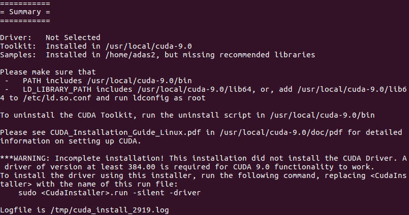

    安装成功以后在 `/usr/local/` 目录下查看，可以看到不但生成对应版本的 `cuda-9.0` 文件夹，还生成一个相应`软连接`文件夹`cuda`:
    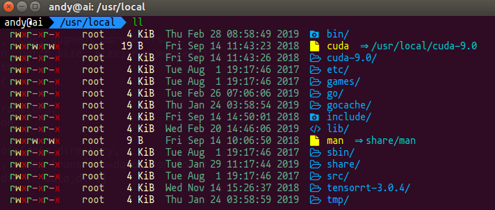

    安装 CUDA9.0 补丁：
    ```shell
    sudo sh cuda_9.0.176.1_linux.run
    sudo sh cuda_9.0.176.2_linux.run
    sudo sh cuda_9.0.176.3_linux.run
    sudo sh cuda_9.0.176.4_linux.run
    ```
- **Ubuntu18.04安装CUDA9.0以及之前版本**
  步骤跟Ubuntu16.04类似，只需要**将gcc和g++版本降级**，ubuntu18.04默认gcc7.3，降级为gcc5，则ubuntu17.04和ubuntu16.04的cuda9.0都能编译.
    ```shell
    sudo apt-get install gcc-5 gcc-5-multilib g++-5 g++-5-multilib
    ```
    将gcc和g++版本切换成gcc5和g++5:
    ```shell
    sudo update-alternatives --install /usr/bin/gcc gcc /usr/bin/gcc-5 50
    sudo update-alternatives --install /usr/bin/gcc gcc /usr/bin/gcc-7 40
    sudo update-alternatives --config gcc
    ```
    输入想要使用的gcc编号:
    ```shell
    sudo update-alternatives --install /usr/bin/g++ g++ /usr/bin/g++-5 50
    sudo update-alternatives --install /usr/bin/g++ g++ /usr/bin/g++-7 40
    sudo update-alternatives --config g++
    ```
    输入想要使用的g++编号，查看gcc版本，已经切换到了gcc5:
    ```shell
    gcc -v
    ```
- **安装CUDA10.1**
  *按照前面安装[NVIDIA驱动](#安装NVIDIA官方显卡驱动)方法安装**NVIDIA-418**驱动*
    ```shell
    chmod 777 cuda_10.1.105_418.39_linux.run
    sudo sh ./cuda_10.1.105_418.39_linux.run
    ```

    输入`accept`进入安装界面:    
    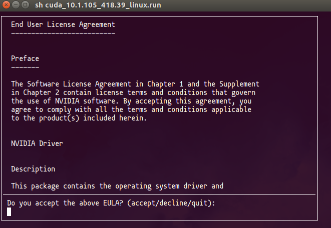
    **不要安装`CUDA`自带的`NVIDIA`驱动**，将光标移动到**Driver**选项上，按下**空格键**取消选择安装`NVIDIA`驱动，移动光标再到`Install`上然后按回车。    
    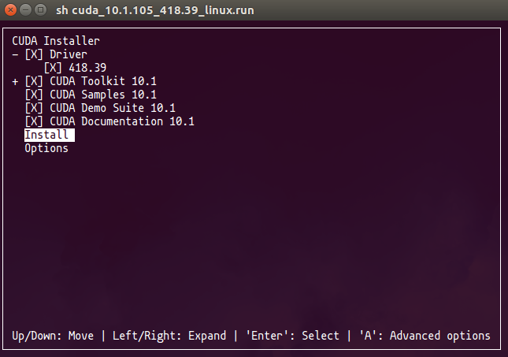
    若已经安装旧版本的CUDA版本，会出现以下提示，输入yes继续安装即可:    

    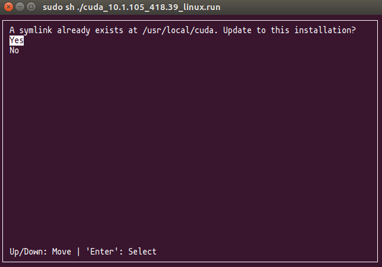    
    安装成功后提示:    

    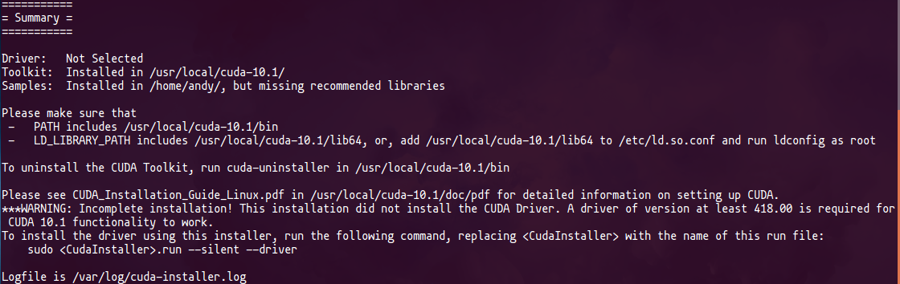
    ```shell
    ===========
    = Summary =
    ===========

    Driver:   Not Selected
    Toolkit:  Installed in /usr/local/cuda-10.1/
    Samples:  Installed in /home/andy/, but missing recommended libraries

    Please make sure that
    -   PATH includes /usr/local/cuda-10.1/bin
    -   LD_LIBRARY_PATH includes /usr/local/cuda-10.1/lib64, or, add /usr/local/cuda-10.1/lib64 to /etc/ld.so.conf and run ldconfig as root

    To uninstall the CUDA Toolkit, run cuda-uninstaller in /usr/local/cuda-10.1/bin

    Please see CUDA_Installation_Guide_Linux.pdf in /usr/local/cuda-10.1/doc/pdf for detailed information on setting up CUDA.
    ***WARNING: Incomplete installation! This installation did not install the CUDA Driver. A driver of version at least 418.00 is required for CUDA 10.1 functionality to work.
    To install the driver using this installer, run the following command, replacing <CudaInstaller> with the name of this run file:
        sudo <CudaInstaller>.run --silent --driver

    Logfile is /var/log/cuda-installer.log
    ```
    安装成功以后在`/usr/local/`目录下查看，可以看到不但生成对应版本的`cuda-10.1`文件夹，还生成一个相应`软连接`文件夹`cuda`或者将之前cuda9.0生成的**cuda软连接**重新指向cuda10.1文件夹:    

    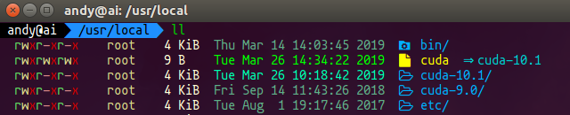


### 修改配置文件
安装完成后配置`CUDA`环境变量，使用`vim`配置文件(这里以`bash`为例, `zsh`配置一样)：
```shell
vim ~/.bashrc
```
在该文件最后加入以下两行并保存：
```shell
# CUDA
export CUDA_ROOT_PATH=/usr/local/cuda #cuda -> cuda11.6
export PATH=$CUDA_ROOT_PATH/bin:$PATH
export CPATH=$CUDA_ROOT_PATH/include:$CPATH #include -> targets/x86_64-linux/include
export LIBRARY_PATH=$CUDA_ROOT_PATH/lib64:$LIBRARY_PATH #lib64 -> targets/x86_64-linux/lib
export LD_LIBRARY_PATH=$CUDA_ROOT_PATH/lib64:$CUDA_ROOT_PATH/extras/CUPTI/lib64:$LD_LIBRARY_PATH #lib64 -> targets/x86_64-linux/lib
```
- `/usr/local/cuda/` 其实是 `/usr/local/cuda-10.2` 或者 `/usr/local/cuda-11.6` 的软连接，后面讲的[切换CUDA版本](#CUDA多版本问题)其实就是修改这个软连接，将其指向需要的CUDA版本即可.
- 查看`/usr/local/cuda/`链接到哪里:
  ```shell
  cd /usr/local
  ll
  # ls -al
  ```
  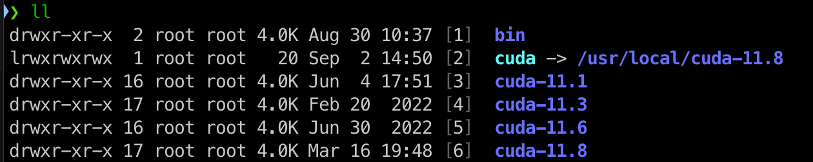    


**使该配置生效：**
```shell
source  ~/.bashrc # source  ~/.zshrc
```
**检验CUDA 是否安装成功**，输入：
```shell
cd /usr/local/cuda/samples/1_Utilities/deviceQuery
sudo make
./deviceQuery
```
- **CUDA 9.0 PASS**:    

    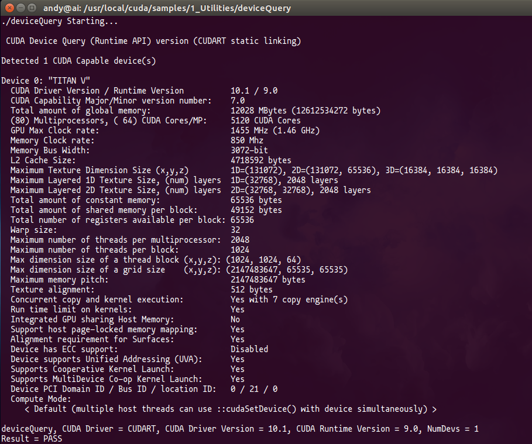

- **CUDA 10.1 PASS**:    

    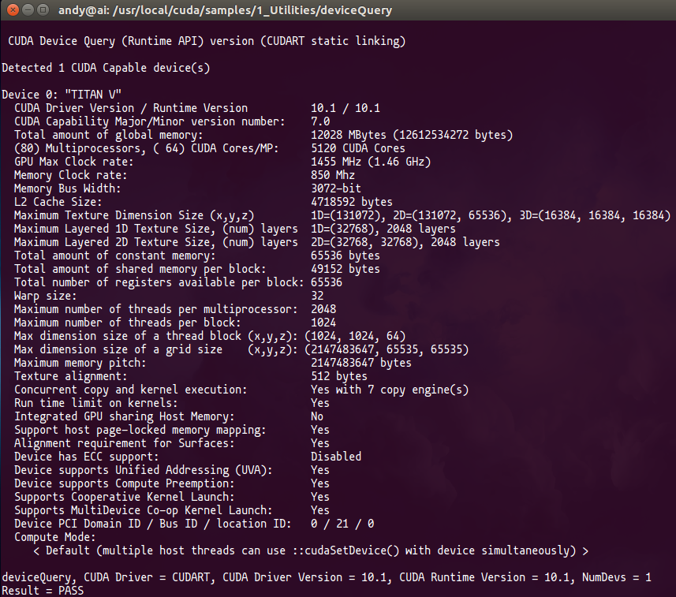


### 查看CUDA版本
```shell
cat /usr/local/cuda/version.txt
```
<!-- 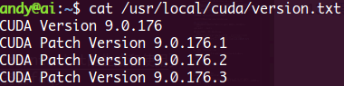     -->
- CUDA 9.0   

    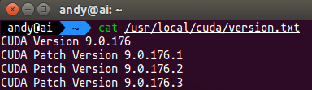

- CUDA 10.1    

    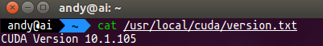

### 卸载CUDA的方法
```shell
cd /usr/local/cuda/bin

# CUDA 9.0
sudo ./uninstall_cuda_9.0.pl

# CUDA 10.1
sudo ./cuda-uninstaller
```
卸载完成后如果显示：`Not removing directory, it is not empty: /usr/local/cuda-9.0` ，假如需要重装`CUDA 9.0`的话就把这个文件夹删除。在`/usr/local/`路径下输入：
```shell
# CUDA 9.0
sudo rm -rf cuda-9.0

# CUDA 10.1
sudo rm -rf cuda-10.1
```

### 安装CUDA过程中遇到的问题
`CUDA 10.1`提示安装失败:
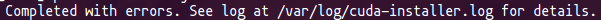
查看` vim /var/log/cuda-installer.log`显示:    


`ERROR: You appear to be running an X server; please exit X `，是在安装`CUDA`的时候选择的安装`CUDA`自带的`NVIDIA`显卡驱动导致的，解决方法是:
(1) 在安装`CUDA`的时候不要选择安装`CUDA`自带的`NVIDIA`驱动；
(2) 若要用`CUDA`自带的`NVIDIA`显卡驱动，则`Ctrl + Alt + F1`在终端命令行进行安装:
```shell
sudo service lightdm stop
bash # Switch from zsh environment to bash environment
sudo apt-get purge nvidia*
sudo sh ./cuda_10.1.105_418.39_linux.run
```
若是在终端命令行下安装的CUDA，则需要安装成功后运行:
```shell
sudo service lightdm start
```
然后再按通过`Ctrl + Alt + F7`可返回图形化模式。

---
## 安装cuDNN

### 下载安装cuDNN
`cuDNN`要根据`CUDA`选择相应平台版本，在`Ubuntu16.04`下(`Ubuntu`其他版本类似)到[cuDNN官网](https://developer.nvidia.com/rdp/cudnn-archive)**推荐下载安装`.tgz`格式的文件**, 不推荐下载安装`.deb`格式，若误装了`.deb`格式的cuDNN请用以下命令进行卸载:
```shell
dpkg -l |grep -i libcudnn* # 查看.deb安装的cudnn
sudo apt-get purge libcudnn*
```
### 一步安装
*该方法不适用于CUDA11*
该方法安装的前提是`/usr/local/cuda`已经连接到正确的`CUDA`版本上。

将`cudnn-xxx.tgz`复制到`/usr/local/`目录下，用`sudo tar -xvf cudnn-xxx.tgz`进行解压，然后删除`sudo rm cudnn-xxx.tgz`即可， 由于`cudnn-xxx.tgz`解压后的目录就是`cuda`文件夹，所以将会自动放在`cuda`软连接下面对应的文件夹里。
```shell
sudo cp cudnn-xxx.tgz /usr/local
sudo chmod a+x cudnn-xxx.tgz
sudo tar -xvf cudnn-xxx.tgz
sudo rm /usr/local/cudnn-xxx.tgz
cd /usr/local/cuda/lib64
sudo chmod a+x *
cd /usr/local/cuda/include
sudo chmod a+x *
```


### 分布安装
下面以安装**cuDNN v7.5.0**为例安装，其他版本类似，只需要将版本号改一下即可:    
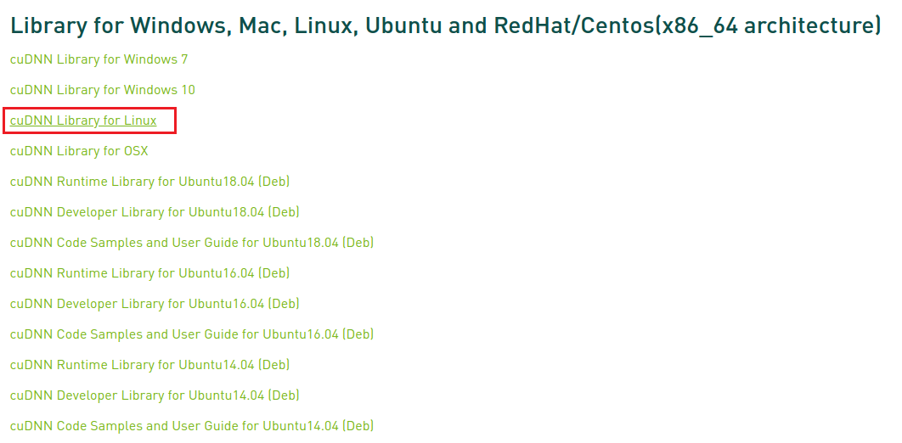

解压`cudnn-10.1-linux-x64-v7.5.0.56.tgz`到当前文件夹，得到一个`cuda`文件夹，该文件夹下有`include`和 `lib64`两个文件夹:
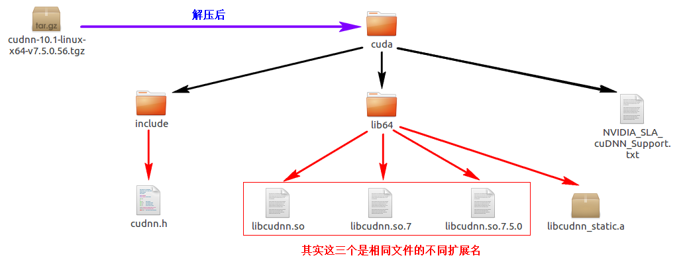

**若安装了多个`CUDA`版本，要特别注意`/usr/local/cuda`软连接到了哪个版本的`CUDA`。**

命令行进入其中的`include`文件夹路径下，然后进行以下操作：
```shell
cd ~/Downloads/cuda/include/
sudo cp -av cudnn.h /usr/local/cuda/include/ #cp加上-a会复制软连接
```
然后命令行进入`cuda/lib64`文件夹路径下(其实`cuda/lib64`文件夹下通过`Beyond Compare`查看，`libcudnn.so`、`libcudnn.so.7`和`libcudnn.so.7.5.0`是同一个文件的不同扩展名)，运行以下命令：
```shell
cd ~/Downloads/cuda/lib64/  # CUDA <= 10
cd ~/Downloads/cuda/lib/    # CUDA >= 11
sudo cp -av lib* /usr/local/cuda/lib64/ #复制动态链接库, cp加上-a会复制软连接关系就不需要手动连接了
sudo chmod a+r /usr/local/cuda/include/cudnn.h /usr/local/cuda/lib64/libcudnn*

## 因为上述cp加上了-a(不加会在cp的时候将原来的软连接文件进行复制)会复制软连接关系, 所以就不需要下面手动建立软连接到方式了
# cd /usr/local/cuda/lib64/
# sudo rm -rf libcudnn.so libcudnn.so.7  #删除原有动态文件
# sudo ln -s libcudnn.so.7.5.0 libcudnn.so.7  #生成软链接
# sudo ln -s libcudnn.so.7 libcudnn.so  #生成软链接
```

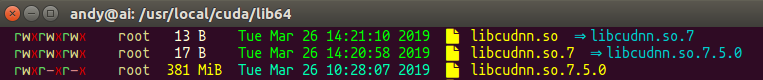

随后需要将路径`/usr/local/cuda/lib64`添加到动态库，分两步：
1）安装`vim`, 输入：
```shell
sudo apt-get install vim-gtk
```
2）**配置**，输入：
```shell
sudo vim /etc/ld.so.conf.d/cuda.conf
```
**编辑状态**下，输入：
```shell
/usr/local/cuda/lib64
```
保存退出，输入下面代码使其**生效**：
```shell
sudo ldconfig
```
安装完成后可用`nvcc -V`命令验证是否安装成功，若出现以下信息则表示安装成功：
```
nvcc: NVIDIA (R) Cuda compiler driver
Copyright (c) 2005-2019 NVIDIA Corporation
Built on Fri_Feb__8_19:08:17_PST_2019
Cuda compilation tools, release 10.1, V10.1.105
```
查看`cuDNN`版本:
- cudnn < 7
  ```shell
  cat /usr/local/cuda/include/cudnn.h | grep CUDNN_MAJOR -A 2
  ```
  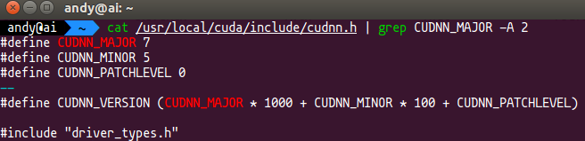

- cudnn >=7
  ```shell
  cat /usr/local/cuda/include/cudnn_version.h  | grep CUDNN_MAJOR -A 2
  ```
  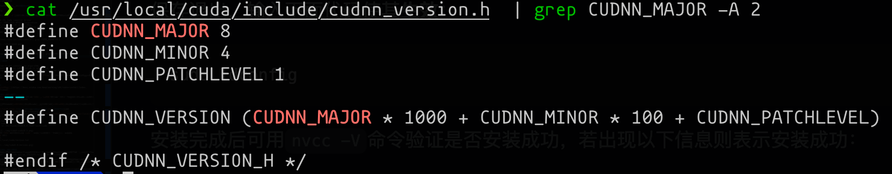

### cuDNN常见问题
```shell
Error : Failed to get convolution algorithm.
This is probably because cuDNN failed to initialize,
so try looking to see if a warning log message was printed above.
```
出现上述问题是安装的`cuDNN`版本跟`CUDA`和`TensorFlow`相兼容的版本不符合，重新安装指定版本的`cuDNN`即可。


**参考资料**
> [cuDNN官方安装指导](https://docs.nvidia.com/deeplearning/sdk/cudnn-install/index.html#installlinux)
---
## Ubuntu CUDA多版本问题
在实验的时候有些算法跟当前生效(安装)的`CUDA`和`cuDNN`版本不一致，所以需要同时安装多个版本，这里就是解决同时管理多个`CUDA`版本问题。

1. 首先按照上述介绍的[安装CUDA](#安装cuda)和对应版本的[安装cuDNN](#安装cudnn)，安装实验环境依赖的版本；
2. 默认`/usr/local/cuda`是**软连接**到**最新安装的`CUDA`文件夹**上的:   

    
3. 删除已经软连接的`/usr/local/cuda`，将需要的`CUDA-X.0安装文件夹`软连接到`/usr/local/cuda`上, 例如需要`CUDA 9.0`这个版本:
    ```shell
    cd /usr/local/
    sudo rm cuda
    sudo ln -s /usr/local/cuda-9.0 /usr/local/cuda
    ```
    
    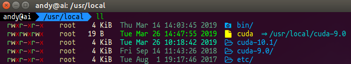
4. 由于在安装`CUDA`的时候已经将`cuda`加入了环境变量，所以不用再加入了。
5. 查看`CUDA`版本
    ```shell
    cat /usr/local/cuda/version.txt
    ```
    
    
---
## Windows CUDA多版本问题
前面的一片文章里面讲到了tensorflow、NVIDIA显卡驱动、CUDA工具包、cudnn之间的一些关系，详情请[参考原文](https://blog.csdn.net/qq_27825451/article/details/89082978)

tensorflow最大的问题就是版本问题，各个版本之间差异比较明显，我们有时候需要不同的tensorflow版本，而不同的版本对于CUDA toolKit的版本要求和cudnn的要求又不一样，我们肯定不能每次使用一个版本都重新安装，前面的那篇文章明确了几个基本观点：

（1）NVIDIA显卡驱动和CUDA ToolKit不是一一对应的，我们一般保持最新的驱动程序，安装其他不同版本的CUDA即可；

（2）CUDA和cudnn也不是严格的一一对应关系，但是这个官网上有着明确的对应连接，即很么版本的cuda配置什么样的cudnn；

所以如果需要在一台电脑上安装多个版本的CUDA和cudnn是完全可行的，由于Linux上面的配置教程很多，这里就不讲了，本文以windows为例来说明，

1、多版本的CUDA以及cudnn安装

由于里显得CUDA会默认捆绑NVIDIA驱动程序，所以在安装的时候不要默认安装，一定要自定义安装，只选择安装CUDA即可，其他的那些就不要安装了，我的电脑上安装的版本如下：

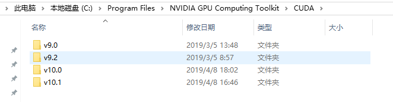

我们一般安装CUDA的时候就使用默认路径，安装到C盘即可，这样方便管理。

然后在NVIDIA官网上面下载CUDA对应的cudnn版本，解压之后将cudnn对应的三个文件拷贝到CUDA对应的文件夹之下，这个时候我们的环境变量应该如下所示：

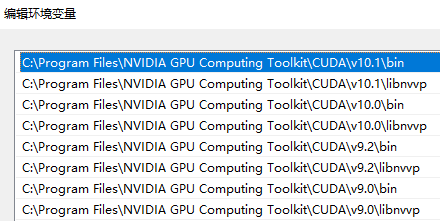

现在多个版本的CUDA就安装完成了。

2、不同版本的tensorflow在CUDA之间的切换

网上有很多在Linux下面的CUDA的切换，其实都是通过环境变量的设置与配置来实现的，但是window这一点坐的很方便，

不需要切换，不需要切换，不需要切换，只要环境变量PATH中有相应的CUDA路径即可，无需手动切换了。

比如我的电脑上同事安装了

tensorflow1.9，它对应于CUDA9.0

tensorflow1.13，它对应于CUDA10.0

tensorflow2.0.0 alpha0，它对应于CUDA10.0

我可以使用任何一个版本，只要在环境变量中有对应的CUDA路径即可，

本人也是通过实验得出来的，首先我删除了CUDA10.0的环境变量,重启之后，发现tensorflow1.13和tensorflow2.0.0都不能使用了，但是tensorflow1.9还可以用；然后我又删除了CUDA9.0的环境变量，重启，这个时候tensorflow1.9也不能使用了；

接下来我又添加CUDA10.0的环境变量，重启，此时tensorflow1.13和tensorflow2.0.0又可以1使用了，然后我又通过添加CUDA9.0环境变量，重启，这时tensorflow1.9又可以使用了。

总结：windows多个不同版本的CUDA使用时不需要切换，只要环境变量PATH中有相应的CUDA路径即可，无需手动切换了。tensorflow在运行的时候会自动在环境变量中寻找合适的CUDA版本，直到找到为止，如果没有，则会报错。

3、验证自己的CUDA是否安装成功

每一个版本的CUDA配置完成后，我们可以验证是否配置成功，主要使用CUDA内置的deviceQuery.exe 和 bandwithTest.exe这两个程序来验证。
首先win+R启动cmd，cd到安装目录下的 ，比如我的安装目录是（以CUDA 10.1为例）：

C:\Program Files\NVIDIA GPU Computing Toolkit\CUDA\v10.1\extras\demo_suite

执行bandwidthTest.exe和deviceQuery.exe这两个应用程序，得到下面的结果：
```bash
C:\Program Files\NVIDIA GPU Computing Toolkit\CUDA\v10.1\extras\demo_suite>deviceQuery
deviceQuery Starting...

 CUDA Device Query (Runtime API) version (CUDART static linking)

Detected 1 CUDA Capable device(s)

Device 0: "GeForce GTX 1070"
  CUDA Driver Version / Runtime Version          10.1 / 10.1
  CUDA Capability Major/Minor version number:    6.1
  Total amount of global memory:                 8192 MBytes (8589934592 bytes)
  (15) Multiprocessors, (128) CUDA Cores/MP:     1920 CUDA Cores
  GPU Max Clock rate:                            1785 MHz (1.78 GHz)
  Memory Clock rate:                             4004 Mhz
  Memory Bus Width:                              256-bit
  L2 Cache Size:                                 2097152 bytes
  Maximum Texture Dimension Size (x,y,z)         1D=(131072), 2D=(131072, 65536), 3D=(16384, 16384, 16384)
  Maximum Layered 1D Texture Size, (num) layers  1D=(32768), 2048 layers
  Maximum Layered 2D Texture Size, (num) layers  2D=(32768, 32768), 2048 layers
  Total amount of constant memory:               zu bytes
  Total amount of shared memory per block:       zu bytes
  Total number of registers available per block: 65536
  Warp size:                                     32
  Maximum number of threads per multiprocessor:  2048
  Maximum number of threads per block:           1024
  Max dimension size of a thread block (x,y,z): (1024, 1024, 64)
  Max dimension size of a grid size    (x,y,z): (2147483647, 65535, 65535)
  Maximum memory pitch:                          zu bytes
  Texture alignment:                             zu bytes
  Concurrent copy and kernel execution:          Yes with 2 copy engine(s)
  Run time limit on kernels:                     Yes
  Integrated GPU sharing Host Memory:            No
  Support host page-locked memory mapping:       Yes
  Alignment requirement for Surfaces:            Yes
  Device has ECC support:                        Disabled
  CUDA Device Driver Mode (TCC or WDDM):         WDDM (Windows Display Driver Model)
  Device supports Unified Addressing (UVA):      Yes
  Device supports Compute Preemption:            No
  Supports Cooperative Kernel Launch:            No
  Supports MultiDevice Co-op Kernel Launch:      No
  Device PCI Domain ID / Bus ID / location ID:   0 / 1 / 0
  Compute Mode:
     < Default (multiple host threads can use ::cudaSetDevice() with device simultaneously) >

deviceQuery, CUDA Driver = CUDART, CUDA Driver Version = 10.1, CUDA Runtime Version = 10.1, NumDevs = 1, Device0 = GeForce GTX 1070
Result = PASS
```
和
```bash
C:\Program Files\NVIDIA GPU Computing Toolkit\CUDA\v10.1\extras\demo_suite>bandwidthTest
[CUDA Bandwidth Test] - Starting...
Running on...

 Device 0: GeForce GTX 1070
 Quick Mode

 Host to Device Bandwidth, 1 Device(s)
 PINNED Memory Transfers
   Transfer Size (Bytes)        Bandwidth(MB/s)
   33554432                     12180.7

 Device to Host Bandwidth, 1 Device(s)
 PINNED Memory Transfers
   Transfer Size (Bytes)        Bandwidth(MB/s)
   33554432                     12782.8

 Device to Device Bandwidth, 1 Device(s)
 PINNED Memory Transfers
   Transfer Size (Bytes)        Bandwidth(MB/s)
   33554432                     191225.0

Result = PASS
```
当两个 Result=PASS 的时候，说明我们的安装配置是没有问题的。


---
## Anaconda
### 安装Anaconda
下载`Anaconda`的`sh`文件`Anaconda3-5.2.0-Linux-x86_64.sh`，然后运行以下代码：
```bash
chmod a+x ./Anaconda3-5.2.0-Linux-x86_64.sh #chmod 777 ./Anaconda3-5.2.0-Linux-x86_64.sh
bash Anaconda3-5.2.0-Linux-x86_64.sh
```
或者
```bash
chmod 777 Anaconda3-5.3.1-Linux-x86_64.sh
bash Anaconda3-5.3.1-Linux-x86_64.sh
```
**`conda install -c menpo opencv3`命令有时候会显示权限不够`permission issue`。这是因为你安装`anaconda`时用的是`sudo`，这时候需要修改`anaconda3`文件夹权限**:
```shell
sudo chown -R 你的用户名 /home/你的用户名/anaconda3
```

### 屏蔽Anaconda
```shell
vim ~/.bashrc
```
然后屏蔽后的结果如下：
```bash
# added by Anaconda3 5.3.1 installer
#export PATH="/home/andy/anaconda3/bin:$PATH"
#export LD_LIBRARY_PATH=~/anaconda3/lib:$LD_LIBRARY_PATH
#export CPLUS_INCLUDE_PATH=~/anaconda3/include/python3.6m
```
其实这里涉及到`linux可执行程序搜索路径`的问题，上述`PATH="/home/andy/anaconda3/bin:$PATH"`将`/home/andy/anaconda3/bin`放在了原始的`$PATH`前面，这样系统在执行的时候首先检查要可执行文件是否在`/home/andy/anaconda3/bin`中，然后再从`$PATH`中搜索，理解了这个关系，上述代码可以改为，这样改了以后将不需要[重建Anaconda软连接](#重建anaconda软连接)这一步操作了:
```bash
# added by Anaconda3 5.3.1 installer
export PATH="$PATH：/home/andy/anaconda3/bin"
export LD_LIBRARY_PATH=$LD_LIBRARY_PATH：~/anaconda3/lib
export CPLUS_INCLUDE_PATH=~/anaconda3/include/python3.6m
```
**Anaconda最新版屏蔽如下**
```bash
# added by Anaconda3 5.3.1 installer
# >>> conda init >>>
# !! Contents within this block are managed by 'conda init' !!
#__conda_setup="$(CONDA_REPORT_ERRORS=false '/home/andy/anaconda3/bin/conda' shell.bash hook 2> /dev/null)"
#if [ $? -eq 0 ]; then
#    \eval "$__conda_setup"
#else
#    if [ -f "/home/andy/anaconda3/etc/profile.d/conda.sh" ]; then
#        . "/home/andy/anaconda3/etc/profile.d/conda.sh"
#        CONDA_CHANGEPS1=false conda activate base
#    else
#        \export PATH="/home/andy/anaconda3/bin:$PATH"
#    fi
#fi
#unset __conda_setup
# <<< conda init <<<
```
最后命令行输入以下命令：
```bash
source ~/.bashrc
```
**必须重启电脑**


### Anaconda环境配置
**创建新的虚拟环境**：
```shell
conda create -n venv python=3.6 pip # select python version and pip
```
若需要指定环境的路径，可以使用以下命令：
```shell
conda create --prefix=~/.conda/envs/venv python=3.8 pip
# conda create -p ~/.conda/envs/venv python=3.8 pip
```
**激活虚拟环境**:
```shell
source activate venv
```
**删除虚拟环境**:
```shell
conda env remove -n venv  # conda remove -n venv --all
```
**删除缓存的安装包**:
```shell
conda clean --packages --tarballs
```
#### 重建Anaconda软连接
**重建原理**
由于linux系统默认搜索可执行文件的顺序为`/bin` -> `/usr/bin` -> `/usr/local/bin` ，而前两个为系统的可执行文件存放的地方，`/usr/local/bin`为用户自定义的可执行文件存放区，所以只需要将`Anaconda`的`~/anaconda3/bin/可执行文件`**软连接**到`/usr/local/bin`即可。

当需要**重新使用`Anaconda`的时候**，只需要将`Anaconda`的执行文件**软连接**到`/usr/local/bin`里，注意**这里要用绝对路径，否则不起作用**，如：
```shell
sudo ln  -s  /home/andy/anaconda3/bin/conda  /usr/local/bin/conda
sudo ln  -s  /home/andy/anaconda3/bin/activate  /usr/local/bin/activate
sudo ln  -s  /home/andy/anaconda3/bin/deactivate  /usr/local/bin/deactivate
```
首先注意`usr` 指 `Unix System Resource`，而不是`User`,
- `/usr/bin`下面的都是系统预装的可执行程序，会随着系统升级而改变
- `/usr/local/bin`目录是给用户放置自己的可执行程序的地方，推荐放在这里，不会被系统升级而覆盖同名文件

**软连接后使用**时：
首先用以下命令查看anaconda环境(自带为base):
```shell
conda env list
```
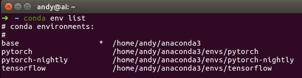

**激活环境用：**
```shell
conda activate [env name]
# or
source activate [env name]
```
**注意:** 上面`[env name]`用具体的环境名代替，如`conda activate base`.


**取消激活环境用：**
```shell
conda deactivate
# or
source deactivate
```
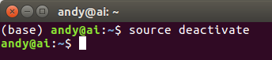

#### 关闭conda自动进入base虚拟环境
```shell
conda config --set auto_activate_base false
```

#### 修复无名字环境
环境没有名字的情况如下:
```shell
❯ conda env list
# conda environments:
#
base                  *  /Users/andy/opt/anaconda3
ai                       /opt/anaconda3/envs/ai
                         /opt/anaconda3/envs/openmmlab
                         /opt/anaconda3/envs/pytorch
```
修复命令如下:
```shell
conda config --append envs_dirs /path/to/the/parent_dir
# conda config --append envs_dirs /opt/anaconda3/envs/
```

### 卸载Anaconda
直接删除anaconda文件夹。因为安装时默认是在用户的根目录下创建文件夹来放置anaconda的文件的，所以直接删除即可:
```shell
cd
rm -rf ~/anaconda3
# rm -rf ~/anaconda2
```

清理下 `.bashrc` 或者 `.zshrc` 中的Anaconda环境变量:
```shell
vim ~/.bashrc

## vim ~/.zshrc
```
删掉与Anaconda相关的内容，然后使其生效:
```shell
source ~/.bashrc

# source ~/.zshrc
```
清理一些隐藏的文件/文件夹:
```shell
cd
rm .condarc
rm -rf ~/.condarc ~/.conda ~/.continuum
```
> [Anaconda官方给出的卸载方法](http://docs.anaconda.com/anaconda/install/uninstall/)

---
## 安装opencv
### 下载OpenCV
进入官网 : http://opencv.org/releases.html 或者 https://github.com/opencv/opencv/releases, 选择 需要的 `x.x.x.zip`版本, 下载 `opencv-x.x.x.zip` :
```bash
cd
wget https://github.com/opencv/opencv/archive/x.x.x.zip
chmod 777 x.x.x.zip
unzip x.x.x.zip
```
### 安装依赖
```shell
sudo apt-get install ffmpeg cmake pkg-config vim libx264-dev libatlas-base-dev gfortran libgtk-3-dev libgtk2.0-dev libpng-dev libjpeg-dev libswscale-dev libxvidcore-dev  libopenexr-dev libtiff-dev libwebp-dev libavcodec-dev libavformat-dev libavdevice-dev
```

### 编译OpenCV
如果对 `CMakeLists` 文件不进行修改，那么 `Opencv` 默认的安装位置
```bash
/usr/local/include/opencv2/         -- 新版Opencv核心头文件
/usr/local/include/opencv/          -- 旧Opencv核心头文件
/usr/local/share/OpenCV/            -- 一些Opencv其他安装信息
/usr/local/lib/                     -- Opencv中的动态链接库存放位置
```

随后解压到你要安装的位置，命令行进入已解压的文件夹 `opencv-x.x.x` 目录下，执行：
```shell
cd opencv-x.x.x
mkdir build # 创建编译的文件目录
cd build
cmake -D CMAKE_BUILD_TYPE=RELEASE  \
      -D CMAKE_INSTALL_PREFIX=/usr/local  \
      -D INSTALL_C_EXAMPLES=ON  \
      -D INSTALL_PYTHON_EXAMPLES=ON  \
      -D WITH_TBB=ON -D WITH_EIGEN=ON  \
      -D WITH_V4L=ON  \
      -D OPENCV_SKIP_PYTHON_LOADER=ON  \
      -D OPENCV_GENERATE_PKGCONFIG=ON  \
      -D WITH_QT=ON  \
      -D WITH_OPENGL=ON  \
      -D PYTHON_DEFAULT_EXECUTABLE=/usr/bin/python3  \
      -D ENABLE_CXX11=ON  \
      -DOPENCV_GENERATE_PKGCONFIG=ON \
      -DBUILD_JPEG=ON \
      -DBUILD_TIFF=ON \
      -DBUILD_PNG=ON ..

# 利用下面的命令得到系统的线程数
nproc

make -j8  #编译
```
若要用到`opencv_contrib`扩展模块一起编译，则需要下载跟**opencv版本一致**的`opencv_contrib-x.x.x`解压咋跟`opencv-x.x.x`同目录下，然后软连接到`opencv_contrib`:
```shell
cmake -D CMAKE_BUILD_TYPE=RELEASE  \
      -D CMAKE_INSTALL_PREFIX=/usr/local  \
      -D INSTALL_C_EXAMPLES=ON  \
      -D INSTALL_PYTHON_EXAMPLES=ON  \
      -D WITH_TBB=ON -D WITH_EIGEN=ON  \
      -D WITH_V4L=ON  \
      -D OPENCV_SKIP_PYTHON_LOADER=ON  \
      -D OPENCV_GENERATE_PKGCONFIG=ON  \
      -D WITH_QT=ON  \
      -D WITH_OPENGL=ON  \
      -D PYTHON_DEFAULT_EXECUTABLE=/usr/bin/python3  \
      -D ENABLE_CXX11=ON  \
      -DOPENCV_EXTRA_MODULES_PATH=../../opencv_contrib/modules \
      -DOPENCV_GENERATE_PKGCONFIG=ON \
      -DBUILD_JPEG=ON \
      -DBUILD_TIFF=ON \
      -DBUILD_PNG=ON ..
```
**遇到一下报错信息有两种可能：**

- 在编译`opencv3.4.0`源码的时候，会下载诸如`ippicv_2017u3_lnx_intel64_20170822.tgz`的压缩包，如果下载失败，请[下载离线包](opencv/opencv-3.4.0-dev.cache.zip)，解压该文件，会得到`.cache`文件夹，用此文件夹覆盖`opencv`源码文件夹下的`.cache`文件夹，再重新编译即可。`.cahce`文件夹为隐藏文件，可用`ctrl+h`查看。

- 若本机里安装了**Anaconda**，**推荐[屏蔽Anaconda](#屏蔽anaconda)**，否则需要在`~/.bashrc` 或 `~/.zshrc `中加入：
    ```shell
    # added by Anaconda3 installer
    export PATH="/home/andy/anaconda3/bin:$PATH"
    export LD_LIBRARY_PATH=~/anaconda3/lib:$LD_LIBRARY_PATH
    export CPLUS_INCLUDE_PATH=~/anaconda3/include/python3.6m
    export PATH="$PATH:$HOME/bin"
    ```
在`98%`的时候会等很久很久，属于正常现象。

### 安装OpenCV
编译成功后安装：
```bash
sudo make install #安装
```
### 配置OpenCV
```shell
sudo gedit /etc/ld.so.conf.d/opencv.conf
```
添加以下内容:
```bash
/usr/local/lib
```
运行以下命令刷新`opencv`动态链接库：
```bash
sudo ldconfig
```
修改环境变量`.bashrc`或者`.zshrc`添加opencv的头文件路径:    
*以opencv4为例*
```bash
 # opencv4
 export CPATH=/usr/local/include/opencv4:$CPATH
```
### CMakeLists.txt
```cmake
# ...
find_package(OpenCV REQUIRED)
include_directories(${OpenCV_INCLUDE_DIRS}) # 若环境变量里有export CPATH=/usr/local/include/opencv4:$CPATH，这这一行可以省略
# ...
target_link_libraries([程序名] ${OpenCV_LIBS})
```

安装完成后通过查看 `opencv` 版本验证是否安装成功：
```bash
pkg-config --modversion opencv # opencv3
pkg-config --modversion opencv4 # opencv4
```
**若运行以上命令提示一下错误**：
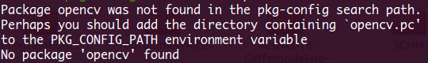
**临时解决方法**
```bash
export PKG_CONFIG_PATH=/usr/local/lib/pkgconfig
```
**彻底解决方法**
接下来要给系统加入`opencv`库的环境变量:
用`gedit`打开`/etc/ld.so.conf`，注意要用sudo打开获得权限，不然无法修改， 如：
```shell
sudo gedit /etc/ld.so.conf
```
在文件中加上一行:
```shell
/usr/local/lib
```
`/user/local`是`opencv`安装路径 就是`makefile`中指定的安装路径。

**或者**不用上述方法，直接运行:
```bash
sudo sh -c 'echo "/usr/local/lib" >> /etc/ld.so.conf.d/opencv.conf'
```
再运行:
```bash
sudo ldconfig
```
若遇到以下问题[Package opencv was not found in the pkg-config search path](https://stackoverflow.com/questions/15320267/package-opencv-was-not-found-in-the-pkg-config-search-path):
```shell
pkg-config --modversion opencv # opencv3
pkg-config --modversion opencv4 # opencv4
```
```bash
Package opencv was not found in the pkg-config search path.
Perhaps you should add the directory containing `opencv.pc'
to the PKG_CONFIG_PATH environment variable
No package 'opencv' found
```

则需要安装:
```shell
sudo apt-get install libopencv-dev
```

Stackoverflow原文的解决方案是:
From your question I guess you are using Ubuntu (or a derivate). If you use:
```shell
sudo apt-get install apt-file
apt update
apt-file search opencv.pc
```
then you see that you have to install `libopencv-dev`.
```shell
sudo apt-get install libopencv-dev
```
After you do so, `pkg-config --cflags opencv` and `pkg-config --libs opencv` should work as expected.

- **bash**
  - **所有用户**
    修改`/etc/bash.bashrc`文件:
    ```shell
    sudo vim /etc/bash.bashrc
    ```
    在文件末尾加入：
    ```shell
    PKG_CONFIG_PATH=$PKG_CONFIG_PATH:/usr/local/lib/pkgconfig
    export PKG_CONFIG_PATH
    ```
    运行`source /etc/bash.bashrc`使其生效。

  - **当前用户**
    修改`~/.bashrc`文件:
    ```shell
    vim ~/.bashrc
    ```
    在文件末尾加入：
    ```vim
    PKG_CONFIG_PATH=$PKG_CONFIG_PATH:/usr/local/lib/pkgconfig
    export PKG_CONFIG_PATH
    ```
    运行`source ~/.bashrc`使其生效。

- **zsh**
  - **所有用户**
    ```bash
    vim /etc/zsh/zprofile
    ```
    然后加入以下内容:
    ```bash
    PKG_CONFIG_PATH=$PKG_CONFIG_PATH:/usr/local/lib/pkgconfig
    export PKG_CONFIG_PATH
    ```
    运行`source /etc/zsh/zprofile`使其生效。

  - **当前用户**
    ```bash
    vim ~/.zshrc
    ```
    然后加入以下内容:
    ```bash
    PKG_CONFIG_PATH=$PKG_CONFIG_PATH:/usr/local/lib/pkgconfig
    export PKG_CONFIG_PATH
    ```
    运行`source ~/.zshrc`使其生效。


### 卸载OpenCV
进入`OpenCV`解压文件夹中的`buid`文件夹：
```shell
cd $HOME/opencv-x.x.x/build
```
运行：
```shell
sudo make uninstall
```
然后把整个`opencv-x.x.x`文件夹都删掉 `rm -rf opencv-x.x.x` 。将shell环境切换到bash下(否则不认识命令行的 `*` 文件通配符)，随后再运行：
```shell
bash
sudo rm -r /usr/local/include/opencv*
sudo rm -r /usr/local/share/opencv*
sudo rm -r /usr/local/bin/opencv*
sudo rm -r /usr/local/lib/libopencv*
sudo rm -r /usr/bin/opencv*
sudo rm -r /bin/opencv*
```
把一些残余的动态链接文件和空文件夹删掉。有些文件夹已经被删掉了所以会找不到路径。

---

## 安装Docker

为了在**docker**中支持**GPU**，`NVidia`之前是弄了个`nvidia-docker2`，现在升级为`NVIDIA Container Toolkit`了。官方说法是"Usage of nvidia-docker2 packages are deprecated since NVIDIA GPUs are now natively supported as devices in the Docker runtime"。


### 安装环境
- OS：Ubuntu 18.04 64 bit
- 显卡：NVidia GTX 2080 Ti x 2
- CUDA：10.0
- cnDNN：7.4

### 配置Docker源
```sh
# 更新源
$ sudo apt update

# 启用HTTPS
$ sudo apt install -y \
    apt-transport-https \
    ca-certificates \
    curl \
    gnupg-agent \
    software-properties-common

# 添加GPG key
$ curl -fsSL https://download.docker.com/linux/ubuntu/gpg | sudo apt-key add -

# 添加稳定版的源
$ sudo add-apt-repository \
   "deb [arch=amd64] https://download.docker.com/linux/ubuntu \
   $(lsb_release -cs) \
   stable"
```
### 安装Docker CE
此刻Docker版本需要19.03，此后可能需要更新。
```sh
# 更新源
$ sudo apt update

# 安装Docker CE
$ sudo apt install -y docker-ce
```
如果这种方式安装失败，也有解决方案。
报错时屏幕上会显示下载失败的deb文件，想办法下载下来，然后挨个手动安装就好。

此刻我需要下载的是下面三个文件，此后更新为当时最新版本即可：

- containerd.io_1.2.6-3_amd64.deb
- docker-ce-cli_19.03.03-0ubuntu-bionic_amd64.deb
- docker-ce_19.03.03-0ubuntu-bionic_amd64.deb
手动依次安装：
```sh
$ sudo dpkg -i containerd.io_1.2.6-3_amd64.deb
$ sudo dpkg -i docker-ce-cli_19.03.0~3-0~ubuntu-bionic_amd64.deb
$ sudo dpkg -i docker-ce_19.03.0~3-0~ubuntu-bionic_amd64.deb
```
### 验证Docker CE
如果出现下面的内容，说明安装成功。
```sh
$ sudo docker run hello-world

Unable to find image 'hello-world:latest' locally
latest: Pulling from library/hello-world
1b930d010525: Pull complete
Digest: sha256:2557e3c07ed1e38f26e389462d03ed943586f744621577a99efb77324b0fe535
Status: Downloaded newer image for hello-world:latest

Hello from Docker!
This message shows that your installation appears to be working correctly.

To generate this message, Docker took the following steps:
 1. The Docker client contacted the Docker daemon.
 2. The Docker daemon pulled the "hello-world" image from the Docker Hub.
    (amd64)
 3. The Docker daemon created a new container from that image which runs the
    executable that produces the output you are currently reading.
 4. The Docker daemon streamed that output to the Docker client, which sent it
    to your terminal.

To try something more ambitious, you can run an Ubuntu container with:
 $ docker run -it ubuntu bash

Share images, automate workflows, and more with a free Docker ID:
 https://hub.docker.com/

For more examples and ideas, visit:
 https://docs.docker.com/get-started/
```

###  配置nvidia-docker源
```sh
# 添加源
$ distribution=$(. /etc/os-release;echo $ID$VERSION_ID)
$ curl -s -L https://nvidia.github.io/nvidia-docker/gpgkey | sudo apt-key add -
$ curl -s -L https://nvidia.github.io/nvidia-docker/$distribution/nvidia-docker.list | sudo tee /etc/apt/sources.list.d/nvidia-docker.list

# 安装并重启docker
$ sudo apt update && sudo apt install -y nvidia-container-toolkit
$ sudo systemctl restart docker
```
### 使用
```sh
# 在官方CUDA镜像上测试 nvidia-smi
$ sudo docker run --gpus all nvidia/cuda:9.0-base nvidia-smi

# 启动支持双GPU的容器
$ sudo docker run --gpus 2 nvidia/cuda:9.0-base nvidia-smi

# 指定GPU 1，运行容器
$ sudo docker run --gpus device=0 nvidia/cuda:9.0-base nvidia-smi
```
能看到显卡信息就说明OK了，当前image是基于Ubuntu 16.04的。


## TensorRT

### 安装TensorRT
> [TensorRT官方安装指南](https://docs.nvidia.com/deeplearning/sdk/tensorrt-install-guide/index.html)
<!-- #### 1. TensorRT环境变量设置 -->
#### <span id="tensorrt1">1. TensorRT环境变量设置</span>
首先[下载**tar**版本的安装包](https://developer.nvidia.com/nvidia-tensorrt-download)，需要登陆NVIDIA账号。
安装`TensorRT`前需要[安装`Cuda`](#安装cuda)和[安装`cudnn`](#安装cudnn)，安装步骤可以参考上方。
打开下载的`TensorRT`所在路径，解压下载的`tar`文件：
```bash
chmod 777 TensorRT-XXX.tar.gz
tar -xzvf TensorRT-XXX.tar.gz
```
将加压后的`TensorRT-XXX`文件夹移动到`HOME`目录下，并创建软连接，这样可以安装多个版本的`TensorRT-XXX`，在切换的时候只需要将用到的`TensorRT-XXX`版本软连接到`TensorRT`上就可以了:
```shell
mv TensorRT-XXX  ~/TensorRT-XXX
cd

# Create Symbol Link
ln -s ~/TensorRT-XXX  TensorRT

# TensorRT 3
sudo ln -s ~/TensorRT/bin/giexec /usr/local/bin/

# TensorRT >= 4
sudo ln -s ~/TensorRT/bin/trtexec /usr/local/bin/
```
然后设置**环境变量**：
```shell
# bash
vim ~/.bashrc # 打开环境变量文件

# zsh
vim ~/.zshrc # 打开环境变量文件
```
将下面变量写入**环境变量文件**中并保存:
```shell
# TensorRT
export LD_LIBRARY_PATH=~/TensorRT/lib:$LD_LIBRARY_PATH
export CUDA_INSTALL_DIR=/usr/local/cuda
export CUDNN_INSTALL_DIR=/usr/local/cuda
export CPATH=$CPATH:~/TensorRT/include
```
```shell
# bash
source ~/.bashrc   # 使刚刚修改的环境变量文件生效

# zsh
source ~/.zshrc
```

系统级配置:   
```shell  
echo "~/TensorRT/lib" | sudo tee /etc/ld.so.conf.d/tensorrt.conf
```


<!-- #### 2. 安装Python的TensorRT包 -->
#### <span id="tensorrt2">2. 安装Python的TensorRT包</span>
进到解压后的`TensorRT`的**Python**文件下：    

**2.1 非虚拟环境下**   
```bash
cd ~/TensorRT/python/

# Python 2.7:
sudo pip2 install tensorrt-XXX-cp27-cp27mu-linux_x86_64.whl

# Python 3.x:
sudo pip3 install tensorrt-XXX-cp35-cp35m-linux_x86_64.whl
```
或者：
```bash
cd TensorRT/python/

# Python 2.7:
pip2 install tensorrt-XXX-cp27-cp27mu-linux_x86_64.whl --user

# Python 3.x:
pip3 install tensorrt-XXX-cp35-cp35m-linux_x86_64.whl --user
```

**2.2 虚拟环境下**   
```bash
source  activate venv
cd TensorRT/python/

# Python 2.7:
pip install tensorrt-XXX-cp27-cp27mu-linux_x86_64.whl

# Python 3.x:
pip install tensorrt-XXX-cp35-cp35m-linux_x86_64.whl
```

**如安装失败请参考[安装过程中遇到的问题以及解决方法](#安装过程中遇到的问题以及解决方法)。**

<!-- #### 3. 安装uff     -->
#### <span id="tensorrt3">3. 安装uff</span>   

转到**uff**目录下安装`uff`文件夹下安装：

**3.1 非虚拟环境下**   
```bash
cd ~/TensorRT/uff/

# Python 2.7:
sudo pip2 install uff-XXX-py2.py3-none-any.whl

# Python 3.x:
sudo pip3 install uff-XXX-py2.py3-none-any.whl
```
或者：
```bash
cd TensorRT/uff/

# Python 2.7:
pip2 install uff-XXX-py2.py3-none-any --user

# Python 3.x:
pip3 install uff-XXX-py2.py3-none-any --user
```

**3.2 虚拟环境下**
```bash
source activate venv
cd TensorRT/uff/

# Python 2.7:
pip install uff-XXX-py2.py3-none-any.whl

# Python 3.x:
pip install uff-XXX-py2.py3-none-any.whl
```

#### <span id="tensorrt4">4. 安装graphsurgeon</span>
转到**graphsurgeon**目录下安装`graphsurgeon`文件夹下安装：   

**4.1 非虚拟环境下**
```shell
cd TensorRT/graphsurgeon/
# Python 2.7:
$ sudo pip2 install graphsurgeon-X.X.X-py2.py3-none-any.whl

# Python 3.x:
$ sudo pip3 install graphsurgeon-X.X.X-py2.py3-none-any.whl
```
或者:
```shell
cd TensorRT/graphsurgeon/

# Python 2.7:
pip2 install graphsurgeon-X.X.X-py2.py3-none-any.whl --user

# Python 3.x:
pip3 install graphsurgeon-X.X.X-py2.py3-none-any.whl --user
```

**4.2 虚拟环境下**   
```bash
source activate venv
cd TensorRT/graphsurgeon/

# Python 2.7:
pip install graphsurgeon-X.X.X-py2.py3-none-any.whl

# Python 3.x:
pip install graphsurgeon-X.X.X-py2.py3-none-any.whl
```

<!-- #### 5. 验证TensorRT是否安装成功     -->
#### <span id="tensorrt5">5. 验证TensorRT是否安装成功</span>
**测试TensorRT是否安装成功**：
```bash
which tensorrt
```
会输出`TensorRT`的安装路径:
```bash
/usr/local/bin/tensorrt
```

**测试uff是否安装成功**：
```bash
which convert-to-uff
```
会输出`uff`的安装路径:
```bash
/usr/local/bin/convert-to-uff
```

拷贝`lenet5.uff`到python相关目录进行验证：
```bash
sudo cp TensorRT/data/mnist/lenet5.uff TensorRT/python/data/mnist/lenet5.uff
cd TensorRT/samples/sampleMNIST
make clean
make
cd /TensorRT/bin  #（转到bin目录下面，make后的可执行文件在此目录下）
./sample_mnist
```
命令执行顺利即安装成功。

<!-- #### 6. TensorRT安装过程中遇到的问题以及解决方法 -->
#### <span id="tensorrt6">6. TensorRT安装过程中遇到的问题以及解决方法</span>

6.1 在安装`Python`的`TensorRT`包时可能出现的错误：
```bash
In file included from src/cpp/cuda.cpp:1:0:
src/cpp/cuda.hpp:14:18: fatal error: cuda.h: No such file or directory
compilation terminated.
error: command 'x86_64-linux-gnu-gcc' failed with exit status 1
```
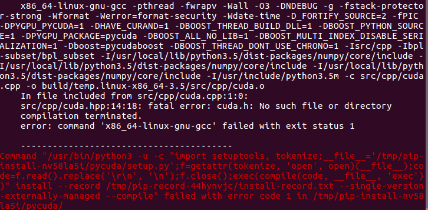
**原因**
显示是找不到cuda.h，根据网上分析是因为用了sudo之后环境变量用的是root的环境变量。

**解决方案**
将cuda的安装路径添加到root的环境变量中，在root角色下安装Python的TensorRT包:
```shell
sudo gedit /etc/profile.d/cuda.sh
```
添加：

```shell
export PATH=/usr/local/cuda/bin:$PATH
```

```shell
sudo su -
# 对于python2
pip2 install tensorrt-XXX-cp27-cp27mu-linux_x86_64.whl

# 对于python3
pip3 install tensorrt-XXX-cp35-cp35m-linux_x86_64.whl
exit
```

6.2 `Python`导入`tensorrt`或者`tensorflow`的时候提示`ImportError: numpy.core.multiarray failed to import`
解决方法:
```shell
pip install -U numpy
```

6.3 在调用`TensorRT`的时候提示`ImportError: Please make sure you have pycuda installed`
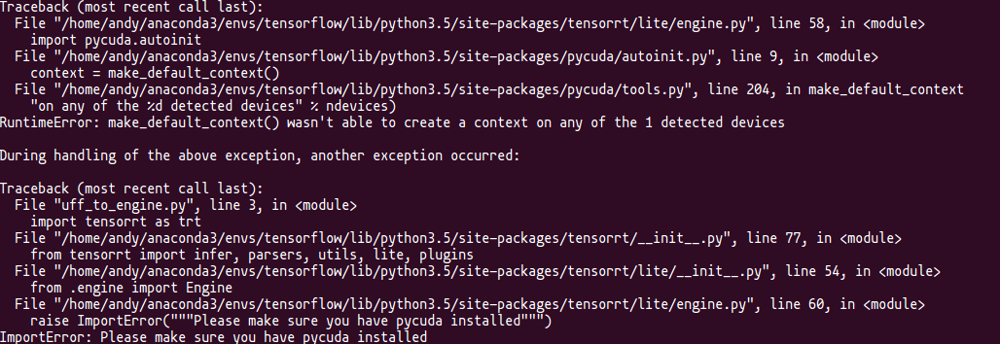
原因是，显卡内存不够:
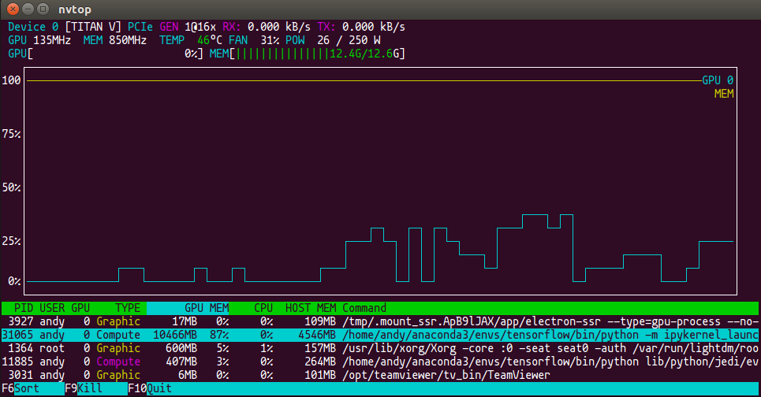
只要关闭占用大现存的程序重新运行程序即可。

### TensorRT生成Engine
*TensorRT版本: 3.0.4*
#### Caffe模型用TensorRT生成Engine
```shell
~/TensorRT/bin/giexec \
--deploy=path_to_prototxt/intputdeploy.prototxt \
--output=prob \
--model=path_to_caffemodel/caffeModelName.caffemodel \
--engine=path_to_output_engine/outputEngineName.engine
```
1、`C++` 调用 `engine` 进行推理的源码在[`src/tensorrt/tools/trt_cpp_caffe_engine`](tensorrt/tools/trt_cpp_caffe_engine)
2、`Python` 调用 `Caffe` 生成的 `engine` 源码文件在[`src/tensorrt/tools/caffe_engine`](tensorrt/tools/caffe_engine)中:
- `call_engine_to_infer_one.py` : 测试单张图片
- `call_engine_to_infer_all.py` : 测试所有图片

#### Tensorflow模型用TensorRT生成Engine
1、`C++` 调用 `UFF` 进行推理的源码在[`src/tensorrt/tools/trt_cpp_tf_uff`](tensorrt/tools/trt_cpp_tf_uff)

2、`Python` 源码文件在[`src/tensorrt/tools/tensorflow_engine`](tensorrt/tools/tensorflow_engine)中：
- `tf_to_uff.py` : TensorFlow模型生成UFF文件
- `uff_to_engine.py` : UFF模型转Engine文件
- `call_engine_to_infer_one.py` : 调用Engine测试单张图片进行推理
- `call_engine_to_infer_all.py` : 调用Engine测试所有图片进行推理
- `tf_to_trt.py` : 修改的官方代码


首先将`TensorFlow`模型生成`uff`文件，然后再将`uff`文件转为`engine`:
- ##### 将TensorFlow模型生成UFF文件
    ```python
    # -*- coding: utf-8 -*-
    # Author : Andy Liu
    # Last modified: 2019-03-15

    # This script is used to convert tensorflow model file to uff file
    # Using:
    #        python tf_to_uff.py

    import os
    import uff
    import tensorflow as tf
    import tensorrt as trt
    os.environ['CUDA_VISIBLE_DEVICES'] = '0'

    # >>>>>> Here need to modify based on your data >>>>>>
    model_path = "model/model.ckpt"
    frozen_model_path = "model/frozen_graphs/frozen_graph.pb"
    uff_path = "model/uff/model.uff"
    frozen_node_name = ["fc_3/frozen"]
    # <<<<<< Here need to modify based on your data <<<<<<

    def getFrozenModel(model_path):
        with tf.Session() as sess:
            sess.run(tf.global_variables_initializer())
            saver = tf.train.import_meta_graph(model_path+'.meta')
            saver.restore(sess, model_path)
            graph = tf.get_default_graph().as_graph_def()
            frozen_graph = tf.graph_util.convert_variables_to_constants(sess, graph, frozen_node_name)
            return tf.graph_util.remove_training_nodes(frozen_graph)


    tf_model = getFrozenModel(model_path)
    with tf.gfile.FastGFile(frozen_model_path, mode='wb') as f:
            f.write(tf_model.SerializeToString())

    # 若用了output_filename参数则返回的是NULL，否则返回的是序列化以后的UFF模型数据
    #uff_model = uff.from_tensorflow(tf_model, output_nodes=frozen_node_name, output_filename=uff_path, text=True, list_nodes=True)
    uff_model = uff.from_tensorflow_frozen_model(frozen_model_path, output_nodes=frozen_node_name, output_filename=uff_path, text=True, list_nodes=True)

    print('Success! Frozen model is stored in ', os.path.abspath(frozen_model_path))
    print('Success! UFF file is stored in ', os.path.abspath(uff_path))
    ```
- ##### 将UFF文件转为Engine
    ```python
    # -*- coding: utf-8 -*-
    # Author : Andy Liu
    # Last modified: 2019-03-15

    # This script is used to convert .uff file to .engine for TX2/PX2 or other NVIDIA Platform
    # Using:
    #        python uff_to_engine.py

    import os
    # import tensorflow as tf
    import tensorrt as trt
    from tensorrt.parsers import uffparser
    import uff

    print("TensorRT version = ", trt.__version__)
    os.environ['CUDA_VISIBLE_DEVICES'] = '0'


    # >>>>>> Here need to modify based on your data >>>>>>
    net_input_shape = (3, 128, 128)
    frozen_input_name = "input"
    frozen_output_name = "fc_3/frozen"
    uff_path = 'model.uff'
    engine_path = "model.engine"
    # <<<<<< Here need to modify based on your data <<<<<<


    def uff2engine(frozen_input_name, net_input_shape,frozen_output_name,uff_path,engine_path):
        with open(uff_path, 'rb') as f:
            uff_model = f.read()
            G_LOGGER = trt.infer.ConsoleLogger(trt.infer.LogSeverity.ERROR)
            parser = uffparser.create_uff_parser()
            parser.register_input(frozen_input_name, net_input_shape, 0)
            parser.register_output(frozen_output_name)
            engine = trt.utils.uff_to_trt_engine(G_LOGGER, uff_model, parser, 1, 1<<30 )
            parser.destroy()
            trt.utils.write_engine_to_file(engine_path, engine.serialize())

    if __name__ == '__main__':

        engine_dir = os.path.dirname(engine_path)
        if not os.path.exists(engine_dir) and not engine_dir == '.' and not engine_dir =='':
            print("Warning !!! %s is not exists, now has create "%engine_dir)
            os.makedirs(engine_dir)

        uff2engine(frozen_input_name, net_input_shape,frozen_output_name,uff_path,engine_path)
        print("Success! Engine file is stored in ", os.path.abspath(engine_path))
    ```
- ##### 调用Engine进行推理
    ```python
    #!/usr/bin/python
    # -*- coding: UTF-8 -*-

    import os
    # import tensorflow as tf
    import tensorrt as trt
    from tensorrt.parsers import uffparser
    import pycuda.driver as cuda
    # import uff
    import cv2
    import numpy as np
    from tqdm import tqdm


    # >>>>>> Here need to modify based on your data >>>>>>
    img_path = "/media/andy/Data/DevWorkSpace/Projects/imageClassifier/data/test/valid/parallel_2862_1_16547177.png"
    LABEL = 0

    ENGINE_PATH = "./model/engine/model.engine"
    NET_INPUT_SHAPE = (128, 128)
    NET_OUTPUT_SHAPE = 5
    class_labels = ['error', 'half', 'invlb', 'invls', 'valid']
    # <<<<<< Here need to modify based on your data <<<<<<


    # Load Image
    def load_image(img_path, net_input_shape):
        # Use the same pre-processing as training
        img = cv2.resize(cv2.cvtColor(cv2.imread(img_path), cv2.COLOR_BGR2RGB), NET_INPUT_SHAPE)
        img = (img-128.)/128.

        # Fixed usage
        img = np.transpose(img, (2, 0, 1)) # 要转换成CHW,这里要特别注意
        return np.ascontiguousarray(img, dtype=np.float32) # 避免error:ndarray is not contiguous


    img = load_image(img_path, NET_INPUT_SHAPE)
    print(img_path)
    # Load Engine file
    G_LOGGER = trt.infer.ConsoleLogger(trt.infer.LogSeverity.ERROR)
    engine = trt.utils.load_engine(G_LOGGER, ENGINE_PATH)
    context = engine.create_execution_context()
    runtime = trt.infer.create_infer_runtime(G_LOGGER)


    output = np.empty(NET_OUTPUT_SHAPE, dtype = np.float32)

    # Alocate device memory
    d_input = cuda.mem_alloc(1 * img.size * img.dtype.itemsize) # img.size * img.dtype.itemsize=img.nbytes
    d_output = cuda.mem_alloc(1 * output.size * output.dtype.itemsize)  # output.size * output.dtype.itemsize=output.nbytes

    bindings = [int(d_input), int(d_output)]

    stream = cuda.Stream()

    # Transfer input data to device
    cuda.memcpy_htod_async(d_input, img, stream)

    # Execute model
    context.enqueue(1, bindings, stream.handle, None)

    # Transfer predictions back
    cuda.memcpy_dtoh_async(output, d_output, stream)
    # Syncronize threads
    stream.synchronize()


    # my frozen graph output is logists , here need convert to softmax
    softmax = np.exp(output) / np.sum(np.exp(output))
    predict = np.argmax(softmax)

    print("True = ",LABEL, ", predict = ", predict, ", softmax = ", softmax)
    ```
#### TensorRT官方实例
资料在本仓库`src/tensorrt`目录下:
- [TensorRT Caffe Engine](tensorrt/tensorrt-4.0.1.6/caffe_to_tensorrt.ipynb)
- [TensorRT Tensorflow Engine](tensorrt/tensorrt-4.0.1.6/tf_to_tensorrt.ipynb)
- [Manually Construct Tensorrt Engine](tensorrt/tensorrt-4.0.1.6/manually_construct_tensorrt_engine.ipynb)

### 参考资料
> [TensorRT官方安装指南](https://docs.nvidia.com/deeplearning/sdk/tensorrt-install-guide/index.html)

---
## 安装Pytorch
**Pytorch** 官网地址：https://pytorch.org/
按照官方的指导安装就可以：


---

## 安装TensorFlow
**Tensorflow** 官网地址: https://www.tensorflow.org/
安装方法:
```shell
pip install [tensorflow_whl_URl]
```
其中, **tensorflow_whl_URl** 需要根据自己的系统环境来选择官方给出`Tensorflow`的`whl`地址:
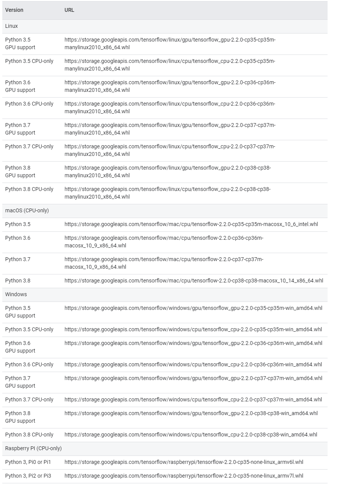

- **NOTE**
  在`Ubuntu`中用`CUDA10.2`和`TensorFlow2.2.0`的时候，提示以下错误:
  ```shell
  Could not load dynamic library 'libcudart.so.10.1';
  dlerror: libcudart.so.10.1: cannot open shared object file: No such file or directory
  ```

  解决方法是，软连接一个`libcudart.so.10.1`到`libcudart.so.10.2`:
  ```shell
  sudo ln -s /usr/local/cuda/lib64/libcudart.so.10.2 /usr/local/cuda/lib64/libcudart.so.10.1
  ```
  > [tensorflow-gpu: Could not load dynamic library 'libcudart.so.10.1'](https://github.com/tensorflow/tensorflow/issues/39132#issuecomment-650565521)
---
## 安装caffe

### Python2下安装Cafe

~~**推荐**此方法安装caffe， [需要Python2.7下安装OpenCV](#安装opencv)~~

#### 1. 安装依赖库
```shell
sudo apt-get update
sudo apt-get upgrade
sudo apt-get install -y build-essential cmake git pkg-config
sudo apt-get install -y libprotobuf-dev libleveldb-dev libsnappy-dev libhdf5-serial-dev protobuf-compiler

sudo apt-get install -y libatlas-base-dev
sudo apt-get install -y --no-install-recommends libboost-all-dev

sudo apt-get install -y libgflags-dev libgoogle-glog-dev liblmdb-dev
sudo apt-get -y install build-essential cmake git libgtk2.0-dev pkg-config python-dev python-numpy libdc1394-22 libdc1394-22-dev libjpeg-dev libpng12-dev libtiff5-dev libjasper-dev libavcodec-dev libavformat-dev libswscale-dev libxine2-dev libgstreamer0.10-dev libgstreamer-plugins-base0.10-dev libv4l-dev libtbb-dev libqt4-dev libfaac-dev libmp3lame-dev libopencore-amrnb-dev libopencore-amrwb-dev libtheora-dev libvorbis-dev libxvidcore-dev x264 v4l-utils unzip
```
#### 2. 配置`CUDA` 及 `CUDNN`
添加 CUDA 环境变量
```shell
vim ~/.bashrc

# CUDA
export CUDA_ROOT_PATH=/usr/local/cuda # cuda -> cuda11.6
export PATH=$CUDA_ROOT_PATH/bin:$PATH  # cuda -> /usr/local/cuda-9.0
export LD_LIBRARY_PATH=$CUDA_ROOT_PATH/lib64:$LD_LIBRARY_PATH
```

#### 3. 安装`OpenCV`，方法同: [安装OpenCV](#安装opencv)

#### 4. 然后按照前面的方法[屏蔽Anaconda](#屏蔽anaconda)

#### 5. 配置`Caffe`

**首先cd 到你要安装的路径下运行**：
```shell
git clone https://github.com/BVLC/caffe.git
```
这时候会出现一个 `caffe` 文件夹。命令行进入此文件夹，运行：
```shell
cp Makefile.config.example Makefile.config

# 若无法拷贝则运行以下命令
# chmod 777 Makefile.config.example
# cp Makefile.config.example Makefile.config
```
此命令是将 `Makefile.config.example` 文件复制一份并更名为 `Makefile.config` ，复制一份的原因是编译 `caffe` 时需要的是 `Makefile.config` 文件，而Makefile.config.example 只是 `caffe` 给出的配置文件例子，不能用来编译 `caffe`。

**然后修改 Makefile.config 文件**，在 `caffe` 目录下打开该文件：
```shell
vim Makefile.config

# 或者用右键选择gedit/vscode打开该文件
```
#### 5.1 修改 `Makefile.config` 文件内容：
- **应用 cudnn**
  将：`#USE_CUDNN := 1`修改为：`USE_CUDNN := 1`

- **应用 opencv 3 版本**
  将：`#OPENCV_VERSION := 3 `修改为：`OPENCV_VERSION := 3`
- **使用 python 接口**
  将： `#WITH_PYTHON_LAYER := 1`修改为`WITH_PYTHON_LAYER := 1`
- **修改 python 路径**
  将：
  ```shell
  INCLUDE_DIRS := $(PYTHON_INCLUDE) /usr/local/include
  LIBRARY_DIRS := $(PYTHON_LIB) /usr/local/lib /usr/lib
  ```
  修改为：
  ```shell
  INCLUDE_DIRS := $(PYTHON_INCLUDE) /usr/local/include /usr/include/hdf5/serial
  LIBRARY_DIRS := $(PYTHON_LIB) /usr/local/lib /usr/lib /usr/lib/x86_64-linux-gnu /usr/lib/x86_64-linux-gnu/hdf5/serial
  ```
  此python路径为系统自带python的路径，假如想使用`Anaconda`的python的话需要在其他地方修改。

- **去掉compute_20**
  找到
  ```shell
  # CUDA architecture setting: going with all of them.
  # For CUDA < 6.0, comment the *_50 through *_61 lines for compatibility.
  # For CUDA < 8.0, comment the *_60 and *_61 lines for compatibility.
  # For CUDA >= 9.0, comment the *_20 and *_21 lines for compatibility.
  CUDA_ARCH := -gencode arch=compute_20,code=sm_20 \
              -gencode arch=compute_20,code=sm_21 \
              -gencode arch=compute_30,code=sm_30 \
              -gencode arch=compute_35,code=sm_35 \
              -gencode arch=compute_50,code=sm_50 \
              -gencode arch=compute_52,code=sm_52 \
              -gencode arch=compute_60,code=sm_60 \
              -gencode arch=compute_61,code=sm_61 \
              -gencode arch=compute_61,code=compute_61
  ```
  改为：
  ```shell
  # CUDA architecture setting: going with all of them.
  # For CUDA < 6.0, comment the *_50 through *_61 lines for compatibility.
  # For CUDA < 8.0, comment the *_60 and *_61 lines for compatibility.
  # For CUDA >= 9.0, comment the *_20 and *_21 lines for compatibility.
  CUDA_ARCH := -gencode arch=compute_30,code=sm_30 \
              -gencode arch=compute_35,code=sm_35 \
              -gencode arch=compute_50,code=sm_50 \
              -gencode arch=compute_52,code=sm_52 \
              -gencode arch=compute_60,code=sm_60 \
              -gencode arch=compute_61,code=sm_61 \
              -gencode arch=compute_61,code=compute_61
  ```
  由于**CUDA 9.x +并不支持compute_20**，此处不修改的话编译`caffe`时会报错：
  ```shell
  nvcc fatal  : Unsupported gpu architecture 'compute_20'
  ```


#### 5.2 **配置好的完整的`Makefile.config`文件**

在caffe源码目录中修改后的完整`Makefile.config`文件，内容如下：
```shell
## Refer to http://caffe.berkeleyvision.org/installation.html
# Contributions simplifying and improving our build system are welcome!

# cuDNN acceleration switch (uncomment to build with cuDNN).
USE_CUDNN := 1

# CPU-only switch (uncomment to build without GPU support).
# CPU_ONLY := 1

# uncomment to disable IO dependencies and corresponding data layers
# USE_OPENCV := 0
# USE_LEVELDB := 0
# USE_LMDB := 0

# uncomment to allow MDB_NOLOCK when reading LMDB files (only if necessary)
#	You should not set this flag if you will be reading LMDBs with any
#	possibility of simultaneous read and write
# ALLOW_LMDB_NOLOCK := 1

# Uncomment if you're using OpenCV 3
OPENCV_VERSION := 3

# To customize your choice of compiler, uncomment and set the following.
# N.B. the default for Linux is g++ and the default for OSX is clang++
CUSTOM_CXX := g++

# CUDA directory contains bin/ and lib/ directories that we need.
CUDA_DIR := /usr/local/cuda
# On Ubuntu 14.04, if cuda tools are installed via
# "sudo apt-get install nvidia-cuda-toolkit" then use this instead:
# CUDA_DIR := /usr

# CUDA architecture setting: going with all of them.
# For CUDA < 6.0, comment the *_50 through *_61 lines for compatibility.
# For CUDA < 8.0, comment the *_60 and *_61 lines for compatibility.
# For CUDA >= 9.0, comment the *_20 and *_21 lines for compatibility.
CUDA_ARCH := -gencode arch=compute_30,code=sm_30 \
            -gencode arch=compute_35,code=sm_35 \
            -gencode arch=compute_50,code=sm_50 \
            -gencode arch=compute_52,code=sm_52 \
            -gencode arch=compute_60,code=sm_60 \
            -gencode arch=compute_61,code=sm_61 \
            -gencode arch=compute_61,code=compute_61

# BLAS choice:
# atlas for ATLAS (default)
# mkl for MKL
# open for OpenBlas
BLAS := atlas
# Custom (MKL/ATLAS/OpenBLAS) include and lib directories.
# Leave commented to accept the defaults for your choice of BLAS
# (which should work)!
# BLAS_INCLUDE := /path/to/your/blas
# BLAS_LIB := /path/to/your/blas

# Homebrew puts openblas in a directory that is not on the standard search path
# BLAS_INCLUDE := $(shell brew --prefix openblas)/include
# BLAS_LIB := $(shell brew --prefix openblas)/lib

# This is required only if you will compile the matlab interface.
# MATLAB directory should contain the mex binary in /bin.
# MATLAB_DIR := /usr/local
# MATLAB_DIR := /Applications/MATLAB_R2012b.app

# NOTE: this is required only if you will compile the python interface.
# We need to be able to find Python.h and numpy/arrayobject.h.
PYTHON_INCLUDE := /usr/include/python2.7 \
                  /usr/lib/python2.7/dist-packages/numpy/core/include
# Anaconda Python distribution is quite popular. Include path:
# Verify anaconda location, sometimes it's in root.
# ANACONDA_HOME := $(HOME)/anaconda
# PYTHON_INCLUDE := $(ANACONDA_HOME)/include \
    # $(ANACONDA_HOME)/include/python2.7 \
    # $(ANACONDA_HOME)/lib/python2.7/site-packages/numpy/core/include

# Uncomment to use Python 3 (default is Python 2)
# PYTHON_LIBRARIES := boost_python3 python3.5m
# PYTHON_INCLUDE := /usr/include/python3.5m \
#                 /usr/lib/python3.5/dist-packages/numpy/core/include

# We need to be able to find libpythonX.X.so or .dylib.
PYTHON_LIB := /usr/lib
# PYTHON_LIB := $(ANACONDA_HOME)/lib

# Homebrew installs numpy in a non standard path (keg only)
# PYTHON_INCLUDE += $(dir $(shell python -c 'import numpy.core; print(numpy.core.__file__)'))/include
# PYTHON_LIB += $(shell brew --prefix numpy)/lib

# Uncomment to support layers written in Python (will link against Python libs)
WITH_PYTHON_LAYER := 1

# Whatever else you find you need goes here.
INCLUDE_DIRS := $(PYTHON_INCLUDE) /usr/local/include /usr/include/hdf5/serial/
LIBRARY_DIRS := $(PYTHON_LIB) /usr/local/lib /usr/lib /usr/lib/x86_64-linux-gnu /usr/lib/x86_64-linux-gnu/hdf5/serial

# If Homebrew is installed at a non standard location (for example your home directory) and you use it for general dependencies
# INCLUDE_DIRS += $(shell brew --prefix)/include
# LIBRARY_DIRS += $(shell brew --prefix)/lib

# NCCL acceleration switch (uncomment to build with NCCL)
# https://github.com/NVIDIA/nccl (last tested version: v1.2.3-1+cuda8.0)
# USE_NCCL := 1

# Uncomment to use `pkg-config` to specify OpenCV library paths.
# (Usually not necessary -- OpenCV libraries are normally installed in one of the above $LIBRARY_DIRS.)
# USE_PKG_CONFIG := 1

# N.B. both build and distribute dirs are cleared on `make clean`
BUILD_DIR := build
DISTRIBUTE_DIR := distribute

# Uncomment for debugging. Does not work on OSX due to https://github.com/BVLC/caffe/issues/171
# DEBUG := 1

# The ID of the GPU that 'make runtest' will use to run unit tests.
TEST_GPUID := 0

# enable pretty build (comment to see full commands)
Q ?= @
```

####  5.3 **修改` caffe 目录`下的` Makefile `文件**
*修改的地方找起来比较困难的话可以复制到word里查找*
将：
```shell
NVCCFLAGS +=-ccbin=$(CXX) -Xcompiler-fPIC $(COMMON_FLAGS)
```
替换为：
```shell
NVCCFLAGS += -D_FORCE_INLINES -ccbin=$(CXX) -Xcompiler -fPIC $(COMMON_FLAGS)
```

将：
```shell
LIBRARIES += glog gflags protobuf boost_system boost_filesystem m hdf5_hl hdf5
```
改为：
```shell
LIBRARIES += glog gflags protobuf boost_system boost_filesystem m hdf5_serial_hl hdf5_serial
```
至此caffe配置文件修改完毕，可以开始编译了。假如显卡不是feimi架构的可以输入如下命令防止出现`Unsupported gpu architecture 'compute_20'`的问题：
```shell
cmake -D CMAKE_BUILD_TYPE=RELEASE  -D CUDA_GENERATION=Kepler ..
```

#### 6. 编译安装`Caffe`
在 `caffe` 目录下执行：
```shell
cd caffe
make all -j $(($(nproc) + 1))
make test -j $(($(nproc) + 1))
make runtest -j $(($(nproc) + 1))
make pycaffe -j $(($(nproc) + 1))
```
`runtest`之后成功成功的界面如下:
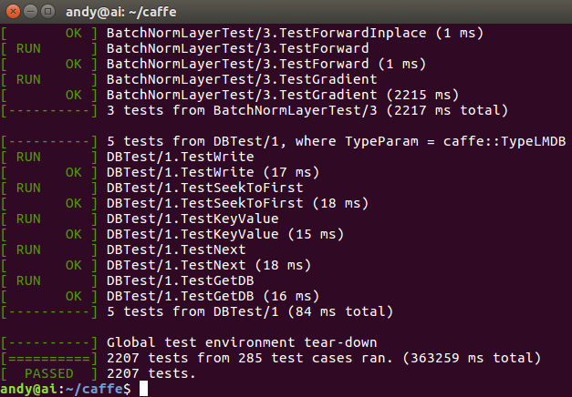

**添加`Caffe`环境变量**
```shell
vim ~/.bashrc

# Caffe
export PYTHONPATH=~/caffe/python:$PYTHONPATH
```

<!-- 这时如果之前的配置或安装出错，那么编译就会出现各种各样的问题，所以前面的步骤一定要细心。假如编译失败可对照出现的问题Google解决方案，再次编译之前使用`make clean`命令清除之前的编译，报错：`nothing
 to be done for all`就说明没有清除之前的编译。编译成功后可运行测试：
```shell
make runtest -j8
``` -->

#### 7. 常见问题
**常见问题 1**
在caffe源码目录中修改`Makefile`文件中这一行如下：
```shell
LIBRARIES += glog gflags protobuf boost_system boost_filesystem m hdf5_serial_hl hdf5_serial
```
上述中`Makefile.config`和`Makefile`文件都要添加`hdf5`相关选项，否则会提示以下错误：


**常见问题 2**
在`python`中导入`caffe`库的时候会提示以下信息：
```shell
/usr/local/lib/python2.7/dist-packages/scipy/sparse/lil.py:19: RuntimeWarning: numpy.dtype
size changed, may indicate binary incompatibility. Expected 96, got 88
```
**解决方法**
将`numpy`降版本：
```shell
pip uninstall numpy
pip install numpy==1.14.5
```

**常见问题 3**
导入`caffe`的时候还有一个**错误**:
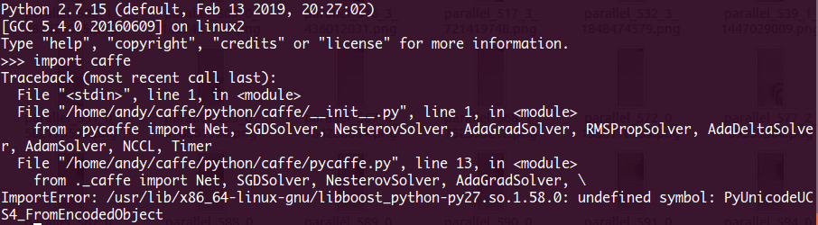
原因是我在`ubutnu`下用的`linuxbrew`安装的`Python2`设为默认`Python`了，然后`caffe`编译配置文件里用的是系统的`Python2`路径，导致系统自带的`Python`与`linuxbrew`安装的`Python`环境混乱。
解决方法是屏蔽掉`linuxbrew`环境。只用系统自带的`Python`，将`~/.profile`文件中的`eval $(/home/linuxbrew/.linuxbrew/bin/brew shellenv)`这一行屏蔽:
```shell
# linuxbrew
#eval $(/home/linuxbrew/.linuxbrew/bin/brew shellenv)
```
然后重启电脑.

**常见问题 4**
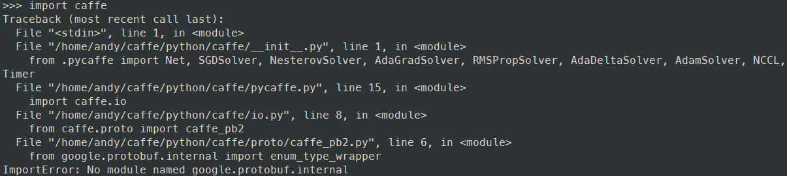
导致上述原因是`pip2`同时存在于`/usr/bin/pip2`和`/usr/local/bin/pip2`两个地方:
```shell
# 查看pip2位于哪里
$ where pip2
/usr/local/bin/pip2
/usr/bin/pip2

# 查看当前用到的pip2是哪一个
$ which pip
/usr/local/bin/pip
```

解决方法是用`/usr/local/bin/pip2`安装`protobuf`:
```shell
/usr/local/bin/pip2 install protobuf
```

> [Importing caffe results in ImportError: "No module named google.protobuf.internal"
](https://stackoverflow.com/questions/37666241/importing-caffe-results-in-importerror-no-module-named-google-protobuf-interna)
> This is probably because you have two python environments in your machine, the one provided by your linux distribution(pip) and the other by the anaconda environment (/home/username/anaconda2/bin/pip).
> Try installing protobuf for both environments to be sure
> `pip install protobuf`
> `/home/username/anaconda2/bin/pip` install protobuf


### Python3下安装Cafe
#### 0. 切换系统`Python`版本到`Python3`
将系统Python切换到Python3版本:
```shell
which python3
which python
sudo rm /usr/bin/python # 删掉Python软连接
sudo ln -s /usr/bin/python3 /usr/bin/python # 将Python3软连接到Python
```
#### 1. 装依赖库
> [同Python2.7安装依赖库](#python2下安装cafe)
>
#### 2. 配置`CUDA` 及 `CUDNN`
> [同Python2.7配置CUDA以及CUDNN](#python2下安装cafe)

#### 3. pip 安装依赖模块:
```shell
pip install opencv-python==3.4.0.12 # OpenCV的Python版本要跟opencv源码安装的版本对应起来
pip install protobuf
```

<!-- **`conda install -c menpo opencv3`命令有时候会显示权限不够`permission issue`。这是因为你安装`anaconda`时用的是`sudo`，这时候需要修改`anaconda3`文件夹权限**:
```shell
sudo chown -R 你的用户名（user ） /home/你的用户名/anaconda3
```
添加`Anaconda CPLUS`路径:
```shell
export CPLUS_INCLUDE_PATH=~/anaconda3/include/python3.6m
```
配置 `boost_python`
```shell
cd /usr/lib/x86_64-linux-gnu && sudo ln -s libboost_python-py35.so libboost_python3.so
``` -->


#### 3. 安装`OpenCV`，方法同: [安装OpenCV](#安装opencv)

#### 4. 然后按照前面的方法[屏蔽Anaconda](#若需要将anaconda屏蔽)

#### 5. 配置`Caffe`
**首先cd 到你要安装的路径下运行**：
```shell
git clone https://github.com/BVLC/caffe.git
```
这时候会出现一个 `caffe` 文件夹。命令行进入此文件夹，运行：
```shell
cp Makefile.config.example Makefile.config

# 若无法拷贝则运行以下命令
# chmod 777 Makefile.config.example
# cp Makefile.config.example Makefile.config
```
此命令是将 `Makefile.config.example` 文件复制一份并更名为 `Makefile.config` ，复制一份的原因是编译 `caffe` 时需要的是 `Makefile.config` 文件，而Makefile.config.example 只是 `caffe` 给出的配置文件例子，不能用来编译 `caffe`。

##### 5.1 **然后修改 Makefile.config 文件**，在 `caffe` 目录下打开该文件：
```shell
vim Makefile.config

# 或者用右键选择gedit/vscode打开该文件
```
修改 `Makefile.config` 文件内容：
- **应用 cudnn**
  将：`#USE_CUDNN := 1`修改为：`USE_CUDNN := 1`

- **应用 opencv 3 版本**
  将：`#OPENCV_VERSION := 3 `修改为：`OPENCV_VERSION := 3`
- **使用 python 接口**
  将： `#WITH_PYTHON_LAYER := 1`修改为`WITH_PYTHON_LAYER := 1`
- **修改 python 路径**
  将：
  ```shell
  INCLUDE_DIRS := $(PYTHON_INCLUDE) /usr/local/include
  LIBRARY_DIRS := $(PYTHON_LIB) /usr/local/lib /usr/lib
  ```
  修改为：
  ```shell
  INCLUDE_DIRS := $(PYTHON_INCLUDE) /usr/local/include /usr/include/hdf5/serial
  LIBRARY_DIRS := $(PYTHON_LIB) /usr/local/lib /usr/lib /usr/lib/x86_64-linux-gnu /usr/lib/x86_64-linux-gnu/hdf5/serial
  ```
  此python路径为系统自带python的路径，假如想使用`Anaconda`的python的话需要在其他地方修改。

- **去掉compute_20**
  找到
  ```shell
  # CUDA architecture setting: going with all of them.
  # For CUDA < 6.0, comment the *_50 through *_61 lines for compatibility.
  # For CUDA < 8.0, comment the *_60 and *_61 lines for compatibility.
  # For CUDA >= 9.0, comment the *_20 and *_21 lines for compatibility.
  CUDA_ARCH := -gencode arch=compute_20,code=sm_20 \
              -gencode arch=compute_20,code=sm_21 \
              -gencode arch=compute_30,code=sm_30 \
              -gencode arch=compute_35,code=sm_35 \
              -gencode arch=compute_50,code=sm_50 \
              -gencode arch=compute_52,code=sm_52 \
              -gencode arch=compute_60,code=sm_60 \
              -gencode arch=compute_61,code=sm_61 \
              -gencode arch=compute_61,code=compute_61
  ```
  改为：
  ```shell
  # CUDA architecture setting: going with all of them.
  # For CUDA < 6.0, comment the *_50 through *_61 lines for compatibility.
  # For CUDA < 8.0, comment the *_60 and *_61 lines for compatibility.
  # For CUDA >= 9.0, comment the *_20 and *_21 lines for compatibility.
  CUDA_ARCH := -gencode arch=compute_30,code=sm_30 \
              -gencode arch=compute_35,code=sm_35 \
              -gencode arch=compute_50,code=sm_50 \
              -gencode arch=compute_52,code=sm_52 \
              -gencode arch=compute_60,code=sm_60 \
              -gencode arch=compute_61,code=sm_61 \
              -gencode arch=compute_61,code=compute_61
  ```
  由于**CUDA 9.x +并不支持compute_20**，此处不修改的话编译`caffe`时会报错：
  ```shell
  nvcc fatal  : Unsupported gpu architecture 'compute_20'
  ```

相比较`Python2`特别的是，要将python指定为本地的`Python3`版本，如本地为**python3.6**， 则需要修改：
```shell
PYTHON_LIBRARIES := boost_python3 python3.6m
PYTHON_INCLUDE := /usr/include/python3.6m \
                 /usr/lib/python3.6/dist-packages/numpy/core/include
```

以下以**Python3.6**为例:
```shell
## Refer to http://caffe.berkeleyvision.org/installation.html
# Contributions simplifying and improving our build system are welcome!

# cuDNN acceleration switch (uncomment to build with cuDNN).
USE_CUDNN := 1

# CPU-only switch (uncomment to build without GPU support).
# CPU_ONLY := 1

# uncomment to disable IO dependencies and corresponding data layers
# USE_OPENCV := 0
# USE_LEVELDB := 0
# USE_LMDB := 0

# uncomment to allow MDB_NOLOCK when reading LMDB files (only if necessary)
#	You should not set this flag if you will be reading LMDBs with any
#	possibility of simultaneous read and write
# ALLOW_LMDB_NOLOCK := 1

# Uncomment if you're using OpenCV 3
OPENCV_VERSION := 3

# To customize your choice of compiler, uncomment and set the following.
# N.B. the default for Linux is g++ and the default for OSX is clang++
CUSTOM_CXX := g++

# CUDA directory contains bin/ and lib/ directories that we need.
CUDA_DIR := /usr/local/cuda
# On Ubuntu 14.04, if cuda tools are installed via
# "sudo apt-get install nvidia-cuda-toolkit" then use this instead:
# CUDA_DIR := /usr

# CUDA architecture setting: going with all of them.
# For CUDA < 6.0, comment the *_50 through *_61 lines for compatibility.
# For CUDA < 8.0, comment the *_60 and *_61 lines for compatibility.
# For CUDA >= 9.0, comment the *_20 and *_21 lines for compatibility.
CUDA_ARCH := -gencode arch=compute_30,code=sm_30 \
             -gencode arch=compute_35,code=sm_35 \
             -gencode arch=compute_50,code=sm_50 \
             -gencode arch=compute_52,code=sm_52 \
             -gencode arch=compute_60,code=sm_60 \
             -gencode arch=compute_61,code=sm_61 \
             -gencode arch=compute_61,code=compute_61

# BLAS choice:
# atlas for ATLAS (default)
# mkl for MKL
# open for OpenBlas
BLAS := atlas
# Custom (MKL/ATLAS/OpenBLAS) include and lib directories.
# Leave commented to accept the defaults for your choice of BLAS
# (which should work)!
# BLAS_INCLUDE := /path/to/your/blas
# BLAS_LIB := /path/to/your/blas

# Homebrew puts openblas in a directory that is not on the standard search path
# BLAS_INCLUDE := $(shell brew --prefix openblas)/include
# BLAS_LIB := $(shell brew --prefix openblas)/lib

# This is required only if you will compile the matlab interface.
# MATLAB directory should contain the mex binary in /bin.
# MATLAB_DIR := /usr/local
# MATLAB_DIR := /Applications/MATLAB_R2012b.app

# NOTE: this is required only if you will compile the python interface.
# We need to be able to find Python.h and numpy/arrayobject.h.
# PYTHON_INCLUDE := /usr/include/python2.7 \
#                  /usr/lib/python2.7/dist-packages/numpy/core/include
# Anaconda Python distribution is quite popular. Include path:
# Verify anaconda location, sometimes it's in root.
# ANACONDA_HOME := $(HOME)/anaconda
# PYTHON_INCLUDE := $(ANACONDA_HOME)/include \
#                 $(ANACONDA_HOME)/include/python2.7 \
#                 $(ANACONDA_HOME)/lib/python2.7/site-packages/numpy/core/include

# Uncomment to use Python 3 (default is Python 2)
PYTHON_LIBRARIES := boost_python3 python3.6m
PYTHON_INCLUDE := /usr/include/python3.6m \
                 /usr/lib/python3.6/dist-packages/numpy/core/include

# We need to be able to find libpythonX.X.so or .dylib.
PYTHON_LIB := /usr/lib
# PYTHON_LIB := $(ANACONDA_HOME)/lib

# Homebrew installs numpy in a non standard path (keg only)
# PYTHON_INCLUDE += $(dir $(shell python -c 'import numpy.core; print(numpy.core.__file__)'))/include
# PYTHON_LIB += $(shell brew --prefix numpy)/lib

# Uncomment to support layers written in Python (will link against Python libs)
WITH_PYTHON_LAYER := 1

# Whatever else you find you need goes here.
INCLUDE_DIRS := $(PYTHON_INCLUDE) /usr/local/include /usr/include/hdf5/serial/
LIBRARY_DIRS := $(PYTHON_LIB) /usr/local/lib /usr/lib /usr/lib/x86_64-linux-gnu /usr/lib/x86_64-linux-gnu/hdf5/serial

# If Homebrew is installed at a non standard location (for example your home directory) and you use it for general dependencies
# INCLUDE_DIRS += $(shell brew --prefix)/include
# LIBRARY_DIRS += $(shell brew --prefix)/lib

# NCCL acceleration switch (uncomment to build with NCCL)
# https://github.com/NVIDIA/nccl (last tested version: v1.2.3-1+cuda8.0)
# USE_NCCL := 1

# Uncomment to use `pkg-config` to specify OpenCV library paths.
# (Usually not necessary -- OpenCV libraries are normally installed in one of the above $LIBRARY_DIRS.)
# USE_PKG_CONFIG := 1

# N.B. both build and distribute dirs are cleared on `make clean`
BUILD_DIR := build
DISTRIBUTE_DIR := distribute

# Uncomment for debugging. Does not work on OSX due to https://github.com/BVLC/caffe/issues/171
# DEBUG := 1

# The ID of the GPU that 'make runtest' will use to run unit tests.
TEST_GPUID := 0

# enable pretty build (comment to see full commands)
Q ?= @
```

##### 5.2 **修改` caffe 目录`下的` Makefile `文件**
*修改的地方找起来比较困难的话可以复制到word里查找*
将：
```shell
NVCCFLAGS +=-ccbin=$(CXX) -Xcompiler-fPIC $(COMMON_FLAGS)
```
替换为：
```shell
NVCCFLAGS += -D_FORCE_INLINES -ccbin=$(CXX) -Xcompiler -fPIC $(COMMON_FLAGS)
```

将：
```shell
LIBRARIES += glog gflags protobuf boost_system boost_filesystem m hdf5_hl hdf5
```
改为：
```shell
LIBRARIES += glog gflags protobuf boost_system boost_filesystem m hdf5_serial_hl hdf5_serial
```
<!-- 将:
```shell
PYTHON_LIBRARIES ?= boost_python python2.7
```
改为:
```shell
PYTHON_LIBRARIES ?= boost_python-py35 #py35需要改为本地目前python版本
``` -->

至此caffe配置文件修改完毕，可以开始编译了。假如显卡不是feimi架构的可以输入如下命令防止出现`Unsupported gpu architecture 'compute_20'`的问题：
```shell
cmake -D CMAKE_BUILD_TYPE=RELEASE  -D CUDA_GENERATION=Kepler ..
```


#### 6. 编译安装`Caffe`
```shell
cd caffe
make all -j $(($(nproc) + 1))
make test -j $(($(nproc) + 1))
make runtest -j $(($(nproc) + 1))
make pycaffe -j $(($(nproc) + 1))
```
在编译的时候会提示: `cannot find -lboost_python3`:
```shell
CXX src/caffe/layers/cudnn_pooling_layer.cpp
CXX src/caffe/layers/cudnn_lcn_layer.cpp
CXX src/caffe/layers/concat_layer.cpp
AR -o .build_release/lib/libcaffe.a
LD -o .build_release/lib/libcaffe.so.1.0.0
/usr/bin/ld: cannot find -lboost_python3
collect2: error: ld returned 1 exit status
Makefile:582: recipe for target '.build_release/lib/libcaffe.so.1.0.0' failed
make: *** [.build_release/lib/libcaffe.so.1.0.0] Error 1
```
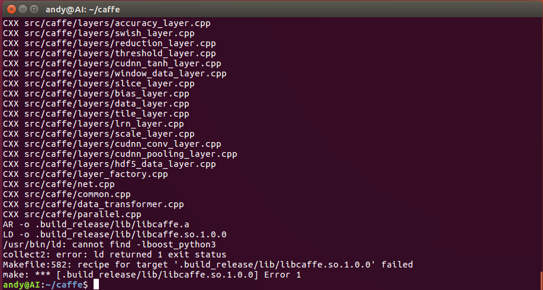
首先去`/usr/lib/x86_64-linux-gnu`目录下查看是否有python3版本的libboost，如果有类似`libboost_python35.so`但是没有`libboost_python3.so`则需要手动建立连接:
```shell
cd /usr/lib/x86_64-linux-gnu
ls -al
```
```shell
rwxrwxrwx   Tue Jun 14 16:53:34 2016 libboost_python.a  ⇒ libboost_python-py27.a
rw-r--r--   Tue Jun 14 16:57:29 2016 libboost_python-py27.a
rwxrwxrwx   Tue Jun 14 16:53:34 2016 libboost_python-py27.so  ⇒ libboost_python-py27.so.1.58.0
rw-r--r--   Tue Jun 14 16:57:28 2016 libboost_python-py27.so.1.58.0
rw-r--r--   Tue Jun 14 16:57:29 2016 libboost_python-py35.a
rwxrwxrwx   Tue Jun 14 16:53:34 2016 libboost_python-py35.so  ⇒ libboost_python-py35.so.1.58.0
rw-r--r--   Tue Jun 14 16:57:29 2016 libboost_python-py35.so.1.58.0
rwxrwxrwx   Tue Jun 14 16:53:34 2016 libboost_python.so  ⇒ libboost_python-py27.so
```

然后建立软连接：
```shell
cd /usr/lib/x86_64-linux-gnu
/usr/lib/x86_64-linux-gnu$ sudo rm libboost_python.a
/usr/lib/x86_64-linux-gnu$ sudo ln -s libboost_python-py35.a libboost_python.a
/usr/lib/x86_64-linux-gnu$ sudo rm libboost_python.so
/usr/lib/x86_64-linux-gnu$ sudo ln -s libboost_python-py35.so libboost_python.so
/usr/lib/x86_64-linux-gnu$ sudo ln -s libboost_python-py35.so libboost_python3.so
```
或者更改makefile文件:
```makefile
PYTHON_LIBRARIES := boost_python-py35  python3.5m
```
推荐使用第一种方法。


**添加`Caffe`环境变量**
```shell
vim ~/.bashrc

# Caffe
export PYTHONPATH=~/caffe/python:$PYTHONPATH
```

#### 7. 常见问题

**常见问题 1**
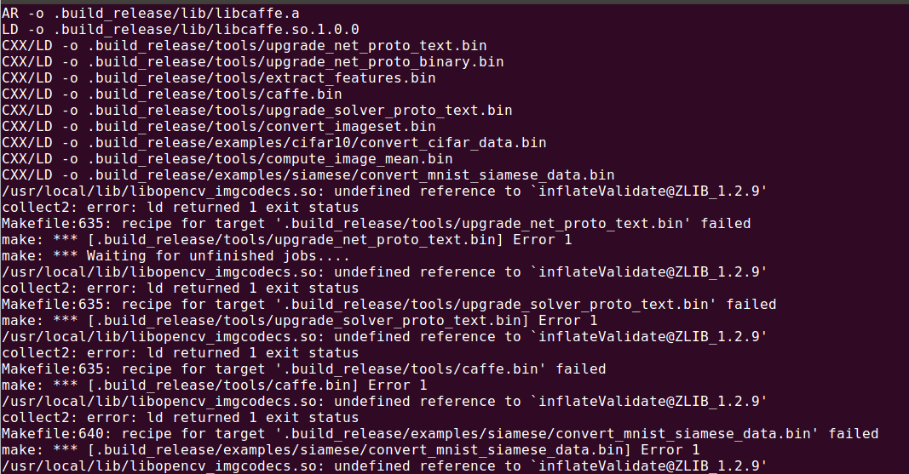

**解决方法**
```shell
git clone https://github.com/madler/zlib
cd path/to/zlib
./configure
make
make install  # you may add 'sudo'
```

**常见问题 2**
<table><tr><td bgcolor=Violet>protoc: error while loading shared libraries: libprotoc.so.10: cannot open shared object file: No such file or directory</td></tr></table>

**解决：**

```shell
export LD_LIBRARY_PATH=/usr/local/lib
```

**常见问题 3**
<table><tr><td bgcolor=Violet>/sbin/ldconfig.real: /usr/local/cuda-9.0/lib64/libcudnn.so.5 不是符号连接</td></tr></table>

**解决：**
在sudo ldconfig时遇到`usr/local/cuda-9.0/lib64/libcudnn.so.5 `不是符号连接的问题，解决办法也很简单，重新建立链接并删除原链接

首先找到`usr/local/cuda-8.0/lib64/`目录，搜索` libcudnn `然后发现两个文件`libcudnn.so.5`和`libcudnn.so.5.0.5 `理论上只有一个`libcudnn.so.5.0.5`

终端执行:
```shell
ln -sf /usr/local/cuda-9.0/lib64/libcudnn.so.5.0.5 /usr/local/cuda-9.0/lib64/libcudnn.so.5
```
再`sudo ldconfig`时就可以了，这时候会发现usr/local/cuda-9.0/lib64/目录下只有`libcudnn.so.5.0.5`文件了，`libcudnn.so.5`消失了。


**常见问题 4**
<table><tr><td bgcolor=Violet>.build_release/tools/caffe: error while loading shared libraries: libhdf5.so.10: cannot open shared object file: No such file    or directory</td></tr></table>

**解决：**
```shell
echo "export LD_LIBRARY_PATH=/home/abc/anaconda2/lib:$LD_LIBRARY_PATH" >>~/.bashrc
```

**常见问题 5**
<table><tr><td bgcolor=Violet>错误：python/caffe/_caffe.cpp:1:52:致命错误：Python.h：没有那个文件或目录
编译中断。
make:***
[python/caffe/_caffe.so]错误1</td></tr></table>

**解决：**
执行：`sudo find / -name 'Python.h'`找到他的路径，
在`Makefile.config`的PYTHON_INCLUDE加上`/home/abc/anaconda2/include/python2.7`（路径是自己的）

**常见问题 6**
<table><tr><td bgcolor=Violet>错误：import caffe时：ImportError:No module named skimage.io</td></tr></table>

**解决：**
可能是我们没有安装所谓的skimage.io模块，所以可以用以下的命令来安装：
```shell
pip install scikit-image  # you may need use sudo
```


**常见问题 7**
<table><tr><td bgcolor=Violet>
import caffe
Traceback(most recent call last):
File"<stdin>", line 1, in <module>
ImportError:No module named caffe</td></tr></table>

**解决：**
```shell
echo'export PATH="/home/andy/caffe/python:$PATH"' >>~/.bashrc
source~/.bashrc
```
关掉终端，重新进入


---
##  安装protobuf
### protobuf是什么？
protobuf（Protocol Buffer）它是google提供的一个开源库，是一种语言无关、平台无关、扩展性好的用于通信协议、数据存储的结构化数据串行化方法。有如XML，不过它更小、更快、也更简单。你可以定义自己的数据结构，然后使用代码生成器生成的代码来读写这个数据结构。


### protobuf-c 是什么？
由于Protocol Buffer原生没有对C的支持，只能使用protobuf-c这个第三方库，它提供了支持C语言的API接口。

下面先安装protobuf，然后安装protobuf-c 。

### 安装protocbuf
#### 下载源码安装包
https://developers.google.com/protocol-buffers/
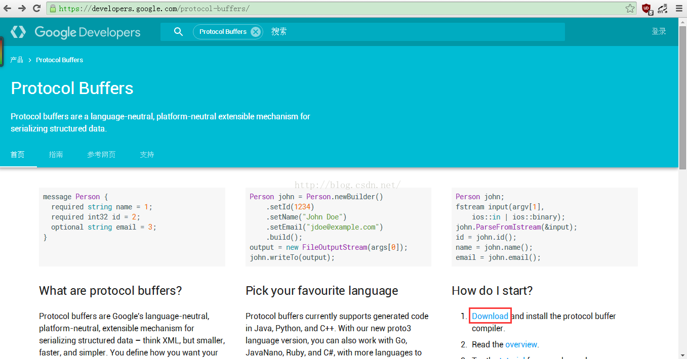


在release下可以找到所有的版本，我这里用的是2.4.1版本，复制protobuf-2.4.1.tar.gz的链接然后用wget命令下载。
```shell
wget https://github.com/google/protobuf/releases/download/v2.4.1/protobuf-2.4.1.tar.gz
```
#### 解压
```shell
tar -zxvf protobuf-2.4.1.tar.gz
```
#### 编译/安装
```shell
cd protobuf-2.4.1
```
（可以参考README思路来做。）
```shell
./configure
make
make check  #(check结果可能会有错误，但不用管她，因为暂时那些功能用不到)
make install
```
（完了之后会在 /usr/local/bin 目录下生成一个可执行文件 protoc）

#### 检查安装是否成功
```shell
protoc --version
```
如果成功，则会输出版本号信息。如果有问题，则会输出错误内容。

#### 错误及解决方法
```shell
protoc: error while loading shared libraries: libprotoc.so.8: cannot open shared
```
**错误原因**：
protobuf的默认安装路径是/usr/local/lib，而/usr/local/lib 不在Ubuntu体系默认的 LD_LIBRARY_PATH 里，所以就找不到该lib
解决方法：
1). 创建文件`sudo gedit /etc/ld.so.conf.d/libprotobuf.conf`，在该文件中输入如下内容：
```shell
/usr/local/lib
```
2). 执行命令
```shell
sudo ldconfig
```
这时，再运行protoc --version 就可以正常看到版本号了


### 安装protobuf-c
（这里使用的是protobuf-c-0.15版本，较高版本的安装类似）

进入下面的链接
https://code.google.com/p/protobuf-c/
进入Downloads界面


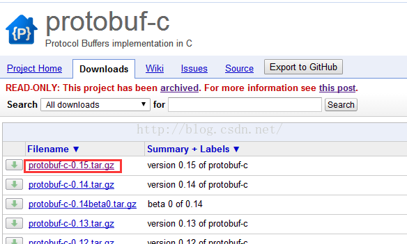

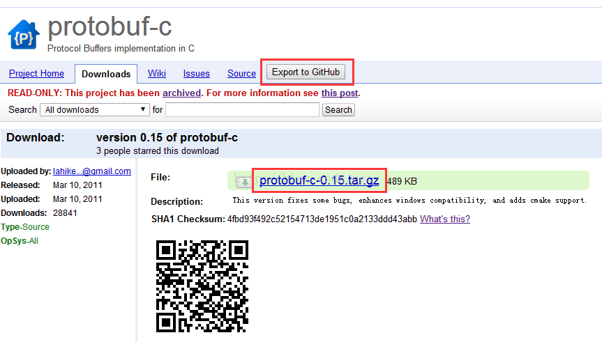

不知怎地，wget无法下载途中的`protobuf-c-0.15.tar.gz`文件。

怎么办呢，我们可以点击上图中的Export to GitHub，将代码导入到GitHub（当然你得有并登录自己的github账号），不过只有源码，没有release版。我们先wget下载源码，解包。由于是源码，所以没有configure文件，但是可以通过执行`autogen.sh`来生成configure文件，之后的操作就和安装protobuf类似了，这里就不细说了。
安装完成后会在` /usr/local/bin `目录下便会生成一个可执行文件 protoc-c

在安装完protobuf-c后，我们来检验一下protobuf-c是否安装成功。到 protobuf-c-0.15/src/test 目录下，执行如下命令：
```
protoc-c --c_out=. test.proto
```
（c_out 标志是用来指定编译后所生成文件的输出路径，这里c_out指定的是当前目录。）
如果在c_out指定目录下能够生成 test.pb-c.c 和 test.pb-c.h 这两个文件则说明安装成功了。

### Protobuf的使用示例
```shell
touch person.proto
```
输入如下内容：
```shell
message Person {
  required string name = 1;
  required int32 id = 2;
}
```
编译.proto文件
```shell
protoc-c --c_out=. person.proto
```
```shell
touch main.c
```
输入如下代码：
```cpp
#include <stdio.h>
#include <stdlib.h>
#include "person.pb-c.h"

void main()
{
        // 定义一个Person元素，并往其中存入数据
        Person person = PERSON__INIT;
        person.id = 1314;
        person.name = "lily";  // 字符串 lily 位于常量区

        printf("id = %d\n", person.id);
        printf("name = %s\n", person.name);

        // 打包
        int len = person__get_packed_size(&person);
        //printf("len = %d\n", len);
        void *sendpack = malloc(len);
        person__pack(&person, sendpack);
         // sendpack是打好的包，可以通过socket通讯将其发送出去。
        //（这里主要讲protobuf，就不发送了）

        // 接收端解包
        Person *recvbuf = person__unpack(NULL, len, sendpack);
        printf("id = %d\n", recvbuf->id);
        printf("name = %s\n", recvbuf->name);
        // 包用完了要释放
        person__free_unpacked(recvbuf, NULL);
        free(sendpack);
}

 ```
编译
```shell
gcc person.pb-c.c main.c -lprotobuf-c
 ```
执行` ./a.out`，输出结果如下：
```shell
id = 1314
name = lily
id = 1314
name = lily
```


---
##  Linux MATLAB安装

### Linux MATLAB 2018安装
#### 安装前准备工作
下载`MATLAB R2018a for Linux`文件, 这里用到的是[@晨曦月下](https://blog.csdn.net/m0_37775034/article/details/80876362)提供的百度网盘链接下载:
> 链接: https://pan.baidu.com/s/1W6jWkaXEMpMUEmIl8qmRwg
> 密码: igx6

进入下载后的文件夹(假如下载后的文件放在了`/home/Download/`, 解压破解文件`Matlab2018aLinux64Crack.tar.gz`文件, 创建一个文件夹`Crack`来放置解压后的文件:
```shell
cd ~/Downloads/Matlab
mkdir Crack
```
解压文件:
```shell
cd ~/Downloads/Matlab
tar -xvf Matlab2018aLinux64Crack.tar.gz -C Crack
```
在`/mnt`中创建一个文件夹用来挂载`R2018a_glnxa64_dvd1.iso`和`R2018a_glnxa64_dvd2.iso`:
```shell
sudo mkdir /mnt/iso
```
先挂载`R2018a_glnxa64_dvd1.iso`:
```shell
sudo mount -t auto -o loop R2018a_glnxa64_dvd1.iso /mnt/iso
```
如果这个时候提示`/mnt/iso: WARNING:device write-protected, mounted read-only`,那就修改下`/mnt`的权限:
```shell
sudo chmod 755 /mnt
```

#### Matlab安装过程
安装开始，从挂载的文件夹`iso`中:
```shell
sudo /mnt/iso/install
```
1. 选择 `Use a File Installation Key`:
  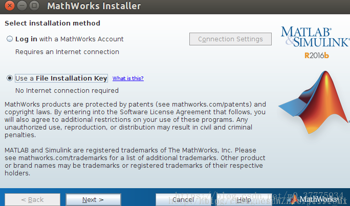
2. 选择`Yes`,同意条约:
  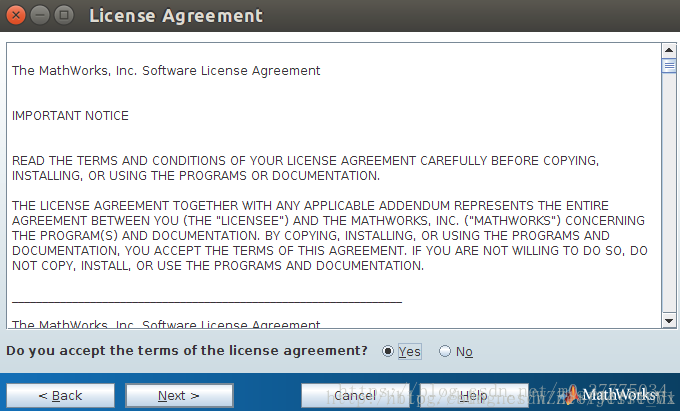
3. 选择默认安装目录,默认放在`/usr/local`中
4. 选择`I have the File Installation Key for my license`, 输入:
    `09806-07443-53955-64350-21751-41297`
5. 安装到某个进度会提示插入`iso2`, 这个时候挂载`R2018a_glnxa64_dvd2.iso`
    ```shell
    sudo mount -t auto -o loop R2018a_glnxa64_dvd2.iso /mnt/iso
    ```
6. 最后安装完成选择`finsh`

### 激活
1. 复制破解文件`Crack`中`license_standalone.lic`到安装目录中
    ```shell
    cd ~/Downloads/Matlab/Crack
    sudo cp license_standalone.lic /usr/local/MATLAB/R2018a/licenses
    ```
2. 复制`Crack`中的`R2018a`到`安装目录`
    ```
    cd ~/Downloads/Matlab/Crack
    sudo cp -r R2018a /usr/local/MATLAB
    ```
至此激活完成!

#### 创建快捷启动方式
打开终端，输入命令 `sudo gedit /usr/share/applications/Matlab.desktop` ,新建一个名为`Matlab.desktop`的文件。输入以下内容:
```shell
[Desktop Entry]
Type=Application
Name=Matlab
GenericName=Matlab 2010b
Comment=Matlab:The Language of Technical Computing
Exec=sh /usr/local/MATLAB/R2018a/bin/matlab -desktop
Icon=/usr/local/MATLAB/R2018a/toolbox/nnet/nnresource/icons/matlab.png
StartupNotify=true
Terminal=false
Categories=Development;Matlab;
```


**收拾残局**, 取消挂载,删除文件:
```shell
sudo umount /mnt/iso
sudo umount /mnt/iso # 两次是因为挂在了两张光盘
cd /mnt
sudo rmdir iso
```

#### Matlab设置
创建命令方便在任何终端都可以打开`matlab`,采用软链接的方式在`/usr/local/bin`中创建启动命令`matlab`:
```shell
cd /usr/local/bin
sudo ln -s /usr/local/MATLAB/R2018a/bin/matlab matlab
```

### Linux MATLAB 2019安装
#### 安装前准备工作
下载`MATLAB R2019b for Linux`文件, 进入下载后的文件夹(假如下载后的文件放在了`/home/Download/`, 解压破解文件`Matlab R2019b Linux64 Crack.tar.gz`文件, 创建一个文件夹`Crack`来放置解压后的文件:
```shell
cd ~/Downloads/Matlab
mkdir Crack
```
解压文件:
```shell
cd ~/Downloads/Matlab
tar -xvf  Matlab\ R2019b\ Linux64\ Crack.tar.gz -C Crack
```
在`/mnt`中创建一个文件夹用来挂载`R2019b_Linux.iso`:
```shell
sudo mkdir /mnt/iso
```
挂载`R2019b_Linux.iso`:
```shell
sudo mount -t auto -o loop R2019b_Linux.iso /mnt/iso
```
如果这个时候提示`/mnt/iso: WARNING:device write-protected, mounted read-only`,那就修改下`/mnt`的权限:
```shell
sudo chmod 755 /mnt
```

#### Matlab安装过程
安装开始，从挂载的文件夹`iso`中:
```shell
sudo /mnt/iso/install
```
1. 选择 `Use a File Installation Key`
2. 选择`Yes`,同意条约
3. 选择默认安装目录,默认安装在`/usr/local`中
4. 选择`I have the File Installation Key for my license`, 输入:
    `09806-07443-53955-64350-21751-41297`
5. 最后安装完成选择`finsh`

#### Matlab设置
创建命令方便在任何终端都可以打开`matlab`,采用软链接的方式在`/usr/local/bin`中创建启动命令`matlab`:
```shell
cd /usr/local/bin
sudo ln -s /usr/local/Polyspace/R2019b/bin/matlab matlab
```

### 激活
1. 复制破解文件`Crack`中`license_standalone.lic`到安装目录中
    ```shell
    cd ~/Downloads/Matlab/Crack
    sudo cp license_standalone.lic /usr/local/Polyspace/R2019b/licenses
    ```
2. 复制`Crack`中的`R2019b`到`安装目录`
    ```
    cd ~/Downloads/Matlab/Crack
    sudo cp -r R2019b /usr/local/Polyspace
    ```
3. 在命令行执行`sudo matlab` 然后选择`license_standalone.lic`完成激活。
至此激活完成!

#### 创建快捷启动方式
打开终端，输入命令 `sudo gedit /usr/share/applications/matlab.desktop` ,新建一个名为`matlab.desktop`的文件。输入以下内容:
```shell
[Desktop Entry]
Type=Application
Name=Matlab
GenericName=Matlab R2019b
Comment=Matlab:The Language of Technical Computing
Exec=sh /usr/local/Polyspace/R2019b/bin/matlab -desktop
Icon=/usr/local/Polyspace/R2019b/toolbox/nnet/nnresource/icons/matlab.png
StartupNotify=true
Terminal=false
Categories=Development;Matlab;
```


**收拾残局**, 取消挂载,删除文件:
```shell
sudo umount /mnt/iso
cd /mnt
sudo rmdir iso
```


**参考资料**
> [linux安装MATLAB R2018a步骤](https://blog.csdn.net/m0_37775034/article/details/80876362)
> [windows下同一个显卡配置多个CUDA工具包以及它们之间的切换](https://blog.csdn.net/qq_27825451/article/details/89135592)
> [Ubuntu 18.04安装Docker CE及NVIDIA Container Toolkit流程](https://www.cnblogs.com/journeyonmyway/p/11234572.html)
> [NVIDIA Installing on Ubuntu and Debian](https://docs.nvidia.com/datacenter/cloud-native/container-toolkit/install-guide.html#installing-on-ubuntu-and-debian)
