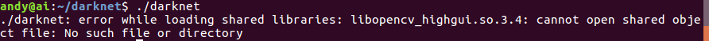
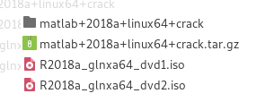

# AI基础环境搭建和设置

 深度学习基础环境的搭建和设置    

---
### 目录
1. [安装Ubuntu和Windows双系统](#安装ubuntu和windows双系统)   
2. [安装NVIDIA驱动](#安装nvidia驱动)   
    - [安装NVIDIA驱动所需的依赖包](#安装nvidia驱动所需的依赖包)   
    - [禁用Ubuntu自带的显卡驱动](#禁用ubuntu自带的显卡驱动)   
    - [安装NVIDIA官方显卡驱动](#安装nvidia官方显卡驱动)   
    - [配置NVIDIA环境变量](#配置nvidia环境变量)   
    - [查看NVIDIA驱动版本](#查看nvidia驱动版本)    
3. [安装CUDA](#安装cuda)   
    - [安装CUDA步骤](#安装cuda步骤)    
    - [修改配置文件](#修改配置文件)    
    - [查看CUDA版本](#查看cuda版本)
    - [卸载CUDA的方法](#卸载cuda的方法)    
4. [安装cuDNN](#安装cudnn)    
5. [安装Anaconda](#安装anaconda)    
6. [安装OpenCV](#安装opencv)   
    - [下载OpenCV](#下载opencv)
    - [编译OpenCV](#编译opencv)
    - [安装OpenCV](#安装opencv)
    - [卸载OpenCV](#卸载opencv)
7. [TensorRT](#tensorrt) 
    - [安装TensorRT](#安装tensorrt)    
      - [TensorRT环境变量设置](#tensorrt1)
      - [安装Python的TensorRT包](#tensorrt2)
      - [安装uff](#tensorrt3)
      - [验证TensorRT是否安装成功](#tensorrt4)
      - [TensorRT安装过程中遇到的问题以及解决方法](#tensorrt5)
    - [TensorRT生成Engine](#tensorrt生成engine)
      - [TensorRT Caffe Engine](./src/tensorrt/tensorrt-4.0.1.6/caffe_to_tensorrt.ipynb)
      - [TensorRT Tensorflow Engine](./src/tensorrt/tensorrt-4.0.1.6/tf_to_tensorrt.ipynb)
      - [Manually Construct Tensorrt Engine](./src/tensorrt/tensorrt-4.0.1.6/manually_construct_tensorrt_engine.ipynb)
8. [安装Caffe](#安装caffe)   
    - [Python2下安装Caffe](#python2下安装cafe) 
    - [Python3下安装Caffe](#python3下安装cafe )
9.  [安装YOLO V3](#安装yolov3)
10. [安装Protobuf](#安装protobuf)
11. [Linux MATLAB 2018a 安装教程及启动失败解决办法](#安装matlab)

---
## 安装Ubuntu和Windows双系统  
详细的安装双系统就不过多介绍了，可以参考[这篇文章](https://blog.csdn.net/s717597589/article/details/79117112/)，但是在安装过程中有几个问题需要说明：      
- 安装Ubuntu之前首先要把BIOS的`security boot`关闭，否则会出现NVIDIA驱动安装完以后重启电脑会反复进入登录界面。
 
- 硬盘分区的时候可以只分为`swap`、`UEFI`、`\`和`\home`四个分区，不分`\home`也可以，在挂在`\`分区的时候会自动生成`\home`和其他分区，但是在重装系统的时候`\home`无法重新挂在之前的`\home`分区导致数据丢失（类似于Windows的非系统盘）。
 
- 重装Ubuntu系统时请早Windows下用EasyUEFI软件将Ubuntu的引导项删除。

---
## 安装NVIDIA驱动   

### 安装驱动NVIDIA所需的依赖包   
*在终端里依次输入以下命令安装驱动所需的依赖包*    
```shell
sudo apt-get install libprotobuf-dev libleveldb-dev libsnappy-dev libopencv-dev libhdf5-serial-dev protobuf-compiler
sudo apt-get install --no-install-recommends libboost-all-dev
sudo apt-get install libopenblas-dev liblapack-dev libatlas-base-dev
sudo apt-get install libgflags-dev libgoogle-glog-dev liblmdb-dev
sudo apt-get install git cmake build-essential
```
假如有安装包一直下载失败，可以使用：
```shell
sudo apt-get update 
```
### 禁用Ubuntu自带的显卡驱动  
Ubuntu 16.04 自带 nouveau显卡驱动，这个自带的驱动是不能用于CUDA的，需要卸载重装。假如重装过显卡驱动则可跳过这一步。没有重装过的就跟着我的步骤往下走。

首先得禁用Ubuntu自带的显卡驱动nouveau，只有在禁用掉 nouveau 后才能顺利安装 NVIDIA 显卡驱动，禁用方法就是在 `/etc/modprobe.d/blacklist-nouveau.conf`文件中添加一条禁用命令，首先需要打开该文件，通过以下命令打开：   
```shell
sudo gedit /etc/modprobe.d/blacklist-nouveau.conf
```
打开后发现该文件中没有任何内容，**写入**：
```shell
blacklist nouveau  
options nouveau modeset=0
```
保存后关闭文件，注意此时还需执行以下命令使禁用 nouveau 真正生效：
```shell
sudo update-initramfs -u
```
然后输入以下命令，若什么都没有显示则禁用nouveau生效了(**重启电脑有可能会出现黑屏，原因是禁用了集成显卡，系统没有显卡驱动**)：    
```shell
lsmod | grep nouveau
```
### 安装NVIDIA官方显卡驱动     
通过`Ctrl + Alt + F1`进入文本模式，输入帐号密码登录，通过`Ctrl + Alt + F7`可返回图形化模式，在文本模式登录后首先关闭桌面服务：
```shell
sudo service lightdm stop
```
这里会要求你输入账户的密码。然后通过`Ctrl + Alt + F7`发现已无法成功返回图形化模式，说明桌面服务已成功关闭，注意此步对接下来的 nvidia 驱动安装尤为重要，必需确保桌面服务已关闭。按`Ctrl + Alt + F1`再次进入python文本模式，先卸载之前的显卡驱动：    
```shell
sudo apt-get purge nvidia*
```
加入官方ppa源：   
```shell
sudo add-apt-repository ppa:graphics-drivers/ppa
```
之后刷新软件库并安装显卡驱动：   
```shell
sudo apt-get update
sudo apt-get install nvidia-390 nvidia-settings nvidia-prime  #大部分NVIDIA驱动可以安装390
```
**重启电脑**，通过下面命令查看显卡信息：   
```shell
nvidia-settings
```

### 配置NVIDIA环境变量  
使用 gedit 命令打开配置文件：
```shell
sudo gedit ~/.bashrc
```
打开后在**文件最后加入**以下两行内容：   
```shell
export LD_LIBRARY_PATH=/usr/lib/x86_64-linux-gnu:$LD_LIBRARY_PATH
export LD_LIBRARY_PATH=/lib/x86_64-linux-gnu:$LD_LIBRARY_PATH
```
保存并退出，运行以下内容使环境变量生效：   
```shell
source  ~/.bashrc
```
### 查看NVIDIA驱动版本    
```bash
cat /proc/driver/nvidia/version
```
或者   
```shell
nvidia-smi
```
---
## 安装CUDA    
### 安装CUDA步骤    
安装完显卡驱动后，`CUDA Toolkit`和`samples`可单独安装，直接在终端运行安装，无需进入文本模式：   
```shell
sudo sh cuda_9.0.176_384.81_linux.run --no-opengl-libs
```
执行此命令约1分钟后会出现安装协议要你看，刚开始是0%，此时长按回车键让此百分比增长，直到100%，然后按照提示操作即可，先输入 accept ，是否安装显卡驱动选择no:   
```shell
Install NVIDIA Accelerated Graphics Driver for Linux-x86_64 387.26?
(y)es/(n)o/(q)uit: n
```
其余的一律按默认或者y进行安装即可。    

    

### 修改配置文件   
安装完成后配置CUDA环境变量，使用 gedit 命令打开配置文件：   
```shell
sudo gedit ~/.bashrc
```
在该文件最后加入以下两行并保存：   
```shell
export PATH=/usr/local/cuda/bin:$PATH    #/usr/local/cuda和/usr/local/cuda-9.0是同一个文件夹，两者通过软连接相连
export LD_LIBRARY_PATH=/usr/local/cuda/lib64:$LD_LIBRARY_PATH
```
**使该配置生效：**   
```shell
source  ~/.bashrc
```
检验CUDA 是否安装成功，输入：   
```shell
cd /usr/local/cuda-9.0/samples/1_Utilities/deviceQuery
sudo make
./deviceQuery
```
### 查看CUDA版本   
```shell
cat /usr/local/cuda/version.txt
```
   

### 卸载CUDA的方法   
```shell
cd /usr/local/cuda/bin
sudo ./uninstall_cuda_9.0.pl
```
卸载完成后如果显示：`Not removing directory, it is not empty: /usr/local/cuda-9.0` ，假如需要重装CUDA 9.0的话就把这个文件夹删除。在/usr/local/路劲下输入：
```shell
sudo rm -r cuda-9.0
```
---
## 安装cudnn   

解压cuNDD v7.zip到当前文件夹，得到一个cudn 文件夹，该文件夹下有include 和 lib64 两个文件夹，命令行进入其中的include 文件夹路径下，然后进行以下操作：
```shell
sudo cp cudnn.h /usr/local/cuda/include/ #复制头文件
```
然后命令行进入 cudn/lib64 文件夹路径下，运行以下命令：
```shell
sudo cp lib* /usr/local/cuda/lib64/ #复制动态链接库
cd /usr/local/cuda/lib64/ 
sudo rm -rf libcudnn.so libcudnn.so.7  #删除原有动态文件
sudo ln -s libcudnn.so.7.0.5 libcudnn.so.7  #生成软衔接
sudo ln -s libcudnn.so.7 libcudnn.so  #生成软链接
```
随后需要将路径/usr/local/cuda/lib64 添加到动态库，分两步：
1）安装vim。输入： 
```shell
sudo apt-get install vim-gtk
```
2）输入：
```shell
sudo vim /etc/ld.so.conf.d/cuda.conf
```
编辑状态下，输入：   
```shell
/usr/local/cuda/lib64
```
保存退出，输入下面代码使其生效：
```shell
sudo ldconfig
```
安装完成后可用`nvcc -V`命令验证是否安装成功，若出现以下信息则表示安装成功：
```
nvcc: NVIDIA (R) Cuda compiler driver
Copyright (c) 2005-2017 NVIDIA Corporation
Built on Fri_Nov__3_21:07:56_CDT_2017
Cuda compilation tools, release 9.0, V9.0.85
```
查看cuDNN版本    
```shell
cat /usr/local/cuda/include/cudnn.h | grep CUDNN_MAJOR -A 2
```

---
## 安装Anaconda
下载anaconda的sh文件`Anaconda3-5.2.0-Linux-x86_64.sh`，然后运行以下代码：
```bash
chmod a+x ./Anaconda3-5.2.0-Linux-x86_64.sh #chmod 777 ./Anaconda3-5.2.0-Linux-x86_64.sh
bash Anaconda3-5.2.0-Linux-x86_64.sh
```
或者
```bash
chmod 777 Anaconda3-5.3.1-Linux-x86_64.sh
bash Anaconda3-5.3.1-Linux-x86_64.sh
```
**conda install -c menpo opencv3命令有时候会显示权限不够permission issue。这是因为你安装anaconda时用的是sudo，这时候需要修改anaconda3文件夹权限**:
```shell
sudo chown -R 你的用户名（user ） /home/你的用户名/anaconda3
```

#### 若需要将anaconda屏蔽
```shell
sudo gedit ~/.bashrc
```
然后屏蔽后的结果如下：    
```vim
# added by Anaconda3 5.3.1 installer
#export PATH="/home/andy/anaconda3/bin:$PATH"
#export LD_LIBRARY_PATH=~/anaconda3/lib:$LD_LIBRARY_PATH
#export CPLUS_INCLUDE_PATH=~/anaconda3/include/python3.6m
```
或者
```vim
# added by Anaconda3 5.3.1 installer
# >>> conda init >>>
# !! Contents within this block are managed by 'conda init' !!
#__conda_setup="$(CONDA_REPORT_ERRORS=false '/home/andy/anaconda3/bin/conda' shell.bash hook 2> /dev/null)"
#if [ $? -eq 0 ]; then
#    \eval "$__conda_setup"
#else
#    if [ -f "/home/andy/anaconda3/etc/profile.d/conda.sh" ]; then
#        . "/home/andy/anaconda3/etc/profile.d/conda.sh"
#        CONDA_CHANGEPS1=false conda activate base
#    else
#        \export PATH="/home/andy/anaconda3/bin:$PATH"
#    fi
#fi
#unset __conda_setup
# <<< conda init <<<
```
最后命令行输入以下命令：
```bash
source ~/.bashrc
```
**必须重启电脑**    

当需要**重新使用anaconda的时候**，只需要将anaconda的执行文件**软连接**到`/usr/local/bin`里，注意**这里要用绝对路径，否则不起作用**，如：
```shell
sudo ln  -s  /home/andy/anaconda3/bin/conda  /usr/local/bin/conda
sudo ln  -s  /home/andy/anaconda3/bin/activate  /usr/local/bin/activate
sudo ln  -s  /home/andy/anaconda3/bin/deactivate  /usr/local/bin/deactivate
```
首先注意usr 指 Unix System Resource，而不是User,    
- `/usr/bin`下面的都是系统预装的可执行程序，会随着系统升级而改变    
- `/usr/local/bin`目录是给用户放置自己的可执行程序的地方，推荐放在这里，不会被系统升级而覆盖同名文件    

**软连接后使用**时：
首先用以下命令查看anaconda环境(自带为base):    
```shell
conda env list
```
    

**激活环境用：**        
```shell
conda activate [env name]
# or
source activate [env name]
```
**注意:** 上面`[env name]`用具体的环境名代替，如`conda activate base`.    
    

**取消激活环境用：**    
```shell
conda deactivate
# or
source deactivate
```
    

---
## 安装opencv   
### 下载OpenCV   
进入官网 : http://opencv.org/releases.html 或者 https://github.com/opencv/opencv/releases, 选择 需要的 `x.x.x.zip`版本, 下载 `opencv-x.x.x.zip` :
```bash
cd
wget https://github.com/opencv/opencv/archive/x.x.x.zip
chmod 777 x.x.x.zip
unzip x.x.x.zip
```
### 编译OpenCV   
随后解压到你要安装的位置，命令行进入已解压的文件夹 `opencv-x.x.x` 目录下，执行：
```shell
cd opencv-x.x.x
mkdir build # 创建编译的文件目录
cd build
cmake -D CMAKE_BUILD_TYPE=Release -D CMAKE_INSTALL_PREFIX=/usr/local -DBUILD_JPEG=ON -DBUILD_TIFF=ON -DBUILD_PNG=ON ..
make -j8  #编译
```
**遇到一下报错信息有两种可能：**    
    
- 在编译`opencv3.4.0`源码的时候，会下载诸如`ippicv_2017u3_lnx_intel64_20170822.tgz`的压缩包，如果下载失败，请[下载离线包](opencv/opencv-3.4.0-dev.cache.zip)，解压该文件，会得到`.cache`文件夹，用此文件夹覆盖`opencv`源码文件夹下的`.cache`文件夹，再重新编译即可。`.cahce`文件夹为隐藏文件，可用`ctrl+h`查看。

- 若本机里安装了**Anaconda**，则需要在`~/.bashrc` 或 `~/.zshrc `中加入：
    ```shell
    # added by Anaconda3 installer
    export PATH="/home/andy/anaconda3/bin:$PATH"
    export LD_LIBRARY_PATH=~/anaconda3/lib:$LD_LIBRARY_PATH
    export CPLUS_INCLUDE_PATH=~/anaconda3/include/python3.6m
    export PATH="$PATH:$HOME/bin"
    ```
在`98%`的时候会等很久很久，属于正常现象。

### 安装OpenCV    
编译成功后安装：   
```bash
sudo make install #安装
```

运行以下命令刷新`opencv`动态链接库：    
```bash
sudo ldconfig
```

安装完成后通过查看 `opencv` 版本验证是否安装成功：   
```bash
pkg-config --modversion opencv
```
**若运行以上命令提示一下错误**：    
    
**临时解决方法**    
```bash
export PKG_CONFIG_PATH=/usr/local/lib/pkgconfig
```   
**彻底解决方法**    
接下来要给系统加入`opencv`库的环境变量:    
用`gedit`打开`/etc/ld.so.conf`，注意要用sudo打开获得权限，不然无法修改， 如：
```shell
sudo gedit /etc/ld.so.conf
```
在文件中加上一行:
```shell
/usr/local/lib
```
`/user/local`是`opencv`安装路径 就是`makefile`中指定的安装路径。    

再运行:   
```bash
sudo ldconfig
```
- **bash**    
  - **所有用户**    
    修改`/etc/bash.bashrc`文件:
    ```shell
    sudo vim /etc/bash.bashrc
    ```
    在文件末尾加入： 
    ```shell
    PKG_CONFIG_PATH=$PKG_CONFIG_PATH:/usr/local/lib/pkgconfig 
    export PKG_CONFIG_PATH 
    ```
    运行`source /etc/bash.bashrc`使其生效。    

  - **当前用户**    
    修改`~/.bashrc`文件:
    ```shell
    vim ~/.bashrc
    ```
    在文件末尾加入： 
    ```vim
    PKG_CONFIG_PATH=$PKG_CONFIG_PATH:/usr/local/lib/pkgconfig 
    export PKG_CONFIG_PATH 
    ```
    运行`source ~/.bashrc`使其生效。    

- **zsh**    
  - **所有用户**    
    ```bash
    vim /etc/zsh/zprofile
    ```
    然后加入以下内容:   
    ```vim
    PKG_CONFIG_PATH=$PKG_CONFIG_PATH:/usr/local/lib/pkgconfig 
    export PKG_CONFIG_PATH
    ```
    运行`source /etc/zsh/zprofile`使其生效。

  - **当前用户**    
    ```bash
    vim ~/.zshrc
    ```
    然后加入以下内容:   
    ```vim
    PKG_CONFIG_PATH=$PKG_CONFIG_PATH:/usr/local/lib/pkgconfig 
    export PKG_CONFIG_PATH
    ```
    运行`source ~/.zshrc`使其生效。


### 卸载OpenCV    
进入`OpenCV`解压文件夹中的`buid`文件夹：   
```shell
cd $HOME/opencv-x.x.x/build
```
运行：   
```shell
sudo make uninstall
```
然后把整个`opencv-x.x.x`文件夹都删掉。随后再运行：   
```shell
sudo rm -r /usr/local/include/opencv2 /usr/local/include/opencv \
/usr/include/opencv /usr/include/opencv2 /usr/local/share/opencv \
/usr/local/share/OpenCV /usr/share/opencv /usr/share/OpenCV \
/usr/local/bin/opencv* /usr/local/lib/libopencv
```
把一些残余的动态链接文件和空文件夹删掉。有些文件夹已经被删掉了所以会找不到路径。    

---
## TensorRT
### 安装TensorRT

<!-- #### 1. TensorRT环境变量设置 -->
#### <span id="tensorrt1">1. TensorRT环境变量设置</span>  
首先下载**tar**版本的安装包，[下载地址](https://developer.nvidia.com/nvidia-tensorrt-download)需要登陆NVIDIA。    
安装`TensorRT`前需要安装`Cuda`和`cudnn`，安装步骤可以参考上方。   
打开下载的TensorRT所在路径，解压下载的tar文件：   
```bash
chmod 777 TensorRT-XXX.tar.gz
tar -xzvf TensorRT-XXX.tar.gz
```
解压好了，然后添加**环境变量**：    
```bash
# bash
gedit ~/.bashrc # 打开环境变量文件

# zsh
gedit ~/.zshrc # 打开环境变量文件
```
```bash
# 将下面三个环境变量写入环境变量文件并保存
export LD_LIBRARY_PATH=TensorRT-XXX解压路径/lib:$LD_LIBRARY_PATH 
export CUDA_INSTALL_DIR=/usr/local/cuda-9.0
export CUDNN_INSTALL_DIR=/usr/local/cuda-9.0
```
```bash
# bash
source ~/.bashrc   # 使刚刚修改的环境变量文件生效

# zsh
source ~/.zshrc
```

<!-- #### 2. 安装Python的TensorRT包 -->
#### <span id="tensorrt2">2. 安装Python的TensorRT包</span>  
进到解压后的TensorRT的**Python**文件下：   
**2.1 非虚拟环境下**
```bash
cd TensorRT-XXX/python/

# 对于python2
sudo pip2 install tensorrt-XXX-cp27-cp27mu-linux_x86_64.whl

# 对于python3
sudo pip3 install tensorrt-XXX-cp35-cp35m-linux_x86_64.whl
```
或者：
```bash
cd TensorRT-XXX/python/

# 对于python2
pip2 install tensorrt-XXX-cp27-cp27mu-linux_x86_64.whl --user

# 对于python3
pip3 install tensorrt-XXX-cp35-cp35m-linux_x86_64.whl --user
```

**2.2 虚拟环境下**   
```bash
source  activate venv
cd TensorRT-XXX/python/

# 对于python2
pip install tensorrt-XXX-cp27-cp27mu-linux_x86_64.whl

# 对于python3
pip install tensorrt-XXX-cp35-cp35m-linux_x86_64.whl
```

**如安装失败请参考[安装过程中遇到的问题以及解决方法](#安装过程中遇到的问题以及解决方法)。**   

<!-- #### 3. 安装uff     -->
#### <span id="tensorrt3">3. 安装uff</span>
转到**uff**目录下安装uff文件夹下安装：   
```bash
cd TensorRT-XXX/uff/

# 对于python2
sudo pip2 install uff-0.1.0rc0-py2.py3-none-any.whl

# 对于python3
sudo pip3 install uff-0.1.0rc0-py2.py3-none-any.whl
```

<!-- #### 4. 验证TensorRT是否安装成功     -->
#### <span id="tensorrt4">4. 验证TensorRT是否安装成功</span> 
**测试TensorRT是否安装成功**：   
```bash
which tensorrt
```
会输出`TensorRT`的安装路径:    
```bash
/usr/local/bin/tensorrt
```

**测试uff是否安装成功**：   
```bash
which convert-to-uff
```
会输出`uff`的安装路径:    
```bash
/usr/local/bin/convert-to-uff
```

拷贝`lenet5.uff`到python相关目录进行验证：   
```bash
sudo cp TensorRT-XXX/data/mnist/lenet5.uff TensorRT-XXX/python/data/mnist/lenet5.uff
cd TensorRT-XXX/samples/sampleMNIST
make clean
make
cd /TensorRT-XXX/bin（转到bin目录下面，make后的可执行文件在此目录下）
./sample_mnist
```
命令执行顺利即安装成功。   
   
<!-- #### 5. TensorRT安装过程中遇到的问题以及解决方法 -->
#### <span id="tensorrt5">5. TensorRT安装过程中遇到的问题以及解决方法</span>
在安装`Python`的`TensorRT`包时可能出现的错误：
```bash
In file included from src/cpp/cuda.cpp:1:0:
src/cpp/cuda.hpp:14:18: fatal error: cuda.h: No such file or directory
compilation terminated.
error: command 'x86_64-linux-gnu-gcc' failed with exit status 1
```
    
**原因**   
显示是找不到cuda.h，根据网上分析是因为用了sudo之后环境变量用的是root的环境变量。    
   
**解决方案**   
将cuda的安装路径添加到root的环境变量中，在root角色下安装Python的TensorRT包:   
```shell
sudo gedit /etc/profile.d/cuda.sh
``` 
添加：  

```shell
export PATH=/usr/local/cuda-9.0/bin:$PATH
```

```shell
sudo su -
# 对于python2
pip2 install tensorrt-XXX-cp27-cp27mu-linux_x86_64.whl

# 对于python3
pip3 install tensorrt-XXX-cp35-cp35m-linux_x86_64.whl
exit
```   

### TensorRT生成Engine
```shell
/home/andy/TensorRT/bin/giexec \
--deploy=path_to_prototxt/intputdeploy.prototxt \
--output=prob \
--model=path_to_caffemodel/caffeModelName.caffemodel \
--engine=path_to_output_engine/outputEngineName.engine
```


---
## 安装caffe  

### Python2下安装Cafe

~~**推荐**此方法安装caffe， [需要Python2.7下安装OpenCV](#安装opencv)~~

#### 1. 安装依赖库   
```shell
sudo apt-get update
sudo apt-get upgrade
sudo apt-get install -y build-essential cmake git pkg-config
sudo apt-get install -y libprotobuf-dev libleveldb-dev libsnappy-dev protobuf-compiler

sudo apt-get install -y libatlas-base-dev
sudo apt-get install -y --no-install-recommends libboost-all-dev

sudo apt-get install -y libgflags-dev libgoogle-glog-dev liblmdb-dev
sudo apt-get -y install build-essential cmake git libgtk2.0-dev pkg-config python-dev python-numpy libdc1394-22 libdc1394-22-dev libjpeg-dev libpng12-dev libtiff5-dev libjasper-dev libavcodec-dev libavformat-dev libswscale-dev libxine2-dev libgstreamer0.10-dev libgstreamer-plugins-base0.10-dev libv4l-dev libtbb-dev libqt4-dev libfaac-dev libmp3lame-dev libopencore-amrnb-dev libopencore-amrwb-dev libtheora-dev libvorbis-dev libxvidcore-dev x264 v4l-utils unzip
```
#### 2. 配置`CUDA` 及 `CUDNN`  
添加 CUDA 环境变量   
```shell
vim ~/.bashrc

# CUDA
export PATH=/usr/local/cuda/bin:$PATH  # cuda -> /usr/local/cuda-9.0
export LD_LIBRARY_PATH=/usr/local/cuda/lib64:$LD_LIBRARY_PATH
```

#### 3. 安装`OpenCV`，方法同: [安装OpenCV](#安装opencv)     

#### 4. 然后按照前面的方法[屏蔽Anaconda](#若需要将anaconda屏蔽)    

#### 5. 配置`Caffe`

**首先cd 到你要安装的路径下运行**：
```shell
git clone https://github.com/BVLC/caffe.git
```
这时候会出现一个 `caffe` 文件夹。命令行进入此文件夹，运行：
```shell
cp Makefile.config.example Makefile.config

# 若无法拷贝则运行以下命令
# chmod 777 Makefile.config.example
# cp Makefile.config.example Makefile.config
```    
此命令是将 `Makefile.config.example` 文件复制一份并更名为 `Makefile.config` ，复制一份的原因是编译 `caffe` 时需要的是 `Makefile.config` 文件，而Makefile.config.example 只是 `caffe` 给出的配置文件例子，不能用来编译 `caffe`。   

**然后修改 Makefile.config 文件**，在 `caffe` 目录下打开该文件：
```shell
vim Makefile.config

# 或者用右键选择gedit/vscode打开该文件
```
#### 5.1 修改 `Makefile.config` 文件内容：   
- **应用 cudnn**   
  将：`#USE_CUDNN := 1`修改为：`USE_CUDNN := 1`   

- **应用 opencv 3 版本**   
  将：`#OPENCV_VERSION := 3 `修改为：`OPENCV_VERSION := 3`   
- **使用 python 接口**
  将： `#WITH_PYTHON_LAYER := 1`修改为`WITH_PYTHON_LAYER := 1`   
- **修改 python 路径**
  将：   
  ```vim
  INCLUDE_DIRS := $(PYTHON_INCLUDE) /usr/local/include
  LIBRARY_DIRS := $(PYTHON_LIB) /usr/local/lib /usr/lib
  ```
  修改为：         
  ```vim
  INCLUDE_DIRS := $(PYTHON_INCLUDE) /usr/local/include /usr/include/hdf5/serial
  LIBRARY_DIRS := $(PYTHON_LIB) /usr/local/lib /usr/lib /usr/lib/x86_64-linux-gnu /usr/lib/x86_64-linux-gnu/hdf5/serial
  ```
  此python路径为系统自带python的路径，假如想使用`Anaconda`的python的话需要在其他地方修改。

- **去掉compute_20**
  找到
  ```shell
  # CUDA architecture setting: going with all of them.
  # For CUDA < 6.0, comment the *_50 through *_61 lines for compatibility.
  # For CUDA < 8.0, comment the *_60 and *_61 lines for compatibility.
  # For CUDA >= 9.0, comment the *_20 and *_21 lines for compatibility.
  CUDA_ARCH := -gencode arch=compute_20,code=sm_20 \
              -gencode arch=compute_20,code=sm_21 \
              -gencode arch=compute_30,code=sm_30 \
              -gencode arch=compute_35,code=sm_35 \
              -gencode arch=compute_50,code=sm_50 \
              -gencode arch=compute_52,code=sm_52 \
              -gencode arch=compute_60,code=sm_60 \
              -gencode arch=compute_61,code=sm_61 \
              -gencode arch=compute_61,code=compute_61
  ```
  改为：
  ```shell
  # CUDA architecture setting: going with all of them.
  # For CUDA < 6.0, comment the *_50 through *_61 lines for compatibility.
  # For CUDA < 8.0, comment the *_60 and *_61 lines for compatibility.
  # For CUDA >= 9.0, comment the *_20 and *_21 lines for compatibility.
  CUDA_ARCH := -gencode arch=compute_30,code=sm_30 \
              -gencode arch=compute_35,code=sm_35 \
              -gencode arch=compute_50,code=sm_50 \
              -gencode arch=compute_52,code=sm_52 \
              -gencode arch=compute_60,code=sm_60 \
              -gencode arch=compute_61,code=sm_61 \
              -gencode arch=compute_61,code=compute_61
  ```
  由于**CUDA 9.x +并不支持compute_20**，此处不修改的话编译`caffe`时会报错：    
  ```shell
  nvcc fatal  : Unsupported gpu architecture 'compute_20'
  ```


#### 5.2 **配置好的完整的`Makefile.config`文件**

在caffe源码目录中修改后的完整`Makefile.config`文件，内容如下：
```shell
## Refer to http://caffe.berkeleyvision.org/installation.html
# Contributions simplifying and improving our build system are welcome!

# cuDNN acceleration switch (uncomment to build with cuDNN).
USE_CUDNN := 1

# CPU-only switch (uncomment to build without GPU support).
# CPU_ONLY := 1

# uncomment to disable IO dependencies and corresponding data layers
# USE_OPENCV := 0
# USE_LEVELDB := 0
# USE_LMDB := 0

# uncomment to allow MDB_NOLOCK when reading LMDB files (only if necessary)
#	You should not set this flag if you will be reading LMDBs with any
#	possibility of simultaneous read and write
# ALLOW_LMDB_NOLOCK := 1

# Uncomment if you're using OpenCV 3
OPENCV_VERSION := 3

# To customize your choice of compiler, uncomment and set the following.
# N.B. the default for Linux is g++ and the default for OSX is clang++
CUSTOM_CXX := g++

# CUDA directory contains bin/ and lib/ directories that we need.
CUDA_DIR := /usr/local/cuda
# On Ubuntu 14.04, if cuda tools are installed via
# "sudo apt-get install nvidia-cuda-toolkit" then use this instead:
# CUDA_DIR := /usr

# CUDA architecture setting: going with all of them.
# For CUDA < 6.0, comment the *_50 through *_61 lines for compatibility.
# For CUDA < 8.0, comment the *_60 and *_61 lines for compatibility.
# For CUDA >= 9.0, comment the *_20 and *_21 lines for compatibility.
CUDA_ARCH := -gencode arch=compute_30,code=sm_30 \
            -gencode arch=compute_35,code=sm_35 \
            -gencode arch=compute_50,code=sm_50 \
            -gencode arch=compute_52,code=sm_52 \
            -gencode arch=compute_60,code=sm_60 \
            -gencode arch=compute_61,code=sm_61 \
            -gencode arch=compute_61,code=compute_61

# BLAS choice:
# atlas for ATLAS (default)
# mkl for MKL
# open for OpenBlas
BLAS := atlas
# Custom (MKL/ATLAS/OpenBLAS) include and lib directories.
# Leave commented to accept the defaults for your choice of BLAS
# (which should work)!
# BLAS_INCLUDE := /path/to/your/blas
# BLAS_LIB := /path/to/your/blas

# Homebrew puts openblas in a directory that is not on the standard search path
# BLAS_INCLUDE := $(shell brew --prefix openblas)/include
# BLAS_LIB := $(shell brew --prefix openblas)/lib

# This is required only if you will compile the matlab interface.
# MATLAB directory should contain the mex binary in /bin.
# MATLAB_DIR := /usr/local
# MATLAB_DIR := /Applications/MATLAB_R2012b.app

# NOTE: this is required only if you will compile the python interface.
# We need to be able to find Python.h and numpy/arrayobject.h.
PYTHON_INCLUDE := /usr/include/python2.7 \
                  /usr/lib/python2.7/dist-packages/numpy/core/include
# Anaconda Python distribution is quite popular. Include path:
# Verify anaconda location, sometimes it's in root.
# ANACONDA_HOME := $(HOME)/anaconda
# PYTHON_INCLUDE := $(ANACONDA_HOME)/include \
    # $(ANACONDA_HOME)/include/python2.7 \
    # $(ANACONDA_HOME)/lib/python2.7/site-packages/numpy/core/include

# Uncomment to use Python 3 (default is Python 2)
# PYTHON_LIBRARIES := boost_python3 python3.5m
# PYTHON_INCLUDE := /usr/include/python3.5m \
#                 /usr/lib/python3.5/dist-packages/numpy/core/include

# We need to be able to find libpythonX.X.so or .dylib.
PYTHON_LIB := /usr/lib
# PYTHON_LIB := $(ANACONDA_HOME)/lib

# Homebrew installs numpy in a non standard path (keg only)
# PYTHON_INCLUDE += $(dir $(shell python -c 'import numpy.core; print(numpy.core.__file__)'))/include
# PYTHON_LIB += $(shell brew --prefix numpy)/lib

# Uncomment to support layers written in Python (will link against Python libs)
WITH_PYTHON_LAYER := 1

# Whatever else you find you need goes here.
INCLUDE_DIRS := $(PYTHON_INCLUDE) /usr/local/include /usr/include/hdf5/serial/
LIBRARY_DIRS := $(PYTHON_LIB) /usr/local/lib /usr/lib /usr/lib/x86_64-linux-gnu /usr/lib/x86_64-linux-gnu/hdf5/serial

# If Homebrew is installed at a non standard location (for example your home directory) and you use it for general dependencies
# INCLUDE_DIRS += $(shell brew --prefix)/include
# LIBRARY_DIRS += $(shell brew --prefix)/lib

# NCCL acceleration switch (uncomment to build with NCCL)
# https://github.com/NVIDIA/nccl (last tested version: v1.2.3-1+cuda8.0)
# USE_NCCL := 1

# Uncomment to use `pkg-config` to specify OpenCV library paths.
# (Usually not necessary -- OpenCV libraries are normally installed in one of the above $LIBRARY_DIRS.)
# USE_PKG_CONFIG := 1

# N.B. both build and distribute dirs are cleared on `make clean`
BUILD_DIR := build
DISTRIBUTE_DIR := distribute

# Uncomment for debugging. Does not work on OSX due to https://github.com/BVLC/caffe/issues/171
# DEBUG := 1

# The ID of the GPU that 'make runtest' will use to run unit tests.
TEST_GPUID := 0

# enable pretty build (comment to see full commands)
Q ?= @
```

####  5.3 **修改` caffe 目录`下的` Makefile `文件**    
*修改的地方找起来比较困难的话可以复制到word里查找*    
将：   
```shell
NVCCFLAGS +=-ccbin=$(CXX) -Xcompiler-fPIC $(COMMON_FLAGS)
```
替换为：   
```vim
NVCCFLAGS += -D_FORCE_INLINES -ccbin=$(CXX) -Xcompiler -fPIC $(COMMON_FLAGS)
```
  
将：
```vim
LIBRARIES += glog gflags protobuf boost_system boost_filesystem m hdf5_hl hdf5
```
改为：    
```vim
LIBRARIES += glog gflags protobuf boost_system boost_filesystem m hdf5_serial_hl hdf5_serial
```
至此caffe配置文件修改完毕，可以开始编译了。假如显卡不是feimi架构的可以输入如下命令防止出现`Unsupported gpu architecture 'compute_20'`的问题：    
```shell
cmake -D CMAKE_BUILD_TYPE=RELEASE  -D CUDA_GENERATION=Kepler ..
```

#### 6. 编译安装`Caffe`    
在 `caffe` 目录下执行：    
```shell
cd caffe
make all -j $(($(nproc) + 1))
make test -j $(($(nproc) + 1))
make runtest -j $(($(nproc) + 1))
make pycaffe -j $(($(nproc) + 1))
```
`runtest`之后成功成功的界面如下:    


**添加`Caffe`环境变量**    
```shell
vim ~/.bashrc
export PYTHONPATH=~/caffe/python:$PYTHONPATH
```

<!-- 这时如果之前的配置或安装出错，那么编译就会出现各种各样的问题，所以前面的步骤一定要细心。假如编译失败可对照出现的问题Google解决方案，再次编译之前使用`make clean`命令清除之前的编译，报错：`nothing
 to be done for all`就说明没有清除之前的编译。编译成功后可运行测试：
```shell
make runtest -j8
``` -->

#### 7. 常见问题    
**常见问题 1**    
在caffe源码目录中修改`Makefile`文件中这一行如下：
```shell
LIBRARIES += glog gflags protobuf boost_system boost_filesystem m hdf5_serial_hl hdf5_serial
```
上述中`Makefile.config`和`Makefile`文件都要添加`hdf5`相关选项，否则会提示以下错误：    
    

**常见问题 2**    
在`python`中导入`caffe`库的时候会提示以下信息：
```shell
/usr/local/lib/python2.7/dist-packages/scipy/sparse/lil.py:19: RuntimeWarning: numpy.dtype 
size changed, may indicate binary incompatibility. Expected 96, got 88
```
**解决方法**
将`numpy`降版本：
```shell
pip uninstall numpy
pip install numpy==1.14.5
```
    
**常见问题 3**       
导入`caffe`的时候还有一个**错误**:    
    
原因是我在`ubutnu`下用的`linuxbrew`安装的`Python2`设为默认`Python`了，然后`caffe`编译配置文件里用的是系统的`Python2`路径，导致系统自带的`Python`与`linuxbrew`安装的`Python`环境混乱。     
解决方法是屏蔽掉`linuxbrew`环境。只用系统自带的`Python`，将`~/.profile`文件中的`eval $(/home/linuxbrew/.linuxbrew/bin/brew shellenv)`这一行屏蔽:    
```shell
# linuxbrew
#eval $(/home/linuxbrew/.linuxbrew/bin/brew shellenv) 
```
然后重启电脑.     

**常见问题 4**    
    
导致上述原因是`pip2`同时存在于`/usr/bin/pip2`和`/usr/local/bin/pip2`两个地方:   
```shell
# 查看pip2位于哪里
$ where pip2
/usr/local/bin/pip2
/usr/bin/pip2

# 查看当前用到的pip2是哪一个
$ which pip
/usr/local/bin/pip
```

解决方法是用`/usr/local/bin/pip2`安装`protobuf`:   
```shell
/usr/local/bin/pip2 install protobuf
```

> [Importing caffe results in ImportError: "No module named google.protobuf.internal"
](https://stackoverflow.com/questions/37666241/importing-caffe-results-in-importerror-no-module-named-google-protobuf-interna)
> This is probably because you have two python environments in your machine, the one provided by your linux distribution(pip) and the other by the anaconda environment (/home/username/anaconda2/bin/pip).
> Try installing protobuf for both environments to be sure
> `pip install protobuf`
> `/home/username/anaconda2/bin/pip` install protobuf

    
### Python3下安装Cafe    
#### 0. 切换系统`Python`版本到`Python3`    
将系统Python切换到Python3版本:    
```shell
which python3
which python
sudo rm /usr/bin/python # 删掉Python软连接
sudo ln -s /usr/bin/python3 /usr/bin/python # 将Python3软连接到Python
```
#### 1. 装依赖库   
> [同Python2.7安装依赖库](#python2下安装cafe)    
> 
#### 2. 配置`CUDA` 及 `CUDNN`   
> [同Python2.7配置CUDA以及CUDNN](#python2下安装cafe)    

#### 3. pip 安装依赖模块: 
```shell
pip install opencv-python==3.4.0.12 # OpenCV的Python版本要跟opencv源码安装的版本对应起来
pip install protobuf
```

<!-- **`conda install -c menpo opencv3`命令有时候会显示权限不够`permission issue`。这是因为你安装`anaconda`时用的是`sudo`，这时候需要修改`anaconda3`文件夹权限**:
```shell
sudo chown -R 你的用户名（user ） /home/你的用户名/anaconda3
```
添加`Anaconda CPLUS`路径:   
```shell
export CPLUS_INCLUDE_PATH=~/anaconda3/include/python3.6m
```
配置 `boost_python`   
```shell
cd /usr/lib/x86_64-linux-gnu && sudo ln -s libboost_python-py35.so libboost_python3.so
``` -->


#### 3. 安装`OpenCV`，方法同: [安装OpenCV](#安装opencv)     

#### 4. 然后按照前面的方法[屏蔽Anaconda](#若需要将anaconda屏蔽)     

#### 5. 配置`Caffe`    
**首先cd 到你要安装的路径下运行**：
```shell
git clone https://github.com/BVLC/caffe.git
```
这时候会出现一个 `caffe` 文件夹。命令行进入此文件夹，运行：
```shell
cp Makefile.config.example Makefile.config

# 若无法拷贝则运行以下命令
# chmod 777 Makefile.config.example
# cp Makefile.config.example Makefile.config
```    
此命令是将 `Makefile.config.example` 文件复制一份并更名为 `Makefile.config` ，复制一份的原因是编译 `caffe` 时需要的是 `Makefile.config` 文件，而Makefile.config.example 只是 `caffe` 给出的配置文件例子，不能用来编译 `caffe`。   

##### 5.1 **然后修改 Makefile.config 文件**，在 `caffe` 目录下打开该文件：
```shell
vim Makefile.config

# 或者用右键选择gedit/vscode打开该文件
```


在`caffe`源码目录中修改`Makefile.config`内容如下：
```shell
## Refer to http://caffe.berkeleyvision.org/installation.html
# Contributions simplifying and improving our build system are welcome!

# cuDNN acceleration switch (uncomment to build with cuDNN).
USE_CUDNN := 1

# CPU-only switch (uncomment to build without GPU support).
# CPU_ONLY := 1

# uncomment to disable IO dependencies and corresponding data layers
# USE_OPENCV := 0
# USE_LEVELDB := 0
# USE_LMDB := 0

# uncomment to allow MDB_NOLOCK when reading LMDB files (only if necessary)
#	You should not set this flag if you will be reading LMDBs with any
#	possibility of simultaneous read and write
# ALLOW_LMDB_NOLOCK := 1

# Uncomment if you're using OpenCV 3
OPENCV_VERSION := 3

# To customize your choice of compiler, uncomment and set the following.
# N.B. the default for Linux is g++ and the default for OSX is clang++
CUSTOM_CXX := g++

# CUDA directory contains bin/ and lib/ directories that we need.
CUDA_DIR := /usr/local/cuda
# On Ubuntu 14.04, if cuda tools are installed via
# "sudo apt-get install nvidia-cuda-toolkit" then use this instead:
# CUDA_DIR := /usr

# CUDA architecture setting: going with all of them.
# For CUDA < 6.0, comment the *_50 through *_61 lines for compatibility.
# For CUDA < 8.0, comment the *_60 and *_61 lines for compatibility.
# For CUDA >= 9.0, comment the *_20 and *_21 lines for compatibility.
CUDA_ARCH := -gencode arch=compute_30,code=sm_30 \
             -gencode arch=compute_35,code=sm_35 \
             -gencode arch=compute_50,code=sm_50 \
             -gencode arch=compute_52,code=sm_52 \
             -gencode arch=compute_60,code=sm_60 \
             -gencode arch=compute_61,code=sm_61 \
             -gencode arch=compute_61,code=compute_61

# BLAS choice:
# atlas for ATLAS (default)
# mkl for MKL
# open for OpenBlas
BLAS := atlas
# Custom (MKL/ATLAS/OpenBLAS) include and lib directories.
# Leave commented to accept the defaults for your choice of BLAS
# (which should work)!
# BLAS_INCLUDE := /path/to/your/blas
# BLAS_LIB := /path/to/your/blas

# Homebrew puts openblas in a directory that is not on the standard search path
# BLAS_INCLUDE := $(shell brew --prefix openblas)/include
# BLAS_LIB := $(shell brew --prefix openblas)/lib

# This is required only if you will compile the matlab interface.
# MATLAB directory should contain the mex binary in /bin.
# MATLAB_DIR := /usr/local
# MATLAB_DIR := /Applications/MATLAB_R2012b.app

# NOTE: this is required only if you will compile the python interface.
# We need to be able to find Python.h and numpy/arrayobject.h.
# PYTHON_INCLUDE := /usr/include/python2.7 \
#                  /usr/lib/python2.7/dist-packages/numpy/core/include
# Anaconda Python distribution is quite popular. Include path:
# Verify anaconda location, sometimes it's in root.
# ANACONDA_HOME := $(HOME)/anaconda
# PYTHON_INCLUDE := $(ANACONDA_HOME)/include \
		# $(ANACONDA_HOME)/include/python2.7 \
		# $(ANACONDA_HOME)/lib/python2.7/site-packages/numpy/core/include

# Uncomment to use Python 3 (default is Python 2)
PYTHON_LIBRARIES := boost_python3 python3.5m
PYTHON_INCLUDE := /usr/include/python3.5m \
                 /usr/lib/python3.5/dist-packages/numpy/core/include

# We need to be able to find libpythonX.X.so or .dylib.
PYTHON_LIB := /usr/lib
# PYTHON_LIB := $(ANACONDA_HOME)/lib

# Homebrew installs numpy in a non standard path (keg only)
# PYTHON_INCLUDE += $(dir $(shell python -c 'import numpy.core; print(numpy.core.__file__)'))/include
# PYTHON_LIB += $(shell brew --prefix numpy)/lib

# Uncomment to support layers written in Python (will link against Python libs)
WITH_PYTHON_LAYER := 1

# Whatever else you find you need goes here.
INCLUDE_DIRS := $(PYTHON_INCLUDE) /usr/local/include /usr/include/hdf5/serial/
LIBRARY_DIRS := $(PYTHON_LIB) /usr/local/lib /usr/lib /usr/lib/x86_64-linux-gnu /usr/lib/x86_64-linux-gnu/hdf5/serial

# If Homebrew is installed at a non standard location (for example your home directory) and you use it for general dependencies
# INCLUDE_DIRS += $(shell brew --prefix)/include
# LIBRARY_DIRS += $(shell brew --prefix)/lib

# NCCL acceleration switch (uncomment to build with NCCL)
# https://github.com/NVIDIA/nccl (last tested version: v1.2.3-1+cuda8.0)
# USE_NCCL := 1

# Uncomment to use `pkg-config` to specify OpenCV library paths.
# (Usually not necessary -- OpenCV libraries are normally installed in one of the above $LIBRARY_DIRS.)
# USE_PKG_CONFIG := 1

# N.B. both build and distribute dirs are cleared on `make clean`
BUILD_DIR := build
DISTRIBUTE_DIR := distribute

# Uncomment for debugging. Does not work on OSX due to https://github.com/BVLC/caffe/issues/171
# DEBUG := 1

# The ID of the GPU that 'make runtest' will use to run unit tests.
TEST_GPUID := 0

# enable pretty build (comment to see full commands)
Q ?= @
```    

##### 5.2 **修改` caffe 目录`下的` Makefile `文件**    
*修改的地方找起来比较困难的话可以复制到word里查找*    
将：   
```shell
NVCCFLAGS +=-ccbin=$(CXX) -Xcompiler-fPIC $(COMMON_FLAGS)
```
替换为：   
```vim
NVCCFLAGS += -D_FORCE_INLINES -ccbin=$(CXX) -Xcompiler -fPIC $(COMMON_FLAGS)
```
  
将：
```vim
LIBRARIES += glog gflags protobuf boost_system boost_filesystem m hdf5_hl hdf5
```
改为：    
```vim
LIBRARIES += glog gflags protobuf boost_system boost_filesystem m hdf5_serial_hl hdf5_serial
```
至此caffe配置文件修改完毕，可以开始编译了。假如显卡不是feimi架构的可以输入如下命令防止出现`Unsupported gpu architecture 'compute_20'`的问题：    
```shell
cmake -D CMAKE_BUILD_TYPE=RELEASE  -D CUDA_GENERATION=Kepler ..
```


#### 6. 编译安装`Caffe`      
```shell
cd caffe
make all -j $(($(nproc) + 1))
make test -j $(($(nproc) + 1))
make runtest -j $(($(nproc) + 1))
make pycaffe -j $(($(nproc) + 1))
```

**添加`Caffe`环境变量**    
```shell
vim ~/.bashrc
export PYTHONPATH=~/caffe/python:$PYTHONPATH
```

#### 7. 常见问题    

**常见问题 1**    
    
**解决方法**    
```shell
git clone https://github.com/madler/zlib
cd path/to/zlib
./configure
make
make install  # you may add 'sudo'
```    

**常见问题 2**    
<table><tr><td bgcolor=Violet>protoc: error while loading shared libraries: libprotoc.so.10: cannot open shared object file: No such file or directory</td></tr></table>

**解决：**

```shell
export LD_LIBRARY_PATH=/usr/local/lib
```

**常见问题 3**    
<table><tr><td bgcolor=Violet>/sbin/ldconfig.real: /usr/local/cuda-9.0/lib64/libcudnn.so.5 不是符号连接</td></tr></table>

**解决：**    
在sudo ldconfig时遇到`usr/local/cuda-9.0/lib64/libcudnn.so.5 `不是符号连接的问题，解决办法也很简单，重新建立链接并删除原链接

首先找到`usr/local/cuda-8.0/lib64/`目录，搜索` libcudnn `然后发现两个文件`libcudnn.so.5`和`libcudnn.so.5.0.5 `理论上只有一个`libcudnn.so.5.0.5`

终端执行:
```shell
ln -sf /usr/local/cuda-9.0/lib64/libcudnn.so.5.0.5 /usr/local/cuda-9.0/lib64/libcudnn.so.5 
```
再`sudo ldconfig`时就可以了，这时候会发现usr/local/cuda-9.0/lib64/目录下只有`libcudnn.so.5.0.5`文件了，`libcudnn.so.5`消失了。


**常见问题 4**    
<table><tr><td bgcolor=Violet>.build_release/tools/caffe: error while loading shared libraries: libhdf5.so.10: cannot open shared object file: No such file    or directory</td></tr></table>

**解决：**    
```shell
echo "export LD_LIBRARY_PATH=/home/abc/anaconda2/lib:$LD_LIBRARY_PATH" >>~/.bashrc
```

**常见问题 5**    
<table><tr><td bgcolor=Violet>错误：python/caffe/_caffe.cpp:1:52:致命错误：Python.h：没有那个文件或目录
编译中断。
make:***    
[python/caffe/_caffe.so]错误1</td></tr></table>

**解决：**    
执行：`sudo find / -name 'Python.h'`找到他的路径，
在`Makefile.config`的PYTHON_INCLUDE加上`/home/abc/anaconda2/include/python2.7`（路径是自己的）    

**常见问题 6**    
<table><tr><td bgcolor=Violet>错误：import caffe时：ImportError:No module named skimage.io</td></tr></table>

**解决：**    
可能是我们没有安装所谓的skimage.io模块，所以可以用以下的命令来安装：
```shell
pip install scikit-image  # you may need use sudo
```


**常见问题 7**    
<table><tr><td bgcolor=Violet>
import caffe 
Traceback(most recent call last):   
File"<stdin>", line 1, in <module>     
ImportError:No module named caffe</td></tr></table>

**解决：**    
```shell
echo'export PATH="/home/andy/caffe/python:$PATH"' >>~/.bashrc
source~/.bashrc
```
关掉终端，重新进入


---
##  安装yolov3  

```shell
git clone http://github.com/pjreddie/darknet.git
cd darknet
```    
修改`Makefile`编译配置文件：    
```vim
  GPU=1
  CUDNN=1
  OPENCV=1
```
然后运行一下命令：    
```bash
make -j8
```   
也可以根据YOLO[官方](https://pjreddie.com/darknet/install/)安装指导安装即可，其中若编译的时候用到opencv库的时候，遇到以下报错：

**原因是opencv没有加入到环境变量中，解决方式**
用gedit打开`/etc/ld.so.conf`，注意要用sudo打开获得权限，不然无法修改， 如：
```shell
sudo gedit /etc/ld.so.conf
```
在文件中加上一行:
```shell
/usr/local/lib
```
`/user/local`是opencv安装路径 就是makefile中指定的安装路径.

再运行`sudo ldconfig`, 修改`bash.bashrc`文件:
```shell
sudo gedit /etc/bash.bashrc
```
在文件末尾加入： 
```shell
PKG_CONFIG_PATH=$PKG_CONFIG_PATH:/usr/local/lib/pkgconfig 
export PKG_CONFIG_PATH 
```
运行`source /etc/bash.bashrc`使其生效。

---
##  安装protobuf
### protobuf是什么？
protobuf（Protocol Buffer）它是google提供的一个开源库，是一种语言无关、平台无关、扩展性好的用于通信协议、数据存储的结构化数据串行化方法。有如XML，不过它更小、更快、也更简单。你可以定义自己的数据结构，然后使用代码生成器生成的代码来读写这个数据结构。


### protobuf-c 是什么？
由于Protocol Buffer原生没有对C的支持，只能使用protobuf-c这个第三方库，它提供了支持C语言的API接口。

下面先安装protobuf，然后安装protobuf-c 。

### 安装protocbuf
#### 下载源码安装包
https://developers.google.com/protocol-buffers/


在release下可以找到所有的版本，我这里用的是2.4.1版本，复制protobuf-2.4.1.tar.gz的链接然后用wget命令下载。
```shell
wget https://github.com/google/protobuf/releases/download/v2.4.1/protobuf-2.4.1.tar.gz
```
#### 解压
```shell
tar -zxvf protobuf-2.4.1.tar.gz
```
#### 编译/安装
```shell
cd protobuf-2.4.1
```
（可以参考README思路来做。）
```shell
./configure
make
make check  #(check结果可能会有错误，但不用管她，因为暂时那些功能用不到)
make install
```
（完了之后会在 /usr/local/bin 目录下生成一个可执行文件 protoc）

#### 检查安装是否成功
```shell
protoc --version
```
如果成功，则会输出版本号信息。如果有问题，则会输出错误内容。

#### 错误及解决方法
```shell
protoc: error while loading shared libraries: libprotoc.so.8: cannot open shared
```
**错误原因**：
protobuf的默认安装路径是/usr/local/lib，而/usr/local/lib 不在Ubuntu体系默认的 LD_LIBRARY_PATH 里，所以就找不到该lib
解决方法：
1). 创建文件`sudo gedit /etc/ld.so.conf.d/libprotobuf.conf`，在该文件中输入如下内容：
```shell
/usr/local/lib
```
2). 执行命令
```shell
sudo ldconfig 
```
这时，再运行protoc --version 就可以正常看到版本号了


### 安装protobuf-c
（这里使用的是protobuf-c-0.15版本，较高版本的安装类似）

进入下面的链接
https://code.google.com/p/protobuf-c/
进入Downloads界面


不知怎地，wget无法下载途中的`protobuf-c-0.15.tar.gz`文件。

怎么办呢，我们可以点击上图中的Export to GitHub，将代码导入到GitHub（当然你得有并登录自己的github账号），不过只有源码，没有release版。我们先wget下载源码，解包。由于是源码，所以没有configure文件，但是可以通过执行`autogen.sh`来生成configure文件，之后的操作就和安装protobuf类似了，这里就不细说了。
安装完成后会在` /usr/local/bin `目录下便会生成一个可执行文件 protoc-c

在安装完protobuf-c后，我们来检验一下protobuf-c是否安装成功。到 protobuf-c-0.15/src/test 目录下，执行如下命令：
```
protoc-c --c_out=. test.proto
```
（c_out 标志是用来指定编译后所生成文件的输出路径，这里c_out指定的是当前目录。）
如果在c_out指定目录下能够生成 test.pb-c.c 和 test.pb-c.h 这两个文件则说明安装成功了。

### Protobuf的使用示例
```shell
touch person.proto
```
输入如下内容：
```vim
message Person {
  required string name = 1;
  required int32 id = 2;
}
```
编译.proto文件
```shell
protoc-c --c_out=. person.proto
```
```shell
touch main.c
```
输入如下代码：
```cpp
#include <stdio.h>
#include <stdlib.h>
#include "person.pb-c.h"
 
void main()
{
        // 定义一个Person元素，并往其中存入数据
        Person person = PERSON__INIT;
        person.id = 1314;
        person.name = "lily";  // 字符串 lily 位于常量区
 
        printf("id = %d\n", person.id);
        printf("name = %s\n", person.name);
 
        // 打包
        int len = person__get_packed_size(&person);
        //printf("len = %d\n", len);
        void *sendpack = malloc(len);
        person__pack(&person, sendpack);
         // sendpack是打好的包，可以通过socket通讯将其发送出去。
        //（这里主要讲protobuf，就不发送了）
 
        // 接收端解包
        Person *recvbuf = person__unpack(NULL, len, sendpack);
        printf("id = %d\n", recvbuf->id);
        printf("name = %s\n", recvbuf->name);
        // 包用完了要释放
        person__free_unpacked(recvbuf, NULL);
        free(sendpack);
}
 
 ```
编译
```shell
gcc person.pb-c.c main.c -lprotobuf-c
 ```
执行` ./a.out`，输出结果如下：
`id = 1314`
`name = lily`
`id = 1314`
`name = lily`


---
##  安装matlab   

matlab2018a 文件在下面吾爱破解给出：https://www.52pojie.cn/thread-713093-1-1.html

最好在百度网盘下载，文件太大容易挂掉，下载完成后有3个文件 


crack文件里面有密钥、许可证文件和需要替换的文件，和win版本是一样的。

（1）在安装包目录下打开Linux终端，执行下列命令：
```shell
sudo mkdir /mnt/matlab
sudo mount -o loop R2018a_glnxa64_dvd1.iso /mnt/matlab
cd /mnt/
sudo ./mnt/matlab/install
```
经过上面步骤就能看到安装界面了，默认安装路径在/usr/local/MATLAB/R2018a/ ，

（2）注意，上面只是挂载了第一个安装包，等安装到60%左右的时候会提示插入第二张CD，此时在刚才安装包目录下再次打开一个终端，执行
```shell
sudo mount -o loop R2018a_glnxa64_dvd2.iso /mnt/matlab
```
挂载第二张CD。    

（3）安装完成后，将crack里面的R2018a/bin 文件复制替换到安装目录下/usr/local/MATLAB/R2018a/ 

```shell
sudo cp -rvf R2018a/bin/* /usr/local/MATLAB/R2018a/bin
```

```shell
sudo ln -s /usr/local/MATLAB/R2018a/bin/matlab /usr/local/bin/matlab    
```

（4）接下来在/usr/local/MATLAB/R2018a/bin 目录下打开matlab
```shell
sudo ./matlab
```
指向许可证文件，激活，等下再次启动MATLAB，之后我自己的就出错了，转达下面部分讨论的内容。    
全部安装完matlab2018a之后启动报错，将crash报给了MathWorks Support，很快回复了，按照里面提供的方法解决了，真是佩服MathWorks的服务（惭愧为了使用simulink使用db，平时数值计算还是用octave或者Python）

首先贴出我的错误代码提示:
```markdown
--------------------------------------------------------------------------------
       Segmentation violation detected at 五 3月 30 00:05:20 2018 +0800
--------------------------------------------------------------------------------
Configuration:
  Crash Decoding           : Disabled - No sandbox or build area path
  Crash Mode               : continue (default)
  Default Encoding         : UTF-8
  Deployed                 : false
  Desktop Environment      : XFCE
  GNU C Library            : 2.26 stable
  Java Version             : Java 1.8.0_144-b01 with Oracle Corporation Java HotSpot(TM) 64-Bit Server VM mixed mode
  MATLAB Architecture      : glnxa64
  MATLAB Entitlement ID    : 6257193
  MATLAB Root              : /usr/local/MATLAB/R2018a
  MATLAB Version           : 9.4.0.813654 (R2018a)
  Operating System         : "Manjaro Linux"
  Process ID               : 1155
  Processor ID             : x86 Family 6 Model 69 Stepping 1, GenuineIntel
  Session Key              : 44bbb319-da74-462f-b0e8-79d2dd5ab281
  Static TLS mitigation    : Disabled: Unnecessary 1
  Window System            : The X.Org Foundation (11906000), display :0.0

Fault Count: 1


Abnormal termination

Register State (from fault):
  RAX = 0000000000000000  RBX = 00007f3007ff7cf0
  RCX = 000000000097b3c0  RDX = 000000000097b3c0
  RSP = 00007f30836ed6b8  RBP = 0000000000000002
  RSI = 00007fff62861f48  RDI = 0000000000000002

   R8 = 00007f30287a2820   R9 = 000000000000002f
  R10 = 00007f302879c640  R11 = 0000000000000206
  R12 = 00007fff62861f48  R13 = 000000000097b3c0
  R14 = 00007f3007ff7cf8  R15 = 0000000000000000

  RIP = 000000000000b4c0  EFL = 0000000000010246

   CS = 0033   FS = 0000   GS = 0000

Stack Trace (from fault):
[  0] 0x000000000000b4c0     <unknown-module>+00000000
```
原因是
```shell
This error occurs when your computer cannot load a certain font display library through MATLAB.
```
官方给出的解决办法：

https://cn.mathworks.com/matlabcentral/answers/364727-why-does-matlab-crash-on-linux-fedora-26-with-a-segmentation-violation-r2017b-or-later

就是下面的方法
```shell
cd  /usr/local/MATLAB/R2018b   (or wherever you may have installed MATLAB)
cd bin/glnxa64
mkdir exclude
mv libfreetype* exclude/
```
当然，我遇到的情况是这样，网上还有一些说`linstdc.so`库和Linux系统自带的版本区别造成的，我也按照方法改成系统的了，但这个不是我遇到的问题解决办法，如果大家遇到了一些crash，发送报给给support也是个不错的选择。

---
##  参考资料  
> 1. [win10下安装Ubuntu16.04双系统](https://blog.csdn.net/s717597589/article/details/79117112/)
> 2. [Ubuntu 16.04+CUDA 9.1+cuDNN v7+OpenCV 3.4.0+Caffe+PyCharm 完全安装指南](https://blog.csdn.net/balixiaxuetian/article/details/79154013)
> 3. [Install caffe with anaconda(3.6) on ubuntu16.04](http://www.yaoingwen.com/ubuntu16-04-anaconda-3-6-caffe/)
> 4. [caffe编译遇到的问题](https://blog.csdn.net/m0_37407756/article/details/70789271)
> 5. [Linux MATLAB 2018a 安装教程及启动失败解决办法](https://blog.csdn.net/ouening/article/details/79751393)
> 6. [关于Ubuntu16.04LTS下Python版本和安装Spyder3的问题？](https://www.zhihu.com/question/51248022/answer/142596984)
> 7. [zsh + oh-my-zsh 默认shell的最佳替代品](https://blog.phpgao.com/oh-my-zsh.html)
> 8. [Terminal Experience](https://medium.com/@caulfieldOwen/youre-missing-out-on-a-better-mac-terminal-experience-d73647abf6d7)
> 9. [远程访问服务器Jupyter Notebook的方法](https://www.jianshu.com/p/8fc3cd032d3c)    
> 10. [Jupyer Notebook官方指南](https://jupyter-notebook.readthedocs.io/en/latest/public_server.html#notebook-server-security)
> 11. [设置 jupyter notebook 可远程访问](https://blog.csdn.net/simple_the_best/article/details/77005400)
> 12. [Docker — 从入门到实践](https://github.com/yeasy/docker_practice)
> 13. [Docker 官方 Ubuntu 安装文档](https://docs.docker.com/install/linux/docker-ce/ubuntu/)
