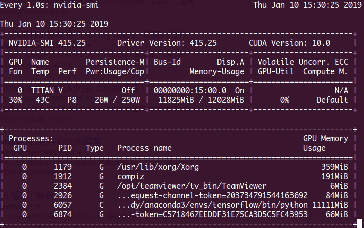

# 深度学习算法安装和环境设置

1. [监视GPU和CPU资源利用情况](#监视gpu和cpu资源利用情况)    
2. [Python项目requirements.txt的生成和使用](#python项目requirements.txt的生成和使用)    
3. [Faster R-CNN编译问题](#faster-r-cnn编译问题)    

---
## 监视GPU和CPU资源利用情况
**监视GPU资源利用情况：**   
```shell
watch -n 1 nvidia-smi #每隔一秒刷新一下GPU资源情况
```

**或者**   
```shell
nvtop
```
`nvtop`需要源码安装，[Github地址](https://github.com/Syllo/nvtop)。   


**监视CPU资源利用情况**    
CPU监视可以用自带的`top`命令查看，但是推荐使用`htop`来显示，首先需要安装`htop`:    
```shell
sudo apt-get install htop
```
然后输入以下命令显示CPU资源利用情况:    
```shell
htop
```

---
## Python项目requirements.txt的生成和使用
我们做开发时为何需要对依赖库进行管理？当依赖类库过多时，如何管理类库的版本？    
`Python`提供通过`requirements.txt`文件来进行项目中依赖的三方库进行整体安装导入。   

首先看一下`requirements.txt`的格式:    
```vim
requests==1.2.0
Flask==0.10.1
```
Python安装依赖库使用pip可以很方便的安装，如果我们需要迁移一个项目，那我们就需要导出项目中依赖的所有三方类库的版本、名称等信息。   

接下来就看Python项目如何根据`requirements.txt`文件来安装三方类库    

### 1. 生成requirements.txt    
- #### 方法一：pip freeze    
*使用`pip freeze`生成`requirements.txt`*    
```bash
pip freeze > requirements.txt
```
`pip freeze`命令输出的格式和`requirements.txt`文件内容格式完全一样，因此我们可以将`pip freeze`的内容输出到文件`requirements.txt`中。在其他机器上可以根据导出的`requirements.txt`进行包安装。    

**注意**：`pip freeze`输出的是本地环境中所有三方包信息，但是会比`pip list`少几个包，因为`pip，wheel，setuptools`等包，是自带的而无法`(un)install`的，如果要显示所有包可以加上参数`-all`，即`pip freeze -all`。    

- #### 方法二：pipreqs
*使用`pipreqs`生成`requirements.txt`*    

首先先安装`pipreqs`:    
```bash
pip install pipreqs
```
使用`pipreqs`生成`requirements.txt`:   
```bash
pipreqs ./
```
**注意**：pipreqs生成指定目录下的依赖类库

- #### 上面两个方法的区别？    
使用`pip freeze`保存的是**当前Python环境**下**所有**的类库，如果你没有用`virtualenv`来对`Python`环境做虚拟化的话，类库就会很杂很多，在对项目进行迁移的时候我们只需关注项目中使用的类库，没有必要导出所有安装过的类库，因此我们一般迁移项目不会使用`pipreqs`，`pip freeze`更加适合迁移**整个python环境**下安装过的类库时使用。(不知道`virtualenv`是什么或者不会使用它的可以查看：《构建`Python`多个虚拟环境来进行不同版本开发之神器-virtualenv》)。    

使用`pipreqs`它会根据**当前目录**下的项目的依赖来导出三方类库，因此常用与项目的迁移中。    

**这就是pip freeze、pipreqs的区别，前者是导出Python环境下所有安装的类库，后者导出项目中使用的类库。**


### 2. 根据requirements.txt安装依赖库    
如果要安装`requirements.txt`中的类库内容，那么你可以执行:    
```bash
pip install -r requirements.txt
```

---
## Faster R-CNN编译问题
1. Clone the Faster R-CNN repository
```shell
# Make sure to clone with --recursive
git clone --recursive https://github.com/rbgirshick/py-faster-rcnn.git
```
or find it in [`src/algorithm/py-faster-rcnn.zip`](ai/py-faster-rcnn.zip) and unzip it.

1. Build the Cython modules
```shell
cd $FRCN_ROOT/lib
make
```

3. Build Caffe and pycaffe
若使用的CUDA 9.0以上，需要将 `/caffe-fast-rcnn/include/caffe/util/cudnn*` 、`/caffe-fast-rcnn/include/caffe/layers/cudnn*` 、`/caffe-fast-rcnn/src/caffe/util/cudnn*` 以及 `/caffe-fast-rcnn/src/caffe/layers/cudnn*` 用**caffe**下的同名替换。  
```shell
cd $FRCN_ROOT/caffe-fast-rcnn
# Now follow the Caffe installation instructions here:
#   http://caffe.berkeleyvision.org/installation.html

# or copy the following:
## Refer to http://caffe.berkeleyvision.org/installation.html
# Contributions simplifying and improving our build system are welcome!

# cuDNN acceleration switch (uncomment to build with cuDNN).
USE_CUDNN := 1

# CPU-only switch (uncomment to build without GPU support).
# CPU_ONLY := 1

# Uncomment if you're using OpenCV 3
OPENCV_VERSION := 3
# To customize your choice of compiler, uncomment and set the following.
# N.B. the default for Linux is g++ and the default for OSX is clang++
CUSTOM_CXX := g++

# CUDA directory contains bin/ and lib/ directories that we need.
CUDA_DIR := /usr/local/cuda
# On Ubuntu 14.04, if cuda tools are installed via
# "sudo apt-get install nvidia-cuda-toolkit" then use this instead:
# CUDA_DIR := /usr

# CUDA architecture setting: going with all of them.
# For CUDA < 6.0, comment the *_50 through *_61 lines for compatibility.
# For CUDA < 8.0, comment the *_60 and *_61 lines for compatibility.
# For CUDA >= 9.0, comment the *_20 and *_21 lines for compatibility.
CUDA_ARCH := -gencode arch=compute_30,code=sm_30 \
		-gencode arch=compute_35,code=sm_35 \
		-gencode arch=compute_50,code=sm_50 \
		-gencode arch=compute_52,code=sm_52 \
		-gencode arch=compute_60,code=sm_60 \
		-gencode arch=compute_61,code=sm_61 \
		-gencode arch=compute_61,code=compute_61

# BLAS choice:
# atlas for ATLAS (default)
# mkl for MKL
# open for OpenBlas
BLAS := atlas
# Custom (MKL/ATLAS/OpenBLAS) include and lib directories.
# Leave commented to accept the defaults for your choice of BLAS
# (which should work)!
# BLAS_INCLUDE := /path/to/your/blas
# BLAS_LIB := /path/to/your/blas

# This is required only if you will compile the matlab interface.
# MATLAB directory should contain the mex binary in /bin.
# MATLAB_DIR := /usr/local
# MATLAB_DIR := /Applications/MATLAB_R2012b.app

# NOTE: this is required only if you will compile the python interface.
# We need to be able to find Python.h and numpy/arrayobject.h.
PYTHON_INCLUDE := /usr/include/python2.7 \
		/usr/lib/python2.7/dist-packages/numpy/core/include
# Anaconda Python distribution is quite popular. Include path:
# Verify anaconda location, sometimes it's in root.
# ANACONDA_HOME := $(HOME)/anaconda
# PYTHON_INCLUDE := $(ANACONDA_HOME)/include \
		# $(ANACONDA_HOME)/include/python2.7 \
		# $(ANACONDA_HOME)/lib/python2.7/site-packages/numpy/core/include \

# We need to be able to find libpythonX.X.so or .dylib.
PYTHON_LIB := /usr/lib
# PYTHON_LIB := $(ANACONDA_HOME)/lib

# Uncomment to support layers written in Python (will link against Python libs)
# This will require an additional dependency boost_regex provided by boost.
WITH_PYTHON_LAYER := 1

# Whatever else you find you need goes here.
INCLUDE_DIRS := $(PYTHON_INCLUDE) /usr/local/include /usr/include/hdf5/serial/
LIBRARY_DIRS := $(PYTHON_LIB) /usr/local/lib /usr/lib /usr/lib/x86_64-linux-gnu /usr/lib/x86_64-linux-gnu/hdf5/serial

# Uncomment to use `pkg-config` to specify OpenCV library paths.
# (Usually not necessary -- OpenCV libraries are normally installed in one of the above $LIBRARY_DIRS.)
# USE_PKG_CONFIG := 1

BUILD_DIR := build
DISTRIBUTE_DIR := distribute

# Uncomment for debugging. Does not work on OSX due to https://github.com/BVLC/caffe/issues/171
# DEBUG := 1

# The ID of the GPU that 'make runtest' will use to run unit tests.
TEST_GPUID := 0

# enable pretty build (comment to see full commands)
Q ?= @
```
然后，编译安装：
```shell
make -j8 && make pycaffe
```

4. Download pre-computed Faster R-CNN detectors
```shell
cd $FRCN_ROOT
./data/scripts/fetch_faster_rcnn_models.sh
```