# Ubuntu FAQ

[**Ubuntu FAQ**](#ubuntu-faq)
  - [**Awesome Linux Software**](#awesome-linux-software)
  - [Linux环境变量初始化与对应文件的生效顺序](#linux环境变量初始化与对应文件的生效顺序)
  - [**Docke**r安装与使用](#docker安装与使用)
    - [Docker安装](#docker安装)
    - [Docker使用](#docker使用)
  - [**Linuxbrew**安装](#linuxbrew安装)
    - [安装linuxbrew](#安装linuxbrew)
    - [linuxbrew必装包](#linuxbrew必装包)
    - [brew常用命令](#brew常用命令)
    - [linuxbrew注意事项](#linuxbrew注意事项)
  - [监视GPU和CPU资源利用情况](#监视gpu和cpu资源利用情况)
  - [Ubuntu每次开机后提示检测到系统程序出现问题的解决方法](#ubuntu每次开机后提示检测到系统程序出现问题的解决方法)
  - [Ubuntu循环登陆问题](#ubuntu循环登陆问题)
  - [文件夹打开缓慢](#文件夹打开缓慢)
  - [安装python依赖库](#安装python依赖库)
    - [Python基础库安装](#python基础库安装)
    - [Python项目requirements文件的生成和使用](#python项目requirements文件的生成和使用)
  - [安装**Chrome**浏览器](#安装chrome浏览器)
  - [pip **/** pip3常见报错](#pip和pip3常见报错)
  - [Ubuntu 16下安装spyder3](#ubuntu-16下安装spyder3)
  - [安装Teamviewer](#安装teamviewer)
  - [安装搜狗输入法](#安装搜狗输入法)
  - [WPS设置](#wps设置)
    - [解决WPS启动提示字体未安装错误](#解决wps启动提示字体未安装错误)
    - [WPS切换显示语言](#wps切换显示语言)
    - [WPS不能输入中文](#wps不能输入中文)
  - [安装赛睿霜冻之蓝v2驱动](#安装赛睿霜冻之蓝v2驱动)
  - [**zsh** **oh-my-zsh**默认shell的最佳替代品](#zsh-oh-my-zsh默认shell的最佳替代品)
    - [查看系统shell环境](#查看系统shell环境)
    - [安装**zsh**](#安装zsh)
    - [安装**vimrc**](#安装vimrc)
    - [安装**oh-my-zsh**](#安装oh-my-zsh)
    - [安装**autojump**](#安装autojump)
    - [安装**zsh-autosuggestions**](#安装zsh-autosuggestions)
    - [安装**zsh-syntax-highlighting**](#安装zsh-syntax-highlighting)
    - [安装**zsh-completions**](#安装zsh-completions)
    - [安装**zsh-history-substring-search**](#安装zsh-history-substring-search)
    - [安装**scm_breeze**](#安装scm-breeze)
    - [安装**colorls**](#安装colorls)
    - [安装**fzf**](#安装fzf)
    - [安装**navi**](#安装navi)
  - [**vim**配置](#vim配置)
    - [**YouCompleteMe**实现vim自动补全](#youcompleteme实现vim自动补全)
    - [**TabNine**实现vim自动补全](#tabnine实现vim自动补全)
    - [vim最终配置](#vim最终配置)
  - [**Tmux**配置与使用](#tmux配置与使用)
    - [Tmux配置](#tmux配置)
    - [Tmux使用手册](#tmux使用手册)
  - [远程连接Ubuntu](#远程连接ubuntu)
  - [**Sublime Text 3**配置问题](#sublime-text-3配置问题)
  - [**VSCode**配置问题](#vscode配置问题)
    - [**Awesome VScode Plugin**](#awesome-vscode-plugin)
    - [VScode Tips](#vscode-tips)
    - [Ubuntu VScode配置Cpp编译环境](#ubuntu-vscode配置cpp编译环境)
    - [VScode环境配置](#vscode环境配置)
  - [Ubuntu查看和关闭进程](#ubuntu查看和关闭进程)
  - [Ubuntu后台执行命令](#ubuntu后台执行命令)
  - [Ubuntu程序开机自启](#ubuntu程序开机自启)
    - [修改系统启动文件](#修改系统启动文件)
    - [Startup Applications](#startup-applications)
  - [查看系统状态](#查看系统状态)
  - [彻底卸载软件](#彻底卸载软件)
  - [截图快捷键](#截图快捷键)
  - [**Ubuntu 美化**](#ubuntu-美化)
    - [Unity环境](#unity环境)
    - [GNOME环境](#gnome环境)
  - [Ubuntu启动后GUI界面卡住不动](#ubuntu启动后gui界面卡住不动)
  - [Ubuntu1804使用过程中常遇到的问题](#ubuntu1804使用过程中长遇到的问题)
---
## Awesome Linux Software
- [Visual Studio Code](https://code.visualstudio.com/download)    
    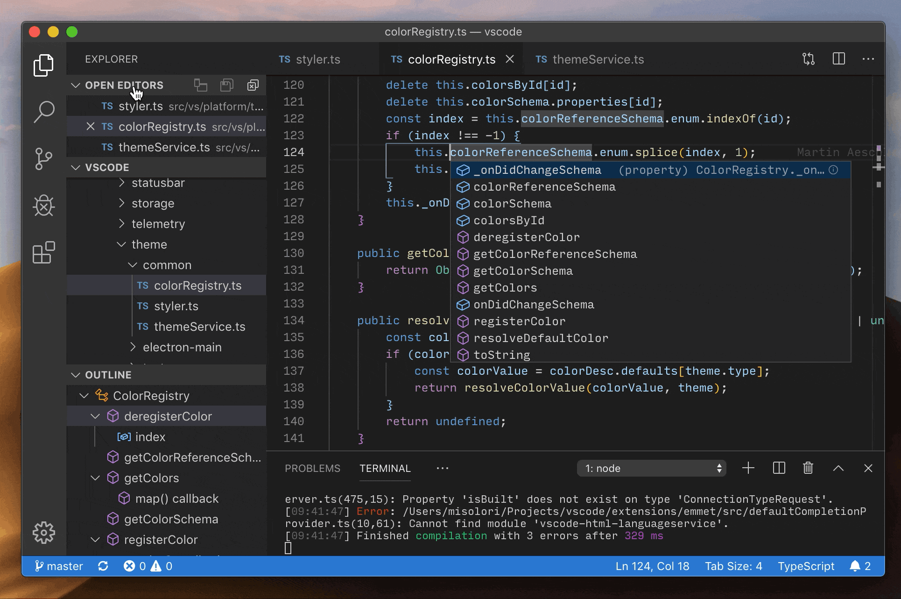
- [Chrome](https://www.google.com/intl/zh-CN/chrome/)
- [mpv media player](https://mpv.io/installation/)
  ```shell
  sudo add-apt-repository ppa:mc3man/mpv-tests
  sudo apt-get update
  sudo apt-get install mpv
  ```
- [WPS](https://www.wps.cn/)
- [Sublime Text](https://www.sublimetext.com/)
- [Beyond Compare](https://www.scootersoftware.com/download.php)
- [Wireshark](https://www.wireshark.org/)
- [kolourpaint](http://www.kolourpaint.org/)    
    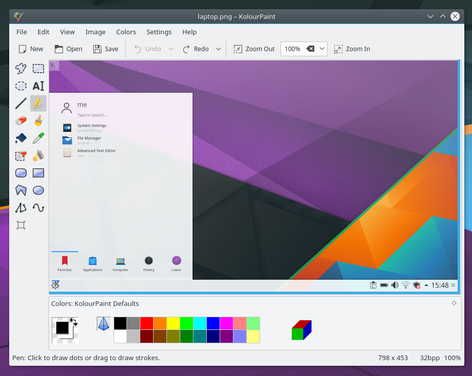
    ```shell
    sudo apt-get install kolourpaint4
    ```
- **tree**
  ```sh
  $ tree
  .
  ├── training
  │   ├── image_2
  │   │   ├── 000000.jpeg
  │   │   ├── 000001.jpeg
  │   │   ├── 000002.jpeg
  │   │   ├── 000003.jpeg
  │   │   ├── 000004.jpeg
  │   │   └── 000005.jpeg
  │   └── label_2
  │       ├── 000000.txt
  │       ├── 000001.txt
  │       ├── 000002.txt
  │       ├── 000003.txt
  │       ├── 000004.txt
  │       └── 000005.txt
  ├── train.txt
  └── val.txt
  ```
- **silversearcher-ag** : 比grep更快
- **cloc** ： 统计代码

---
## Docker安装与使用
### 安装环境
```
OS：Ubuntu 18.04 64 bit
显卡：NVidia GTX 2080 Ti x 2
CUDA：10.0
cnDNN：7.4
```
### 配置Docker源
```sh
# 更新源
$ sudo apt update

# 启用HTTPS
$ sudo apt install -y \
    apt-transport-https \
    ca-certificates \
    curl \
    gnupg-agent \
    software-properties-common

# 添加GPG key
$ curl -fsSL https://download.docker.com/linux/ubuntu/gpg | sudo apt-key add -

# 添加稳定版的源
$ sudo add-apt-repository \
   "deb [arch=amd64] https://download.docker.com/linux/ubuntu \
   $(lsb_release -cs) \
   stable"
```
### 安装Docker CE
此刻Docker版本需要19.03，此后可能需要更新。
```sh
# 更新源
$ sudo apt update

# 安装Docker CE
$ sudo apt install -y docker-ce
```
如果这种方式安装失败，也有解决方案。
报错时屏幕上会显示下载失败的deb文件，想办法下载下来，然后挨个手动安装就好。

此刻我需要下载的是下面三个文件，此后更新为当时最新版本即可：
```sh
containerd.io_1.2.6-3_amd64.deb
docker-ce-cli_19.03.03-0ubuntu-bionic_amd64.deb
docker-ce_19.03.03-0ubuntu-bionic_amd64.deb
```
手动依次安装：
```sh
$ sudo dpkg -i containerd.io_1.2.6-3_amd64.deb
$ sudo dpkg -i docker-ce-cli_19.03.0~3-0~ubuntu-bionic_amd64.deb
$ sudo dpkg -i docker-ce_19.03.0~3-0~ubuntu-bionic_amd64.deb
```
### 验证Docker CE
如果出现下面的内容，说明安装成功。
```sh
$ sudo docker run hello-world

Unable to find image 'hello-world:latest' locally
latest: Pulling from library/hello-world
1b930d010525: Pull complete
Digest: sha256:2557e3c07ed1e38f26e389462d03ed943586f744621577a99efb77324b0fe535
Status: Downloaded newer image for hello-world:latest

Hello from Docker!
This message shows that your installation appears to be working correctly.

To generate this message, Docker took the following steps:
 1. The Docker client contacted the Docker daemon.
 2. The Docker daemon pulled the "hello-world" image from the Docker Hub.
    (amd64)
 3. The Docker daemon created a new container from that image which runs the
    executable that produces the output you are currently reading.
 4. The Docker daemon streamed that output to the Docker client, which sent it
    to your terminal.

To try something more ambitious, you can run an Ubuntu container with:
 $ docker run -it ubuntu bash

Share images, automate workflows, and more with a free Docker ID:
 https://hub.docker.com/

For more examples and ideas, visit:
 https://docs.docker.com/get-started/
```

## Linux环境变量初始化与对应文件的生效顺序
### Linux的变量种类
按变量的生存周期划分：
- `永久的`：需要修改配置文件，变量永久生效。
- `临时的`：使用export命令声明即可，变量在关闭shell时失效。

在配置永久环境变量时，又可以按照作用范围分为:
- `用户环境变量`
- `系统环境变量`

系统环境变量对所有系统用户都有效，用户环境变量仅仅对当前的用户有效。

### 设置环境变量
#### 直接运行`export`命令定义变量
  在shell的命令行下直接使用[export 变量名=变量值] 定义变量。该变量只在当前的shell（BASH）或其子shell（BASH）下是有效的，shell关闭了，变量也就失效了，再打开新shell时就没有这个变量，需要使用的话还需要重新定义。

####  修改系统环境变量
  系统环境变量一般保存在下面的文件中

- `/etc/profile` : 全局（公有）配置，不管是哪个用户，登录时都会读取该文件。
- `/etc/bash.bashrc` : 它也是全局（公有）的 bash执行时，不管是何种方式，都会读取此文件。
- `/etc/environment` : 不要轻易修改此文件

#### 修改用户环境变量
用户环境变量通常被存储在下面的文件中：

- `~/.profile`
  若bash是以login方式执行时，读取~/.bash_profile，若它不存在，则读取~/.bash_login，若前两者不存在，读取~/.profile。

- `~/.bash_profile` 或者 `~./bash_login`
  若bash是以login方式执行时，读取`~/.bash_profile`，若它不存,则读取`~/.bash_login`，若前两者不存在，读取 `~/.profile`。
  只有bash是以login形式执行时，才会读取`.bash_profile`，Unbutu默认没有此文件，可新建。 通常该配置文件还会配置成去读取`~/.bashrc`。

- `~/.bashrc`
  当bash是以non-login形式执行时，读取此文件。若是以login形式执行，则不会读取此文件。

`~/.bash_profile` 是交互式、login 方式进入 bash 运行的
`~/.bashrc` 是交互式 non-login 方式进入 bash 运行的通常二者设置大致相同，所以通常前者会调用后者。

#### 修改环境变量配置文件

如想将一个路径加入到环境变量（例如`$PATH`）中，可以像下面这样做（修改`/etc/profile`）：
```shell
sudo vi /etc/profile
```
以环境变量PATH为例子，环境变量的声明格式：
```shell
PATH=$PATH:PATH_1:PATH_2:PATH_3:...:PATH_N
export PATH
```
你可以自己加上指定的路径，中间用冒号隔开。环境变量更改后，在用户下次登陆时生效，如果想立刻生效，则可执行下面的语句：
```shell
$source /etc/profile
```

### 环境配置文件的区别
#### `profile`、 `bashrc`、`.bash_profile`、 `.bashrc`介绍
bash会在用户登录时，读取下列四个环境配置文件：

- 全局环境变量设置文件：`/etc/profile`、`/etc/bashrc`。
- 用户环境变量设置文件：`~/.bash_profile`、`~/.bashrc`。

**读取顺序：①` /etc/profile` 、② `~/.bash_profile` 、③ `~/.bashrc` 、④ `/etc/bashrc`** 。

- ① `/etc/profile`：此文件为系统的每个用户设置环境信息，系统中每个用户登录时都要执行这个脚本，如果系统管理员希望某个设置对所有用户都生效，可以写在这个脚本里，该文件也会从`/etc/profile.d`目录中的配置文件中搜集shell的设置。
- ② `~/.bash_profile`：每个用户都可使用该文件设置专用于自己的shell信息，当用户登录时，该文件仅执行一次。默认情况下，他设置一些环境变量，执行用户的`.bashrc`文件。
- ③ `~/.bashrc`：该文件包含专用于自己的shell信息，当登录时以及每次打开新shell时，该文件被读取。
- ④ `/etc/bashrc`：为每一个运行bash shell的用户执行此文件，当bash shell被打开时，该文件被读取。    

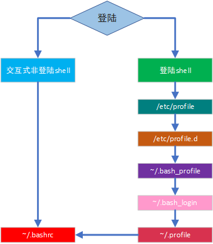

#### `.bashrc`和`.bash_profile`的区别

- `.bash_profile`会用在登陆shell， `.bashrc` 使用在交互式非登陆 shell 。简单说来，它们的区别主要是`.bash_profile`是在你每次登录的时候执行的；`.bashrc`是在你新开了一个命令行窗口时执行的。
- 当通过控制台进行登录（输入用户名和密码）：在初始化命令行提示符的时候会执行`.bash_profile` 来配置你的shell环境。但是如果已经登录到机器，在Gnome或者是KDE也开了一个新的终端窗口（xterm），这时，`.bashrc`会在窗口命令行提示符出现前被执行。当你在终端敲入`/bin/bash`时`.bashrc`也会在这个新的bash实例启动的时候执行。

#### 建议
   大多数的时候你不想维护两个独立的配置文件，一个登录的一个非登录的shell。当你设置PATH时，你想在两个文件都适用。可以在`.bash_profile`中调用`.bashrc`，然后将PATH和其他通用的设置放到`.bashrc`中。
   要做到这几点，添加以下几行到`.bash_profile`中：
```vim
if [ -f ~/.bashrc ]; then
    . ~/.bashrc
fi
```
  现在，当你从控制台登录机器的时候，`.bashrc`就会被执行。


## Docker安装
>警告：切勿在没有配置 Docker APT 源的情况下直接使用 apt 命令安装 Docker.

### 准备工作

#### 系统要求

Docker CE 支持以下版本的 [Ubuntu](https://www.ubuntu.com/server) 操作系统：

* Bionic 18.04 (LTS)
* Xenial 16.04 (LTS)
* Trusty 14.04 (LTS) (Docker CE v18.06 及以下版本)

Docker CE 可以安装在 64 位的 x86 平台或 ARM 平台上。Ubuntu 发行版中，LTS（Long-Term-Support）长期支持版本，会获得 5 年的升级维护支持，这样的版本会更稳定，因此在生产环境中推荐使用 LTS 版本。

#### 卸载旧版本

旧版本的 Docker 称为 `docker` 或者 `docker-engine`，使用以下命令卸载旧版本：

```bash
$ sudo apt-get remove docker \
               docker-engine \
               docker.io
```

#### Ubuntu 14.04 可选内核模块

从 Ubuntu 14.04 开始，一部分内核模块移到了可选内核模块包 (`linux-image-extra-*`) ，以减少内核软件包的体积。正常安装的系统应该会包含可选内核模块包，而一些裁剪后的系统可能会将其精简掉。`AUFS` 内核驱动属于可选内核模块的一部分，作为推荐的 Docker 存储层驱动，一般建议安装可选内核模块包以使用 `AUFS`。

如果系统没有安装可选内核模块的话，可以执行下面的命令来安装可选内核模块包：

```bash
$ sudo apt-get update

$ sudo apt-get install \
    linux-image-extra-$(uname -r) \
    linux-image-extra-virtual
```

#### Ubuntu 16.04 +

Ubuntu 16.04 + 上的 Docker CE 默认使用 `overlay2` 存储层驱动,无需手动配置。

### 使用 APT 安装

由于 `apt` 源使用 HTTPS 以确保软件下载过程中不被篡改。因此，我们首先需要添加使用 HTTPS 传输的软件包以及 CA 证书。

```bash
$ sudo apt-get update

$ sudo apt-get install \
    apt-transport-https \
    ca-certificates \
    curl \
    software-properties-common
```

鉴于国内网络问题，强烈建议使用国内源，官方源请在注释中查看。

为了确认所下载软件包的合法性，需要添加软件源的 `GPG` 密钥。

```bash
$ curl -fsSL https://mirrors.ustc.edu.cn/docker-ce/linux/ubuntu/gpg | sudo apt-key add -


# 官方源
# $ curl -fsSL https://download.docker.com/linux/ubuntu/gpg | sudo apt-key add -
```

然后，我们需要向 `source.list` 中添加 Docker 软件源

```bash
$ sudo add-apt-repository \
    "deb [arch=amd64] https://mirrors.ustc.edu.cn/docker-ce/linux/ubuntu \
    $(lsb_release -cs) \
    stable"


# 官方源
# $ sudo add-apt-repository \
#    "deb [arch=amd64] https://download.docker.com/linux/ubuntu \
#    $(lsb_release -cs) \
#    stable"
```

>以上命令会添加稳定版本的 Docker CE APT 镜像源，如果需要测试或每日构建版本的 Docker CE 请将 stable 改为 test 或者 nightly。

#### 安装 Docker CE

更新 apt 软件包缓存，并安装 `docker-ce`：

```bash
$ sudo apt-get update

$ sudo apt-get install docker-ce
```

### 使用脚本自动安装

在测试或开发环境中 Docker 官方为了简化安装流程，提供了一套便捷的安装脚本，Ubuntu 系统上可以使用这套脚本安装：

```bash
$ curl -fsSL get.docker.com -o get-docker.sh
$ sudo sh get-docker.sh --mirror Aliyun
```

执行这个命令后，脚本就会自动的将一切准备工作做好，并且把 Docker CE 的 Edge 版本安装在系统中。

### 启动 Docker CE

```bash
$ sudo systemctl enable docker
$ sudo systemctl start docker
```

Ubuntu 14.04 请使用以下命令启动：

```bash
$ sudo service docker start
```

### 建立 docker 用户组

默认情况下，`docker` 命令会使用 [Unix socket](https://en.wikipedia.org/wiki/Unix_domain_socket) 与 Docker 引擎通讯。而只有 `root` 用户和 `docker` 组的用户才可以访问 Docker 引擎的 Unix socket。出于安全考虑，一般 Linux 系统上不会直接使用 `root` 用户。因此，更好地做法是将需要使用 `docker` 的用户加入 `docker` 用户组。

建立 `docker` 组：

```bash
$ sudo groupadd docker
```

将当前用户加入 `docker` 组：

```bash
$ sudo usermod -aG docker $USER
```

退出当前终端并重新登录，进行如下测试。

### 测试 Docker 是否安装正确

```bash
$ docker run hello-world

Unable to find image 'hello-world:latest' locally
latest: Pulling from library/hello-world
d1725b59e92d: Pull complete
Digest: sha256:0add3ace90ecb4adbf7777e9aacf18357296e799f81cabc9fde470971e499788
Status: Downloaded newer image for hello-world:latest

Hello from Docker!
This message shows that your installation appears to be working correctly.

To generate this message, Docker took the following steps:
 1. The Docker client contacted the Docker daemon.
 2. The Docker daemon pulled the "hello-world" image from the Docker Hub.
    (amd64)
 3. The Docker daemon created a new container from that image which runs the
    executable that produces the output you are currently reading.
 4. The Docker daemon streamed that output to the Docker client, which sent it
    to your terminal.

To try something more ambitious, you can run an Ubuntu container with:
 $ docker run -it ubuntu bash

Share images, automate workflows, and more with a free Docker ID:
 https://hub.docker.com/

For more examples and ideas, visit:
 https://docs.docker.com/get-started/
```

若能正常输出以上信息，则说明安装成功。

### 镜像加速

如果在使用过程中发现拉取 Docker 镜像十分缓慢，可以配置 Docker [国内镜像加速](mirror.md)。

## Docker使用

### 拉取镜像
```shell
docker pull nvidia/cuda:10.2-cudnn7-devel-ubuntu18.04
```
### 创建容器
```shell
docker creat --name myDocker --gpus all -it --shm-size=1gb -v /home/andy/DevWorkSpace:~/DevWorkSpace nvidia/cuda:10.2-cudnn7-devel-ubuntu18.04 /bin/bash
```

### 查看本地镜像
```shell
docker images
```

### 删除镜像
```shell
docker rmi nvidia/cuda:10.2-cudnn7-devel-ubuntu18.04
```
### 运行容器
```shell
docker exec -it myDocker /bin/bash
```
### 查看容器运行情况
```shell
docker ps # 查看运行中的容器

docker ps -a # 查看所有容器
```

### 停止容器
```shell
docker stop myDocker
```

### 销毁容器
```shell
docker rm myDocker
```

## docker中常见的错误
1. bash: nvcc: command not found
    To get access to the CUDA development tools, you should use the devel images instead. These are the relevant tags:
    ```vim
    nvidia/cuda:10.2-devel-ubuntu18.04
    nvidia/cuda:10.2-cudnn7-devel-ubuntu18.04
    ```
    These would then give you access to the tools such as nvcc and the cuDNN header files that are required for development.

### 参考文档
> [Docker — 从入门到实践](https://github.com/yeasy/docker_practice)
> [Docker 官方 Ubuntu 安装文档](https://docs.docker.com/install/linux/docker-ce/ubuntu/)


---
## Linuxbrew安装
[*The Homebrew package manager for Linux*](https://linuxbrew.sh/)

### 安装linuxbrew

将以下命令粘贴到命令行中运行:
```bash
sh -c "$(curl -fsSL https://raw.githubusercontent.com/Linuxbrew/install/master/install.sh)"
```
The installation script installs Linuxbrew to `/home/linuxbrew/.linuxbrew` using sudo if possible and in your home directory at` ~/.linuxbrew` otherwise. Linuxbrew does not use sudo after installation. Using `/home/linuxbrew/.linuxbrew` allows the use of more binary packages (bottles) than installing in your personal home directory.

Follow the Next steps instructions to add Linuxbrew to your `PATH` and to your bash shell profile script, either `~/.profile` on Debian/Ubuntu or `~/.bash_profile` on CentOS/Fedora/RedHat.
```bash
test -d ~/.linuxbrew && eval $(~/.linuxbrew/bin/brew shellenv)
test -d /home/linuxbrew/.linuxbrew && eval $(/home/linuxbrew/.linuxbrew/bin/brew shellenv)
test -r ~/.profile && echo "eval \$($(brew --prefix)/bin/brew shellenv)" >>~/.profile
echo "eval \$($(brew --prefix)/bin/brew shellenv)" >>~/.profile
source ~/.profile
```

You're done! Try installing a package:
```bash
brew install hello
```
If you're using an older distribution of Linux, installing your first package will also install a recent version of glibc and gcc. Use brew doctor to troubleshoot common issues.

### linuxbrew必装包
- git
- wget
- vim

### brew常用命令
- `brew shellenv`
  Prints export statements - run them in a shell and this installation of Homebrew will be included into your PATH, MANPATH and INFOPATH.

  HOMEBREW_PREFIX, HOMEBREW_CELLAR and HOMEBREW_REPOSITORY are also exported to save multiple queries of those variables.

  Consider adding evaluating the output in your dotfiles (e.g. ~/.profile) with eval $(brew shellenv)

  ```
  brew shellenv
  ```
  ```bash
  export HOMEBREW_PREFIX="/home/linuxbrew/.linuxbrew"
  export HOMEBREW_CELLAR="/home/linuxbrew/.linuxbrew/Cellar"
  export HOMEBREW_REPOSITORY="/home/linuxbrew/.linuxbrew/Homebrew"
  export PATH="/home/linuxbrew/.linuxbrew/bin:/home/linuxbrew/.linuxbrew/sbin:$PATH"
  export MANPATH="/home/linuxbrew/.linuxbrew/share/man:$MANPATH"
  export INFOPATH="/home/linuxbrew/.linuxbrew/share/info:$INFOPATH"
  ```
- `brew install xxx`
  安装xxx软件
- `brew uninstall xxx`
  卸载xxx软件
- `brew search xxx`
  搜索xxx软件

### linuxbrew注意事项
假如用`linuxbrew`安装的`Python`会替换系统默认的`Python`。若需要还原则需要将`~/.profile`文件中的`eval $(/home/linuxbrew/.linuxbrew/bin/brew shellenv)`这一行屏蔽:
```shell
# linuxbrew
#eval $(/home/linuxbrew/.linuxbrew/bin/brew shellenv)
```
然后重启电脑.

---

## 监视GPU和CPU资源利用情况
**监视GPU资源利用情况：**
```shell
watch -n 1 nvidia-smi #每隔一秒刷新一下GPU资源情况
```
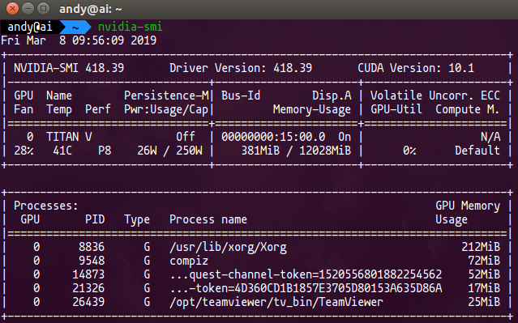
**或者**
```shell
nvtop
```
`nvtop`需要源码安装，[Github地址](https://github.com/Syllo/nvtop)。    
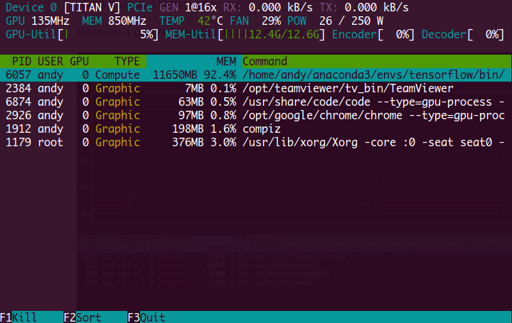

**监视CPU资源利用情况**
CPU监视可以用自带的`top`命令查看，但是推荐使用`htop`来显示，首先需要安装`htop`:
```shell
sudo apt-get install htop
```
然后输入以下命令显示CPU资源利用情况:
```shell
htop
```    
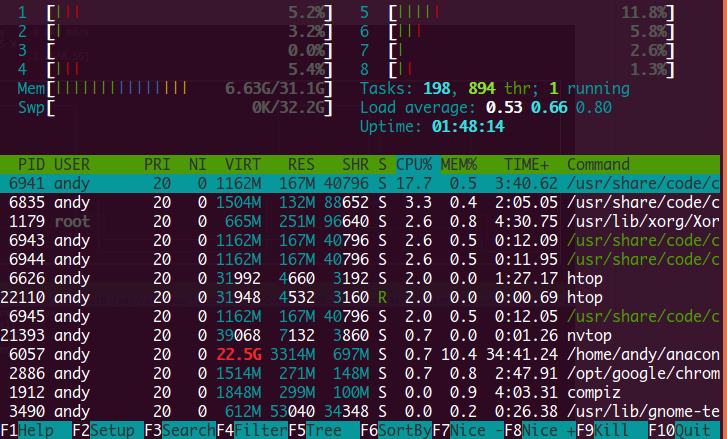


---
## Ubuntu每次开机后提示检测到系统程序出现问题的解决方法
首先，错误报告存放位置:
```bash
cd /var/crash/
ls #可以查看错误报告
sudo rm /var/crash/* #删除该目录下的所有文件
```
但是，这只是删除掉的是错误报告，如果系统再有什么崩溃，又会再报错。

---
## Ubuntu循环登陆问题
### 问题描述
登录Ubuntu的时候在输入密码和登录桌面之间反复循环。

### 原因
安装软件的时候破坏了NVIDIA驱动导致。

### 解决方法
1. 进入linux的shell
在登录界面进入linux的shell（`ctrl + Alt + F1`），输入用户名、密码，进入shell。
关闭图形界面，命令为:
```bash
sudo service lightdm stop #或者 sudo /etc/init.d/lightdm stop
#sudo apt-get autoremove #有可能需要
```
2. 卸载NVIDIA驱动:
```bash
sudo apt-get purge nvidia*
```
或者:
```bash
sudo PATH_TO_NVIDIA_DRIVE/NVIDIA-Linux-x86_64-xxx.run --uninstall
```
3. 重新安装NVIDIA驱动:
```bash
sudo apt-get install nvidia-390 nvidia-settings nvidia-prime #nvidia-390可以替换为其他版本
```
或者:
```bash
sudo PATH_TO_NVIDIA_DRIVER/NVIDIA-Linux-x86_64-xxx.run --no-opengl-files
```
**.run**安装过程选项为:
```vim
在NVIDIA驱动安装过程中，依次的选项为：
1 accept
2 The distribution-provided pre-install script failed … …
Continue installation
3 Would you like to run the nvidia-xconfig utility to automatically update your X Configuration file so set the NVIDIA X driver will be used when you restart X?
NO
4 Install 32-Bit compatibility libraries?
NO
```
4. 打开图形界面，命令为:
```bash
sudo service lightdm start #或者sudo /etc/init.d/lightdm start
```
---
## 文件夹打开缓慢
经常会遇到打开Ubuntu文件夹资源管理器的时候卡住，必须得重启才能解决，现在临时的解决方法是:
```shell
sudo apt-get install thunar thunar-archive-plugin
```

---
## 安装python依赖库

### Python基础库安装
**注意**：`Python2` 的话用`pip`安装，`Python3`用`pip3`安装（总之要知道安装在哪里，有的系统将`python`软连接到`Python3`上了）
```shell
pip install scipy \
            pandas \
            numpy \
            scikit-image \
            scikit-learn \
            matplotlib \
            pandas \
            tqdm \
            Pillow
```
`Anaconda`虚拟环境中首先激活虚拟环境，然后用`conda`安装依赖包:
```shell
conda install jupyter notebook \
              scipy \
              pandas \
              numpy \
              scikit-image \
              cikit-learn \
              matplotlib \
              pandas \
              tqdm \
              Pillow
```
**DGX-ONE**服务器下安装：
```shell
apt-get install scipy
apt-get install numpy
apt-get install python-skimage(install skimage)
(pspnet): install matio
```

### Python项目requirements文件的生成和使用
我们做开发时为何需要对依赖库进行管理？当依赖类库过多时，如何管理类库的版本？
`Python`提供通过`requirements.txt`文件来进行项目中依赖的三方库进行整体安装导入。

首先看一下`requirements.txt`的格式:
```vim
requests==1.2.0
Flask==0.10.1
```
Python安装依赖库使用pip可以很方便的安装，如果我们需要迁移一个项目，那我们就需要导出项目中依赖的所有三方类库的版本、名称等信息。

接下来就看Python项目如何根据`requirements.txt`文件来安装三方类库

#### 1. 生成requirements.txt
- #### 方法一：pip freeze
*使用`pip freeze`生成`requirements.txt`*
```bash
pip freeze > requirements.txt
```
`pip freeze`命令输出的格式和`requirements.txt`文件内容格式完全一样，因此我们可以将`pip freeze`的内容输出到文件`requirements.txt`中。在其他机器上可以根据导出的`requirements.txt`进行包安装。

**注意**：`pip freeze`输出的是本地环境中所有三方包信息，但是会比`pip list`少几个包，因为`pip，wheel，setuptools`等包，是自带的而无法`(un)install`的，如果要显示所有包可以加上参数`-all`，即`pip freeze -all`。

- #### 方法二：pipreqs
*使用`pipreqs`生成`requirements.txt`*

首先先安装`pipreqs`:
```bash
pip install pipreqs
```
使用`pipreqs`生成`requirements.txt`:
```bash
pipreqs ./
```
**注意**：pipreqs生成指定目录下的依赖类库

**上面两个方法的区别？**
使用`pip freeze`保存的是**当前Python环境**下**所有**的类库，如果你没有用`virtualenv`来对`Python`环境做虚拟化的话，类库就会很杂很多，在对项目进行迁移的时候我们只需关注项目中使用的类库，没有必要导出所有安装过的类库，因此我们一般迁移项目不会使用`pipreqs`，`pip freeze`更加适合迁移**整个python环境**下安装过的类库时使用。(不知道`virtualenv`是什么或者不会使用它的可以查看：《构建`Python`多个虚拟环境来进行不同版本开发之神器-virtualenv》)。

使用`pipreqs`它会根据**当前目录**下的项目的依赖来导出三方类库，因此常用与项目的迁移中。

**这就是pip freeze、pipreqs的区别，前者是导出Python环境下所有安装的类库，后者导出项目中使用的类库。**


#### 2. 根据requirements.txt安装依赖库
如果要安装`requirements.txt`中的类库内容，那么你可以执行:
```bash
pip install -r requirements.txt
```

---
## 安装chrome浏览器
***[参考地址](https://blog.csdn.net/qq_30164225/article/details/54632634)***

将下载源加入系统源列表:
```shell
sudo wget http://www.linuxidc.com/files/repo/google-chrome.list -P /etc/apt/sources.list.d/
```
导入谷歌软件公钥:
```shell
wget -q -O - https://dl.google.com/linux/linux_signing_key.pub | sudo apt-key add -
```
更新源:
```shell
sudo apt-get update
```
安装chrome
```shell
sudo apt-get install google-chrome-stable
```

---
## pip和pip3常见报错
### **问题描述 1**
```shell
$ pip3 --version
Traceback (most recent call last):
  File "/usr/bin/pip3", line 5, in <module>
    from pkg_resources import load_entry_point
  File "/usr/lib/python3/dist-packages/pkg_resources.py", line 2708, in <module>
    working_set.require(__requires__)
  File "/usr/lib/python3/dist-packages/pkg_resources.py", line 686, in require
    needed = self.resolve(parse_requirements(requirements))
  File "/usr/lib/python3/dist-packages/pkg_resources.py", line 584, in resolve
    raise DistributionNotFound(req)
pkg_resources.DistributionNotFound: pip==1.5.6
```
**解决方法**
```shell
sudo python3 get-pip.py
sudo python3 ez_setup.py
```
其中[get-pip.py](./fix_pip/get-pip.py)和[ez_setup.py](./fix_pip/ez_setup-pip.py)文件在[`src/fix_pip`](./fix_pip/)文件夹中。

### **问题描述 2**
```shell
Error checking for conflicts.
Traceback (most recent call last):
  File "/home/andy/.local/lib/python3.5/site-packages/pip/_vendor/pkg_resources/__init__.py", line 2584, in version
    return self._version
  File "/home/andy/.local/lib/python3.5/site-packages/pip/_vendor/pkg_resources/__init__.py", line 2691, in __getattr__
    raise AttributeError(attr)
AttributeError: _version

During handling of the above exception, another exception occurred:

Traceback (most recent call last):
  File "/home/andy/.local/lib/python3.5/site-packages/pip/_internal/commands/install.py", line 503, in _warn_about_conflicts
    package_set, _dep_info = check_install_conflicts(to_install)
  File "/home/andy/.local/lib/python3.5/site-packages/pip/_internal/operations/check.py", line 108, in check_install_conflicts
    package_set, _ = create_package_set_from_installed()
  File "/home/andy/.local/lib/python3.5/site-packages/pip/_internal/operations/check.py", line 47, in create_package_set_from_installed
    package_set[name] = PackageDetails(dist.version, dist.requires())
  File "/home/andy/.local/lib/python3.5/site-packages/pip/_vendor/pkg_resources/__init__.py", line 2589, in version
    raise ValueError(tmpl % self.PKG_INFO, self)
ValueError: ("Missing 'Version:' header and/or METADATA file", Unknown [unknown version] (/home/andy/.local/lib/python3.5/site-packages))
```    
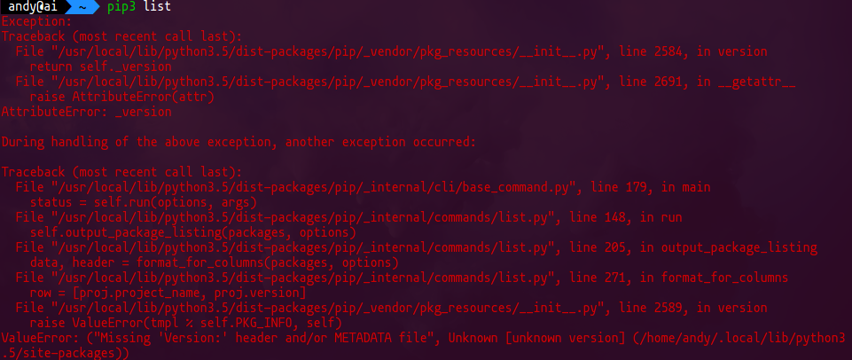

**解决方法**
运行以下代码，查看`site-packages`下的文件夹， 删除以 `-` 开头的文件夹:
```shell
python3 -c "import site; print(site.getsitepackages())"
```

到报错文件夹下(这里是`/home/andy/.local/lib/python3.5/site-packages`)删除 `-` 开头的文件夹，然后重新执行 `pip3 list` .
我这里是 `-pencv_python-3.4.3.18.dist-info` ：
```shell
rm -rf  ./-pencv_python-3.4.3.18.dist-info
```
然后 `pip3 list` 正常了.

---
## Ubuntu 16下安装spyder3
安装pip3：
```shell
sudo apt install python3-pip
```
安装 Spyder 最新版本，目前即为 Spyder 3：
```shell
pip3 install -U spyder
```
命令行下运行即可：
```shell
spyder3
```
若运行时发现报错：`qtpy.PythonQtError: No Qt bindings could be found`
那就安装 pyqt5（目前最新为5）……：$
```shell
pip3 install -U pyqt5
```
---
## 安装Teamviewer

1. 卸载旧版本Teamviewer
   ```bash
   sudo apt-get purge teamviewer

    rm -rf ~/.config/teamviewer

    rm -rf ~/.local/share/teamviewer1*
    #rm -rf ~/.local/share/teamviewer13
    ```

2. 安装Teamviewer
   ```shell
   sudo dpkg -i teamviewer_13.2.75536_amd64.deb
   ```

3. Teamviewer安装过程中遇到的问题
    - **Teamviewer 13 安装后Dash启动没有GUI界面**
        进入 `/opt/teamviewer/logfiles/user` 下查看 `gui.log` 信息：
        ```vim
        Cannot mix incompatible Qt library (version 0x50501) with this library (version 0x50c03)
        ```
        进入 `/opt/` 目录下发现多了一个 **qt512** 文件夹，将其删除( `sudo rm -rf /opt/qt512` )再在Dash启动Teamviewer问题就解决了。


---
## 安装搜狗输入法

1. 卸载旧版本搜狗输入法:
    ```bash
    sudo apt-get purge sogoupinyin

    rm -rf ~/.config/sogou-qimpanel
    rm -rf ~/.config/SogouPY
    rm -rf ~/.config/SogouPY.users
    ```

2. [下载linux版搜狗输入法](https://pinyin.sogou.com/linux/?r=pinyin)
3. 命令行运行：
   ```shell
    sudo dpkg -i sogoupinyin_2.2.0.0108_amd64.deb
   ```
4. System Setting -> Language Support -> Keyboard input method system:`fcitx`
5. 状态栏->输入法->打开Fcitx配置窗口，点击`+`去掉`Only Show Current Language`前面对号，然后搜`sogou`添加好，重启电脑即可。    
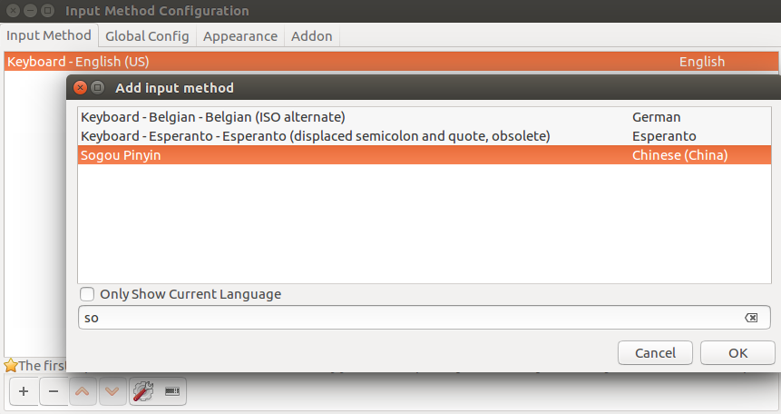
5. 有可能重启后会出现两个输入法图标，解决方法：
   ```shell
   sudo apt-get remove fcitx-ui-qimpanel
   ```

6. 搜狗拼音输入法候选栏乱码解决方法
   ```shell
   cd ~/.config
   sudo rm -rf SogouPY* sogou*
   ```


---
## WPS设置
### 解决WPS启动提示字体未安装错误

首先[下载字体库](wps/wps_symbol_fonts.zip)到本地，然后以下方式任选一个安装字体:

1、解压
```shell
sudo unzip wps_symbol_fonts.zip -d /usr/share/fonts/wps-office
```
解压完成后再次打开WPS就不会看到以上错误。

2、注意：一定要以`wps-office`的文件夹进行保存，如果没有以这样命名，那么可以按照以下方法进行：
```shell
#生成字体的索引信息
sudo mkfontscale
sudo mkfontdir
#运行fc-cache命令更新字体缓存
sudo fc-cache
```
重启WPS即可。

3、这种方式是直接双击字体进行安装，进入到解压出的文件，双击即可。

### WPS切换显示语言
修改WPS的配置文件: `~/.config/Kingsoft/Office.conf`:
```shell
vim ~/.config/Kingsoft/Office.conf
```
在文件开头添加以下内容:
```vim
languages=zh_CN
```    
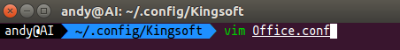    

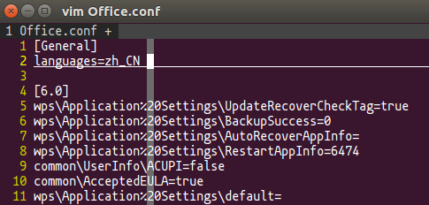    

### WPS不能输入中文
**原因**：环境变量未正确设置。
**解决办法**:
#### WPS文字
打开终端输入：
```shell
sudo vim /usr/bin/wps
```
添加一下文字到打开的文本中（添加到`#!/bin/bash`下面）：
```shell
export XMODIFIERS="@im=fcitx"
export QT_IM_MODULE="fcitx"
```
#### WPS表格
打开终端输入：
```shell
sudo vim /usr/bin/et
```
添加一下文字到打开的文本中（添加到`#!/bin/bash`下面）：
```shell
export XMODIFIERS="@im=fcitx"
export QT_IM_MODULE="fcitx"
```
####  WPS演示
打开终端输入：
```shell
sudo vim /usr/bin/wpp
```
添加一下文字到打开的文本中（添加到`#!/bin/bash`下面）：
```shell
export XMODIFIERS="@im=fcitx"
export QT_IM_MODULE="fcitx"
```
修改完后保存，打开相应的程序切换输入法就可以输入中文了。

---
## 安装赛睿霜冻之蓝v2驱动
先安装依赖项：
```shell
sudo apt-get install build-essential python-dev libusb-1.0-0-dev libudev-dev
```
接着安装驱动：
```shell
sudo pip install rivalcfg
```

---
## zsh oh-my-zsh默认shell的最佳替代品
### 项目地址
- **[zsh](http://www.zsh.org)**
- **[vimrc](https://github.com/amix/vimrc)**
- **[oh-my-zsh](http://ohmyz.sh)**
- **[zsh-autosuggestions](https://github.com/zsh-users/zsh-autosuggestions)**
- **[zsh-syntax-highlighting](https://github.com/zsh-users/zsh-syntax-highlighting)**
- **[zsh-completions](https://github.com/zsh-users/zsh-completions)**
- **[zsh-history-substring-search](https://github.com/zsh-users/zsh-history-substring-search)**
- **[scm_breeze](https://github.com/scmbreeze/scm_breeze)**
- **[colorls](https://github.com/athityakumar/colorls)**


### 查看系统shell环境
查看当前发行版可以使用的`shell`:
```shell
cat /etc/shells
```
查看当前使用的`shell`:
```shell
echo $0
```
查看当前用户(默认)使用的`shell`:
```shell
echo $SHELL
```

### 安装zsh
```shell
sudo apt-get install zsh
```

#### 设置zsh为系统默认shell:
- **为root用户修改默认shell为zsh**
  ```shell
  chsh -s /bin/zsh root
  ```
- **为当前用户修改默认shell为zsh**
  ```shell
  chsh -s /bin/zsh
  # or
  chsh -s `which zsh`
  ```

**重启电脑**后打开 `Terminal` 提示以下内容:
```shell
This is the Z Shell configuration function for new users,
zsh-newuser-install.
You are seeing this message because you have no zsh startup files
(the files .zshenv, .zprofile, .zshrc, .zlogin in the directory
~).  This function can help you with a few settings that should
make your use of the shell easier.

You can:

(q)  Quit and do nothing.  The function will be run again next time.

(0)  Exit, creating the file ~/.zshrc containing just a comment.
     That will prevent this function being run again.

(1)  Continue to the main menu.

(2)  Populate your ~/.zshrc with the configuration recommended
     by the system administrator and exit (you will need to edit
     the file by hand, if so desired).

--- Type one of the keys in parentheses ---
```    
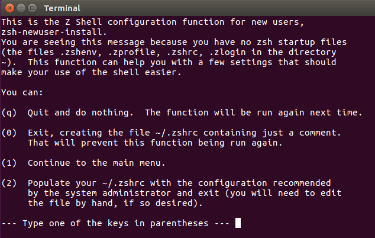
- q: 啥也不做，下次打开终端还提示；
- 0: 退出，创建只包含一条命令的`~/.zshrc`文件，下次打开终端不会提示
- 1: 继续主菜单
- 2: 创建系统推荐的`~/.zshrc`文件配置

一般情况下输入 `0` 即可，`~/.zshrc` 的配置文件用 `oh-my-zsh` 的配置.


#### 恢复bash为系统默认：
```shell
chsh -s /bin/bash
```
#### Zsh不支持通配符(* )匹配和正则表达式解决方法   
在`~/.zshrc`中添加以下内容:    
```shell
# ignore no matches
set -o nonomatch
#setopt nonomatch
```


### 安装vimrc
- **Install for your own user only**
  The awesome version includes a lot of great plugins, configurations and color schemes that make Vim a lot better. To install it simply do following from your terminal:
  ```shell
  git clone --depth=1 https://github.com/amix/vimrc.git ~/.vim_runtime
  sh ~/.vim_runtime/install_awesome_vimrc.sh
  ```
- **Install for multiple users**
  To install for multiple users, the repository needs to be cloned to a location accessible for all the intended users.
  ```shell
  git clone --depth=1 https://github.com/amix/vimrc.git /opt/vim_runtime
  sh ~/.vim_runtime/install_awesome_parameterized.sh /opt/vim_runtime user0 user1 user2
  # to install for all users with home directories
  sh ~/.vim_runtime/install_awesome_parameterized.sh /opt/vim_runtime --all
  ```
Naturally, `/opt/vim_runtime` can be any directory, as long as all the users specified have read access.

**错误处理**
在运行vim的时候提示如下错误：
```vim
vim-go requires Vim 7.4.2009 or Neovim 0.3.1, but you're using an older version.
Please update your Vim for the best vim-go experience.
If you really want to continue you can set this to make the error go away:
    let g:go_version_warning = 0
Note that some features may error out or behave incorrectly.
Please do not report bugs unless you're using Vim 7.4.2009 or newer or Neovim 0.3.1.
```
***解决方法***：
编辑`.vimrc`
```shell
vim ~/.vimrc
```
添加一行
```vim
let g:go_version_warning = 0
```
保存退出 问题解决


### 安装oh-my-zsh
- **via curl**
  ```shell
  sh -c "$(curl -fsSL https://raw.githubusercontent.com/ohmyzsh/ohmyzsh/master/tools/install.sh)"
  ```
- **via wget**
  ```shell
  sh -c "$(wget -O- https://raw.githubusercontent.com/ohmyzsh/ohmyzsh/master/tools/install.sh)"
  ```
- **via fetch**
  ```shell
  sh -c "$(fetch -o - https://raw.githubusercontent.com/ohmyzsh/ohmyzsh/master/tools/install.sh)"
  ```
- **Manual inspection**
  It's a good idea to inspect the install script from projects you don't yet know. You can do that by downloading the install script first, looking through it so everything looks normal, then running it:
  ```shell
  wget https://raw.githubusercontent.com/ohmyzsh/ohmyzsh/master/tools/install.sh
  sh install.sh
  ```
**[主题](https://github.com/ohmyzsh/ohmyzsh/wiki/Themes)**
以安装[powerlevel10k为例](https://github.com/romkatv/powerlevel10k):    
```sh
git clone --depth=1 https://github.com/romkatv/powerlevel10k.git ${ZSH_CUSTOM:-$HOME/.oh-my-zsh/custom}/themes/powerlevel10k
```
Set `ZSH_THEME="powerlevel10k/powerlevel10k"` in `~/.zshrc`.    
配置**powerlevel10k**:    
```sh
p10k configure
```


**在 `~/.zshrc` 配置文件追加以下内容**
```shell
# GO PATH
export GOPATH=$HOME/go
export GOROOT=/usr/local/go
export PATH=$PATH:$GOROOT/bin:$GOPATH/bin

LC_CTYPE=en_US.UTF-8
LC_ALL=en_US.UTF-8

# some more ls aliases
alias ll='ls -alF'
alias la='ls -A'
alias l='ls -CF'
```
**插件**

[Plugins](https://github.com/ohmyzsh/ohmyzsh/wiki/Plugins)

**升级**
```shell
omz update
```

**使用oh-my-zsh后导致的卡顿问题**
现象是每次cd和ll时都会被卡住很长时间根本受不了，最后在官方github查明原因是使用的主题会自动获取git信息，可以使用以下命令禁止zsh自动获取git信息，解决卡顿问题:
```shell
git config --global oh-my-zsh.hide-status 1
```
若想恢复则：
```shell
git config --global oh-my-zsh.hide-status 0
```
### 安装autojump
```sh
sudo apt-get install autojump
```
添加`autojump`到`~/.zshrc`:
```vim
plugins=(
            git
            autojump
        )
```
### 安装zsh-autosuggestions
- **Oh My Zsh**
    1. Clone this repository into $ZSH_CUSTOM/plugins (by default `~/.oh-my-zsh/custom/plugins`):
        ```shell
        git clone https://github.com/zsh-users/zsh-autosuggestions ${ZSH_CUSTOM:-~/.oh-my-zsh/custom}/plugins/zsh-autosuggestions
        ```
    2. Add the plugin to the list of plugins for Oh My Zsh to load (`inside ~/.zshrc`):
        ```vim
        plugins=(
                    git
                    autojump
                    zsh-autosuggestions
                )
        ```
    3. Start a new terminal session.

- **Manual (Git Clone)**
    1. Clone this repository somewhere on your machine. This guide will assume` ~/.zsh/zsh-autosuggestions`:
        ```shell
        git clone https://github.com/zsh-users/zsh-autosuggestions ~/.zsh/zsh-autosuggestions
        ```
    2. Add the following to your `.zshrc`:
        ```shell
        source ~/.zsh/zsh-autosuggestions/zsh-autosuggestions.zsh
        ```
    3. Start a new terminal session.


### 安装zsh-syntax-highlighting
- **Oh-my-zsh**
  1. Clone this repository in **oh-my-zsh**'s plugins directory:
        ```shell
        git clone https://github.com/zsh-users/zsh-syntax-highlighting.git ${ZSH_CUSTOM:-~/.oh-my-zsh/custom}/plugins/zsh-syntax-highlighting
        ```
  2. Activate the plugin in `~/.zshrc`:
        ```shell
        plugins=(
                    git
                    autojump
                    zsh-autosuggestions
                    zsh-syntax-highlighting
                )
        ```
  3. Source `~/.zshrc` to take changes into account:
        ```shell
        source ~/.zshrc
        ```
  4. Update
        ```shell
        cd ${ZSH_CUSTOM:-~/.oh-my-zsh/custom}/plugins/zsh-syntax-highlighting
        git pull
        ```

- **In your ~/.zshrc**
  1. Simply clone this repository and source the script:
        ```shell
        git clone https://github.com/zsh-users/zsh-syntax-highlighting.git
        echo "source ${(q-)PWD}/zsh-syntax-highlighting/zsh-syntax-highlighting.zsh" >> ${ZDOTDIR:-$HOME}/.zshrc
        ```
  2. Then, enable syntax highlighting in the current interactive shell:
        ```shell
        source ./zsh-syntax-highlighting/zsh-syntax-highlighting.zsh
        ```
  If git is not installed, download and extract a snapshot of the latest development tree from:
        ```shell
        wget https://github.com/zsh-users/zsh-syntax-highlighting/archive/master.tar.gz
        ```

  Note the `source` command must be **at the end** of `~/.zshrc`.

### 安装zsh-completions
Clone the repository inside your `oh-my-zsh` repo:
```shell
git clone https://github.com/zsh-users/zsh-completions ${ZSH_CUSTOM:-${ZSH:-~/.oh-my-zsh}/custom}/plugins/zsh-completions
```
Add it to `FPATH` in your `.zshrc` by adding the following line before `source "$ZSH/oh-my-zsh.sh`":
```vim
fpath+=${ZSH_CUSTOM:-${ZSH:-~/.oh-my-zsh}/custom}/plugins/zsh-completions/src
```
### 安装zsh-history-substring-search
1. Clone this repository in `oh-my-zsh's plugins` directory:
  ```shell
  git clone https://github.com/zsh-users/zsh-history-substring-search ${ZSH_CUSTOM:-~/.oh-my-zsh/custom}/plugins/zsh-history-substring-search
  ```
2. Activate the plugin in `~/.zshrc`:
  ```vim
  plugins=( [plugins...]
            zsh-history-substring-search
          )
  ```
3. Source `~/.zshrc` to take changes into account:
  ```shell
  source ~/.zshrc
  ```
### 安装scm-breeze
```bash
git clone git://github.com/scmbreeze/scm_breeze.git ~/.scm_breeze
~/.scm_breeze/install.sh
source ~/.bashrc   # or source "${ZDOTDIR:-$HOME}/.zshrc"
```
The install script creates required default configs and adds the following line to your `.bashrc` or `.zshrc`:
```bash
[ -s "$HOME/.scm_breeze/scm_breeze.sh" ] && source "$HOME/.scm_breeze/scm_breeze.sh"
```
**Note**: You need to install ruby for some SCM Breeze commands to work. This also improves performance. See `ruby-lang.org` for installation information.


### 安装colorls
先看效果:    
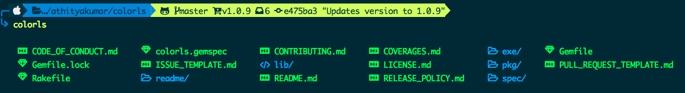

#### 安装
1. 用`Rbenv`安装`Ruby` (preferably, version > 2.1)
  安装依赖包:
   ```shell
   sudo apt update
   sudo apt install git curl libssl-dev libreadline-dev zlib1g-dev autoconf bison build-essential libyaml-dev libreadline-dev libncurses5-dev libffi-dev libgdbm-devCopy
   ```
    安装`Rbenv`:
    ```shell
    # curl -sL https://github.com/rbenv/rbenv-installer/raw/master/bin/rbenv-installer | bash -
    git clone https://github.com/rbenv/rbenv.git ~/.rbenv
    ```
    配置`Rbenv`环境:
    ```shell
    # Bash
    echo '# Rbenv' >> ~/.bashrc
    echo 'export PATH="$HOME/.rbenv/bin:$PATH"' >> ~/.bashrc
    echo 'eval "$(rbenv init -)"' >> ~/.bashrc
    source ~/.bashrc

    git clone https://github.com/rbenv/ruby-build.git ~/.rbenv/plugins/ruby-build
    echo 'export PATH="$HOME/.rbenv/plugins/ruby-build/bin:$PATH"' >> ~/.bashrc
    exec $SHELL

    # Zsh
    echo '# Rbenv' >> ~/.zshrc
    echo 'export PATH="$HOME/.rbenv/bin:$PATH"' >> ~/.zshrc
    echo 'eval "$(rbenv init -)"' >> ~/.zshrc
    source ~/.zshrc

    git clone https://github.com/rbenv/ruby-build.git ~/.rbenv/plugins/ruby-build
    echo 'export PATH="$HOME/.rbenv/plugins/ruby-build/bin:$PATH"' >> ~/.zshrc
    exec $SHELL
    ```
    安装`Ruby`:
    ```shell
    rbenv install 2.6.6
    rbenv global 2.6.6
    ruby -v
    ```

    **安装过程中遇到的问题（build fails on Ubuntu 18.04 with libssl-dev installed）:**
    ```shell
    andy@ROG:~$ rbenv install 2.6.6
    Downloading ruby-2.6.6.tar.bz2...
    -> https://cache.ruby-lang.org/pub/ruby/2.6/ruby-2.6.6.tar.bz2
    Installing ruby-2.6.6...

    BUILD FAILED (Ubuntu 18.04 using ruby-build 20200520-10-g157c719)

    Inspect or clean up the working tree at /tmp/ruby-build.20200624010548.2257.GjCp3V
    Results logged to /tmp/ruby-build.20200624010548.2257.log

    Last 10 log lines:
    The Ruby openssl extension was not compiled.
    The Ruby readline extension was not compiled.
    ERROR: Ruby install aborted due to missing extensions
    Try running `apt-get install -y libssl-dev libreadline-dev` to fetch missing dependencies.

    Configure options used:
    --prefix=/home/andy/.rbenv/versions/2.6.6
    --enable-shared
    LDFLAGS=-L/home/andy/.rbenv/versions/2.6.6/lib
    CPPFLAGS=-I/home/andy/.rbenv/versions/2.6.6/include
    ```

    解决方法:
    ```shell
    sudo apt purge libssl-dev && sudo apt install libssl1.0-dev
    ```


2. **安装字体**并设置`Terminal`的显示字体否则`icon`显示不全，推荐 `powerline nerd-font`中的`Mononoki`字体。可以查看 [Nerd Font](https://github.com/ryanoasis/nerd-fonts) 来获得更多安装详细介绍。

    *Note for `ubuntu` users - Please enable the **Nerd Font** at `Terminal > Preferences > Profiles > Edit > General > Test Appearance > Custom font > mononoki Nerd Font Regular`.*    
    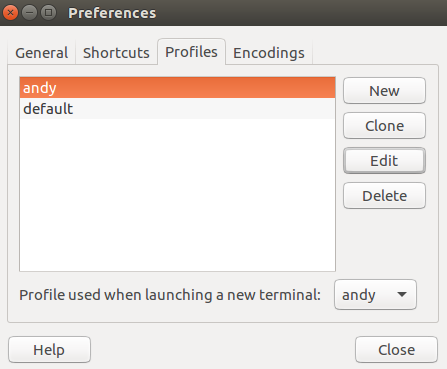    
    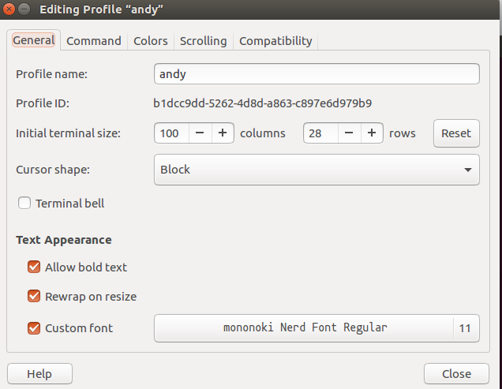    

3. Install the [colorls](https://rubygems.org/gems/colorls/) ruby gem with：
    ```shell
    gem install colorls
    ```

    *Note for `rbenv` users - In case of load error when using `lc`, please try the below patch.*

    ```shell
    rbenv rehash
    rehash
    ```

4. Enable tab completion for flags by entering following line to your shell configuration file (`~/.bashrc` or `~/.zshrc`) :
    ```bash
    source $(dirname $(gem which colorls))/tab_complete.sh
    ```
#### 配置colorls
在命令行可以使用`colorls`来代替`ls`，也可以通过下面配置**别名**来替代`colorls`:
配置`Bash`或`Zsh`环境，这里以`Zsh`配置为例:
进入`~/.zshrc`配置文件:
```shell
vim ~/.zshrc
```
在文件末追加以下内容:
```shell
# Colorls
alias ls='colorls'
alias ll='colorls -lA --report'
alias lc='colorls -lA --sd'
```
使其生效:
```shell
source ~/.zshrc
```
#### 升级colorls
```shell
gem update colorls
```
#### 卸载colorls
```shell
gem uninstall colorls
```

#### 参考资料
> [Terminal Experience](https://medium.com/@caulfieldOwen/youre-missing-out-on-a-better-mac-terminal-experience-d73647abf6d7)


### 安装fzf
fzf是通用命令行模糊查找器.

`fzf` 的GitHub仓库地址: https://github.com/junegunn/fzf

`navi` 依赖 `fzf` , 所以需要先安装 `fzf`:
```sh
git clone --depth 1 https://github.com/junegunn/fzf.git ~/.fzf
~/.fzf/install
```

### 安装navi
`navi` 的GitHub仓库地址: https://github.com/denisidoro/navi

<!-- **Using oh-my-zsh**

Make sure that your oh-my-zsh $ZSH_CUSTOM directory is configured, then clone navi into the plugins directory.
```sh
plugins_dir="$ZSH_CUSTOM/plugins"
mkdir -p "$plugins_dir"
cd "$plugins_dir"
git clone https://github.com/denisidoro/navi
```
Then, add it to the oh-my-zsh plugin array to automatically enable the zsh widget:
```sh
 plugins=(
   git
   zsh-syntax-highlighting
   zsh-autosuggestions
   fzf
   navi
 )

```
Lastly, reload your zshrc or spawn a new terminal to load navi. Once this is done, you should be able to use it as a shell widget with no additional setup.

> Please note that when installing as an oh-my-zsh plugin, navi will not be available as a command. If you also want to be able to run the command interactively, you will need to do one of the following:

- Install it to /usr/bin/local (via sudo make install)
- Manually set $PATH so that navi can be found.

You can manually update your path by adding a line like this in your .zshrc:
```shell
export PATH=$PATH:"$ZSH_CUSTOM/plugins/navi"
```
And verify that it works by running which navi after reloading your configuration. -->

- Using cargo
[Install Rust and Cargo](https://doc.rust-lang.org/cargo/getting-started/installation.html):
```shell
curl --proto '=https' --tlsv1.2 https://sh.rustup.rs -sSf | sh
```
然后在`.bashrc`或者`.zshrc`中添加:
```vim
# Cargo
export PATH="$HOME/.cargo/bin:$PATH"
```
安装navi:
```shell
cargo install navi
```

- Downloading pre-compiled binaries
  ```shell
  bash <(curl -sL https://raw.githubusercontent.com/denisidoro/navi/master/scripts/install)

  # alternatively, to set directories:
  # SOURCE_DIR=/opt/navi BIN_DIR=/usr/local/bin bash <(curl -sL https://raw.githubusercontent.com/denisidoro/navi/master/scripts/install)l
  ```

- Building from source
  ```shell
  git clone https://github.com/denisidoro/navi ~/.navi
  cd ~/.navi
  make install

  # alternatively, to set install directory:
  # make BIN_DIR=/usr/local/bin install
  ```

---
## vim配置
### YouCompleteMe实现vim自动补全

1 准备条件

(1) 最新版的`Vim(7.3.584+)`，须支持`python`。
终端输入命令：`vim –version` 或 打开vim用命令：version 查看版本信息，若python前有'+'即可。
然后终端执行命令，安装相关依赖项：
```shell
sudo apt-get install python-dev
```
装的过程中若遇到问题，依次执行以下命令：
```shell
sudo apt-get update
sudo apt-get install -f
```
之后重试安装：
```shell
sudo apt-get install python-dev
```

(2) 安装`cmake`
```shell
sudo apt-get install cmake
```

(3) 安装`clang`
```
sudo apt-get install clang
```
**或者跳过这步**，后面编译**YCM**(YouCompleteMe)时，如果没有`clang`会自动安装。


2 安装**Vundle**
*这个是用来管理`vim`插件的，安装和卸载都特别方便，各个插件是一个文件夹，放在目录`bunble`下。*
(1) 下载`Vundle`源码到本地
```shell
git clone https://github.com/VundleVim/Vundle.vim.git ~/.vim/bundle/Vundle.vim
```

(2) 编辑`~/.vim_runtime/my_configs.vim` (*旧版是在 `.vimrc` 的文件起始处*)，插入以下内容并保存：
```vim
" >>>>>> vundle
set nocompatible              " 去除VI一致性,必须
filetype off                  " 必须

" 设置包括vundle和初始化相关的runtime path
set rtp+=~/.vim/bundle/Vundle.vim
call vundle#begin()
" 另一种选择, 指定一个vundle安装插件的路径
"call vundle#begin('~/some/path/here')

" 让vundle管理插件版本,必须
Plugin 'VundleVim/Vundle.vim'

" 以下范例用来支持不同格式的插件安装.
" 请将安装插件的命令放在vundle#begin和vundle#end之间.
" Github上的插件
" 格式为 Plugin '用户名/插件仓库名'
Plugin 'tpope/vim-fugitive'
" 来自 http://vim-scripts.org/vim/scripts.html 的插件
" Plugin '插件名称' 实际上是 Plugin 'vim-scripts/插件仓库名' 只是此处的用户名可以省略
Plugin 'L9'
" 由Git支持但不再github上的插件仓库 Plugin 'git clone 后面的地址'
Plugin 'git://git.wincent.com/command-t.git'
" 本地的Git仓库(例如自己的插件) Plugin 'file:///+本地插件仓库绝对路径'
"Plugin 'file:///home/andy/path/to/plugin'
" 插件在仓库的子目录中.
" 正确指定路径用以设置runtimepath. 以下范例插件在sparkup/vim目录下
Plugin 'rstacruz/sparkup', {'rtp': 'vim/'}
" 安装L9，如果已经安装过这个插件，可利用以下格式避免命名冲突
"Plugin 'ascenator/L9', {'name': 'newL9'}
" YouCompleteMe
Plugin 'ycm-core/YouCompleteMe'
Plugin 'yggdroot/indentline'
Plugin 'jiangmiao/auto-pairs'
Plugin 'codota/tabnine-vim'

" 你的所有插件需要在下面这行之前
call vundle#end()            " 必须
filetype plugin indent on    " 必须 加载vim自带和插件相应的语法和文件类型相关脚本
" 忽视插件改变缩进,可以使用以下替代:
"filetype plugin on
"
" 简要帮助文档
" :PluginList       - 列出所有已配置的插件
" :PluginInstall    - 安装插件,追加 `!` 用以更新或使用 :PluginUpdate
" :PluginSearch foo - 搜索 foo ; 追加 `!` 清除本地缓存
" :PluginClean      - 清除未使用插件,需要确认; 追加 `!` 自动批准移除未使用插件
"
" 查阅 :h vundle 获取更多细节和wiki以及FAQ
" 将你自己对非插件片段放在这行之后
" <<<<<< vundle
```
**注意**：`Bundle '插件名或git链接' `表示要安装的插件

(3)再次打开vim，在命令行模式中执行：    
```vim
BundleInstall
```    
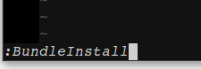
进入安装插件过程：    
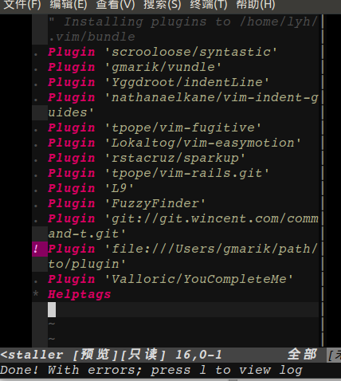

Plugin前面有`'>'`表示该插件正在安装，`YouCompleteMe`插件安装的时间比较长，耐心等待，不要退出，最后会提示有一个错误，这是正常的，因为`YouCompleteMe`需要手工编译出库文件，就像上图中的'！'，忽略它。
**注**：若要卸载插件，只需将`.vimrc`中 "Bundle '插件' "这条语句删掉，然后在vim 命令行模式中执行：`BundleClean`即可。

3  编译`YouCompleteMe`

(1) 进入YouCompleteMe文件夹下
```shell
cd  ~/.vim/bundle/YouCompleteMe/
```    
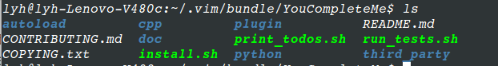

(2) 编译
```shell
./install.py  --clang-completer --go-completer --ts-completer
```
参数`–clang-completer`是为了支持C/C++的补全，不需要可以不加。编译过程比较长，耐心等待。

**上述编译支持go语言的时候，若提示以下错误，是因为在升级go版本的时候没有彻底卸载旧版本:**
```sh
[100%] Built target _regex
# runtime
/usr/local/go/src/runtime/stubs_x86.go:10:6: stackcheck redeclared in this block
    previous declaration at /usr/local/go/src/runtime/stubs_amd64x.go:10:6
/usr/local/go/src/runtime/unaligned1.go:11:6: readUnaligned32 redeclared in this block
    previous declaration at /usr/local/go/src/runtime/alg.go:321:40
/usr/local/go/src/runtime/unaligned1.go:15:6: readUnaligned64 redeclared in this block
    previous declaration at /usr/local/go/src/runtime/alg.go:329:40
```
> [golang github issue: runtime error on `go get` go1.11 #27269](https://github.com/golang/go/issues/27269)


4  修改`~/.vim_runtime/my_configs.vim` (*旧版是在 `.vimrc` 的文件起始处*)配置文件    
(1) 找到配置文件`.ycm_extra_conf.py`在`~/.vim/bundle/YouCompleteMe/third_party/ycmd/`下面:
```shell
cd ~/.vim/bundle/YouCompleteMe/third_party/ycmd/
```
`ls -a` 即可看到。

(2) [可选] 自行在`YouCompleteMe/`中创建`cpp/ycm`目录，将 `.ycm_extra_conf.py`拷贝进去:    
```shell
cd ~/.vim/bundle/YouCompleteMe
mkdir cpp
mkdir cpp/ycm
cp ~/.vim/bundle/YouCompleteMe/third_party/ycmd/.ycm_extra_conf.py ~/.vim/bundle/YouCompleteMe/cpp/ycm/
```

(3) 修改`~/.vim_runtime/my_configs.vim` (*旧版是在 `.vimrc` 的文件起始处*)配置文件, 将下面的内容添加到里面:    
```vim
" >>>>>> YouCompleteMe
" 寻找全局配置文件
let g:ycm_global_ycm_extra_conf = '~/.vim/bundle/YouCompleteMe/third_party/ycmd/.ycm_extra_conf.py'
"let g:ycm_global_ycm_extra_conf = '~/.vim/bundle/YouCompleteMe/cpp/ycm/.ycm_extra_conf.py'
" 禁用syntastic来对python检查
let g:syntastic_ignore_files=[".*\.py$"]
" 使用ctags生成的tags文件
let g:ycm_collect_identifiers_from_tag_files = 1
" 开启语义补全
" 修改对C语言的补全快捷键，默认是CTRL+space，修改为ALT+;未测出效果
"let g:ycm_key_invoke_completion = '<M-;>'
" 设置转到定义处的快捷键为ALT+G，未测出效果
"nmap <M-g> :YcmCompleter GoToDefinitionElseDeclaration <C-R>=expand("<cword>")<CR><CR>
"关键字补全
"let g:ycm_seed_identifiers_with_syntax = 1
" 在接受补全后不分裂出一个窗口显示接受的项
set completeopt-=preview
" 让补全行为与一般的IDE一致
set completeopt=longest,menu
" 不显示开启vim时检查ycm_extra_conf文件的信息
let g:ycm_confirm_extra_conf=0
" 每次重新生成匹配项，禁止缓存匹配项
let g:ycm_cache_omnifunc=0
" 在注释中也可以补全
let g:ycm_complete_in_comments=1
" 输入第一个字符就开始补全
let g:ycm_min_num_of_chars_for_completion=1
" 错误标识符
let g:ycm_error_symbol='>>'
" 警告标识符
let g:ycm_warning_symbol='>*'
" 不查询ultisnips提供的代码模板补全，如果需要，设置成1即可
" let g:ycm_use_ultisnips_completer=0
" <<<<<< YouCompleteMe
```
上面的内容中，除了第一句寻找全局配置文件，其他的语句可以根据自己的需要更改、删除或添加。
**注**：如果没有在第(3)步中自己创建`cpp/ycm`目录拷贝`.ycm_extra_conf.py`文件，则需要将第一句中的路径改为全局配置文件所在的具体路径，如下：
```vim
let g:ycm_global_ycm_extra_conf = '~/.vim/bundle/YouCompleteMe/third_party/ycmd/.ycm_extra_conf.py'
```

5 保存退出 ,打开一个C/C++源程序，体验其自动补全效果。       
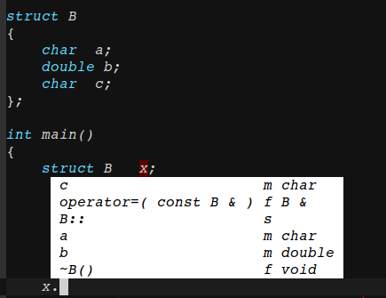

6 配合上面安装的`syntastic`还可以语法检测     
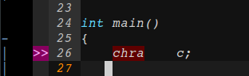

`'>>'`指出有语法错误，但是检测速度太慢，没什么大用。自我感觉这个语法自动检测很烦，可以禁用它：
进入 `/bundle/YouCompleteMe/plugin`，修改`youcompleteme.vim`中的：     
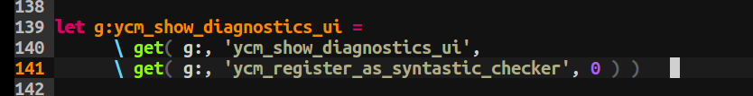
将如上图中的`第141行`的参数改为`0`就可以了。

7 `YcmDiags`插件可以显示错误或警告信息，可以设置`F9`为打开窗口的快捷键，在`.vimrc`中添加语句：     
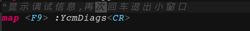    
显示效果：        
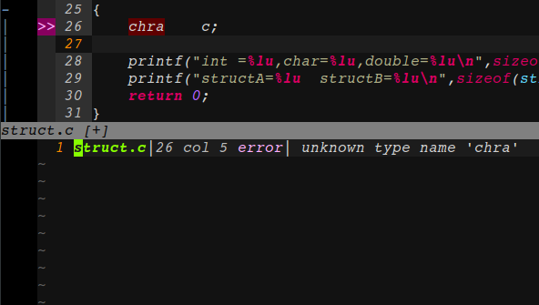

8 添加头文件
目前在`include`中，无法补全`stdio.h`等头文件，我们需要将`/usr/include`添加进去。路径添加到 `~/.vim/bundle/YouCompleteMe/cpp/ycm/.ycm_extra_conf.py` 或者`~/.vim/bundle/YouCompleteMe/third_party/ycmd/.ycm_extra_conf.py`文件中的`flags` 数组中，每增加一个路径，前面要写`'-isystem'`。    
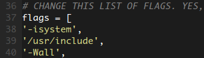
以后需要boost库等其他的补全，也需要将相应的路径添加进去。    

# TabNine实现vim自动补全
将上述的`YouCompleteMe`屏蔽，`TabNine`打开，重新运行:
```vim
BundleInstall
```


# vim最终配置
```vim
" >>>>>>>> Vundle
set nocompatible              " 去除VI一致性,必须
filetype off                  " 必须

" 设置包括vundle和初始化相关的runtime path
set rtp+=~/.vim/bundle/Vundle.vim
call vundle#begin()
" 另一种选择, 指定一个vundle安装插件的路径
"call vundle#begin('~/some/path/here')

" 让vundle管理插件版本,必须
Plugin 'VundleVim/Vundle.vim'

" 以下范例用来支持不同格式的插件安装.
" 请将安装插件的命令放在vundle#begin和vundle#end之间.
" Github上的插件
" 格式为 Plugin '用户名/插件仓库名'
Plugin 'tpope/vim-fugitive'
" 来自 http://vim-scripts.org/vim/scripts.html 的插件
" Plugin '插件名称' 实际上是 Plugin 'vim-scripts/插件仓库名' 只是此处的用户名可以省略
Plugin 'L9'
" 由Git支持但不再github上的插件仓库 Plugin 'git clone 后面的地址'
Plugin 'git://git.wincent.com/command-t.git'
" 本地的Git仓库(例如自己的插件) Plugin 'file:///+本地插件仓库绝对路径'
"Plugin 'file:///home/andy/path/to/plugin'
" 插件在仓库的子目录中.
" 正确指定路径用以设置runtimepath. 以下范例插件在sparkup/vim目录下
Plugin 'rstacruz/sparkup', {'rtp': 'vim/'}
" 安装L9，如果已经安装过这个插件，可利用以下格式避免命名冲突
"Plugin 'ascenator/L9', {'name': 'newL9'}
" YouCompleteMe
"Plugin 'ycm-core/YouCompleteMe'
Plugin 'yggdroot/indentline'
Plugin 'jiangmiao/auto-pairs'
Plugin 'codota/tabnine-vim'

" 你的所有插件需要在下面这行之前
call vundle#end()            " 必须
filetype plugin indent on    " 必须 加载vim自带和插件相应的语法和文件类型相关脚本
" 忽视插件改变缩进,可以使用以下替代:
"filetype plugin on
"
" 简要帮助文档
" :PluginList       - 列出所有已配置的插件
" :PluginInstall    - 安装插件,追加 `!` 用以更新或使用 :PluginUpdate
" :PluginSearch foo - 搜索 foo ; 追加 `!` 清除本地缓存
" :PluginClean      - 清除未使用插件,需要确认; 追加 `!` 自动批准移除未使用插件
"
" 查阅 :h vundle 获取更多细节和wiki以及FAQ
" 将你自己对非插件片段放在这行之后
" <<<<<<<< Vundle

" >>>>>> YouCompleteMe
" 寻找全局配置文件
let g:ycm_global_ycm_extra_conf = '~/.vim/bundle/YouCompleteMe/third_party/ycmd/.ycm_extra_conf.py'
" 禁用syntastic来对python检查
let g:syntastic_ignore_files=[".*\.py$"]
" 使用ctags生成的tags文件
let g:ycm_collect_identifiers_from_tag_files = 1
" 开启语义补全
" 修改对C语言的补全快捷键，默认是CTRL+space，修改为ALT+;未测出效果
"let g:ycm_key_invoke_completion = '<M-;>'
" 设置转到定义处的快捷键为ALT+G，未测出效果
"nmap <M-g> :YcmCompleter GoToDefinitionElseDeclaration <C-R>=expand("<cword>")<CR><CR>
"关键字补全
"let g:ycm_seed_identifiers_with_syntax = 1
" 在接受补全后不分裂出一个窗口显示接受的项
set completeopt-=preview
" 让补全行为与一般的IDE一致
set completeopt=longest,menu
" 不显示开启vim时检查ycm_extra_conf文件的信息
let g:ycm_confirm_extra_conf=0
" 每次重新生成匹配项，禁止缓存匹配项
let g:ycm_cache_omnifunc=0
" 在注释中也可以补全
let g:ycm_complete_in_comments=1
" 输入第一个字符就开始补全
let g:ycm_min_num_of_chars_for_completion=1
" 错误标识符
let g:ycm_error_symbol='>>'
" 警告标识符
let g:ycm_warning_symbol='>*'
" 不查询ultisnips提供的代码模板补全，如果需要，设置成1即可
" let g:ycm_use_ultisnips_completer=0
" <<<<<< YouCompleteMe

" >>>>>> add by ANDY
" 显示行号
set number
" 显示标尺
set ruler
" 历史纪录
set history=1000
" 输入的命令显示出来，看的清楚些
set showcmd
" 状态行显示的内容
set statusline=%F%m%r%h%w\ [FORMAT=%{&ff}]\ [TYPE=%Y]\ [POS=%l,%v][%p%%]\ %{strftime(\"%d/%m/%y\ -\ %H:%M\")}
" 启动显示状态行1，总是显示状态行2
set laststatus=2
" 语法高亮显示
syntax on
set fileencodings=utf-8,gb2312,gbk,cp936,latin-1
set fileencoding=utf-8
set termencoding=utf-8
set fileformat=unix
set encoding=utf-8
" 配色方案
colorscheme desert
" 指定配色方案是256色
set t_Co=256
set wildmenu
" 去掉有关vi一致性模式，避免以前版本的一些bug和局限，解决backspace不能使用的问题
"set nocompatible
set backspace=indent,eol,start
set backspace=2
" 启用自动对齐功能，把上一行的对齐格式应用到下一行
set autoindent
" 依据上面的格式，智能的选择对齐方式，对于类似C语言编写很有用处
set smartindent
" vim禁用自动备份
set nobackup
set nowritebackup
set noswapfile
" 用空格代替tab
set expandtab
" 设置显示制表符的空格字符个数,改进tab缩进值，默认为8，现改为4
set tabstop=4
" 统一缩进为4，方便在开启了et后使用退格(backspace)键，每次退格将删除X个空格
set softtabstop=4
" 设定自动缩进为4个字符，程序中自动缩进所使用的空白长度
set shiftwidth=4
" 设置帮助文件为中文(需要安装vimcdoc文档)
set helplang=cn
" 显示匹配的括号
set showmatch
" 文件缩进及tab个数
au FileType html,python,vim,javascript setl shiftwidth=4
au FileType html,python,vim,javascript setl tabstop=4
au FileType java,php setl shiftwidth=4
au FileType java,php setl tabstop=4
" 高亮搜索的字符串
set hlsearch
" 检测文件的类型
"filetype off
filetype plugin on
filetype indent on
" C风格缩进
set cindent
set completeopt=longest,menu
" 功能设置
" 去掉输入错误提示声音
set noeb
" 自动保存
set autowrite
" 突出显示当前行
set cursorline
" 突出显示当前列
set cursorcolumn
"设置光标样式为竖线vertical bar
" Change cursor shape between insert and normal mode in iTerm2.app
"if $TERM_PROGRAM =~ "iTerm"
let &t_SI = "\<Esc>]50;CursorShape=1\x7" " Vertical bar in insert mode
let &t_EI = "\<Esc>]50;CursorShape=0\x7" " Block in normal mode
"endif
" 共享剪贴板
set clipboard+=unnamed
" 文件被改动时自动载入
set autoread
" 顶部底部保持3行距离
set scrolloff=3
" <<<<<< add by ANDY
```
---
## Tmux配置与使用
**先上配置好的效果图**:    
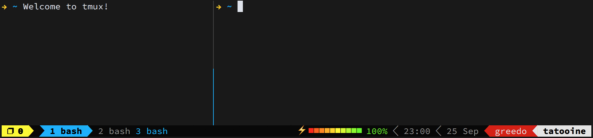    
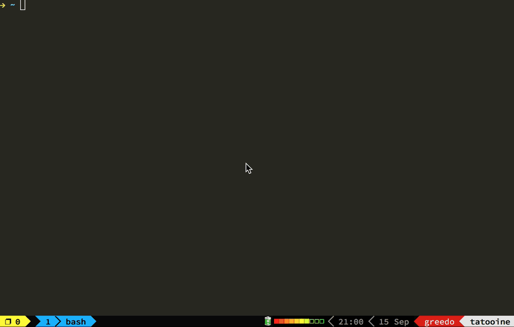    
    

### Tmux安装
```shell
sudo apt-get install tmux
```

### Tmux配置
安装`.tmux`配置文件，官方github地址: https://github.com/gpakosz/.tmux

- **`.tmux`安装要求**:
  - tmux **`>= 2.1`**
  - outside of tmux, `$TERM` must be set to `xterm-256color`

- **`.tmux`安装**
  按照下面命令安装: (安装之前首先备份一下 `~/.tmux.conf` 文件)
  ```shell
  cd
  git clone https://github.com/gpakosz/.tmux.git
  ln -s -f .tmux/.tmux.conf
  ln -s .tmux/.tmux.conf.local .tmux.conf.local # cp .tmux/.tmux.conf.local .
  ```
- 然后**配置`~/.tmux.conf.local`文件**，将下列代码取消屏蔽，并将原始的屏蔽：
  ```
  tmux_conf_theme_left_separator_main=''
  tmux_conf_theme_left_separator_sub=''
  tmux_conf_theme_right_separator_main=''
  tmux_conf_theme_right_separator_sub=''
  ```
  可以修改右侧状态栏来显示天气预报:
  ```
  tmux_conf_theme_status_right='#{prefix}#{pairing}#{synchronized} #(curl wttr.in/shanghai?format=3\&m) , %R , %d %b | #{username}#{root} | #{hostname} '
  ```
  效果如下:    
  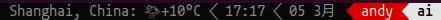

  **更详细配置介绍[请看](tmux/tmux_conf.md)**

- 官方推荐安装[`Source Code Pro`](tmux/source-code-pro-2.030R-ro-1.050R-it.zip)字体，官方[GitHub地址](https://github.com/adobe-fonts/source-code-pro/releases)或者[Powerline](https://github.com/powerline/fonts)中提供的`Source Code Pro`字体，解压后文件夹`source-code-pro/TTF/`下直接安装即可。但是安装了`Source Code Pro`字体后[安装colorls](#安装colorls)显示会有问题，所以为了兼容性**推荐 `powerline nerd-font`字体 —— `mononoki Nerd Font Regular`**。具体可以查看 [Nerd Font README](https://github.com/ryanoasis/nerd-fonts/blob/master/readme.md) 来获得更多安装详细介绍。
  *Note for `ubuntu` users - Please enable the **Nerd Font** at `Terminal > Preferences > Profiles > Edit > General > Text Appearance > Custom font > mononoki Nerd Font Regular`.*     

      
      
  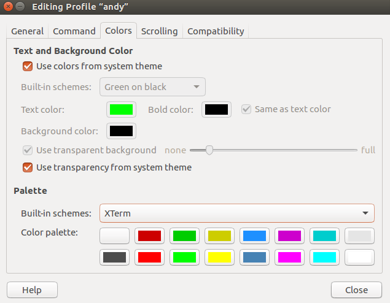    


- 安装[Powerline symbols](https://github.com/powerline/powerline/raw/develop/font/PowerlineSymbols.otf).

- 使`~/.tmux.conf.local`配置文件生效:
  ```shell
  tmux # 启动tmux

  #然后`Ctrl+b`再按`:`进入`tmux`命令行模式
  source ~/.tmux.conf
  ```    
  

### Tmux使用手册

**常用命令**

启动新会话：

    tmux [new -s 会话名 -n 窗口名]

恢复会话：

    tmux at [-t 会话名]

列出所有会话：

    tmux ls

<a name="killSessions"></a>关闭会话：

    tmux kill-session -t 会话名

<a name="killAllSessions"></a>关闭所有会话：

    tmux ls | grep : | cut -d. -f1 | awk '{print substr($1, 0, length($1)-1)}' | xargs kill


**在 Tmux 中，按下 Tmux 前缀 `ctrl+b`，然后**：

会话

    :new<回车>  启动新会话
    s           列出所有会话
    $           重命名当前会话

**<a name="WindowsTabs"></a>窗口 (标签页)**

    c  创建新窗口
    w  列出所有窗口
    n  后一个窗口
    p  前一个窗口
    f  查找窗口
    ,  重命名当前窗口
    &  关闭当前窗口

**调整窗口排序**

    swap-window -s 3 -t 1  交换 3 号和 1 号窗口
    swap-window -t 1       交换当前和 1 号窗口
    move-window -t 1       移动当前窗口到 1 号

**<a name="PanesSplits"></a>窗格（分割窗口**）

    %  垂直分割
    "  水平分割
    o  交换窗格
    x  关闭窗格
    ⍽  左边这个符号代表空格键 - 切换布局
    q 显示每个窗格是第几个，当数字出现的时候按数字几就选中第几个窗格
    { 与上一个窗格交换位置
    } 与下一个窗格交换位置
    z 切换窗格最大化/最小化


**更多详情请[移步](tmux/tmux_cheatsheet.md)**

#### 参考资料
> [.tmux配置](https://github.com/gpakosz/.tmux)
> [Tmux 快捷键 & 速查表](https://gist.github.com/ryerh/14b7c24dfd623ef8edc7)

---
## 远程连接Ubuntu
### 通过SSH连接
1. 需要安装ssh的客户端和服务端
    ```shell
    sudo apt-get install openssh-server openssh-client
    ```
2. 安装完以后就可以在另一台电脑上远程连接了
    ```shell
    ssh user_name@ip_address[:port]
    ```

### 通过VNC连接
1. 在Ubuntu上首先需要安装vnc4server
    ```shell
    sudo apt-get install vnc4server
    ```

2. 第一次执行vncserver的时候需要为客户端连接设置6位的密码
    ```shell
    vncserver
    ```

3. 在vnc客户端（noVNC/vncviewer）中远程链接 `IP:1`，但是输入密码后显示灰屏并且鼠标为x型,这是因为vncserver在Ubuntu系统中找不到指定的图形化工具

    此时需要在Ubuntu中下载图形化工具:
    ```shell
    apt-get install gnome-panel gnome-settings-daemon metacity nautilus gnome-terminal
    ```

    安装完成之后需要更改`~/.vnc/xstartup文件`,添加如下内容：
    ```shell
    export XKL_XMODMAP_DISABLE=1
    unset SESSION_MANAGER
    unset DBUS_SESSION_BUS_ADDRESS
    gnome-panel &
    gnmoe-settings-daemon &
    metacity &
    nautilus &
    gnome-terminal &
    ```


4. 之后重启vncserver就OK了
    ```shell
    vncserver :1
    ```
    **注**：停止某个vnc服务
    ```shell
    vncserver -kill :端口号
    ```


---
## Sublime Text 3配置问题
**安装Control Package**:
通过按下`Ctrl+'` 然后输入以下命令：
```
import urllib.request,os,hashlib; h = '6f4c264a24d933ce70df5dedcf1dcaee'
+ 'ebe013ee18cced0ef93d5f746d80ef60'; pf = 'Package
Control.sublime-package'; ipp = sublime.installed_packages_path();
urllib.request.install_opener( urllib.request.build_opener(
urllib.request.ProxyHandler()) ); by = urllib.request.urlopen
('http://packagecontrol.io/' + pf.replace(' ', '%20')).read(); dh =
hashlib.sha256(by).hexdigest(); print('Error validating download (got %s
instead of %s), please try manual install' % (dh, h)) if dh != h else
open(os.path.join( ipp, pf), 'wb' ).write(by)
```


**环境配置**:
```json
{
    "font_face": "Monaco",
    "font_size": 14,
    "translate_tabs_to_spaces": true
}
```

---
## VSCode配置问题
### Awesome VScode Plugin
- **C/C++**
- **go**
- **Python**
- **Chinese (Simplified) Language Pack for Visual Studio Code**
- **TabNine** : All-language autocompleter
- **Dash** : Dash, Zeal and Velocity integration in Visual Studio Code, 目前只支持与Mac下的Dash关联
- **Bracket Pair Colorizer** : 着色匹配括号
- **comment-divider** : 行内容生成注释包装的分隔符
- **Indent-Rainbow** : 对缩进显示彩虹色作色，使得更加易读
- **Trailing Spaces** : 检测多余空格并高亮
- **Code Spell Checker** : 代码拼写检查
- **Sublime Text Keymap** : 在VScode中添加Sublime Text 热门快捷键
- **GitLens** : 增强了内置的Visual Studio代码Git功能
- **Visual Studio IntelliCode** : AI-assisted development
- **Live Share** : 远程实时代码协同开发
- **Remote Development**
- **Remote - SSH** : 通过使用 SSH 来连接远程机器/虚拟机以打开任何文件
- **Remote - Containers** : 通过打开容器来使用沙箱工具链或基于容器的应用
- **Remote - WSL** : 在Windows上通过WSL来获得Linux开发体验
- **Visual Studio Codespaces**
- **CMake Tools** : Microsoft Extended CMake support in Visual Studio Code
- **ROS** : Visual Studio Code Extension for ROS
- **Anaconda Extension Pack** : A set of extensions that enhance the experience of Anaconda customers using VScode
- **Bookmarks** : 书签
- koroFileHeader : 用于生成文件头部注释和函数注释的插件
- **Code Runner** : 代码一键运行，支持超过40种语言
- **Comment Translate** : VSCode 注释翻译
- **Todo Tree** : Show TODO, FIXME, etc. comment tags in a tree view
- **Todo+**
- Kanban
- TODO.md Kanban Board
- **[Settings Sync](https://github.com/shanalikhan/code-settings-sync)** : Synchronize Settings
- Sublime Text Keymap and Settings Importer
- Visual Studio IntelliCode
- EditorConfig for VS Code
- **Markdown All in One** : 多合一的 Markdown 插件：自动补全，格式化，数学公式支持等功能以及丰富的快捷键
- Markdown Shortcuts
- markdownlint
- VS Code Jupyter Notebook Previewer
- Project Manager
- Path Intellisense
- Beautify
- ColorTabs
- prototxt
- GitHub Pull Requests
- Git History
- **LaTeX Workshop** : 提升 LaTeX 编排效率：预览，智能提示，格式化等功能以及丰富的快捷键
- Syncing : 简单可靠的多设备间 VS Code 配置同步工具
- vscode-cudacpp
- **Better Comments** : 注释高亮
- **Auto Comment Blocks**
- **Comment Divider**
- **文件夹图标主题**
  - **vscode-icons**
  - Material Icon Theme
  - Nomo Dark Icon Theme
  - VSCode Great Icons
- **颜色主题**
  - **Atom One Dark Theme**
  - One Dark Pro
  - Dracula Official

### VScode Tips
- 按下 `ctrl+K` ，再按下 `ctrl+S` ，查看快捷键列表;
- 按下 `ctrl+P` ，弹出搜索栏，直接输入关键字，在所有文件中搜索特定符号:
   - 在搜索栏前输入 `@` ，在当前文件中搜索特定符号;
   - 在搜索栏前输入 `>` ，搜索所有可使用的命令;
-  `ctrl` + `=` 和 `ctrl` + `-` 组合来进行缩放;

### Ubuntu VScode配置Cpp编译环境

1. `CMakeLists.txt`中设置:
   ```
   set(CMAKE_BUILD_TYPE "Debug")
   ```
2. vscode中安装C++插件；
3. 点击运行按钮会弹出配置C++环境，需要修改`launch.json`文件:
   ```JavaScript
    {
        // 使用 IntelliSense 了解相关属性。
        // 悬停以查看现有属性的描述。
        // 欲了解更多信息，请访问: https://go.microsoft.com/fwlink/?linkid=830387
        "version": "0.2.0",
        "configurations": [
            {
                "name": "g++ - 生成和调试活动文件",
                "type": "cppdbg",
                "request": "launch",
                "program": "${fileDirname}/${fileBasenameNoExtension}",
                "args": [],
                "stopAtEntry": false,
                "cwd": "${workspaceFolder}",
                "environment": [],
                "externalConsole": false,
                "MIMode": "gdb",
                "setupCommands": [
                    {
                        "description": "为 gdb 启用整齐打印",
                        "text": "-enable-pretty-printing",
                        "ignoreFailures": true
                    }
                ],
                "preLaunchTask": "g++ build active file",
                "miDebuggerPath": "/usr/bin/gdb"
            }
        ]
    }
    ```
    只需修改其中的一行`"program": "enter program name, for example ${workspaceFolder}/a.out"`, 将`enter program name, for example`删除，`a.out`修改为自己的生成的可执行文件名即可。    

    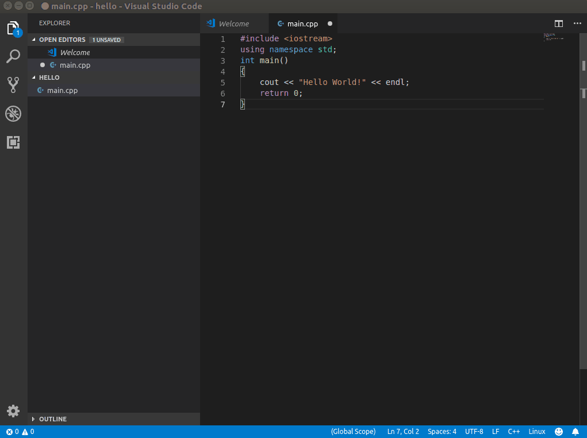    

    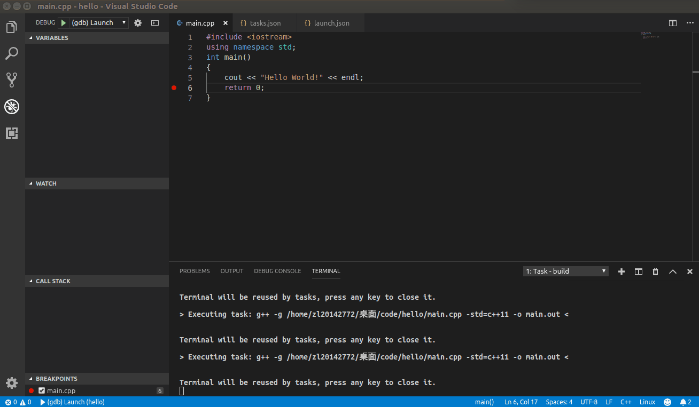    

    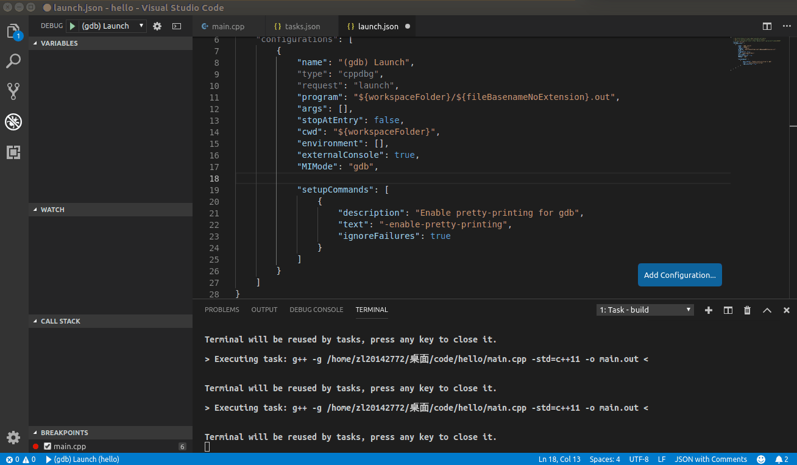    


### VScode环境配置    
    

```json
{
    // 使用 IntelliSense 了解相关属性。
    // 悬停以查看现有属性的描述。
    // 欲了解更多信息，请访问: https://go.microsoft.com/fwlink/?linkid=830387
    "version": "0.2.0",
    "configurations": [
        {
            "name": "g++ - 生成和调试活动文件",
            "type": "cppdbg",
            "request": "launch",
            "program": "${fileDirname}/${fileBasenameNoExtension}",
            "args": [],
            "stopAtEntry": false,
            "cwd": "${workspaceFolder}",
            "environment": [],
            "externalConsole": false,
            "MIMode": "gdb",
            "setupCommands": [
                {
                    "description": "为 gdb 启用整齐打印",
                    "text": "-enable-pretty-printing",
                    "ignoreFailures": true
                }
            ],
            "preLaunchTask": "g++ build active file",
            "miDebuggerPath": "/usr/bin/gdb"
        }
    ]
}
```
其中:
- `"editor.fontFamily"`优先使用第一个字体，当第一个字体没有的时候依次使用后面的。
- `"terminal.integrated.fontFamily": "'mononoki Nerd Font'"`, 终端显示字体，首先要安装 `powerline nerd-font`中的`Mononoki`字体，可以查看 [Nerd Font](https://github.com/ryanoasis/nerd-fonts) 来获得更多安装详细介绍。    
  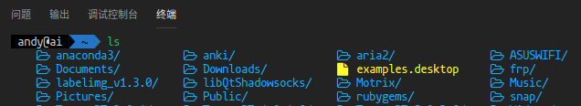

### vscode编辑器默认字体
- **Linux**: `'Droid Sans Mono', 'monospace', monospace, 'Droid Sans Fallback'`
- **Windows**: `Consolas, 'Courier New', monospace`
- **Mac**: `Menlo, Monaco, 'Courier New', monospace`

### vscode遇到的问题
1. 在安装插件的时候提示`cannot read property local of undefined vscode`
    解决方法:
    ```shell
    sudo chown -R [用户名]  ~/.vscode
    ```

---
## ubuntu查看和关闭进程
根据进程名查看进程PID：
```shell
ps -aux | grep [Process name]
```
关闭进程：
```shell
kill -9 [Process_PID]
```

---
## Ubuntu后台执行命令

*当我们在终端或控制台工作时，可能不希望由于运行一个作业而占住了屏幕，因为可能还有更重要的事情要做，比如阅读电子邮件。对于密集访问磁盘的进程，我们更希望它能够在每天的非负荷高峰时间段运行(例如凌晨)。为了使这些进程能够在后台运行，也就是说不在终端屏幕上运行，有几种选择方法可供使用。*

### 1、&
当在前台运行某个作业时，终端被该作业占据,可以在命令后面加上`&`实现后台运行。例如：`sh test.sh &`
适合在后台运行的命令有**find**、费时的排序及一些**shell**脚本。在后台运行作业时要当心：需要用户交互的命令不要放在后台执行，因为这样你的机器就会在那里傻等。不过，作业在后台运行一样会将结果输出到屏幕上，干扰你的工作。如果放在后台运行的作业会产生大量的输出，最好使用下面的方法把它的输出重定向到某个文件中：
```shell
command > out.file 2>&1 &
```
这样，所有的标准输出和错误输出都将被重定向到一个叫做`out.file`的文件中。PS：当你成功地提交进程以后，就会显示出一个进程号，可以用它来监控该进程，或杀死它。(`ps -ef | grep 进程号 `或者 `kill -9 进程号`）

### 2、nohup
使用&命令后，作业被提交到后台运行，当前控制台没有被占用，但是一但把当前控制台关掉(退出帐户时)，作业就会停止运行。nohup命令可以在你退出帐户之后继续运行相应的进程。nohup就是不挂起的意思( no hang up)。该命令的一般形式为：
```shell
nohup command &
```
如果使用nohup命令提交作业，那么在缺省情况下该作业的所有输出都被重定向到一个名为nohup.out的文件中，除非另外指定了输出文件：
```shell
nohup command > myout.file 2>&1 &
```
使用了nohup之后，很多人就这样不管了，其实这样有可能在当前账户非正常退出或者结束的时候，命令还是自己结束了。所以在使用nohup命令后台运行命令之后，需要使用exit正常退出当前账户，这样才能保证命令一直在后台运行。
```shell
ctrl + z #可以将一个正在前台执行的命令放到后台，并且处于暂停状态。
```
```shell
Ctrl+c #终止前台命令。
```
```shell
jobs #查看当前有多少在后台运行的命令。
```
`jobs -l`选项可显示所有任务的PID，jobs的状态可以是running, stopped, Terminated。但是如果任务被终止了（kill），shell 从当前的shell环境已知的列表中删除任务的进程标识。

### 2>&1解析
```shell
command >out.file 2>&1 &
```

1. command>out.file是将command的输出重定向到out.file文件，即输出内容不打印到屏幕上，而是输出到out.file文件中。
2. 2>&1 是将标准出错重定向到标准输出，这里的标准输出已经重定向到了out.file文件，即将标准出错也输出到out.file文件中。最后一个&， 是让该命令在后台执行。
3. 试想2>1代表什么，2与>结合代表错误重定向，而1则代表错误重定向到一个文件1，而不代表标准输出；换成2>&1，&与1结合就代表标准输出了，就变成错误重定向到标准输出.


---
## Ubuntu程序开机自启

### 修改系统启动文件
打开系统的自动启动配置文件 `/etc/rc.local` :
```shell
sudo vim /etc/rc.local
```
如要开机自动启动`frpc`，则 `/etc/rc.local` 添加的内容如下:
```vim
nohup /home/andy/frp/frpc -c /home/andy/frp/frpc.ini &
```
保存退出，运行 `source /etc/rc.local` 或者重启电脑即可。

### Startup Applications

`Ubuntu`中在 `Application` 中打开 `Startup Applications` :     

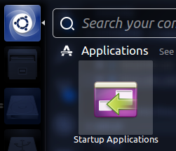    

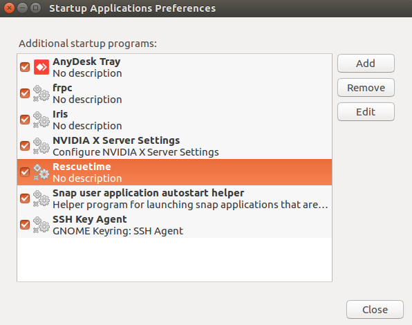    

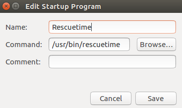    


---
## 查看系统状态

### 1. nvtop　　　
*查看NVIDIA显卡状态信息*　　　
```shell
# Install CMake, ncurses and git
sudo apt install cmake libncurses5-dev libncursesw5-dev git

git clone https://github.com/Syllo/nvtop.git
mkdir -p nvtop/build && cd nvtop/build
cmake ..

# If it errors with "Could NOT find NVML (missing: NVML_INCLUDE_DIRS)"
# try the following command instead, otherwise skip to the build with make.
cmake .. -DNVML_RETRIEVE_HEADER_ONLINE=True

make
make install # You may need sufficient permission for that (root)
```

运行一下命令：    
```shell
nvtop
```    


从上图可以看出**F1**被默认设置为关掉进程的快捷键，会跟系统的帮助快捷键冲突，所里这里需要修改３处源码，重新编译安装:
```c
case KEY_F(1): //在nvtop.c#L297
//改为:
case KEY_F(9):
```

```c
case KEY_F(1): //在interface.c#L1661
//改为：
case KEY_F(9):
```

```c
wprintw(win, "F%zu", i + 1);  //在interface.c#L1435
//改为：
if(i==0)
{
    wprintw(win, "F%zu", i + 9);
}
else
{
    wprintw(win, "F%zu", i + 1);
}
```
**重新编译安装后的效果：**    
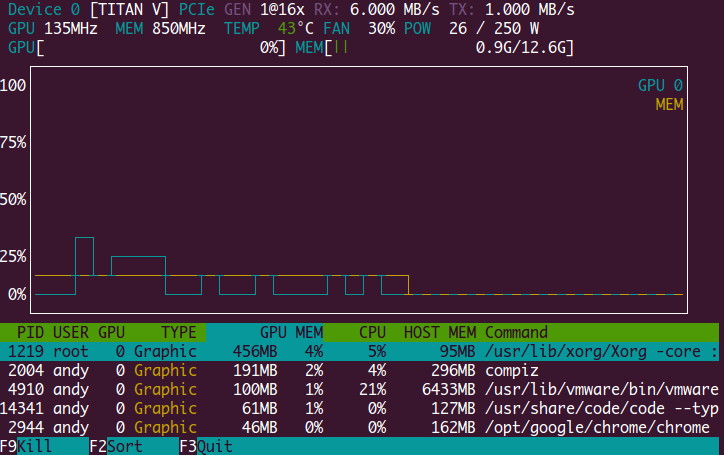

**注意**：https://github.com/Syllo/nvtop/commit/b126abb63f38d50e8fbb961ad0aedc11b51b3911 之后修复这个问题。

### 2. htop　　　
*代替传统top命令*　　　

CPU监视可以用自带的`top`命令查看，但是推荐使用`htop`来显示，首先需要安装`htop`:
```shell
sudo apt-get install htop
```
也可以通过源码安装：　　　
```shell
git clone https://github.com/hishamhm/htop.git
cd htop
./autogen.sh && ./configure && make
```
然后输入以下命令显示CPU资源利用情况:
```shell
htop
```    


### 3. glances　　　
*查看系统全部信息*

```shell
curl -L https://bit.ly/glances | /bin/bash
```
然后运行：
```shell
glances
```    
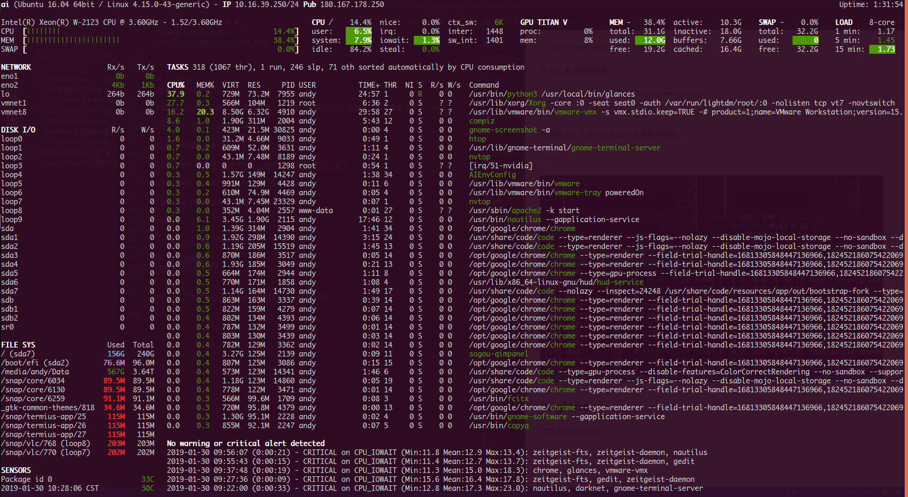

---
## 彻底卸载软件
彻底卸载软件，下面以卸载`Firefox`为例:
先列出来与`Firefox`相关的软件:
```shell
dpkg --get-selections | grep firefox
```
列出来为:
```shell
firefox
firefox-locale-en
unity-scope-firefoxbookmarks
```

卸载上述列出来跟`Firefox`相关的软件:
```shell
sudo apt-get purge  firefox firefox-locale-en unity-scope-firefoxbookmarks
```
或者:
```shell
sudo apt-get purge firefox* unity-scope-firefoxbookmarks
```

---
## 截图快捷键

System Settings -> Keyboard -> Shortcuts -> Custom Shortcuts:

在自定义栏创建一个名字为"截图"的快捷键，在弹出窗口的命令栏填入:
```shell
gnome-screenshot -a
```
保存后在该快捷键的右侧点击，然后按下需要设置的快捷键即可.    


---
## Ubuntu 美化

### Unity环境
Ubuntu 16.04是Unity环境, 安装 `Unity Tweak Tool` :
```shell
sudo apt-get install unity-tweak-tool
```
- Numix主题
  ```shell
  sudo add-apt-repository ppa:numix/ppa
  sudo apt-get update
  sudo apt-get install numix-gtk-theme numix-icon-theme-circle
  ```
- Flatabulous主题
```shell
sudo add-apt-repository ppa:noobslab/themes
sudo apt-get update
sudo apt-get install flatabulous-theme ultra-flat-icons
```

通过 `Unity Tweak Tool` 设置主题:    
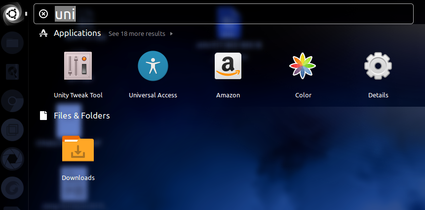    

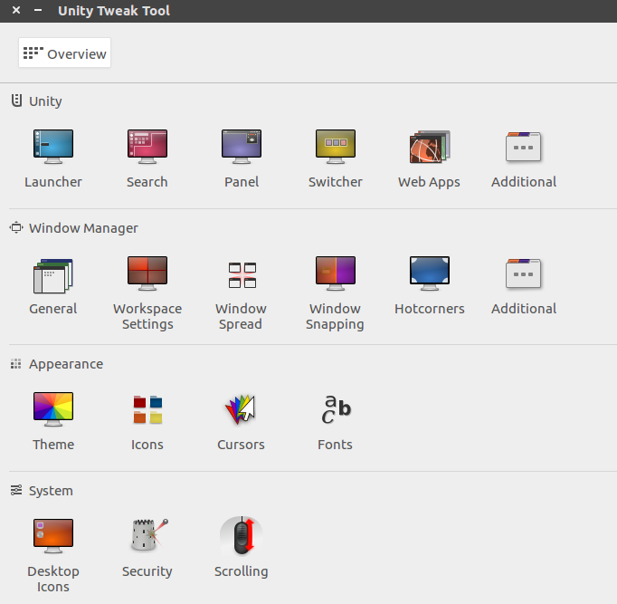    

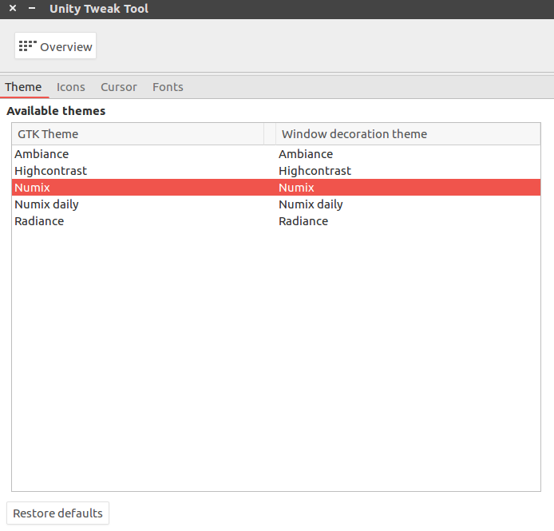    

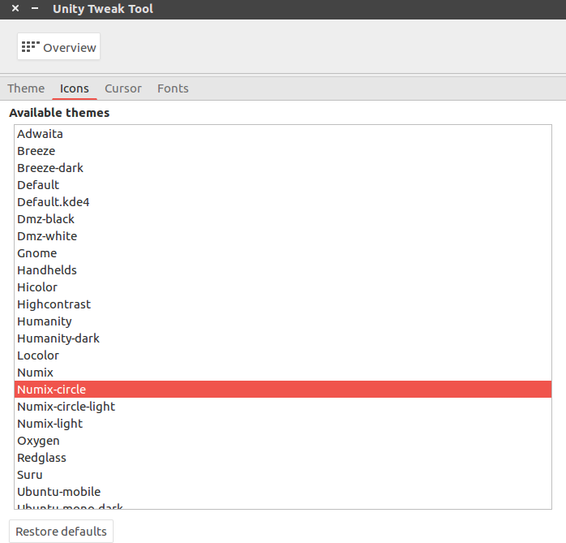    

**参考资料**
> [How To Install Numix Theme And Icons In Ubuntu 14.04 & 16.04.](https://itsfoss.com/install-numix-ubuntu/)
> [Numix Gtk Theme](https://github.com/numixproject/numix-gtk-theme)
> [Numix Circle](https://github.com/numixproject/numix-icon-theme-circle)


### GNOME环境
Ubuntu 17+ 以上是GNOME环境。
如果没有`gnome tweak tool`，运行下面的指令
```shell
sudo apt install gnome-tweak-tool
```
如果没有`user themes`插件，运行下面的指令
```shell
sudo apt install gnome-shell-extensions
```

1. Using PPA to install themes
    ```shell
    sudo add-apt-repository ppa:system76/pop
    sudo apt-get update
    sudo apt-get install pop-theme
    ```
2. Using .deb packages to install themes
    ```shell
    sudo dpkg -i theme-x.deb
    ```
3. Using archive files to install themes
    在home目录下创建 `.themes` 和 `.icons` 两个文件夹:
    ```shell
    cd
    mkdir ~/.themes
    mkdir ~/.icons
    ```
    - `.themes` – for GTK and GNOME Shell themes
    - `.icons` – for icon themes

    

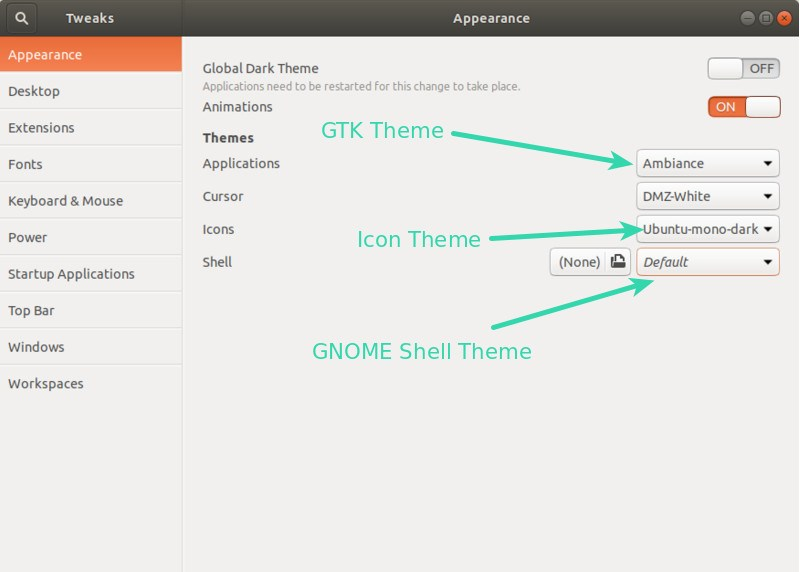    

    

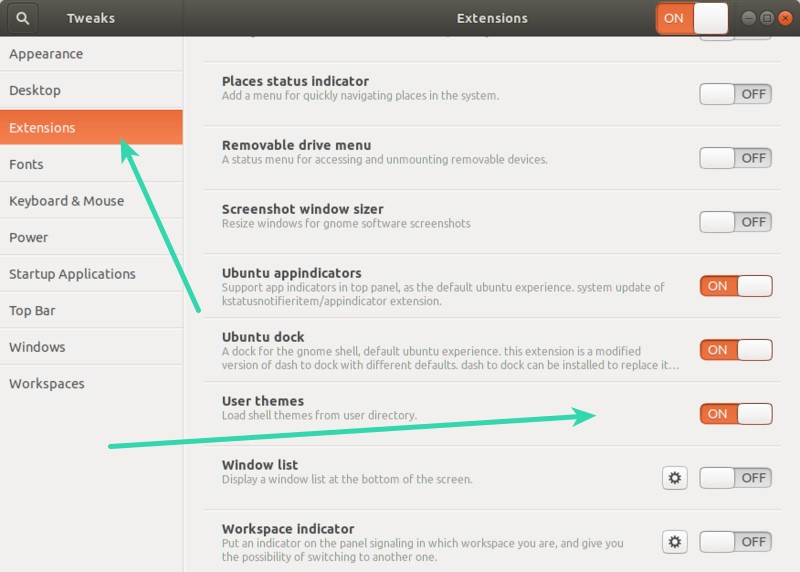    

## Ubuntu启动后GUI界面卡住不动
**Ubuntu 16.04 - GUI freezes on login start page**

> I am unable to enter anything at the login screen; it just freezes directly after the page shows. The cursor inside the login form blinks about 10 times, then it stops. I can't move the mouse or use the keyboard.
I already entered the secure mode and triggered update, upgrade and dist-upgrade via the root shell it made no difference.

```bash
apt-get update
apt-get install xserver-xorg-input-all
apt-get install ubuntu-desktop
apt-get install ubuntu-minimal
apt-get install xorg xserver-xorg
apt-get install xserver-xorg-input-evdev  # I think this packet was the problem
apt-get install xserver-xorg-video-vmware

/etc/init.d/lightdm restart
# reboot
```

# Ubuntu1804使用过程中长遇到的问题
1. libdvd-pkg: `apt-get check` failed, you may have broken packages. Aborting...
```shell
sudo dpkg-reconfigure libdvd-pkg
```


**参考资料**
> 1. [How to Install Themes in Ubuntu 18.04 and 16.04](https://itsfoss.com/install-themes-ubuntu/)
> 2. [Ubuntu 16.04 - GUI freezes on login start page](https://unix.stackexchange.com/questions/368748/ubuntu-16-04-gui-freezes-on-login-start-page)
