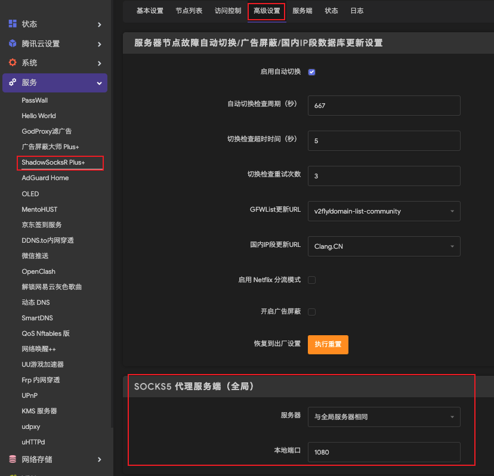
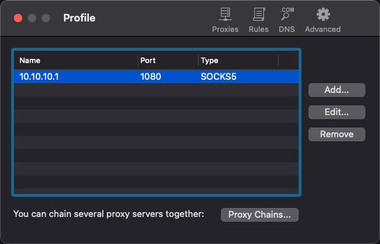
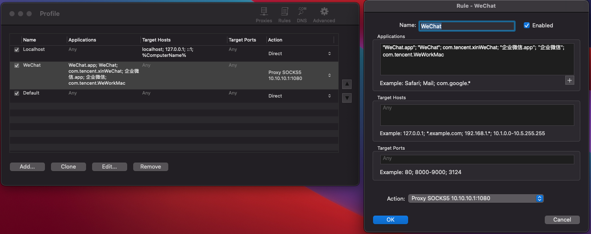

# OpenWRT

- [Proxifier使用](#proxifier使用)

---
## Proxifier使用
给某个软件单独设置全局代理, 这时候就需要**Proxifier**这个神器。

使用代理客户端Proxifier，通过设置，让微信的请求都走Proxifier, 需要注意的是，Proxifier 只是代理客户端，真正向服务器请求数据的不是它，而是中间的代理服务器.

代理客户端的请求会转发给代理服务器，我们在代理服务器中可以看到所有的请求数据。

Proxifier的配置很简单，先添加Proxy Server，菜单选择Profile->Proxy Server。 这个Proxy Server 需要事先运行, 下面以OpenWRT里点SSR Plus为例介绍一下:

### OpenWRT设置

### Proxifier设置

