# ESXi下安装iKuai和LEDE双软路由

- [ESXi下安装iKuai和LEDE双软路由](#esxi%E4%B8%8B%E5%AE%89%E8%A3%85ikuai%E5%92%8Clede%E5%8F%8C%E8%BD%AF%E8%B7%AF%E7%94%B1)
  - [硬件清单](#%E7%A1%AC%E4%BB%B6%E6%B8%85%E5%8D%95)
  - [网络拓扑图](#%E7%BD%91%E7%BB%9C%E6%8B%93%E6%89%91%E5%9B%BE)
  - [ESXi](#esxi)
    - [下载ESXi](#%E4%B8%8B%E8%BD%BDesxi)
    - [制作启动U盘](#%E5%88%B6%E4%BD%9C%E5%90%AF%E5%8A%A8u%E7%9B%98)
    - [软路由U盘启动安装ESXi](#%E8%BD%AF%E8%B7%AF%E7%94%B1u%E7%9B%98%E5%90%AF%E5%8A%A8%E5%AE%89%E8%A3%85esxi)
    - [设置ESXi](#%E8%AE%BE%E7%BD%AEesxi)
    - [ESXi的web端设置](#esxi%E7%9A%84web%E7%AB%AF%E8%AE%BE%E7%BD%AE)
      - [设置笔记本网卡IP](#%E8%AE%BE%E7%BD%AE%E7%AC%94%E8%AE%B0%E6%9C%AC%E7%BD%91%E5%8D%A1ip)
      - [激活ESXi](#%E6%BF%80%E6%B4%BBesxi)
      - [打开虚拟机交换机的混杂模式](#%E6%89%93%E5%BC%80%E8%99%9A%E6%8B%9F%E6%9C%BA%E4%BA%A4%E6%8D%A2%E6%9C%BA%E7%9A%84%E6%B7%B7%E6%9D%82%E6%A8%A1%E5%BC%8F)
      - [网卡非直通情况](#%E7%BD%91%E5%8D%A1%E9%9D%9E%E7%9B%B4%E9%80%9A%E6%83%85%E5%86%B5)
      - [网卡直通情况](#%E7%BD%91%E5%8D%A1%E7%9B%B4%E9%80%9A%E6%83%85%E5%86%B5)
  - [iKuai](#ikuai)
    - [安装iKuai](#%E5%AE%89%E8%A3%85ikuai)
    - [设置iKuai](#%E8%AE%BE%E7%BD%AEikuai)
      - [网卡非直通情况](#%E7%BD%91%E5%8D%A1%E9%9D%9E%E7%9B%B4%E9%80%9A%E6%83%85%E5%86%B5-1)
      - [网卡直通情况](#%E7%BD%91%E5%8D%A1%E7%9B%B4%E9%80%9A%E6%83%85%E5%86%B5-1)
    - [iKuai的web端设置](#ikuai%E7%9A%84web%E7%AB%AF%E8%AE%BE%E7%BD%AE)
  - [LEDE](#lede)
    - [安装LEDE](#%E5%AE%89%E8%A3%85lede)
    - [设置LEDE](#%E8%AE%BE%E7%BD%AElede)
      - [网卡非直通情况](#%E7%BD%91%E5%8D%A1%E9%9D%9E%E7%9B%B4%E9%80%9A%E6%83%85%E5%86%B5-2)
      - [网卡直通情况](#%E7%BD%91%E5%8D%A1%E7%9B%B4%E9%80%9A%E6%83%85%E5%86%B5-2)
    - [LEDE的web端设置](#lede%E7%9A%84web%E7%AB%AF%E8%AE%BE%E7%BD%AE)

## 硬件清单
- CPU: I5 7200U
- 网卡: 6个Intel 82583V 10/100/1000以太网
- 内存: 金士顿 DDR4 2400 8G
- SSD: 三星 EVO850
- USB: 3.0x4个
- 电源: 技嘉12V

## 网络拓扑图
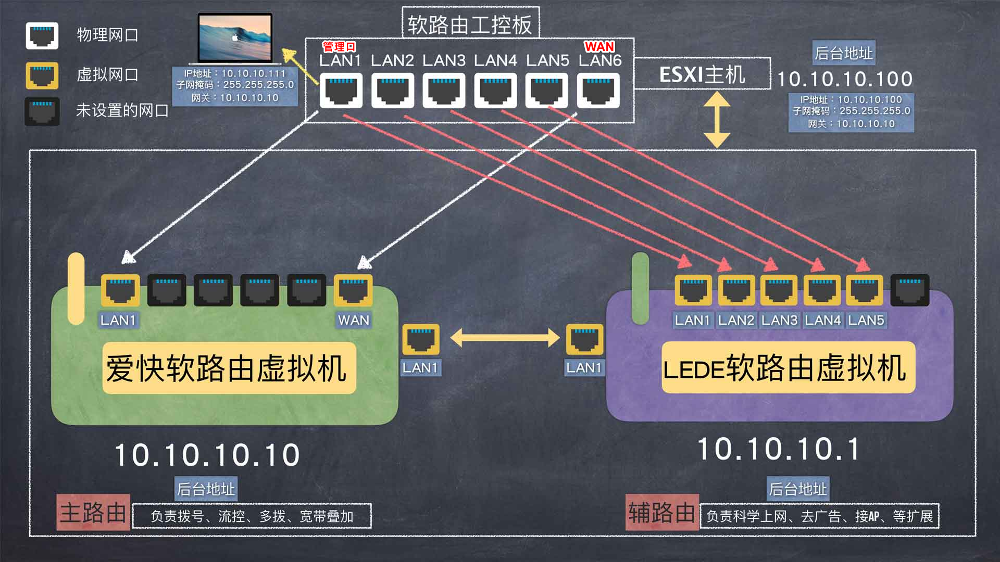    

## ESXi
### 下载ESXi
到VMWare官方网站[下载ESXi 6.7版本](https://my.vmware.com/cn/web/vmware/info/slug/datacenter_cloud_infrastructure/vmware_vsphere/6_7)，下载的时候需要注册账号，然后申请试用，序列号请自行购买正版(或Google)。

### 制作启动U盘
- **用老毛桃工具**   
  到老毛桃官网下载[装机版老毛桃软件](http://www.laomaotao.org/):   
  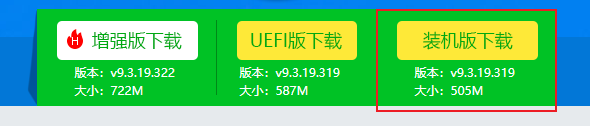    
  然后用老毛桃烧写U盘:    
       
  在烧写好的U盘根目录中创建一个名字为**MYEXT**的文件夹，将下载的ESXi的ISO镜像放入该文件夹下:    
  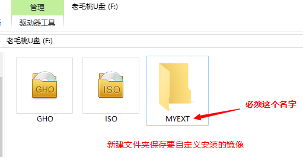    
  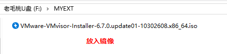    

- **用软碟通UltraISO**
  到软碟通官网下载UltraISO，然后启动并试用:    
  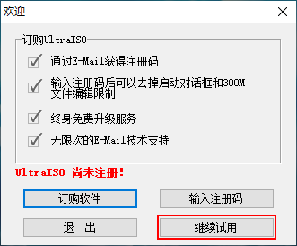     
  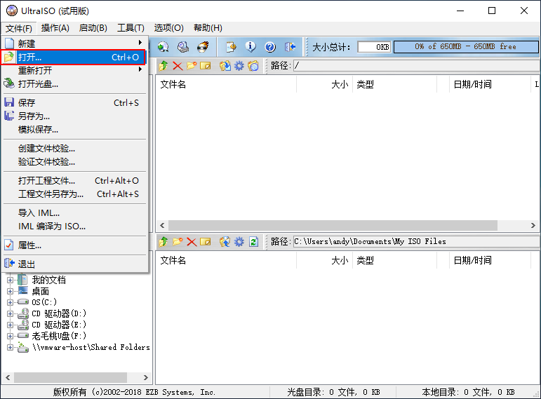      
  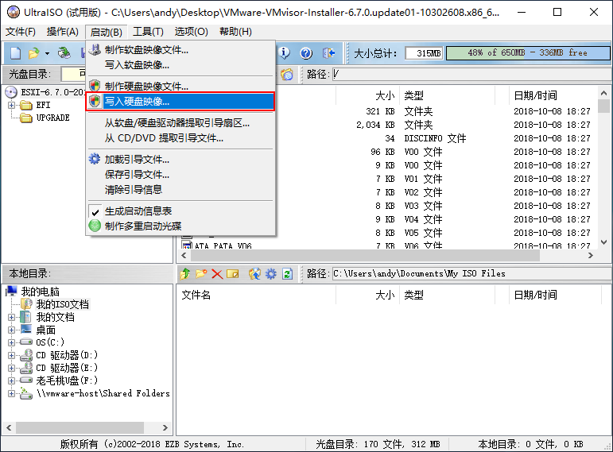      
  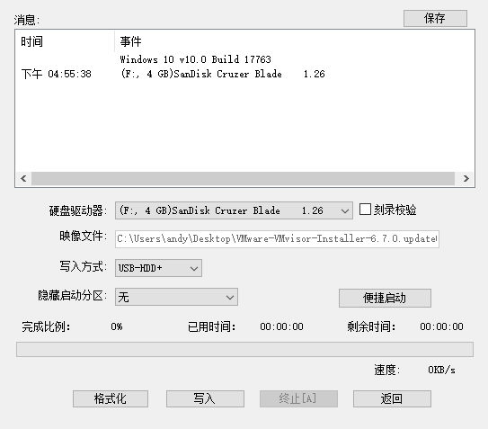     
  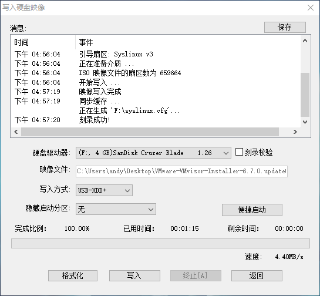     

### 软路由U盘启动安装ESXi   
- **UltraISO**: U盘启动，按照提示安装即可。

- **老毛桃**: 用U盘启动软路由，进入PE，选在老毛桃PE中运行**自定义镜像**选项，选择刚刚放入MYEXT文件夹中的ESXi镜像，按照提示安装ESXi即可。   
  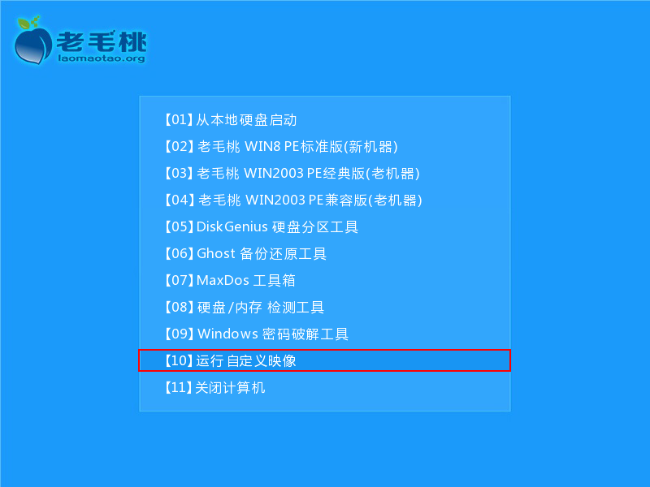    
      
  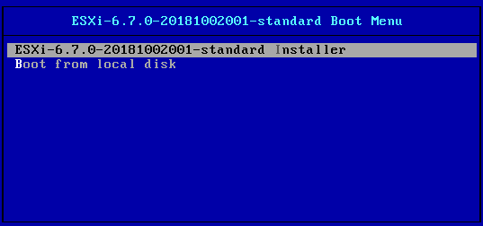    

进入安装界面:    
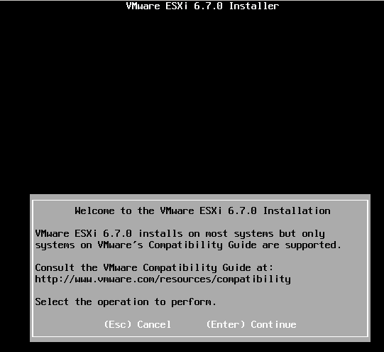    
选择安装位置(我这里为了截图方便，我安装在VMWare虚拟机里)，多块硬盘已经要注意选择安装在哪块硬盘以及别安装在U盘上:   
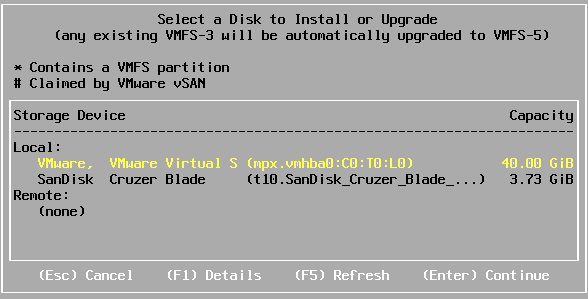    
设置好密码(默认用户名为:root)，按照提示安装即可，注意安装结束的时候会提示**先移除安装介质/U盘**，然后按下回车重启:    
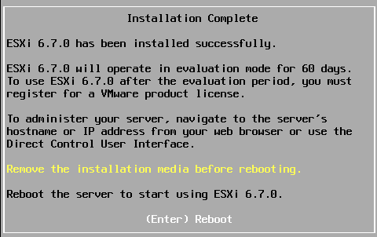    
若启动前已经将网线插入则ESXi默认会根据网络动态获取IP，若启动前没有插网线则IP会为0.0.0.0:    
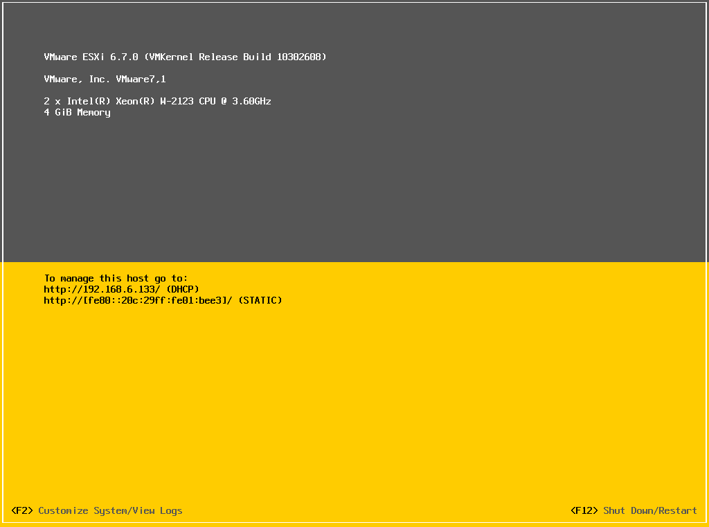    

### 设置ESXi
安装完ESXi后重启，然后按**F2**进入ESXi设置界面:       
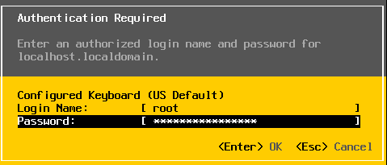     
选择**Configure Management Network**进入设置:   
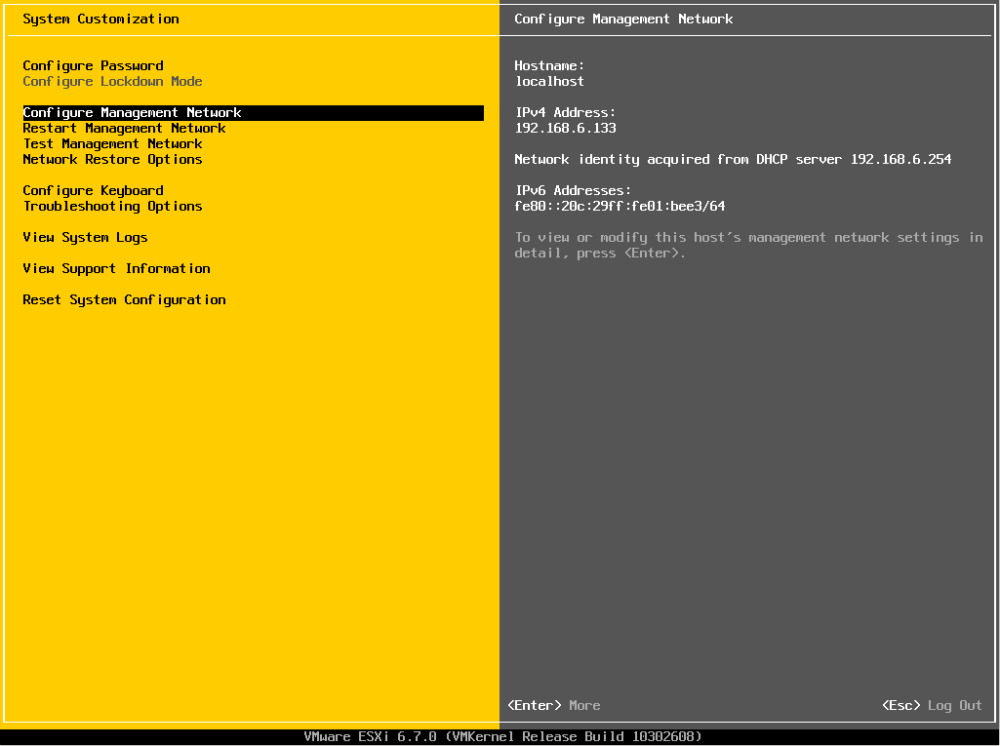     
选择**IPv4 Configuration**选项卡，然后回车:    
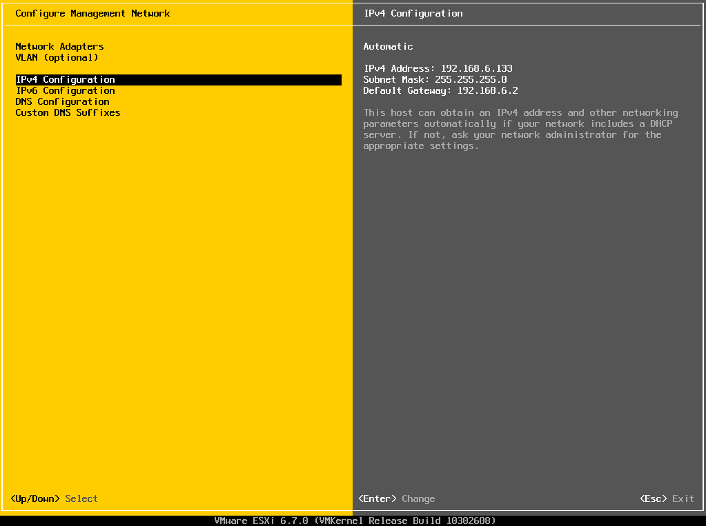     
光标移动到**Set Static IPv4 address and network configuration**，然后用空格键选择，并设置：    
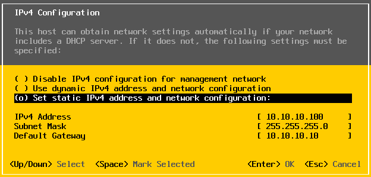     
  - **IPv4 Address**: **10.10.10.100**    
  - **Subnet Mask**: **255.255.255.0**    
  - **Default Gateway**: **10.10.10.10**    
  - 这里设置的默认网关`10.10.10.10`是给`iKuai`的后台地址

按下回车键，然后按ESC键并输入Y保存设置:   
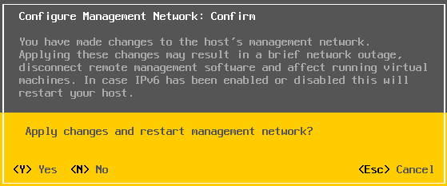    
设置生效后的界面如下，可以看出IP变为静态的了:    
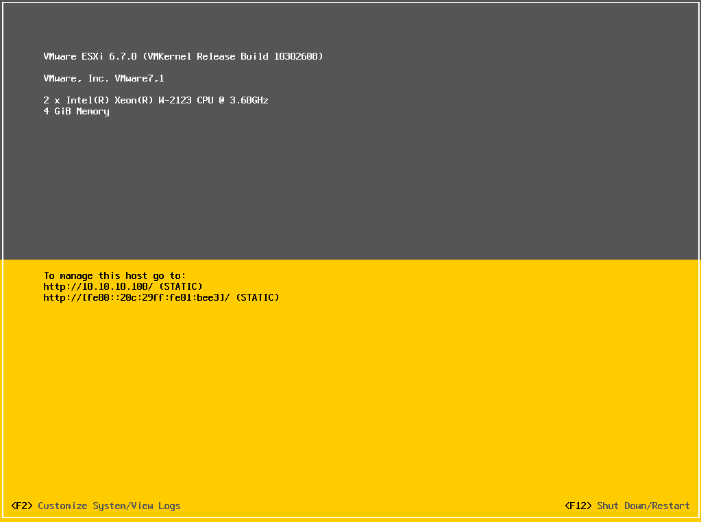    

### ESXi的web端设置
#### 设置笔记本网卡IP
将笔记本的网口用网线连接到软路由的LAN6口，并将笔记本有线网卡的IPv4设置为:    
- IPv4: **10.10.10.111**
- 子网掩码: **255.255.255.0**
- 默认网关/路由器: **10.10.10.10**  
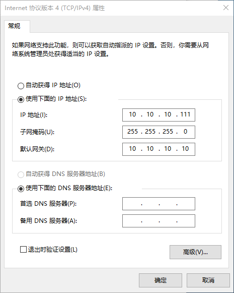    

浏览器打开**10.10.10.100**，然后输入设置的密码进入ESXi后台(用户名为root，密码为安装ESXi时候设置的密码):   
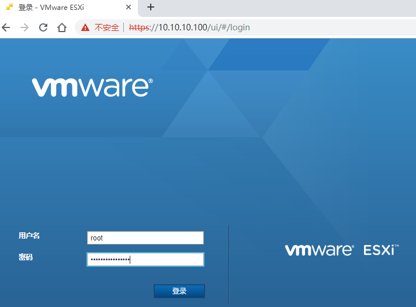    

#### 激活ESXi
默认ESXi有试用期限制，解除限制需要用序列号激活ESXi:    
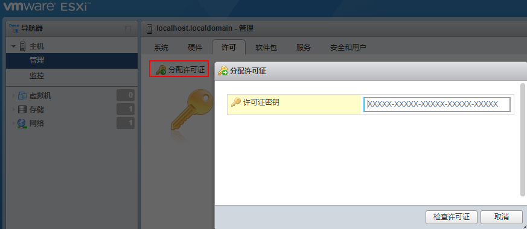    

#### 打开虚拟机交换机的混杂模式
网络=>虚拟交换机=>vSwitcho=>编辑设置=>安全=>混杂模式=>接受       
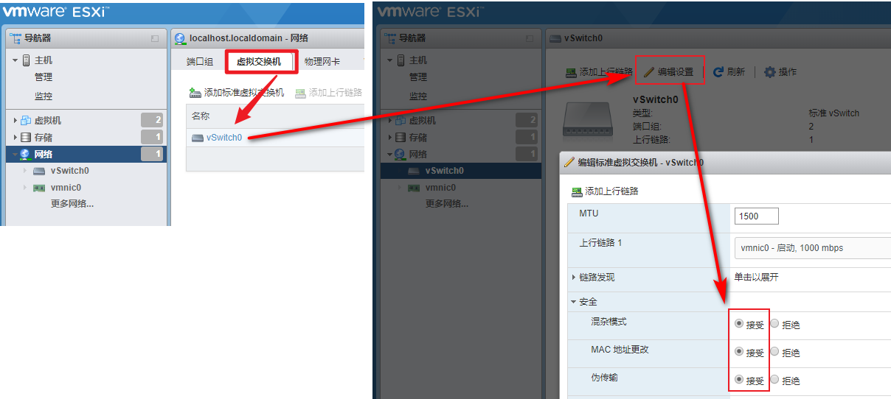    

#### 网卡非直通情况
- 网络->虚拟交换机->添加交换机(多少个网口添加多少个)->安全->全部接受
- 网络->端口组->添加端口组(多少个网口添加多少个)->安全->全部接受
- 存储->数据存储浏览器->创建文件夹->LEDE->将转换好的LEDE的ESXi虚拟机镜像上传到该文件夹下->虚拟机->新建虚拟机->客户机操作系统linux->客户机操作系统版本->其他64位->添加硬盘->添加现有硬盘->选择刚刚上传的LEDE虚拟机文件,**删除原来的硬盘**->添加网络适配器(多少个网口添加多少个)->保存->重新编辑配置(若内存栏出现错误，刷新一下浏览器重新编辑)->设置网卡对应的端口
- 存储->数据存储浏览器->创建文件夹->iKuai->将iKuai的ISO镜像上传到该文件夹下->虚拟机->新建虚拟机->客户机操作系统linux->客户机操作系统版本->其他64位->CD/DVD选择刚刚上传的iKuai的ISO文件->添加网络适配器(多少个网口添加多少个)->保存->重新编辑配置(若内存栏出现错误，刷新一下浏览器重新编辑)->设置网卡对应的端口

#### 网卡直通情况    
主机 => 硬件 => PCI设备 => 下拉选择`支持直通`来筛选网卡 = > 选中后5个(共6个)端口。    
这里要注意不要将第一个(第一个好记)端口这是为直通，否则导致进不去ESXi后台。    
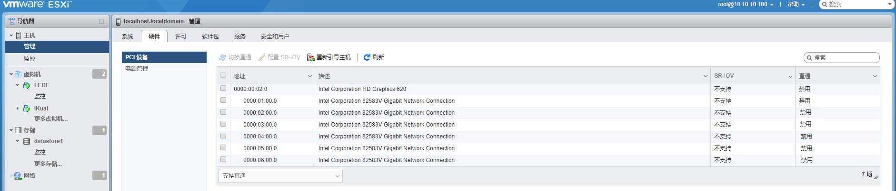     
     
设置好以后要单机**重新引导主机**，否则可能导致进不去ESXi的后台。    
  

## iKuai
### 安装iKuai
下载iKuai的ISO文件    
设置LAN1的IP地址:10.10.10.1    
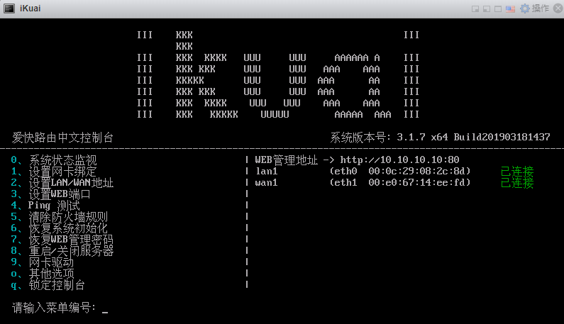    
### 设置iKuai

#### 网卡非直通情况

#### 网卡直通情况

### iKuai的web端设置

## LEDE
### 安装LEDE
到KoolShare官网下载LEDE的固件，虚拟机转盘或PE下写盘专用=>要选择combined格式，因为uefi格式下LEDE编辑的时候硬盘显示错误:    
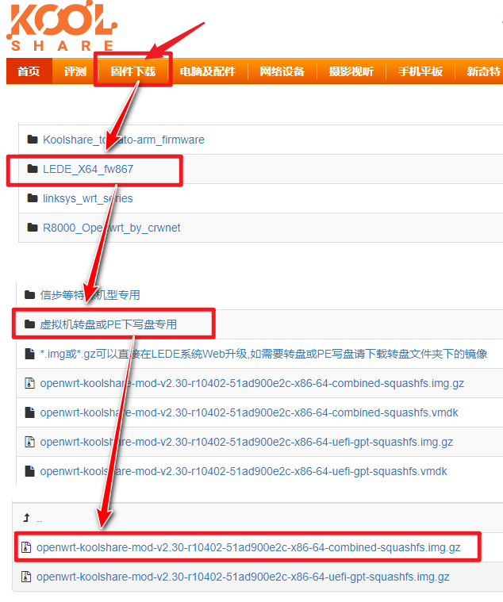    
下载完成后解压到本地，然后用**StarWind Converte**将LEDE的.img格式转换为ESXi虚拟机文件。    

设置IP地址为:10.10.10.1

### 设置LEDE
#### 网卡非直通情况

#### 网卡直通情况

### LEDE的web端设置