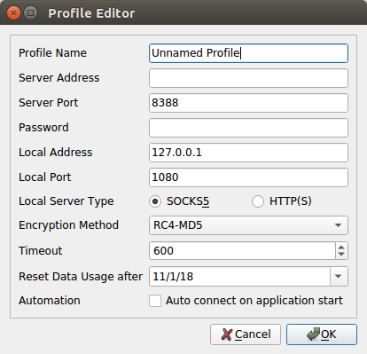
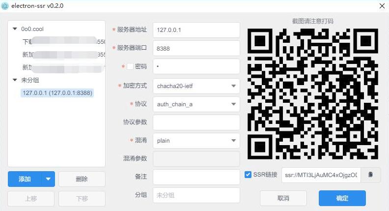
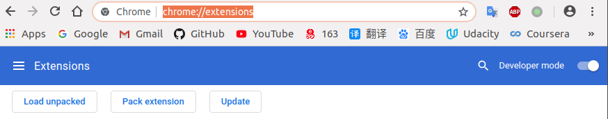
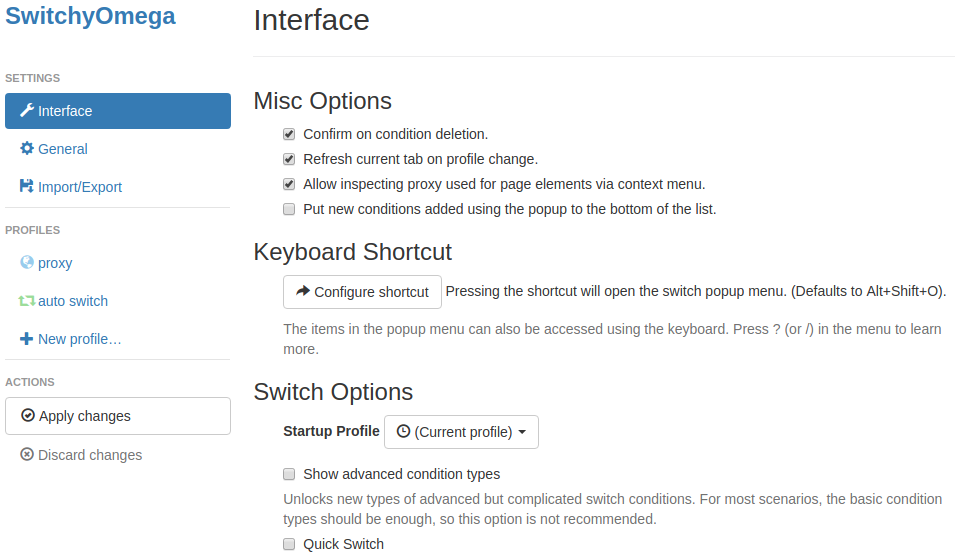
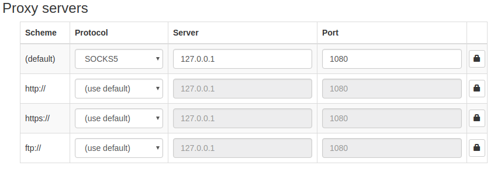

# shadowsocks安装
***Ubuntu上面经常需要科学上网，为了防止忘记，故此记录***
- [shadowsocks安装](#shadowsocks%e5%ae%89%e8%a3%85)
  - [Shadowsocks说明](#shadowsocks%e8%af%b4%e6%98%8e)
  - [安装Shadowsocks-qt5](#%e5%ae%89%e8%a3%85shadowsocks-qt5)
    - [解决状态栏图标丢失问题](#%e8%a7%a3%e5%86%b3%e7%8a%b6%e6%80%81%e6%a0%8f%e5%9b%be%e6%a0%87%e4%b8%a2%e5%a4%b1%e9%97%ae%e9%a2%98)
  - [安装electron-ssr](#%e5%ae%89%e8%a3%85electron-ssr)
  - [配置chrome浏览器](#%e9%85%8d%e7%bd%aechrome%e6%b5%8f%e8%a7%88%e5%99%a8)

---
## Shadowsocks说明
`shadowsocks-qt5`和`electron-ssr`是`ubuntu`上一个可视化的界面，操作起来比较方便；也有脚本安装的，切换路线比较繁琐，所以推荐安装可视化界面版本。   

---
## 安装Shadowsocks-qt5
*只能用ss，不能用ssr*    
1. **官方AppImage安装(推荐)**
    - 从官方[github](https://github.com/shadowsocks/shadowsocks-qt5/releases)下载`Shadowsocks-Qt5-*.AppImage`程序，到创建的ss文件夹下；
    - 终端下运行以下命令修改可执行权限：   
        ```shell
        chmod a+x Shadowsocks-Qt5-*.AppImage
        ```
    - 双击`Shadowsocks-Qt5-*.AppImage`运行即可。


    **添加源方式安装**
    ```shell
    sudo add-apt-repository ppa:hzwhuang/ss-qt5
    sudo apt-get update
    sudo apt-get -f install libappindicator1 libindicator7
    sudo apt-get install shadowsocks-qt5
    ```
2. **配置客户端**
根据自己搭建的服务器或者购买的账号配置客户端，但是注意`Local Address`、`Local Port`和`Local Server Type`要跟下面讲的chrome插件地址和端口一致。    


3. **给AppImage方式安装的添加启动图标**
要给软件添加启动图标，可到`/usr/share/applications`目录下创建相应的配置文件：  
    ```shell
    cd /usr/share/applications
    ```
    然后执行：    
    ```shell
    sudo vim ss.desktop
    ```
    添加如下内容：   
    ```vim
    [Desktop Entry]
    Name=ss
    Name[zh_CN]=ss
    Comment=ss
    Exec=/home/andy/ss/Shadowsocks-Qt5-3.0.1-x86_64.AppImage
    Icon=/home/andy/ss/icon.png
    Terminal=ss
    Type=Application
    Categories=Application;
    Encoding=UTF-8
    StartupNotify=true
    ```
    其中`icon.png`需要从网上下载也可以从`../src/ss/icon.png`找到，放入ss文件夹中：        
        
    然后保存退出即可。

### 解决状态栏图标丢失问题
安装Qt默认库:
```shell
# Note, selecting 'qt5-default' instead of 'qt-default'
sudo apt-get install qt-default

sudo apt-get install qt4-default qt5-default
```


---
## 安装electron-ssr
**下载**    
官方github地址: https://github.com/erguotou520/electron-ssr    

`Linux`优先建议下载`electron-ssr-x.x.x.AppImage`，然后`chmod 777 electron-ssr-x.x.x.AppImage`，直接双击运行。    

**配置文件位置**    
`~/.config/gui-config.json`    

    

---
## 配置chrome浏览器
1. 下载代理插件[Proxy SwitchyOmega](https://github.com/FelisCatus/SwitchyOmega)对应的chrome版本；
2. 在chrome地址栏输入`chrome://extensions/`然后将`Developer mode`打开，然后将上面下载好的`SwitchyOmega_Chromium.crx`**拖入**该页面下：   


3. 安装好Proxy SwitchyOmega之后浏览器会自动打开配置界面，如下图所示：    


4. 新建一个规则，名字随意，然后代理规则那里选择socks5，服务器地址填127.0.0.1，端口1080，如下图所示：   

也可通过备份文件导入配置，然后保存修改，在浏览器中选择auto switch（自动切换）或者GFWed（备份文件恢复的配置，即自己添加的配置规则）。
自动切换可以根据不同的网址来自动选择是否使用代理，现在在浏览器中应该能够流畅的科学上网了，当然，取决于你自己的shadowsocks账号配置。